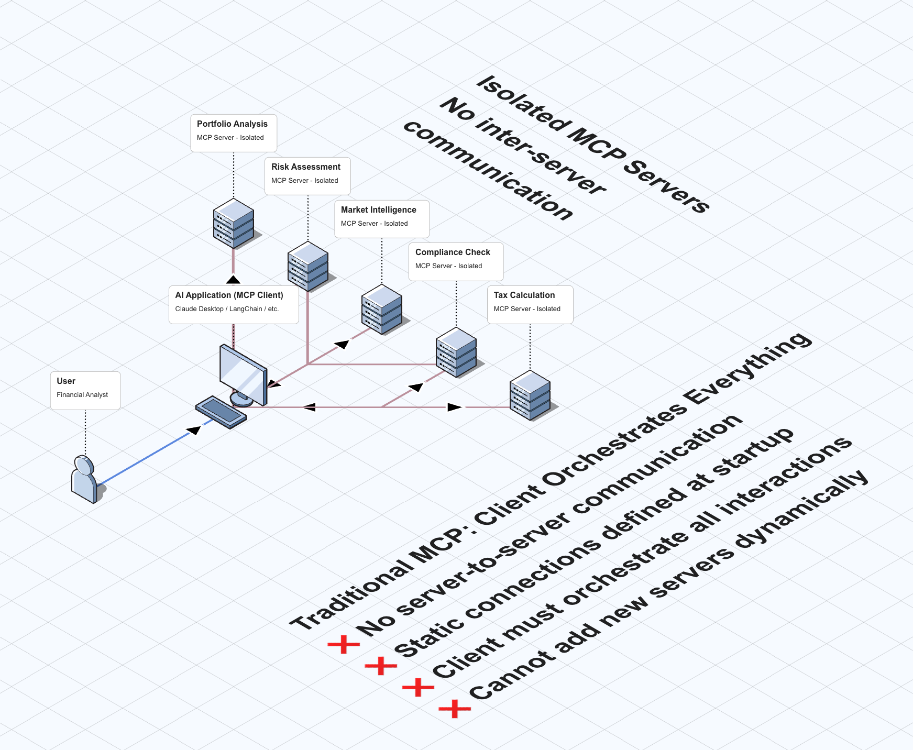
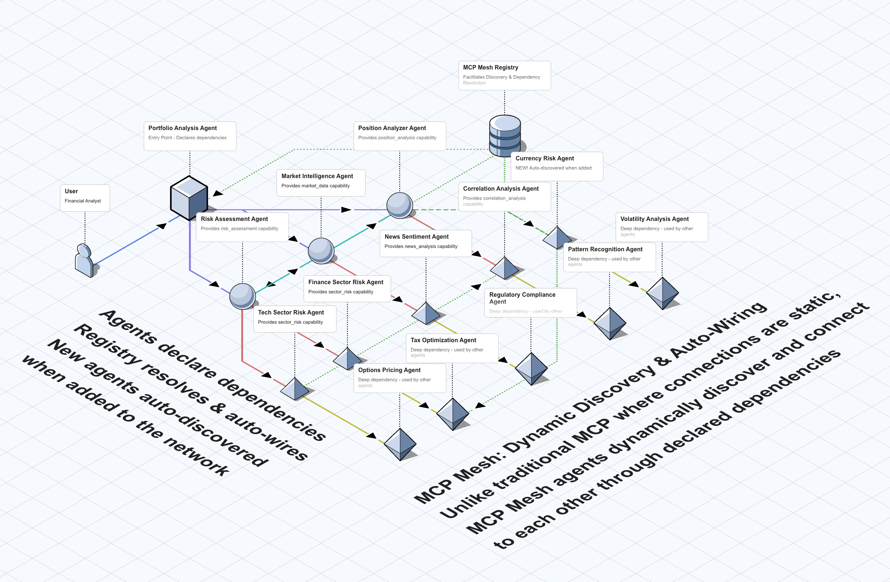

# MCP Mesh

[](https://github.com/dhyansraj/mcp-mesh/actions/workflows/release.yml)
[](https://golang.org)
[](https://python.org)
[](https://hub.docker.com/u/mcpmesh)
[](https://kubernetes.io)
[](https://discord.gg/KDFDREphWn)
[](#license)

> **The future of AI is not one large model, but many specialized agents working together.**

MCP Mesh makes this vision reality by scaling the Model Context Protocol (MCP) to distributed environments. Bring your FastMCP code and run it in Kubernetes with just two decorators added - agents automatically discover each other and work together across clusters.

## Why MCP Mesh?

**MCP revolutionized AI tool integration** - now scale those same patterns to production.

### **Key Features**

- **Dynamic Dependency Injection**: Pull-based discovery with runtime function injection - no networking code required
- **Resilient Architecture**: Registry as facilitator, agents communicate directly with fault tolerance and self-healing
- **Automatic Discovery**: Agents find each other without configuration
- **Near-Complete MCP Support**: Comprehensive MCP protocol implementation for distributed networks
- **Complete Observability Stack**: Grafana dashboards, Tempo tracing, and real-time trace streaming with Redis
- **Distributed Tracing**: OTLP export with cross-agent context propagation for multi-agent workflow monitoring
- **Advanced Session Management**: Redis-backed session stickiness with automatic routing across pod replicas
- **Enhanced Proxy System**: Kwargs-driven auto-configuration for timeouts, retries, streaming, and authentication
- **Smart Dependencies**: Version constraints, tags, and graceful degradation
- **Kubernetes Native**: Production-ready with scaling, health checks, and comprehensive observability

### **Core Design Principles**

- **Registry as Facilitator**: Coordinates discovery and dependency resolution without mediating data flow
- **Runtime as Wrapper**: Thin language runtimes enable multi-language agent development
- **Pre-Injected Dependencies**: Lightweight proxies are resolved in background, not at call time
- **Background Orchestration**: Mesh coordinates in the background, agents focus on business logic

## Architecture Overview

### Traditional MCP: Complex Systems = Nightmare



**❌ Building complex agentic apps with traditional MCP:**

- Client handles all orchestration, networking, and state
- Adding new services requires reconfiguring everything
- No dynamic upgrades - must restart entire system
- Complex boilerplate for every service interaction

### MCP Mesh: Complex Systems = Simple Code



**✅ MCP Mesh handles the complexity so you don't have to:**

- **Zero Boilerplate**: Just add `@mesh.tool()` - networking handled automatically
- **Dynamic Everything**: Add/remove/upgrade services without touching other code
- **Complex Apps Made Simple**: Financial services example shows 6+ interconnected agents
- **Production Ready**: Built-in resilience, distributed observability, and scaling

**The Magic**: Write simple Python functions, get enterprise-grade distributed systems.

## Quick Start

### See MCP Mesh in Action

_MCP Mesh sets the stage, but MCP agents steal the show! Agents dynamically discover dependencies, gracefully degrade when services go down, and seamlessly reconnect when they come back online._

### Simple Agent Example

```python
#!/usr/bin/env python3
from typing import Any
import mesh
from fastmcp import FastMCP

app = FastMCP("Hello World Service")

@app.tool()
@mesh.tool(
    capability="greeting",
    dependencies=["date_service"]
)
def hello_mesh(date_service: Any = None) -> str:
    if date_service is None:
        return "👋 Hello from MCP Mesh! (Date service not available yet)"

    current_date = date_service()
    return f"👋 Hello from MCP Mesh! Today is {current_date}"

@mesh.agent(
    name="hello-world",
    http_port=9090,
    auto_run=True
)
class HelloWorldAgent:
    pass
```

### See It In Action

```bash
# Start agents with meshctl (registry starts automatically)
meshctl start examples/simple/system_agent.py
meshctl start examples/simple/hello_world.py

# Test the dynamic dependency injection
curl http://localhost:9090/mcp/ -X POST \
  -H "Content-Type: application/json" \
  -H "Accept: application/json, text/event-stream" \
  -d '{"jsonrpc": "2.0", "id": 1, "method": "tools/call", "params": {"name": "hello_mesh_simple", "arguments": {}}}'

# Response: "👋 Hello from MCP Mesh! Today is December 19, 2024 at 02:30 PM"
```

**The magic**: Agents automatically discover and connect to each other without any configuration!

## Advanced Features for Production

MCP Mesh extends the MCP protocol with enterprise-grade capabilities for distributed environments:

### **Session Stickiness & Stateful Operations**

```python
@mesh.tool(
    session_required=True,     # Enable session routing
    stateful=True,            # Mark as stateful
    auto_session_management=True  # Automatic lifecycle
)
def user_counter(session_id: str, increment: int = 1):
    # Automatically routed to same pod for session consistency
    return update_user_state(session_id, increment)
```

**Features**: Redis-backed session storage, automatic pod assignment, graceful fallback to in-memory storage.

### **Enhanced Proxy Auto-Configuration**

```python
@mesh.tool(
    capability="data_processor",
    timeout=120,                  # 2-minute timeout
    retry_count=3,               # Exponential backoff retries
    auth_required=True,          # Bearer token authentication
    streaming=True,              # Auto-select streaming proxy
    custom_headers={"X-Version": "v2"}  # Service identification
)
async def process_dataset(data_url: str):
    # Auto-configured with production-ready settings
```

**Features**: Timeout management, retry policies, authentication, streaming auto-selection, custom headers.

### **Comprehensive MCP Protocol Support**

MCP Mesh provides extensive MCP protocol coverage in distributed environments:

- **Complete Tool Calling**: Full MCP JSON-RPC implementation with enhanced error handling
- **Streaming Support**: Native async generators with automatic proxy selection
- **Authentication Integration**: Bearer tokens, custom headers, and security controls
- **Session Management**: Stateful operations with distributed session affinity
- **Error Resilience**: Graceful degradation and automatic retry mechanisms

The implementation maintains MCP protocol compatibility while adding distributed system capabilities that scale from local development to enterprise deployments.

## 📦 Installation

### Python Package (Recommended)

```bash
# Install with semantic versioning (allows patches, not minor versions)
pip install "mcp-mesh>=0.4.0,<0.5.0"
```

### CLI Tools

```bash
# Install meshctl and registry binaries
curl -sSL https://raw.githubusercontent.com/dhyansraj/mcp-mesh/main/install.sh | bash
```

### Docker Images

```bash
# Registry service (gets latest patches for 0.4.x)
docker pull mcpmesh/registry:0.4

# Python runtime for agents (gets latest patches for 0.4.x)
docker pull mcpmesh/python-runtime:0.4

# CLI tools (gets latest patches for 0.4.x)
docker pull mcpmesh/cli:0.4
```

### Quick Setup Options

| Method             | Best For                | Command                                            |
| ------------------ | ----------------------- | -------------------------------------------------- |
| **Docker Compose** | Getting started quickly | `cd examples/docker-examples && docker-compose up` |
| **Python Package** | Agent development       | `pip install "mcp-mesh>=0.4.0,<0.5.0"`             |
| **Kubernetes**     | Production deployment   | `kubectl apply -k examples/k8s/base/`              |

> **🔧 For Development**: See [Local Development Guide](docs/02-local-development.md) to build from source.

## Why MCP Mesh?

While the Model Context Protocol (MCP) provides an excellent foundation for AI tool integration, scaling MCP applications in production environments presents unique challenges. MCP Mesh addresses these common pain points with a Kubernetes-native approach:

### **Service Discovery & Orchestration**

- **Challenge**: MCP applications typically require manual configuration to connect multiple servers, limiting dynamic service composition
- **Solution**: Automatic service discovery with registry-based coordination allows agents to find and connect to capabilities without hardcoded configurations

### **Scaling & Load Balancing**

- **Challenge**: Running multiple MCP servers requires external proxy tools and complex load balancing setups
- **Solution**: Native horizontal scaling with health-based routing distributes requests across available agent instances automatically

### **Development Complexity**

- **Challenge**: Setting up multi-server MCP environments involves significant boilerplate code and manual orchestration
- **Solution**: Two simple decorators (`@mesh.agent` + `@mesh.tool`) provide the same functionality with zero configuration overhead

### **Production Deployment**

- **Challenge**: Limited guidance exists for deploying MCP applications at scale with proper monitoring and fault tolerance
- **Solution**: Complete Kubernetes manifests, PostgreSQL integration, and production-ready observability out of the box

### **Dependency Management**

- **Challenge**: No standardized way to handle versioned dependencies or capability requirements between MCP servers
- **Solution**: Semantic versioning with constraint matching (e.g., `>= 2.0`) and tag-based capability selection for precise dependency resolution

### **Reliability & Fault Tolerance**

- **Challenge**: MCP server connection issues and shutdown problems can affect application stability
- **Solution**: Resilient architecture where agents work standalone and gracefully handle registry failures while maintaining service continuity

MCP Mesh transforms MCP from a point-to-point protocol into a distributed service mesh, making production-scale MCP deployments as simple as developing locally.

## Vision: Global AI Agent Network

MCP Mesh's architecture naturally enables a distributed ecosystem where AI agents can discover and collaborate across organizational and geographical boundaries. The same technology powering enterprise deployments can scale to support industry-wide cooperation.

### **Technical Foundation for Cross-Cluster Federation**

The registry-based discovery model supports federated architectures where agents from different Kubernetes clusters can participate in a shared capability network:

```yaml
# Multi-cluster registry federation
apiVersion: v1
kind: ConfigMap
metadata:
  name: registry-federation
data:
  federation.yaml: |
    primary_registry: "https://registry.my-org.com"
    federated_registries:
      - url: "https://public-registry.ai-consortium.org"
        trust_level: "verified"
        capabilities: ["translation", "analysis", "computation"]
      - url: "https://academic-registry.university.edu"
        trust_level: "research"
        capabilities: ["research_tools", "data_analysis"]
```

### **Potential Industry Applications**

**Enterprise Collaboration**: Organizations could share specialized AI capabilities while maintaining security boundaries - imagine a financial analysis agent discovering legal compliance tools from a partner firm's cluster, or supply chain optimization agents coordinating across vendor networks.

**Research Networks**: Academic institutions could pool computational resources and specialized models, allowing researchers worldwide to access domain-specific AI tools without complex bilateral agreements.

**Industry Standards**: Professional consortia could establish common capability registries, enabling standardized AI tool interfaces across competing platforms while preserving competitive differentiation in implementation.

### **Governance and Trust Framework**

Such a network would require:

- **Capability Verification**: Cryptographic signatures and reputation systems for agent capabilities
- **Access Control**: Fine-grained permissions based on organizational membership and trust relationships
- **Economic Models**: Usage metering and compensation mechanisms for capability providers
- **Quality Assurance**: SLA monitoring and capability performance benchmarking

### **Current State and Roadmap**

Today, MCP Mesh provides the core infrastructure patterns needed for this vision:

- ✅ **Registry Federation**: Multiple registries can already cross-reference capabilities
- ✅ **Security Boundaries**: Namespace isolation and RBAC controls
- ✅ **Standard Protocols**: HTTP APIs and MCP compatibility ensure interoperability
- 🔄 **In Development**: Enhanced authentication, capability verification, and cross-cluster networking
- 📋 **Future Work**: Economic frameworks, reputation systems, and governance tooling

The technology exists; what's needed is community coordination and trust frameworks. MCP Mesh provides the infrastructure foundation for organizations ready to explore collaborative AI agent networks.

## Installation

### One-Line Install (Recommended)

```bash
# Install everything with one command (requires curl and Python 3.11+)
curl -sSL https://raw.githubusercontent.com/dhyansraj/mcp-mesh/main/install.sh | bash -s -- --version v0.4
```

### Package Manager Installation

```bash
# Python package from PyPI (allows patch updates)
pip install "mcp-mesh>=0.4.0,<0.5.0"

# Docker images (use minor version tag for latest patches)
docker pull mcpmesh/registry:0.4
docker pull mcpmesh/python-runtime:0.4
docker pull mcpmesh/cli:0.4

# Download CLI binary directly (specific version)
curl -L https://github.com/dhyansraj/mcp-mesh/releases/download/v0.4.0/mcp-mesh_v0.4.0_linux_amd64.tar.gz | tar xz
sudo mv meshctl /usr/local/bin/
```

### Development Installation

```bash
# Clone and build from source
git clone https://github.com/dhyansraj/mcp-mesh.git
cd mcp-mesh
make install
```

For detailed installation options, see our [Installation Guide](docs/01-getting-started/02-installation.md).

## meshctl CLI Tool

MCP Mesh includes `meshctl`, a kubectl-like command-line tool for observing and monitoring the MCP Mesh network. It provides comprehensive visibility into distributed agent topologies with additional support for local development workflows.

### Key Capabilities

- **Network observability**: Monitor distributed agent topologies across environments
- **Real-time status monitoring**: View agent health, dependencies, and connectivity
- **Multi-environment support**: Connect to local, Docker, or Kubernetes registries
- **Beautiful visualizations**: kubectl-style table displays with filtering and sorting
- **Dependency tracking**: Observe capability resolution and injection status
- **Local development support**: Start agents for development and testing

### Local Development Support

```bash
# Start registry for local development
./bin/meshctl start --registry-only

# Start agent with development features
./bin/meshctl start examples/simple/hello_world.py --auto-restart --watch-files

# Start multiple agents for testing
./bin/meshctl start examples/simple/hello_world.py examples/simple/system_agent.py
```

### Available Commands

| Command              | Description                                   | Primary Use     |
| -------------------- | --------------------------------------------- | --------------- |
| `meshctl list`       | Display running agents with dependency status | **Monitoring**  |
| `meshctl status`     | Show detailed mesh network health             | **Monitoring**  |
| `meshctl start`      | Start agents (local development)              | **Development** |
| `meshctl config`     | Manage configuration settings                 | **Management**  |
| `meshctl completion` | Generate shell autocompletion                 | **Utilities**   |

### Observability Features

- **kubectl-style interface**: Familiar command patterns for Kubernetes users
- **Real-time monitoring**: Live status updates of agent health and dependencies
- **Multi-environment connectivity**: Monitor local, Docker, and Kubernetes registries
- **Filtering and sorting**: Find specific agents in large topologies
- **JSON output**: Integrate with monitoring and automation tools
- **Dependency visualization**: Understand capability resolution and injection status

## Why MCP Mesh? Scaling MCP to Production

### MCP's Success Creates New Opportunities

The MCP ecosystem has proven that standardized AI tool integration works brilliantly. Now teams want to:

- 🚀 Scale successful MCP applications across multiple machines
- 🏗️ Deploy MCP tools in production Kubernetes environments
- 🔄 Distribute MCP capabilities across microservices
- 📈 Build resilient, fault-tolerant MCP architectures

### MCP Mesh: Built for MCP Developers

- ✅ **Keep your existing MCP knowledge**: Same concepts, bigger scale
- ✅ **Bring your FastMCP code**: Run existing MCP agents in Kubernetes with just two decorators added
- ✅ **MCP protocol compatible**: Works with existing MCP clients and tools
- ✅ **Kubernetes-native**: Production-ready infrastructure patterns
- ✅ **Gradual adoption**: Start small, scale as needed
- ✅ **Community-driven**: Extending MCP together

### Beyond Traditional Approaches

While existing solutions focus on static tool definitions or centralized orchestration, MCP Mesh introduces:

- **Pull-based dependency model**: Agents declare what they need, registry coordinates discovery, Python runtime handles injection
- **Registry as facilitator, not gatekeeper**: Coordinates service discovery and dependency resolution, but actual MCP calls flow directly between agents
- **Language runtime flexibility**: Currently supports Python with plans for additional language runtimes
- **Hot-swappable capabilities**: Add, remove, or update capabilities without restarting the entire system

## 📚 Learn More

### **Tutorials**

- **[Getting Started Guide](docs/01-getting-started.md)** - Build your first distributed MCP agent
- **[Local Development](docs/02-local-development.md)** - Professional development workflows
- **[Docker Deployment](docs/03-docker-deployment.md)** - Multi-service environments
- **[Kubernetes Basics](docs/04-kubernetes-basics.md)** - Production deployment

### **Reference Guides**

- **[Mesh Decorators](docs/mesh-decorators.md)** - Complete decorator reference
- **[meshctl CLI](docs/meshctl-cli.md)** - Command-line tool guide
- **[Environment Variables](docs/environment-variables.md)** - Configuration options
- **[Architecture & Design](docs/architecture-and-design.md)** - Deep technical details

## Development

### Prerequisites

- **Go 1.21+** (for registry service)
- **Python 3.11+** (for agent runtime)
- **Docker** (for containerized development)
- **Kubernetes/Minikube** (for cluster deployment)

### Build and Test

```bash
# Build the entire project
make build

# Run tests
make test-all

# Local development with Docker Compose
make dev

# Deploy to Kubernetes
make deploy
```

### Project Structure

```
mcp-mesh/
├── src/core/           # Go registry service and CLI
├── src/runtime/        # Python agent runtime and decorators
├── examples/           # Sample agents and deployment examples
├── docs/              # Comprehensive documentation
├── helm/              # Helm charts for Kubernetes deployment
├── docker/            # Docker configurations
└── k8s/               # Kubernetes manifests
```

## Contributing

We welcome contributions from the community! MCP Mesh is designed to be a collaborative effort to advance the state of distributed MCP applications.

### How to Contribute

1. **[Check the Issues](https://github.com/dhyansraj/mcp-mesh/issues)** - Find good first issues or suggest new features
2. **[Join Discussions](https://github.com/dhyansraj/mcp-mesh/discussions)** - Share ideas and get help from the community
3. **[Submit Pull Requests](https://github.com/dhyansraj/mcp-mesh/pulls)** - Contribute code, documentation, or examples
4. **Follow our development guidelines** - See project structure and coding standards below

### Development Areas

- **Core Platform**: Go registry service, capability discovery, health monitoring
- **Python Runtime**: Agent decorators, dynamic injection, HTTP proxy generation, FastMCP integration
- **Language Runtimes**: Additional language support (Go, JavaScript, etc.)
- **Documentation**: Guides, tutorials, API documentation, examples
- **Deployment**: Helm charts, operators, CI/CD integration
- **Testing**: Unit tests, integration tests, performance benchmarks

## 💬 Community & Support

- **[Discord](https://discord.gg/KDFDREphWn)** - Real-time help and discussions
- **[GitHub Discussions](https://github.com/dhyansraj/mcp-mesh/discussions)** - Share ideas and ask questions
- **[Issues](https://github.com/dhyansraj/mcp-mesh/issues)** - Report bugs or request features
- **[Examples](examples/)** - Working code examples and deployment patterns

## Roadmap

### Current Status

- ✅ Core registry service with dynamic dependency injection
- ✅ Python runtime with decorator-based agent development
- ✅ Local development environment
- ✅ Docker Compose deployment
- ✅ Kubernetes and Helm charts deployments
- ✅ MCP protocol compatibility
- ✅ Enhanced monitoring and observability
- ✅ Performance optimizations and caching

### Upcoming Features

- 🔄 Multi-cluster registry federation
- 🔄 Advanced security and RBAC
- 🔄 Integration with service mesh (Istio/Linkerd)
- 🔄 Operator for automated Kubernetes deployment

## License

This project is open source. License details will be provided in the LICENSE file.

---

## Acknowledgments

- **[Anthropic](https://anthropic.com)** for creating the MCP protocol that inspired this project
- **[FastMCP](https://github.com/jlowin/fastmcp)** for providing excellent MCP server foundations
- **[Kubernetes](https://kubernetes.io)** community for building the infrastructure platform that makes this possible
- All the **contributors** who help make MCP Mesh better

---

## 🚀 Get Started

1. **[⚡ Quick Tutorial](docs/01-getting-started.md)** - Build your first distributed MCP agent
2. **[💬 Join Discord](https://discord.gg/KDFDREphWn)** - Connect with the community
3. **[🔧 Contribute](https://github.com/dhyansraj/mcp-mesh/issues)** - Help build the future of AI orchestration

**Star the repo** if MCP Mesh helps you build better AI systems! ⭐
