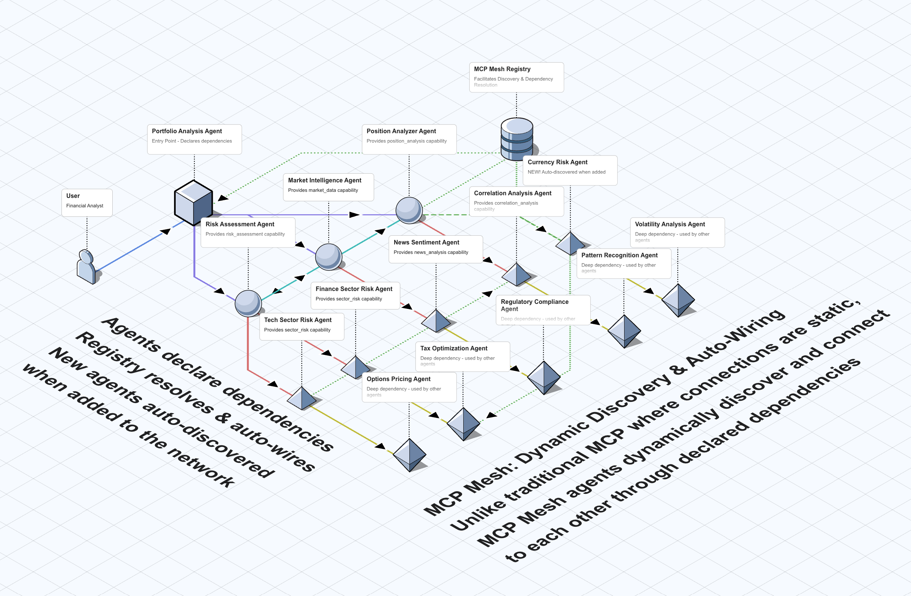

#  MCP Mesh

[](https://github.com/dhyansraj/mcp-mesh/actions/workflows/release.yml)
[](https://python.org)
[](https://openjdk.org)
[](https://www.typescriptlang.org)
[](https://golang.org)
[](https://www.rust-lang.org)
[](https://pypi.org/project/mcp-mesh/)
[](https://www.npmjs.com/package/@mcpmesh/cli)
[](https://central.sonatype.com/artifact/io.mcp-mesh/mcp-mesh-spring-boot-starter)
[](https://hub.docker.com/u/mcpmesh)
[](https://github.com/dhyansraj/mcp-mesh/pkgs/container/mcp-mesh%2Fmcp-mesh-core)
[](https://discord.gg/KDFDREphWn)
[](https://www.youtube.com/@MCPMesh)
[](#license)

> **The future of AI is not one large model, but many specialized agents working together.**

<p align="center">
  <a href="https://mcp-mesh.ai/"><strong>📚 Documentation</strong></a> ·
  <a href="https://mcp-mesh.ai/python/getting-started/"><strong>🚀 Quick Start</strong></a> ·
  <a href="https://www.youtube.com/@MCPMesh"><strong>🎬 YouTube</strong></a> ·
  <a href="https://discord.gg/KDFDREphWn"><strong>💬 Discord</strong></a>
</p>

---

## ⚡ Getting Started

```bash
# Install the CLI
npm install -g @mcpmesh/cli

# Explore commands
meshctl --help

# Built-in documentation
meshctl man
```

**[Python Quick Start →](https://mcp-mesh.ai/python/getting-started/)** | **[Java Quick Start →](https://mcp-mesh.ai/java/getting-started/)** | **[TypeScript Quick Start →](https://mcp-mesh.ai/typescript/getting-started/)**

---

## 🎯 Why MCP Mesh?

You write the agent logic. The mesh discovers, connects, heals, and traces — across languages, machines, and clouds.

---

### **For Developers 👩‍💻**

**Stop fighting infrastructure. Start building intelligence.**

- **Zero Boilerplate**: Simple decorators/functions replace hundreds of lines of networking code
- **Python, Java & TypeScript**: Write MCP servers as simple functions in your preferred language - no manual client/server setup
- **Web Framework Integration**: Inject MCP agents directly into FastAPI (Python), Spring Boot (Java), or Express (TypeScript) APIs seamlessly
- **LLM as Dependencies**: Inject LLMs just like MCP agents - dynamic prompts with Jinja2 (Python), FreeMarker (Java), or Handlebars (TypeScript)
- **Seamless Development Flow**: Code locally, test with Docker Compose, deploy to Kubernetes - same code, zero changes
- **kubectl-like Management**: `meshctl` - a familiar command-line tool to run, monitor, and manage your entire agent network

```python
from fastmcp import FastMCP
import mesh

app = FastMCP("TripPlanner")

@app.tool()
@mesh.tool(
    capability="plan_trip",
    dependencies=[
        {"capability": "weather", "tags": ["+claude"]},
        {"capability": "hotels",  "tags": ["+gpt"]},
        {"capability": "flights"},
        {"capability": "budget",  "tags": ["+claude"]},
    ],
)
async def plan_trip(
    destination: str,
    dates: str,
    weather: mesh.McpMeshTool = None,
    hotels:  mesh.McpMeshTool = None,
    flights: mesh.McpMeshTool = None,
    budget:  mesh.McpMeshTool = None,
) -> TripPlan:
    forecast = await weather(destination=destination, dates=dates)
    options  = await hotels(destination=destination, dates=dates)
    routes   = await flights(destination=destination, dates=dates)
    cost     = await budget(routes=routes, options=options)
    return TripPlan(forecast, options, routes, cost)

@mesh.agent(name="trip-planner", auto_run=True)
class TripAgent: pass
```

> **Four distributed calls, composed like a local function.** Each dependency could live in this process, another machine, another language. Mesh handles discovery, transport, retry, and failover — your function stays a function. Each dep is just another `@mesh.tool`, defined the same way — in this agent or another.
>
> **Any dependency can be a plain tool _or_ an LLM agent — your code can't tell the difference.** `weather` could be a REST API *or* a Claude-powered reasoning agent returning a typed pydantic forecast. `+claude` means prefer the reasoning agent; if it dies, mesh auto-rewires to the API. When Claude recovers, mesh rewires back. No deploy, no config, no code change.
>
> **Routing stays in Python, not YAML.** See how below.

<details>
<summary><b>See how the Claude-powered weather agent is built (10 lines)</b></summary>

```python
from fastmcp import FastMCP
import mesh

app = FastMCP("ClaudeWeather")

@app.tool()
@mesh.llm(
    system_prompt="file://prompts/weather.j2",
    provider={"capability": "llm", "tags": ["+claude"]},
)
@mesh.tool(capability="weather", tags=["+claude"])
def weather(destination: str, dates: str,
            llm: mesh.MeshLlmAgent = None) -> Forecast:
    return llm(f"Forecast for {destination} on {dates}")

@mesh.agent(name="claude-weather", auto_run=True)
class Agent: pass
```

</details>

<details>
<summary><b>Route by Python if/else, not config</b></summary>

```python
# Two providers of the same capability, wired at runtime
weather = reasoning_weather if user.wants_explanation else api_weather
forecast = await weather(destination, dates)
```

</details>

**[See the full TripPlanner tutorial →](https://mcp-mesh.ai/tutorial/)**

---

### **For Solution Architects 🏗️**

**Design intelligent systems, not complex integrations.**

- **Agent-Centric Architecture**: Design specialized agents with clear capabilities and dependencies, not monolithic systems
- **Dynamic Intelligence**: Agents get smarter automatically when new capabilities come online - no reconfiguration needed
- **Domain-Driven Design**: Solve business problems with ecosystems of focused agents that can be designed and developed independently
- **Composable Solutions**: Mix and match agents to create new business capabilities without custom integration code

**Example**: Deploy a financial analysis agent that automatically discovers and uses risk assessment, market data, and compliance agents as they become available.

---

### **For DevOps & Platform Teams ⚙️**

**AI infrastructure out of the box.**

- **Kubernetes-Native**: Deploy with Helm charts - horizontal scaling, health checks, and service discovery included
- **Enterprise Observability**: Built-in Grafana dashboards, distributed tracing, and centralized logging for complete system visibility
- **Zero-Touch Operations**: Agents self-register, auto-discover dependencies, and gracefully handle failures without network restarts
- **Standards-Based**: Leverage existing Kubernetes patterns - RBAC, network policies, service mesh integration, and security policies

**Scale from 2 agents to 200+ with the same operational complexity.**

---

### **For Support & Operations 🛠️**

**Complete visibility and zero-downtime operations.**

- **Real-Time Network Monitoring**: See every agent, dependency, and health status in live dashboards
- **Intelligent Scaling**: Agents scale independently based on demand - no cascading performance issues
- **Graceful Failure Handling**: Agents degrade gracefully when dependencies are unavailable, automatically reconnect when services return
- **One-Click Diagnostics**: `meshctl status` provides instant network health assessment with actionable insights

---

### **For Engineering Leadership 📈**

**Transform AI experiments into production revenue.**

- **Accelerated Time-to-Market**: Move from PoC to production deployment in weeks, not months
- **Cross-Team Collaboration**: Enable different departments to build agents that automatically enhance each other's capabilities
- **Risk Mitigation**: Proven patterns help ensure reliable AI deployments that scale with your business
- **Future-Proof Architecture**: Add new AI capabilities without disrupting existing systems

**Turn your AI strategy from "promising experiments" to "competitive advantage in production."**

---

## Architecture Overview



**MCP Mesh handles the complexity so you don't have to:**

- **Zero Boilerplate**: Just add `@mesh.tool()` - networking handled automatically
- **Dynamic Everything**: Add/remove/upgrade services without touching other code
- **Complex Apps Made Simple**: Financial services example shows 6+ interconnected agents
- **Production Ready**: Built-in resilience, distributed observability, and scaling

**The Magic**: Write simple functions in Python, Java, or TypeScript, get distributed systems.

---

## Key Features

### **Distributed Dynamic Dependency Injection (DDDI)**

- **Distributed** — dependencies span machines, clouds, and runtimes (Python/TypeScript/Java)
- **Dynamic** — services discovered and injected at runtime, not compile time
- **Hot-swappable** — dependencies update without restarts via heartbeat-driven re-resolution
- **Pull-based discovery** with runtime function injection — no networking code required
- **Smart resolution** with version constraints, capability matching, and tag scoring
- **LLM as a dependency** — treat LLMs as first-class injectable services with automatic tool discovery

### **Resilience**

- **Registry as facilitator** - agents communicate directly with fault tolerance
- **Self-healing architecture** - automatic reconnection when services return
- **Graceful degradation** - agents work standalone when dependencies unavailable
- **Background orchestration** - mesh coordinates without blocking business logic

### **Observability**

- **Complete observability stack** - Grafana dashboards, Tempo tracing, Redis session management
- **Distributed tracing** with OTLP export and cross-agent context propagation
- **Real-time trace streaming** for multi-agent workflow monitoring
- **Advanced session management** with Redis-backed stickiness across pod replicas

### **Developer Experience & Operations**

- **Near-complete MCP protocol support** for distributed networks
- **Enhanced proxy system** with kwargs-driven auto-configuration for timeouts, retries, streaming
- **meshctl CLI** for lifecycle management and network insights
- **Kubernetes native** with scaling, health checks, and comprehensive observability

---

## MCP Mesh vs Other AI Agent Frameworks

| Feature                                      | Other Frameworks  | MCP Mesh                      |
| -------------------------------------------- | ----------------- | ----------------------------- |
| **Zero-config Dependency Injection**         | ❌                | ✅                            |
| **Dynamic Agent Discovery & Hot Join/Leave** | ❌                | ✅                            |
| **Cross-language Support**                   | ❌                | ✅ Python + Java + TypeScript |
| **Same Code: Local → Docker → K8s**          | ❌ Rewrite needed | ✅                            |
| **Developer CLI (scaffold, trace, status)**  | ❌                | ✅ `meshctl`                  |
| **Kubernetes-native (Helm)**                 | ❌ DIY            | ✅                            |
| **Distributed Tracing (OpenTelemetry)**      | ❌ DIY            | ✅ Grafana/Tempo              |
| **Auto-failover & Graceful Degradation**     | ❌                | ✅                            |
| **LLM as Dependency (Discovery + Failover)** | ❌                | ✅                            |
| **Zero-config Testing (Topology Mocking)**   | ❌                | ✅                            |
| **Standard Protocol**                        | ❌ Custom         | ✅ MCP                        |
| **Framework Lock-in**                        | High (classes)    | Low (decorators)              |
| **Lines of Code per Agent**                  | ~50+              | ~10                           |

**[See full comparison →](https://mcp-mesh.ai/comparison/)**

---

## Contributing

We welcome contributions from the community! MCP Mesh is designed to be a collaborative effort to advance the state of distributed MCP applications.

### How to Contribute

1. **[Check the Issues](https://github.com/dhyansraj/mcp-mesh/issues)** - Find good first issues or suggest new features
2. **[Join Discussions](https://github.com/dhyansraj/mcp-mesh/discussions)** - Share ideas and get help from the community
3. **[Submit Pull Requests](https://github.com/dhyansraj/mcp-mesh/pulls)** - Contribute code, documentation, or examples
4. **Follow our development guidelines** - See project structure and coding standards below

---

## Community & Support

- **[Discord](https://discord.gg/KDFDREphWn)** - Real-time help and discussions
- **[GitHub Discussions](https://github.com/dhyansraj/mcp-mesh/discussions)** - Share ideas and ask questions
- **[Issues](https://github.com/dhyansraj/mcp-mesh/issues)** - Report bugs or request features
- **[Examples](examples/)** - Working code examples and deployment patterns

---

## License

This project is open source. License details will be provided in the LICENSE file.

---

## Acknowledgments

- **[Anthropic](https://anthropic.com)** for creating the MCP protocol that inspired this project
- **[FastMCP](https://github.com/jlowin/fastmcp)** for providing excellent MCP server foundations
- **[Kubernetes](https://kubernetes.io)** community for building the infrastructure platform that makes this possible
- All the **contributors** who help make MCP Mesh better

---

## 📚 Learn More

1. **[📚 Full Documentation](https://mcp-mesh.ai/)** - Complete guides and reference
2. **[⚡ Quick Tutorial](https://mcp-mesh.ai/python/getting-started/)** - Build your first distributed MCP agent
3. **[💬 Join Discord](https://discord.gg/KDFDREphWn)** - Connect with the community
4. **[🔧 Contribute](https://mcp-mesh.ai/contributing/)** - Help build the future of AI orchestration

**Star the repo** if MCP Mesh helps you build better AI systems! ⭐
