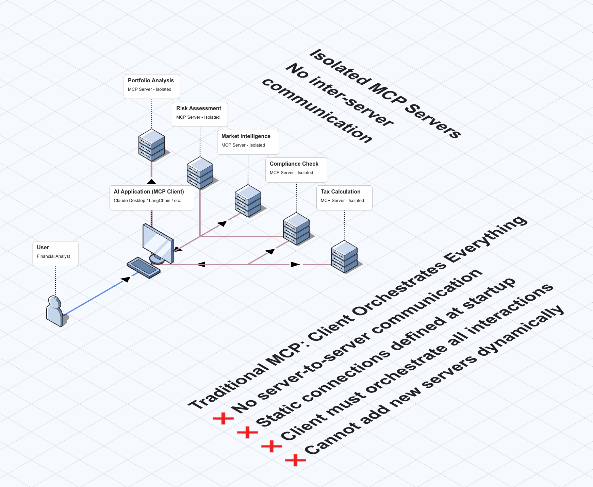

# MCP Mesh

[](https://github.com/dhyansraj/mcp-mesh/actions/workflows/release.yml)
[](https://golang.org)
[](https://python.org)
[](https://hub.docker.com/u/mcpmesh)
[](https://kubernetes.io)
[](https://discord.gg/KDFDREphWn)
[](#license)

> **The future of AI is not one large model, but many specialized agents working together.**

## 🎯 Why MCP Mesh?

> **The MCP Protocol is brilliant for AI tool integration. MCP Mesh makes it production-ready.**

While MCP solved AI tool standardization, scaling MCP applications to production presents unique challenges. MCP Mesh transforms MCP from a development protocol into an enterprise-grade distributed system.

---

### **For Developers 👩‍💻**

**Stop fighting infrastructure. Start building intelligence.**

- **Zero Boilerplate**: Two decorators (`@app.tool()` + `@mesh.tool()`) replace hundreds of lines of networking code
- **Pure Python Simplicity**: Write MCP servers as simple functions - no manual client/server setup, no connection management
- **End-to-End Integration**: Use `@mesh.route()` to inject MCP agents directly into FastAPI APIs - bridge web services and AI agents seamlessly
- **Seamless Development Flow**: Code locally, test with Docker Compose, deploy to Kubernetes - same code, zero changes
- **kubectl-like Management**: `meshctl` - a familiar command-line tool to run, monitor, and manage your entire agent network

```python
# MCP Agent
@app.tool()
@mesh.tool(dependencies=["weather_service"])
def plan_trip(weather_service=None):
    # Just write business logic - mesh handles the rest

# FastAPI Route with MCP DI
@api.post("/trip-planning")
@mesh.route(dependencies=["plan_trip"])
async def create_trip(trip_data: dict, plan_trip=None):
    # Use MCP agents directly in your web API
    return plan_trip(trip_data)
```

---

### **For Solution Architects 🏗️**

**Design intelligent systems, not complex integrations.**

- **Agent-Centric Architecture**: Design specialized agents with clear capabilities and dependencies, not monolithic systems
- **Dynamic Intelligence**: Agents get smarter automatically when new capabilities come online - no reconfiguration needed
- **Domain-Driven Design**: Solve business problems with ecosystems of focused agents that can be designed and developed independently
- **Composable Solutions**: Mix and match agents to create new business capabilities without custom integration code

**Example**: Deploy a financial analysis agent that automatically discovers and uses risk assessment, market data, and compliance agents as they become available.

---

### **For DevOps & Platform Teams ⚙️**

**Production-ready AI infrastructure out of the box.**

- **Kubernetes-Native**: Deploy with battle-tested Helm charts - horizontal scaling, health checks, and service discovery included
- **Enterprise Observability**: Built-in Grafana dashboards, distributed tracing, and centralized logging for complete system visibility
- **Zero-Touch Operations**: Agents self-register, auto-discover dependencies, and gracefully handle failures without network restarts
- **Standards-Based**: Leverage existing Kubernetes patterns - RBAC, network policies, service mesh integration, and security policies

**Scale from 2 agents to 200+ with the same operational complexity.**

---

### **For Support & Operations 🛠️**

**Complete visibility and zero-downtime operations.**

- **Real-Time Network Monitoring**: See every agent, dependency, and health status in live dashboards
- **Intelligent Scaling**: Agents scale independently based on demand - no cascading performance issues
- **Graceful Failure Handling**: Agents degrade gracefully when dependencies are unavailable, automatically reconnect when services return
- **One-Click Diagnostics**: `meshctl status` provides instant network health assessment with actionable insights

---

### **For Engineering Leadership 📈**

**Transform AI experiments into production revenue.**

- **Accelerated Time-to-Market**: Move from PoC to production deployment in weeks, not months
- **Cross-Team Collaboration**: Enable different departments to build agents that automatically enhance each other's capabilities
- **Risk Mitigation**: Battle-tested enterprise patterns ensure reliable AI deployments that scale with your business
- **Future-Proof Architecture**: Add new AI capabilities without disrupting existing systems

**Turn your AI strategy from "promising experiments" to "competitive advantage in production."**

---

## Architecture Overview

### Traditional MCP: Complex Systems = Nightmare



**❌ Building complex agentic apps with traditional MCP:**

- Client handles all orchestration, networking, and state
- Adding new services requires reconfiguring everything
- No dynamic upgrades - must restart entire system
- Complex boilerplate for every service interaction

### MCP Mesh: Complex Systems = Simple Code


**✅ MCP Mesh handles the complexity so you don't have to:**

- **Zero Boilerplate**: Just add `@mesh.tool()` - networking handled automatically
- **Dynamic Everything**: Add/remove/upgrade services without touching other code
- **Complex Apps Made Simple**: Financial services example shows 6+ interconnected agents
- **Production Ready**: Built-in resilience, distributed observability, and scaling

**The Magic**: Write simple Python functions, get enterprise-grade distributed systems.

---

## MCP vs MCP Mesh: At a Glance

| Challenge                  | Traditional MCP                      | MCP Mesh                       |
| -------------------------- | ------------------------------------ | ------------------------------ |
| **Connect 5 servers**      | 200+ lines of networking code        | 2 decorators                   |
| **Handle failures**        | Manual error handling everywhere     | Automatic graceful degradation |
| **Scale to production**    | Custom Kubernetes setup              | `helm install mcp-mesh`        |
| **Monitor system**         | Build custom dashboards              | Built-in observability stack   |
| **Add new capabilities**   | Restart and reconfigure clients      | Auto-discovery, zero downtime  |
| **Development complexity** | Manage servers, clients, connections | Write business logic only      |
| **Deployment**             | Manual orchestration                 | Kubernetes-native with Helm    |

---

## Key Features

### **Dynamic Dependency Injection & Service Discovery**

- **Pull-based discovery** with runtime function injection - no networking code required
- **Automatic agent discovery** without configuration
- **Smart dependency resolution** with version constraints and tags
- **Load balancing** across multiple service providers

### **Enterprise-Grade Resilience**

- **Registry as facilitator** - agents communicate directly with fault tolerance
- **Self-healing architecture** - automatic reconnection when services return
- **Graceful degradation** - agents work standalone when dependencies unavailable
- **Background orchestration** - mesh coordinates without blocking business logic

### **Production-Ready Observability**

- **Complete observability stack** - Grafana dashboards, Tempo tracing, Redis session management
- **Distributed tracing** with OTLP export and cross-agent context propagation
- **Real-time trace streaming** for multi-agent workflow monitoring
- **Advanced session management** with Redis-backed stickiness across pod replicas

### **Developer Experience & Operations**

- **Near-complete MCP protocol support** for distributed networks
- **Enhanced proxy system** with kwargs-driven auto-configuration for timeouts, retries, streaming
- **meshctl CLI** for lifecycle management and network insights
- **Kubernetes native** with scaling, health checks, and comprehensive observability

---

## Quick Start

### See MCP Mesh in Action

_MCP Mesh sets the stage, but MCP agents steal the show! Agents dynamically discover dependencies, gracefully degrade when services go down, and seamlessly reconnect when they come back online._

### Simple Agent Example

```python
#!/usr/bin/env python3
from typing import Any
import mesh
from fastmcp import FastMCP

app = FastMCP("Hello World Service")

@app.tool()
@mesh.tool(
    capability="greeting",
    dependencies=["date_service"]
)
def hello_mesh(date_service: Any = None) -> str:
    if date_service is None:
        return "👋 Hello from MCP Mesh! (Date service not available yet)"

    current_date = date_service()
    return f"👋 Hello from MCP Mesh! Today is {current_date}"

@mesh.agent(
    name="hello-world",
    http_port=9090,
    auto_run=True
)
class HelloWorldAgent:
    pass
```

### Installation & Demo

```bash
# Install MCP Mesh
pip install "mcp-mesh>=0.5,<0.6"

# Start agents with meshctl (registry starts automatically)
meshctl start examples/simple/system_agent.py
meshctl start examples/simple/hello_world.py

# Test the dynamic dependency injection
curl http://localhost:9090/mcp/ -X POST \
  -H "Content-Type: application/json" \
  -H "Accept: application/json, text/event-stream" \
  -d '{"jsonrpc": "2.0", "id": 1, "method": "tools/call", "params": {"name": "hello_mesh_simple", "arguments": {}}}'

# Response: "👋 Hello from MCP Mesh! Today is December 19, 2024 at 02:30 PM"
```

**The magic**: Agents automatically discover and connect to each other without any configuration!

### Installation Options

| Method             | Best For                | Command                                                |
| ------------------ | ----------------------- | ------------------------------------------------------ |
| **Homebrew**       | macOS users             | `brew tap dhyansraj/mcp-mesh && brew install mcp-mesh` |
| **Docker Compose** | Getting started quickly | `cd examples/docker-examples && docker-compose up`     |
| **Python Package** | Agent development       | `pip install "mcp-mesh>=0.5,<0.6"`                     |
| **Kubernetes**     | Production deployment   | `kubectl apply -k examples/k8s/base/`                  |

### Advanced Features for Production

MCP Mesh extends the MCP protocol with enterprise-grade capabilities for distributed environments:

#### **Session Stickiness & Stateful Operations**

```python
@mesh.tool(
    session_required=True,     # Enable session routing
    stateful=True,            # Mark as stateful
    auto_session_management=True  # Automatic lifecycle
)
def user_counter(session_id: str, increment: int = 1):
    # Automatically routed to same pod for session consistency
    return update_user_state(session_id, increment)
```

**Features**: Redis-backed session storage, automatic pod assignment, graceful fallback to in-memory storage.

#### **Enhanced Proxy Auto-Configuration**

```python
@mesh.tool(
    capability="data_processor",
    timeout=120,                  # 2-minute timeout
    retry_count=3,               # Exponential backoff retries
    auth_required=True,          # Bearer token authentication
    streaming=True,              # Auto-select streaming proxy
    custom_headers={"X-Version": "v2"}  # Service identification
)
async def process_dataset(data_url: str):
    # Auto-configured with production-ready settings
```

**Features**: Timeout management, retry policies, authentication, streaming auto-selection, custom headers.

#### **Comprehensive MCP Protocol Support**

MCP Mesh provides extensive MCP protocol coverage in distributed environments:

- **Complete Tool Calling**: Full MCP JSON-RPC implementation with enhanced error handling
- **Streaming Support**: Native async generators with automatic proxy selection
- **Authentication Integration**: Bearer tokens, custom headers, and security controls
- **Session Management**: Stateful operations with distributed session affinity
- **Error Resilience**: Graceful degradation and automatic retry mechanisms

The implementation maintains MCP protocol compatibility while adding distributed system capabilities that scale from local development to enterprise deployments.

> **🔧 For Development**: See [Local Development Guide](docs/02-local-development.md) to build from source.

---

## Learn More

### **Tutorials**

- **[Getting Started Guide](docs/01-getting-started.md)** - Build your first distributed MCP agent
- **[Local Development](docs/02-local-development.md)** - Professional development workflows
- **[Docker Deployment](docs/03-docker-deployment.md)** - Multi-service environments
- **[Kubernetes Basics](docs/04-kubernetes-basics.md)** - Production deployment

### **Reference Guides**

- **[Mesh Decorators](docs/mesh-decorators.md)** - Complete decorator reference
- **[meshctl CLI](docs/meshctl-cli.md)** - Command-line tool guide
- **[Environment Variables](docs/environment-variables.md)** - Configuration options
- **[Architecture & Design](docs/architecture-and-design.md)** - Deep technical details

### **From MCP to Production: Challenges Solved**

While the Model Context Protocol (MCP) provides an excellent foundation for AI tool integration, scaling MCP applications in production environments presents unique challenges. MCP Mesh addresses these common pain points with a Kubernetes-native approach:

#### **Service Discovery & Orchestration**

- **Challenge**: MCP applications typically require manual configuration to connect multiple servers, limiting dynamic service composition
- **Solution**: Automatic service discovery with registry-based coordination allows agents to find and connect to capabilities without hardcoded configurations

#### **Scaling & Load Balancing**

- **Challenge**: Running multiple MCP servers requires external proxy tools and complex load balancing setups
- **Solution**: Native horizontal scaling with health-based routing distributes requests across available agent instances automatically

#### **Development Complexity**

- **Challenge**: Setting up multi-server MCP environments involves significant boilerplate code and manual orchestration
- **Solution**: Two simple decorators (`@mesh.agent` + `@mesh.tool`) provide the same functionality with zero configuration overhead

#### **Production Deployment**

- **Challenge**: Limited guidance exists for deploying MCP applications at scale with proper monitoring and fault tolerance
- **Solution**: Complete Kubernetes manifests, PostgreSQL integration, and production-ready observability out of the box

#### **Dependency Management**

- **Challenge**: No standardized way to handle versioned dependencies or capability requirements between MCP servers
- **Solution**: Semantic versioning with constraint matching (e.g., `>= 2.0`) and tag-based capability selection for precise dependency resolution

#### **Reliability & Fault Tolerance**

- **Challenge**: MCP server connection issues and shutdown problems can affect application stability
- **Solution**: Resilient architecture where agents work standalone and gracefully handle registry failures while maintaining service continuity

MCP Mesh transforms MCP from a point-to-point protocol into a distributed service mesh, making production-scale MCP deployments as simple as developing locally.

---

## Vision: Global AI Agent Network

MCP Mesh's architecture naturally enables a distributed ecosystem where AI agents can discover and collaborate across organizational and geographical boundaries. The same technology powering enterprise deployments can scale to support industry-wide cooperation.

### **Technical Foundation for Cross-Cluster Federation**

The registry-based discovery model supports federated architectures where agents from different Kubernetes clusters can participate in a shared capability network:

```yaml
# Multi-cluster registry federation
apiVersion: v1
kind: ConfigMap
metadata:
  name: registry-federation
data:
  federation.yaml: |
    primary_registry: "https://registry.my-org.com"
    federated_registries:
      - url: "https://public-registry.ai-consortium.org"
        trust_level: "verified"
        capabilities: ["translation", "analysis", "computation"]
      - url: "https://academic-registry.university.edu"
        trust_level: "research"
        capabilities: ["research_tools", "data_analysis"]
```

### **Potential Industry Applications**

**Enterprise Collaboration**: Organizations could share specialized AI capabilities while maintaining security boundaries - imagine a financial analysis agent discovering legal compliance tools from a partner firm's cluster, or supply chain optimization agents coordinating across vendor networks.

**Research Networks**: Academic institutions could pool computational resources and specialized models, allowing researchers worldwide to access domain-specific AI tools without complex bilateral agreements.

**Industry Standards**: Professional consortia could establish common capability registries, enabling standardized AI tool interfaces across competing platforms while preserving competitive differentiation in implementation.

### **Current State and Roadmap**

Today, MCP Mesh provides the core infrastructure patterns needed for this vision:

- ✅ **Registry Federation**: Multiple registries can already cross-reference capabilities
- ✅ **Security Boundaries**: Namespace isolation and RBAC controls
- ✅ **Standard Protocols**: HTTP APIs and MCP compatibility ensure interoperability
- 🔄 **In Development**: Enhanced authentication, capability verification, and cross-cluster networking
- 📋 **Future Work**: Economic frameworks, reputation systems, and governance tooling

The technology exists; what's needed is community coordination and trust frameworks. MCP Mesh provides the infrastructure foundation for organizations ready to explore collaborative AI agent networks.

---

## Development

### Prerequisites

- **Go 1.21+** (for registry service)
- **Python 3.11+** (for agent runtime)
- **Docker** (for containerized development)
- **Kubernetes/Minikube** (for cluster deployment)

### Build and Test

```bash
# Build the entire project
make build

# Run tests
make test-all

# Local development with Docker Compose
make dev

# Deploy to Kubernetes
make deploy
```

### Project Structure

```
mcp-mesh/
├── src/core/           # Go registry service and CLI
├── src/runtime/        # Python agent runtime and decorators
├── examples/           # Sample agents and deployment examples
├── docs/              # Comprehensive documentation
├── helm/              # Helm charts for Kubernetes deployment
├── docker/            # Docker configurations
└── k8s/               # Kubernetes manifests
```

---

## Contributing

We welcome contributions from the community! MCP Mesh is designed to be a collaborative effort to advance the state of distributed MCP applications.

### How to Contribute

1. **[Check the Issues](https://github.com/dhyansraj/mcp-mesh/issues)** - Find good first issues or suggest new features
2. **[Join Discussions](https://github.com/dhyansraj/mcp-mesh/discussions)** - Share ideas and get help from the community
3. **[Submit Pull Requests](https://github.com/dhyansraj/mcp-mesh/pulls)** - Contribute code, documentation, or examples
4. **Follow our development guidelines** - See project structure and coding standards below

### Development Areas

- **Core Platform**: Go registry service, capability discovery, health monitoring
- **Python Runtime**: Agent decorators, dynamic injection, HTTP proxy generation, FastMCP integration
- **Language Runtimes**: Additional language support (Go, JavaScript, etc.)
- **Documentation**: Guides, tutorials, API documentation, examples
- **Deployment**: Helm charts, operators, CI/CD integration
- **Testing**: Unit tests, integration tests, performance benchmarks

---

## Community & Support

- **[Discord](https://discord.gg/KDFDREphWn)** - Real-time help and discussions
- **[GitHub Discussions](https://github.com/dhyansraj/mcp-mesh/discussions)** - Share ideas and ask questions
- **[Issues](https://github.com/dhyansraj/mcp-mesh/issues)** - Report bugs or request features
- **[Examples](examples/)** - Working code examples and deployment patterns

---

## License

This project is open source. License details will be provided in the LICENSE file.

---

## Acknowledgments

- **[Anthropic](https://anthropic.com)** for creating the MCP protocol that inspired this project
- **[FastMCP](https://github.com/jlowin/fastmcp)** for providing excellent MCP server foundations
- **[Kubernetes](https://kubernetes.io)** community for building the infrastructure platform that makes this possible
- All the **contributors** who help make MCP Mesh better

---

## 🚀 Get Started

1. **[⚡ Quick Tutorial](docs/01-getting-started.md)** - Build your first distributed MCP agent
2. **[💬 Join Discord](https://discord.gg/KDFDREphWn)** - Connect with the community
3. **[🔧 Contribute](https://github.com/dhyansraj/mcp-mesh/issues)** - Help build the future of AI orchestration

**Star the repo** if MCP Mesh helps you build better AI systems! ⭐
