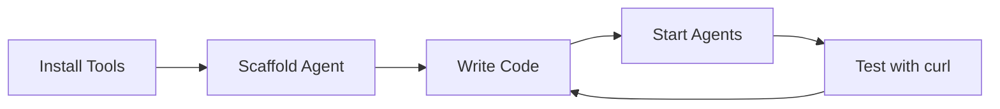

# Local Development

> Develop your own MCP Mesh agents locally

## Choose Your Language

<div class="grid-features" markdown>
<div class="feature-card" markdown>
### :fontawesome-brands-python: Python

Full-featured Python SDK with decorators.

- `@mesh.agent`, `@mesh.tool` decorators
- Jinja2 template support
- pytest integration

[:material-arrow-right: Python Guide](python/local-development/index.md){ .md-button }

</div>

<div class="feature-card" markdown>
### :material-language-typescript: TypeScript

Modern TypeScript SDK with full type safety.

- `mesh()`, `agent.addTool()` functions
- Zod schema validation
- Vitest integration

[:material-arrow-right: TypeScript Guide](typescript/local-development/index.md){ .md-button }

</div>
</div>

---

## Overview

This guide walks you through setting up a local development environment for building your own MCP Mesh agents. You'll learn how to scaffold, develop, and test agents on your machine using **Python** or **TypeScript**.

## Development Workflow



## Quick Start

### 1. Install Required Components

=== "meshctl (CLI)"

    ```bash
    npm install -g @mcpmesh/cli
    ```

    Command-line tool for managing agents, registry, and mesh operations.

=== "Registry"

    ```bash
    npm install -g @mcpmesh/cli
    ```

    Service discovery and coordination server. Included with the npm package above.

=== "Python Runtime"

    ```bash
    pip install "mcp-mesh>=0.8,<0.9"
    ```

    Runtime for building agents with `@mesh.agent` and `@mesh.tool` decorators.

=== "TypeScript Runtime"

    ```bash
    npm install @mcpmesh/sdk zod
    npm install -D typescript tsx @types/node
    ```

    Runtime for building agents with `mesh()` and `agent.addTool()` functions.

### 2. Set Up Your Project

```bash
# Create project directory
mkdir my-agent-project
cd my-agent-project

# Create and activate virtual environment
python -m venv .venv
source .venv/bin/activate  # On Windows: .venv\Scripts\activate

# Install MCP Mesh SDK (if not done above)
pip install "mcp-mesh>=0.8,<0.9"
```

### 3. Scaffold Your Agent

```bash
# Generate a new agent
meshctl scaffold --name my-agent --capability my_service

# Or with Docker Compose for deployment
meshctl scaffold --name my-agent --compose
```

This creates:

```
my-agent/
├── main.py           # Your agent code
├── requirements.txt  # Dependencies
└── README.md         # Documentation
```

### 4. Develop Your Agent

Edit `main.py` to add your functionality:

```python
import mesh
from fastmcp import FastMCP

app = FastMCP("My Agent")

@app.tool()
@mesh.tool(capability="my_service")
def my_function(data: str) -> str:
    """Your custom functionality."""
    return f"Processed: {data}"

@mesh.agent(name="my-agent", http_port=8080, auto_run=True)
class MyAgent:
    pass
```

### 5. Start Your Agent

```bash
# Start your agent (registry auto-starts if not running)
meshctl start main.py
```

### 6. Test Your Agent

```bash
# List registered agents
meshctl list

# Call your tool
meshctl call my_function '{"data":"hello"}'
```

<details>
<summary>Alternative: Using curl directly</summary>

```bash
# List available tools
curl -s -X POST http://localhost:8080/mcp \
  -H "Content-Type: application/json" \
  -H "Accept: application/json, text/event-stream" \
  -d '{"jsonrpc":"2.0","id":1,"method":"tools/list","params":{}}'

# Call your tool
curl -s -X POST http://localhost:8080/mcp \
  -H "Content-Type: application/json" \
  -H "Accept: application/json, text/event-stream" \
  -d '{"jsonrpc":"2.0","id":1,"method":"tools/call","params":{"name":"my_function","arguments":{"data":"hello"}}}'
```

!!! note "SSE Response Format"
MCP Mesh uses Server-Sent Events (SSE) format. `meshctl call` handles this automatically.

</details>

## Multi-Agent Development

Develop multiple agents that work together:

```bash
# Terminal 1: Start first agent
meshctl start agents/auth_agent.py

# Terminal 2: Start second agent (depends on first)
meshctl start agents/api_agent.py

# Test dependency injection
meshctl call secure_operation
```

## Project Structure

Each scaffolded agent gets its own directory:

```
my-project/
├── my-agent/
│   ├── main.py           # Agent code
│   ├── requirements.txt  # Dependencies
│   ├── Dockerfile        # Container build
│   ├── helm-values.yaml  # Kubernetes config
│   ├── __init__.py
│   ├── __main__.py
│   └── README.md
├── another-agent/
│   ├── main.py
│   ├── requirements.txt
│   ├── Dockerfile
│   └── ...
└── docker-compose.yml    # Generated with --compose
```

## Environment Variables

For local development, agent configuration (name, port, capabilities) is typically defined in the agent code itself. Environment variables are more useful for:

- **Shared configuration** across multiple agents (API keys, external service URLs)
- **Kubernetes/Helm deployments** where you override ports and registry URLs

```bash
# .env - shared config for multiple agents
OPENAI_API_KEY=sk-...
DATABASE_URL=postgres://localhost:5432/mydb
```

Use `--env-file` to load shared variables when starting agents:

```bash
# Load .env for all agents
meshctl start --env-file .env agent1.py agent2.py

# Or pass individual variables
meshctl start --env MY_API_KEY=secret main.py
```

!!! tip "Port Configuration"
Avoid setting `MCP_MESH_HTTP_PORT` in shared env files—it causes port conflicts when running multiple agents. Define ports in your agent code for local dev, or let them auto-assign with `port: 0`.

## Useful Commands

```bash
# Start multiple agents at once (mixed languages supported)
meshctl start agent1.py agent2.ts agent3.py

# Start with hot reload (auto-restart on file changes)
meshctl start -w main.py

# Start in background (detached mode)
meshctl start -d main.py

# List all agents
meshctl list

# Check mesh status (capabilities, dependencies, endpoints)
meshctl status

# Stop all agents
meshctl stop --all
```

## Debugging

### Enable Debug Mode

```bash
# Debug mode (verbose output + debug logging)
meshctl start --debug main.py

# Or set specific log level
meshctl start --log-level DEBUG main.py

# Available levels: TRACE, DEBUG, INFO, WARN, ERROR
# TRACE enables SQL logging for registry debugging
```

### Check Registry Connection

```bash
# Quick check - shows agent count and dependency resolution
meshctl list

# Detailed view - shows capabilities, dependencies, endpoints
meshctl status
```

### VS Code Configuration

Create `.vscode/launch.json`:

```json
{
  "version": "0.2.0",
  "configurations": [
    {
      "name": "Debug Agent",
      "type": "python",
      "request": "launch",
      "module": "mesh",
      "args": ["start", "main.py"],
      "env": {
        "MCP_MESH_LOG_LEVEL": "DEBUG"
      }
    }
  ]
}
```

## Testing Your Agents

```python
# tests/test_agents.py
import pytest
import requests

def test_my_function():
    response = requests.post(
        "http://localhost:8080/mcp",
        json={
            "jsonrpc": "2.0",
            "id": 1,
            "method": "tools/call",
            "params": {
                "name": "my_function",
                "arguments": {"data": "test"}
            }
        }
    )
    assert response.status_code == 200
    result = response.json()
    assert "Processed: test" in str(result)
```

Run tests:

```bash
pytest tests/
```

## Troubleshooting

### Registry Not Starting

```bash
# Check if port 8000 is in use
lsof -i :8000

# Kill existing process if needed
kill -9 $(lsof -t -i:8000)

# Start registry manually
meshctl start-registry
```

### Agent Not Registering

1. Check registry is running: `curl http://localhost:8000/health`
2. Check agent logs for errors
3. Verify `MCP_MESH_REGISTRY_URL` is correct

### Dependency Not Injected

```bash
# Quick check - see if all dependencies are resolved (e.g., "4/4")
meshctl list

# Detailed view - shows capabilities, resolved dependencies, and endpoints
meshctl status
```

## Next Steps

- [Docker Deployment](03-docker-deployment.md) - Package and deploy your agents
- [Kubernetes Deployment](04-kubernetes-basics.md) - Scale to production
- [Mesh Decorators Reference](mesh-decorators.md) - All decorator options
