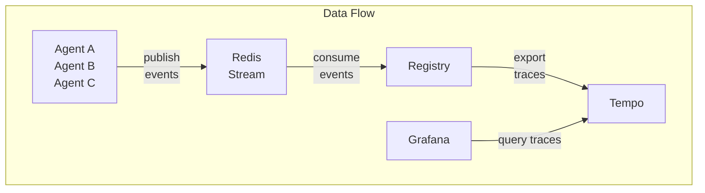

# Observability

> Built-in tracing, dashboards, and monitoring - ready to use

## Overview

MCP Mesh includes a complete observability stack:

- **Redis** - Trace event collection from agents
- **Tempo** - Distributed trace storage and querying
- **Grafana** - Pre-configured dashboards

The data flows: **Agents → Redis → Registry → Tempo → Grafana**

## Quick Start

### With Helm (Recommended)

```bash
# Deploy core with observability enabled (default)
helm install mcp-core oci://ghcr.io/dhyansraj/mcp-mesh/mcp-mesh-core \
  --version 0.9.6 \
  --namespace mcp-mesh \
  --set redis.enabled=true \
  --set tempo.enabled=true \
  --set grafana.enabled=true

# Access Grafana
kubectl port-forward svc/mcp-core-mcp-mesh-grafana 3000:3000 -n mcp-mesh
open http://localhost:3000  # admin/admin
```

### With Docker Compose

```bash
# Generate compose with observability
meshctl scaffold --compose --observability -d ./agents

# Start
docker-compose up -d

# Access Grafana
open http://localhost:3000
```

## Architecture



## Configuration

### Environment Variables

**Registry (trace consumer):**

| Variable                               | Default                        | Description                              |
| -------------------------------------- | ------------------------------ | ---------------------------------------- |
| `MCP_MESH_DISTRIBUTED_TRACING_ENABLED` | `false`                        | Enable tracing                           |
| `REDIS_URL`                            | `redis://localhost:6379`       | Redis for trace events                   |
| `TELEMETRY_ENDPOINT`                   | -                              | Tempo OTLP endpoint                      |
| `TRACE_EXPORTER_TYPE`                  | `otlp`                         | Export format: `otlp`, `console`, `json` |
| `STREAM_NAME`                          | `mesh:trace`                   | Redis stream name                        |
| `CONSUMER_GROUP`                       | `mcp-mesh-registry-processors` | Consumer group                           |

**Agents (trace publishers):**

| Variable                               | Default                  | Description                 |
| -------------------------------------- | ------------------------ | --------------------------- |
| `MCP_MESH_DISTRIBUTED_TRACING_ENABLED` | `false`                  | Enable trace publishing     |
| `REDIS_URL`                            | `redis://localhost:6379` | Redis for publishing events |

### Enable Tracing

```yaml
# In mcp-mesh-core values
mcp-mesh-registry:
  registry:
    observability:
      distributedTracing:
        enabled: true
        redisUrl: "redis://mcp-core-mcp-mesh-redis:6379"
        telemetryEndpoint: "mcp-core-mcp-mesh-tempo:4317"
```

## Troubleshooting

### Step 1: Check if Agents are Publishing to Redis

```bash
# Check Redis stream exists and has events
redis-cli XLEN mesh:trace

# View recent events
redis-cli XREVRANGE mesh:trace + - COUNT 5

# Expected output: Events with trace_id, span_id, agent_name
```

**If empty:**

- Check `MCP_MESH_DISTRIBUTED_TRACING_ENABLED=true` in agent env
- Check agent can reach Redis: `curl http://agent:8080/health`
- Check agent logs for "Tracing enabled" message

### Step 2: Check Registry Connection to Redis

```bash
# Check registry can connect to Redis
kubectl exec -it <registry-pod> -n mcp-mesh -- redis-cli -h mcp-core-mcp-mesh-redis ping

# Check consumer group exists
redis-cli XINFO GROUPS mesh:trace

# Expected output: Consumer group "mcp-mesh-registry-processors" with consumers
```

**If no consumer group:**

- Check `MCP_MESH_DISTRIBUTED_TRACING_ENABLED=true` in registry env
- Check `REDIS_URL` points to correct Redis service
- Check registry logs for "Starting trace consumer" message

### Step 3: Check Registry is Exporting to Tempo

```bash
# Check trace status endpoint
kubectl port-forward svc/mcp-core-mcp-mesh-registry 8000:8000 -n mcp-mesh
curl http://localhost:8000/trace/status | jq .

# Expected output:
# {
#   "enabled": true,
#   "consumer": { "status": "running" },
#   "correlator": { "active_traces": N },
#   "exporter": { "type": "otlp", "exported_traces": N }
# }
```

**If exporter not working:**

- Check `TELEMETRY_ENDPOINT` points to Tempo (e.g., `tempo:4317`)
- Check Tempo is running: `kubectl get pods -l app.kubernetes.io/name=mcp-mesh-tempo`
- Check registry logs for export errors

### Step 4: Check Grafana Can Query Tempo

```bash
# Port-forward Tempo
kubectl port-forward svc/mcp-core-mcp-mesh-tempo 3200:3200 -n mcp-mesh

# Query traces directly from Tempo
curl "http://localhost:3200/api/search?limit=5" | jq .

# Expected output: List of traces
```

**If no traces in Tempo:**

- Check Tempo is receiving data on port 4317 (OTLP gRPC)
- Check Tempo logs: `kubectl logs -l app.kubernetes.io/name=mcp-mesh-tempo -n mcp-mesh`

**In Grafana:**

1. Go to Explore → Select "Tempo" datasource
2. Search for traces
3. If "No data", check datasource URL points to `http://mcp-core-mcp-mesh-tempo:3200`

## Common Issues

### No traces appearing anywhere

```bash
# Full diagnostic check
echo "=== Redis Stream ==="
redis-cli XLEN mesh:trace

echo "=== Consumer Groups ==="
redis-cli XINFO GROUPS mesh:trace

echo "=== Registry Trace Status ==="
curl -s http://localhost:8000/trace/status | jq .

echo "=== Tempo Traces ==="
curl -s "http://localhost:3200/api/search?limit=1" | jq .
```

### Traces in Redis but not in Tempo

Registry is not consuming or exporting properly:

```bash
# Check registry logs
kubectl logs -l app.kubernetes.io/name=mcp-mesh-registry -n mcp-mesh | grep -i trace

# Check consumer lag (pending events)
redis-cli XINFO GROUPS mesh:trace
# Look for "lag" field - high lag means consumer is slow/stuck
```

### Traces in Tempo but not in Grafana

Grafana datasource misconfigured:

1. Go to Grafana → Configuration → Data Sources → Tempo
2. Verify URL: `http://mcp-core-mcp-mesh-tempo:3200`
3. Click "Save & Test"

## Accessing Services

```bash
# Grafana (dashboards)
kubectl port-forward svc/mcp-core-mcp-mesh-grafana 3000:3000 -n mcp-mesh
# URL: http://localhost:3000 (admin/admin)

# Tempo (trace API)
kubectl port-forward svc/mcp-core-mcp-mesh-tempo 3200:3200 -n mcp-mesh
# URL: http://localhost:3200/api/search

# Registry (trace status)
kubectl port-forward svc/mcp-core-mcp-mesh-registry 8000:8000 -n mcp-mesh
# URL: http://localhost:8000/trace/status
```

## Disable Observability

For minimal deployments:

```yaml
# mcp-mesh-core values
redis:
  enabled: false

tempo:
  enabled: false

grafana:
  enabled: false

mcp-mesh-registry:
  registry:
    observability:
      distributedTracing:
        enabled: false
```
