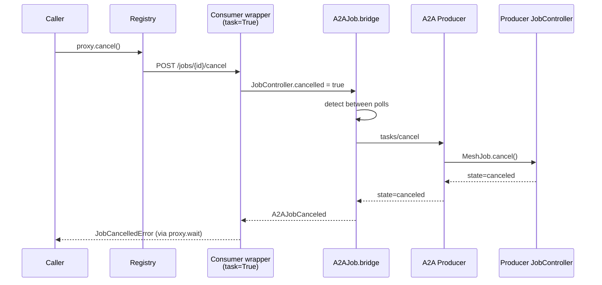

# Architecture & Decisions

This page captures the design rationale behind the A2A consumer arc — what mesh chose to build, what it deliberately did not, and the race-fix history that makes the current shape work safely.

## Why `bridge(JobController)`, not `as_mesh_job()`

When designing the long-running consumer (issue #910), there were two viable options for how a `task=True` mesh capability could wrap an external A2A long-running task:

**Option 1 — `as_mesh_job()`.** The consumer body returns a synthetic `MeshJob` proxy that internally polls the A2A backend. Mesh-side code (registry, downstream callers) sees a `MeshJob` shape; the proxy hides the A2A polling. This requires shadow-registry plumbing — the synthetic proxy needs to convince the registry that a job is in flight even though no `task=True` mesh tool is the actual owner. Substantial new machinery.

**Option 2 — `bridge(JobController)`. (chosen)** The consumer is "just" a regular `task=True` mesh tool. The mesh runtime injects a real `JobController` for it the same way it does for any native long-running tool. The handler body submits to A2A non-blocking and hands the returned `A2AJob` to `bridge(controller)` — which polls A2A and mirrors progress into the controller. The mesh `task=True` wrapper takes the bridge's return value and calls `controller.complete(...)` itself.

Option 2 wins because:

- No shadow-registry plumbing. The capability is registered through the same `task=True` path as any native long-running tool — same heartbeat, same orphan-reset, same cancel propagation.
- The bridge primitive is small (`A2AJob.bridge` is ~30 lines per runtime). All the heavy lifting reuses mesh's existing `task=True` substrate.
- Downstream callers see a normal `MeshJob` proxy with no special semantics. They have no clue the work is happening on an external A2A backend.

The trade-off: the consumer process holds the polling / SSE channel for the lifetime of the upstream task. If the consumer dies mid-job, the long-running state is lost (the upstream A2A task continues but the mesh-side handle is gone — see "Failover pinning semantics" below).

Source: `src/runtime/python/mesh/_a2a_consumer.py` (`A2AJob.bridge`, `A2AStream.bridge`).

## Failover pinning semantics

Capability+tag failover applies differently depending on call shape:

- **Sync consumers.** Every `tools/call` is a fresh resolution. A dead consumer is detoured cleanly on the next call. Caller experience: transparent rewire to a peer consumer in seconds (see [Failover & Federation](failover.md)).

- **Long-running consumers (`task=True`).** The job is **pinned** to the consumer that submitted it. The state lives on the external A2A backend; the consumer holds the open polling / SSE channel as the only mesh-side handle on it. Killing the consumer mid-job:
    - Surfaces as `JobLost` to the caller.
    - The caller MAY retry the submission — the retry routes to a peer consumer via the standard resolver, which submits a fresh A2A task on the upstream (no portable "resume" semantic exists on A2A v1.0).
    - The orphaned upstream A2A task may still be running; the upstream's own deadline / cancel policy applies. Mesh cannot orphan-cancel it because the original consumer (which held the task id) is dead.

This is by design. Long-running A2A tasks are stateful on the upstream; mesh does not (and cannot, without protocol extensions) replicate that state across consumer replicas. For policy: prefer sync skills for cross-vendor failover; reserve long-running for skills where the upstream truly is long-running and the per-vendor pinning is acceptable.

## Cancel propagation chain (full file:line references)

The cancel chain — caller through to upstream A2A producer — for the polling bridge:

1. **Caller-side.** `await proxy.cancel(reason)` invokes `MeshJob.cancel(...)` which POSTs `/jobs/{id}/cancel` to the registry.
2. **Registry.** Forwards to the consumer's `/jobs/{id}/cancel` endpoint (auto-registered on every mesh agent's FastAPI app).
3. **Consumer cancel hook.** Flips the `JobController` to cancelled state. Python: `with_job_async_py` in the Rust core (`src/runtime/rust/src/with_job_async.rs`); Java: `JobController.isCancelled()` returns true; TS: `awaitJobCancel(jobId)` resolves.
4. **Bridge detection.** `A2AJob.bridge` polls between iterations:
    - Python: `src/runtime/python/mesh/_a2a_consumer.py` — `A2AJob.bridge` races each iteration's sleep against the cancel signal.
    - Java: `src/runtime/java/mcp-mesh-sdk/src/main/java/io/mcpmesh/a2a/A2AJob.java` — `controller.isCancelled()` checked between polls.
    - TypeScript: `src/runtime/typescript/src/a2a/a2a-job.ts` — `awaitJobCancel(jobId)` raced against polling sleep.
5. **Outbound cancel.** Bridge POSTs `tasks/cancel` to the upstream A2A producer's JSON-RPC endpoint.
6. **Upstream propagation.** The A2A producer cancels the underlying work (mesh `MeshJob.cancel(...)` if the producer is itself a mesh agent) and reports `state=canceled`.
7. **Mesh-side terminal.** Bridge raises `A2AJobCanceled` (Py) / `A2AJobCanceledException` (Java) / `A2AJobCanceledError` (TS); the `task=True` wrapper records the canceled outcome in the `JobController`; the caller's `proxy.wait()` raises `JobCancelledError`.

## SSE constraint rationale

Per A2A v1.0 spec §SSE: client disconnect on a `tasks/sendSubscribe` stream is a transient signal. The producer continues running unless the client explicitly POSTs `tasks/cancel`.

Consequence for `A2AStream.bridge`:

- It does NOT POST `tasks/cancel` on cancel. It just closes the SSE connection.
- A mesh-side cancel during `stream.bridge` re-raises as `A2AJobCanceled` so the wrapper records the outcome — but the upstream producer keeps billing for the work.

If cancel propagation is required, use the polling bridge (`_a2a.submit(...)` + `a2a_job.bridge(...)`). The polling bridge's iteration-level cancel detection allows it to POST `tasks/cancel` explicitly before raising the cancel exception.

The protocol could be extended (a custom "cancel-on-disconnect" header), but mesh does not introduce non-spec extensions on the wire — that would break interoperability with other A2A producers.

## Race-fixes shipped along the way

The current shape works because a small set of races was identified and fixed during the consumer arc (referenced for posterity and for anyone tracking the change history):

- **Rust `with_job_async_py` cancel-watcher race (PR #914 / commit `5e9275b3`).** This affected ALL `task=True` users, not just A2A consumers — but it surfaced first under the A2A consumer's tight cancel loop. The fix: lift `register_active_job` BEFORE `into_future`, so the cancel watcher is wired before the handler can raise.
- **Per-loop `httpx` binding (PR #915).** `A2AClient`'s shared `httpx.AsyncClient` was bound to the loop that constructed it; pytest-asyncio's per-test loops broke this. Fix: re-create the inner client when the running loop differs from the bound one. Source: `src/runtime/python/mesh/_a2a_consumer.py` `A2AClient._http`.
- **Java `@A2AConsumer` framework-injection refactor (PR #924 / issue #923).** Aligns Java's annotation processing with Python's decorator pattern — the Spring starter constructs and injects the `A2AClient`, owning its lifecycle, instead of the user constructing it manually. Removes the marker-only annotation form (which now fails at boot with a migration message).
- **TypeScript `A2AClient` cache key by identity (PR #927).** Earlier TS implementation cached `A2AClient` instances by content-derived key. When two tools shared the same upstream URL but had different bearer tokens, they silently shared a single cached client and mixed up tokens between tools. Fix: cache by tool identity (WeakMap), so each tool's `A2AClient` is per-tool. BLOCKER fix.

## Open hardening (links to specific issues)

The A2A consumer arc closes with the following deferred work:

- **Java SIGTERM cancel propagation under tsuite (#921).** The Java consumer's tc07 test (failover on consumer death) is currently disabled in tsuite due to a SIGTERM handling race in the Java runtime — the Java agent doesn't release its mesh job lease cleanly enough on SIGTERM for tsuite's strict assertions to pass. Java consumers work in production; tsuite's edge-case test needs Java-side hardening.
- **TypeScript hardening pass (#926).** Outstanding non-BLOCKER cleanup: tighter typing on `_injected[]`, error message consistency with Python.
- **tsuite SIGTERM blocking (#920).** A tsuite-internal issue blocking uc27 tc07 from running cleanly. Disabled under `tests/integration/_disabled_pending_issues/uc27-tc07-pending-920/`.

## See also

- [Long-Running & SSE](long-running.md) — bridge primitives
- [Failover & Federation](failover.md) — capability+tag mechanism
