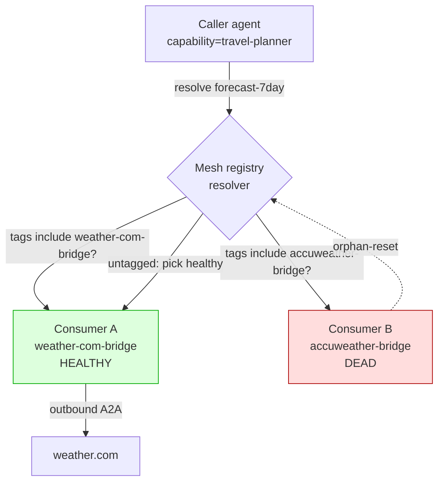

# Failover & Federation

This is the strategic differentiator. The A2A v1.0 spec defines the wire protocol; it does NOT define how a caller chooses between two backends advertising the same skill. Mesh does — and applies the same machinery to A2A consumers as it does to any native mesh capability. The result: cross-vendor failover and federation across A2A backends without any changes to the A2A protocol itself.

## Auto-tag mechanism

Every `@mesh.a2a_consumer` (Python), `@A2AConsumer` (Java), and `a2aConfig`-bearing tool (TypeScript) registers its capability with the surrounding `@mesh.agent` name auto-injected as a tag. The capability is otherwise identical across consumers — same name, same version, same other user-supplied tags. The auto-tag is what makes sibling consumers distinguishable to the resolver.

| Consumer agent name   | Capability     | Effective tags                                    |
| --------------------- | -------------- | ------------------------------------------------- |
| `weather-com-bridge`  | `forecast-7day`| `["a2a-bridge", "weather-com-bridge"]`            |
| `accuweather-bridge`  | `forecast-7day`| `["a2a-bridge", "accuweather-bridge"]`            |

The auto-tag is the consumer's `@mesh.agent` name, lazily substituted at registration time (Python uses an internal `__MESH_CONSUMER_SELF__` sentinel — see `src/runtime/python/mesh/decorators.py`). This avoids the chicken-and-egg problem where the consumer is decorated before `@mesh.agent` runs.

## Worked example: 2 consumers, 1 capability

Consider two cross-vendor weather backends, both speaking A2A v1.0 with a `forecast-7day` skill. Bridge each into the mesh under the same logical capability:

```python
# weather_com_bridge.py
@app.tool()
@mesh.a2a_consumer(
    capability="forecast-7day",
    a2a_url="https://weather.com/agents/forecast",
    a2a_skill_id="forecast-7day",
    auth=mesh.A2ABearer(token_env="WEATHER_COM_TOKEN"),
)
async def forecast_7day(zip: str, _a2a: mesh.A2AClient = None) -> dict:
    response = await _a2a.send(message={
        "role": "user", "parts": [{"type": "text", "text": zip}],
    })
    return json.loads(response.artifact_text)


@mesh.agent(name="weather-com-bridge", http_port=9301)
class WeatherComBridge: pass
```

```python
# accuweather_bridge.py
@app.tool()
@mesh.a2a_consumer(
    capability="forecast-7day",
    a2a_url="https://accuweather.com/agents/forecast",
    a2a_skill_id="forecast-7day",
    auth=mesh.A2ABearer(token_env="ACCUWEATHER_TOKEN"),
)
async def forecast_7day(zip: str, _a2a: mesh.A2AClient = None) -> dict:
    ...


@mesh.agent(name="accuweather-bridge", http_port=9302)
class AccuweatherBridge: pass
```

Both register the `forecast-7day` capability. Their auto-tags (`weather-com-bridge` vs `accuweather-bridge`) make them addressable independently.

## Tag-pinning vs untagged dependencies

Downstream callers choose their selection strategy via the standard `dependencies=[...]` shape:

**Pin a specific provider** — caller wants weather.com regardless of who else is up:

```python
@mesh.tool(
    capability="travel-planner",
    dependencies=[
        {"capability": "forecast-7day", "tags": ["weather-com-bridge"]},
    ],
)
async def travel_planner(forecast_7day: McpMeshTool = None): ...
```

**Untagged — let the resolver pick** — caller is happy with any healthy provider:

```python
@mesh.tool(
    capability="travel-planner",
    dependencies=["forecast-7day"],
)
async def travel_planner(forecast_7day: McpMeshTool = None): ...
```

With the untagged form the resolver picks any consumer that registered the capability and is currently healthy. Tag-pinning constrains the search.

## Failover on consumer death

When the pinned consumer dies (or stops sending heartbeats), the mesh registry's existing orphan-reset path applies:

1. Heartbeat misses (default ~3 cycles, ~15s) mark the consumer's tools as orphaned.
2. The next caller's resolution skips the dead consumer and finds the surviving peer (assuming the original `dependencies=[...]` did not pin to the dead one).
3. The caller's outbound proxy rewires to the surviving consumer transparently — no caller-side code change.

Tag-pinned dependencies that target ONLY the dead consumer's auto-tag will fail resolution until the consumer recovers; this is by design (pinning is an explicit "I want this provider, not any other"). For policy-driven failover, omit the consumer-name tag and let the resolver choose.



Once orphan-reset fires (consumer B dead), any new resolution that previously picked B (or did not pin) routes to A's surviving lane — no caller-side rewire needed.

## Constraint: dispatch-time vs in-flight

Capability+tag failover applies at **dispatch time**:

- **Sync calls** (`tools/call`): every call is a fresh resolution, so a dead consumer is detoured cleanly on the next call.
- **Long-running jobs** (`task=True`): the job is pinned to the consumer that submitted it — the job state lives on the external A2A backend and the consumer holds the open polling / SSE channel. Killing the consumer mid-job surfaces as `JobLost` to the caller; retrying the submission routes to a peer consumer (which submits a fresh A2A task — there is no portable "resume" semantic on A2A v1.0).

See [Long-Running & SSE](long-running.md) for the bridging primitives and [Architecture & Decisions](architecture.md) for the pinning rationale.

## See also

- [Long-Running & SSE](long-running.md) — pinning semantics for `task=True` consumers
- [Architecture & Decisions](architecture.md) — failover trade-offs and design rationale
- [Consumer Quick Start](consumer-quickstart.md) — the single-consumer base case
