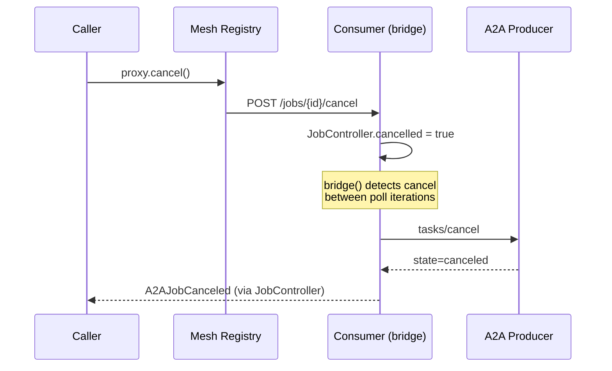

# Long-Running & SSE

External A2A skills that take longer than a sync `tools/call` window need to be bridged into the mesh as `MeshJob`-shaped capabilities. This page covers the consumer-side bridging primitives — `A2AJob.bridge(JobController)` for polling and `A2AStream.bridge(JobController)` for SSE — plus cancel propagation and SSE constraints.

The producer side — Python's `mesh.a2a.mount`, Java's `@MeshA2A`, or TypeScript's `mesh.a2a.mount` returning a `JobProxy` — is covered in [Producer](producer.md).

## The bridge model

A long-running A2A consumer is a regular `task=True` mesh tool whose body submits to A2A non-blocking, then mirrors A2A polling state into the framework-injected `JobController`:

1. The mesh runtime detects `task=True` and injects a `JobController` at the right parameter slot (Python `MeshJob`, Java `MeshJob`, TypeScript `JobController`).
2. The handler issues `A2AClient.submit(...)` (poll path) or `A2AClient.subscribe(...)` (SSE path) — both return immediately without waiting for terminal state.
3. The handler hands the returned `A2AJob` / `A2AStream` to `bridge(controller)`.
4. The bridge polls (or consumes the SSE stream), mirrors progress into `controller.update_progress(...)`, and returns the final artifact value.
5. The mesh `task=True` wrapper takes that return value and calls `controller.complete(...)` itself — handler doesn't need to manage terminal state.

The downstream caller consumes the bridged capability via the standard `MeshJob` interface (`await proxy.wait()`, `await proxy.cancel()`) — no clue the actual work is happening on an external A2A backend.

## Poll vs SSE — when to use which

| Aspect              | `A2AJob.bridge` (poll)         | `A2AStream.bridge` (SSE)           |
| ------------------- | ------------------------------ | ---------------------------------- |
| Transport           | `tasks/send` + `tasks/get`     | `tasks/sendSubscribe`              |
| Connection style    | Many short HTTP requests       | One long-lived SSE connection      |
| Producer support    | Always (per A2A v1.0)          | Producer must implement subscribe  |
| Cancel propagation  | Yes — POSTs `tasks/cancel` upstream | NO — disconnect-only (see below) |
| Latency on progress | Polling interval (~0.5s–2s)    | Push-driven, sub-second            |
| Network sensitivity | Resilient (no long socket)     | One bad ingress can drop the stream |

**Default to poll.** SSE is the optimization when you need sub-second progress fidelity AND the upstream supports `tasks/sendSubscribe` AND your network path tolerates long-lived streams. Poll's cancel propagation is the safer default for production — see "Cancel propagation" below.

## Cancel propagation

When a downstream caller cancels the mesh job, the registry forwards the cancel to the consumer agent. The bridge must propagate that cancel through to the upstream A2A producer so the external work stops billing. Here is the chain:

1. Caller invokes `await proxy.cancel(reason="...")`.
2. Mesh registry POSTs `/jobs/{id}/cancel` to the consumer agent.
3. The consumer's job-cancel hook flips the `JobController` to cancelled state.
4. The poll bridge observes the cancel — mechanism differs per runtime:
    - **Python**: the outer dispatch wrapper (`_mcp_mesh.engine.job_dispatch`) races the user task against `_await_job_cancel(job_id)` (a pyo3 binding to the Rust core); when cancel wins, the user task is cancelled and the bridge's `await asyncio.sleep` raises `CancelledError`, which `A2AJob.bridge` catches in its outer `try`.
    - **TypeScript**: `A2AJob.bridge` races `awaitJobCancel(jobId)` against each poll's sleep via a shared `AbortController`.
    - **Java**: `A2AJob.bridge` polls `controller.isCancelled()` between iterations (poll-only, no race).
5. The bridge POSTs `tasks/cancel` to the upstream A2A producer.
6. The upstream producer cancels the underlying work and reports `state=canceled`.
7. The bridge raises `A2AJobCanceled` (Py) / `A2AJobCanceledException` (Java) / `A2AJobCanceledError` (TS); the mesh wrapper records the canceled outcome.



**SSE constraint.** Per A2A v1.0, client disconnect on a `tasks/sendSubscribe` stream is a transient signal — the producer continues running unless the client explicitly POSTs `tasks/cancel`. `A2AStream.bridge` therefore does NOT POST `tasks/cancel` on cancel; it just closes the SSE connection. If your bridge needs to propagate cancel to the upstream producer, use the poll path (`A2AClient.submit(...)` + `A2AJob.bridge(...)`) which races the cancel signal against the polling sleep and POSTs `tasks/cancel` explicitly.

## SSE event lifecycle

The A2A v1.0 SSE stream emits a small set of envelope shapes. The bridge translates each into a `JobController` operation:

```mermaid
stateDiagram-v2
    [*] --> Working: TaskStatusUpdateEvent<br/>(state=working)
    Working --> Working: TaskStatusUpdateEvent<br/>(progress)
    Working --> Working: TaskArtifactUpdateEvent<br/>(intermediate artifacts)
    Working --> Terminal: TaskArtifactUpdateEvent<br/>(final artifact)
    Terminal --> [*]: TaskStatusUpdateEvent<br/>(final=true; state=completed/failed/canceled)
```



The terminal `TaskStatusUpdateEvent` (with `final=true`) closes the stream. The bridge returns the last-seen artifact value at that point.

## Per-runtime example

The same bridging shape across all three runtimes:

=== "Python"

    ```python
    @app.tool()
    @mesh.a2a_consumer(
        capability="report",
        a2a_url="http://localhost:9091/agents/report",
        a2a_skill_id="generate-report",
        task=True,                          # forwarded to inner @mesh.tool
    )
    async def report(
        user_id: str,
        sections: list[str],
        _a2a: mesh.A2AClient = None,
        job: MeshJob = None,                # framework-injected JobController
    ) -> dict:
        a2a_job = await _a2a.submit(message={
            "role": "user",
            "parts": [{
                "type": "text",
                "text": json.dumps({"user_id": user_id, "sections": sections}),
            }],
        })
        return await a2a_job.bridge(job)
    ```

    SSE variant: replace `_a2a.submit(...)` with `_a2a.subscribe(...)` and `a2a_job.bridge(...)` with `stream.bridge(...)`.

=== "TypeScript"

    ```typescript
    agent.addTool({
      name: "report",
      capability: "report",
      task: true,
      meshJobParamIndex: 1,
      a2aConfig: {
        url: "http://localhost:9091/agents/report",
        skillId: "generate-report",
      },
      parameters: z.object({
        user_id: z.string(),
        sections: z.array(z.string()),
      }),
      execute: async ({ user_id, sections }, ..._injected) => {
        const job = _injected[0] as JobController;
        const a2a = _injected[1] as A2AClient;
        const a2aJob = await a2a.submit({
          role: "user",
          parts: [{ type: "text", text: JSON.stringify({ user_id, sections }) }],
        });
        return await a2aJob.bridge(job);
      },
    });
    ```

    SSE variant: `a2a.subscribe(...)` + `stream.bridge(job)`.

=== "Java"

    ```java
    @MeshTool(capability = "report", task = true, tags = {"a2a-bridge"})
    @A2AConsumer(
        url = "http://localhost:9091/agents/report",
        skillId = "generate-report"
    )
    public Object generateReport(
            @Param("user_id") String userId,
            @Param("sections") List<String> sections,
            A2AClient a2a,
            MeshJob job) throws Exception {
        Map<String, Object> message = Map.of(
            "role", "user",
            "parts", List.of(Map.of(
                "type", "text",
                "text", JSON.writeValueAsString(Map.of(
                    "user_id", userId, "sections", sections))))
        );
        A2AJob a2aJob = a2a.submit(message);
        return a2aJob.bridge((JobController) job);
    }
    ```

    SSE variant: `a2a.subscribe(message)` returns `A2AStream`; call `stream.bridge((JobController) job)` inside a try-with-resources.

## Sync fallback (no `JobController`)

When a `task=True` consumer is invoked via a synchronous `tools/call` (no `X-Mesh-Job-Id` header), the framework injects `null` for `JobController`. The handler should fall back to `A2AClient.send(...)` (or stream-drain) and parse the artifact text directly — see the working examples in [Examples Gallery](examples.md) for the canonical fallback shape per runtime.

## See also

- [Failover & Federation](failover.md) — pinning semantics for `task=True` consumers
- [Architecture & Decisions](architecture.md) — `bridge(JobController)` design rationale and full file:line cancel chain
