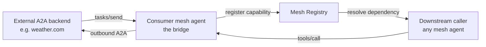

# A2A in MCP Mesh

MCP Mesh implements the [A2A v1.0 protocol](https://a2a-protocol.org/latest/specification/) on both sides of the wire. A mesh agent can call OUT to an external A2A endpoint (consumer side) AND expose its own mesh tools as A2A skills (producer side). The shared transport between mesh agents stays MCP; A2A is the bridge to anything outside the mesh that speaks the protocol.

## Why A2A in mesh

The A2A v1.0 spec defines an HTTP + JSON-RPC envelope for cross-vendor agent calls. It deliberately stops at the protocol — capability discovery is per-card, there is no resolver, no failover, no DDDI. MCP Mesh adds those layers around A2A:

- **Producer** (Python, Java, TypeScript — all three runtimes; TS shipped via [#933](https://github.com/dhyanraj/mcp-mesh/issues/933)): the producer entry builds the agent card automatically from declared metadata and attaches both `/.well-known/agent.json` and the JSON-RPC entrypoint to a user-owned hosting framework — `mesh.a2a.mount(app, ...)` on FastAPI in Python, `@MeshA2A` on a Spring Boot bean in Java, `mesh.a2a.mount(app, ...)` on Express in TypeScript. Sync, long-running (`task=True`/`task=true`), and SSE handlers are all supported.
- **Consumer** (Python, Java, TypeScript): a mesh capability whose body issues outbound `tasks/send` / `tasks/sendSubscribe` against a foreign A2A backend. The bridge re-publishes the upstream skill as a normal mesh capability — downstream callers do not need to know they are talking to A2A.

## The strategic value-add

Once a foreign A2A backend is bridged into the mesh as a capability, every mesh feature applies on top — without any changes to the protocol:

- **Capability+tag failover.** Two consumers bridging the same logical capability against different vendors (`weather.com` vs `accuweather.com`) auto-tag with their agent name. Downstream callers either pin a specific provider via tags or let the resolver pick a healthy one.
- **Health-driven rewiring.** When a consumer dies, the registry's orphan-reset transparently routes new calls to a peer consumer in seconds.
- **DDDI.** A2A consumers are first-class `@mesh.tool` capabilities — consumed by other tools through the same dependency-injection pipeline as any native mesh capability.
- **Long-running jobs.** A `task=True` consumer mirrors A2A `tasks/get` polling (or `tasks/sendSubscribe` SSE) into a `JobController`, so external long-running A2A work shows up as a standard `MeshJob` to the caller.

## Producer vs consumer

| Aspect            | Producer                                                                                  | Consumer                                                    |
| ----------------- | ----------------------------------------------------------------------------------------- | ----------------------------------------------------------- |
| Direction         | Mesh tool exposed AS A2A                                                                  | External A2A skill bridged INTO mesh                        |
| Decorator/marker  | `mesh.a2a.mount(app, ...)` (Py / TS) / `@MeshA2A` (Java)                                  | `@mesh.a2a_consumer` (Py) / `@A2AConsumer` (Java) / `a2aConfig` (TS) |
| Runtime support   | Python, Java, TypeScript                                                                   | Python, Java, TypeScript                                    |
| Card / discovery  | Auto-generated at `/.well-known/agent.json`                                               | Card fetched once at scaffold time (or `--offline`)         |
| Long-running      | Return `JobProxy`; framework parks the task                                               | `task=True` body submits + `bridge(JobController)`          |
| SSE               | `tasks/sendSubscribe` handler returns `JobProxy`                                          | `A2AClient.subscribe(...)` + `stream.bridge(JobController)` |
| Auth              | Bearer enforcement on the JSON-RPC route                                                  | `A2ABearer` / `authBearerEnv` / `tokenEnv`                  |

## A one-liner consumer

This is the simplest possible bridge — re-publish an external A2A `get-date` skill as a regular mesh `current-date` capability:

```python
import json
import mesh

@app.tool()
@mesh.a2a_consumer(
    capability="current-date",
    a2a_url="http://upstream.example.com/agents/date",
    a2a_skill_id="get-date",
)
async def current_date(_a2a: mesh.A2AClient = None) -> dict:
    response = await _a2a.send(
        message={"role": "user", "parts": [{"type": "text", "text": "now"}]},
    )
    return json.loads(response.artifact_text)
```

A downstream mesh tool then depends on `current-date` like any other capability — no awareness that the work is happening over A2A. Full multi-runtime walkthrough in the [Consumer Quick Start](consumer-quickstart.md).

## Data flow



The consumer agent is a regular `@mesh.tool` capability whose body happens to wrap an outbound A2A call. From the registry's perspective there is no special path — capability discovery, tag matching, and health propagation all work as they do for any native tool.

## What's NOT in scope here

- **A2A v1.0 protocol semantics.** Wire format, JSON-RPC envelopes, task lifecycle states — see the [A2A v1.0 spec](https://a2a-protocol.org/latest/specification/) and [JSON-RPC 2.0](https://www.jsonrpc.org/specification).
- **Authentication schemes beyond bearer.** OAuth / mTLS are future work — Phase 1 ships bearer only ([Authentication](authentication.md)).
- **Multi-skill cards.** Each `mesh.a2a.mount(...)` / `@MeshA2A` surface emits exactly one skill per card today. Multi-skill grouping under a single card is v2 scope ([surfaces-spec.md Appendix B](surfaces-spec.md)).

## See also

- [Consumer Quick Start](consumer-quickstart.md) — Python, TypeScript, and Java side-by-side
- [Failover & Federation](failover.md) — the strategic differentiator
- [Architecture & Decisions](architecture.md) — why `bridge(JobController)` and the cancel propagation chain
