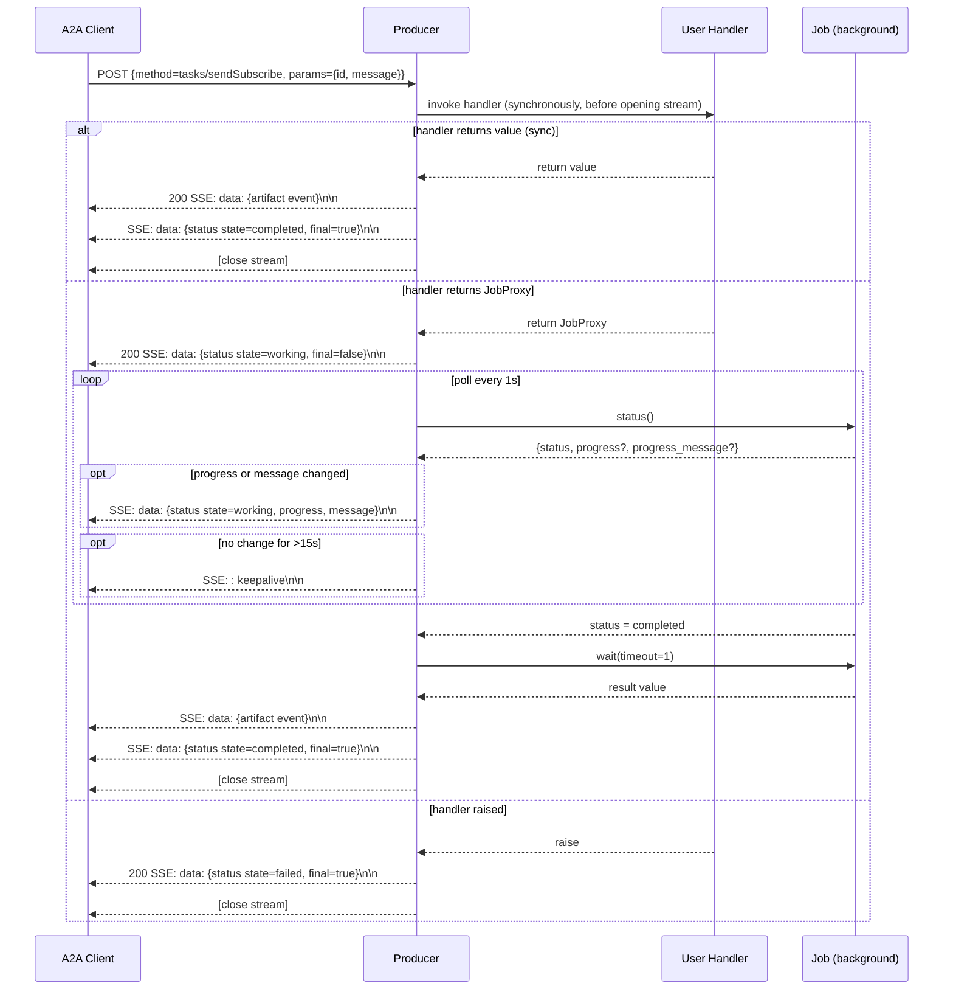
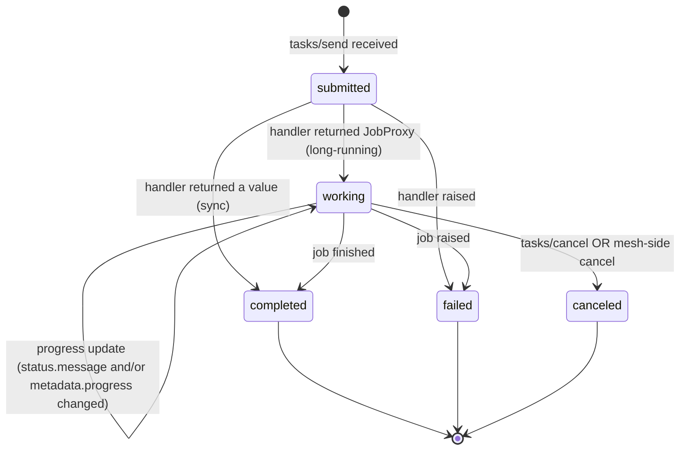

# A2A Producer Spec (Conformance)

This document codifies the on-the-wire contract that every mcp-mesh A2A
**producer** implementation must honour, regardless of host language. It is the
written form of behaviour currently encoded only in the Python source under
`src/runtime/python/mesh/a2a.py` and `src/runtime/python/_mcp_mesh/engine/`.

The audience is a developer building a producer SDK in a new runtime (Java,
TypeScript, Rust, ...) who needs to emit wire-compatible cards, JSON-RPC
responses, and SSE streams without having to read the Python source. The
existing consumer-side parsers — `mesh._a2a_consumer.A2AStream` (Python),
`src/runtime/typescript/src/a2a/a2a-stream.ts` (TS), and
`io.mcpmesh.a2a.A2AStream` (Java) — are the de-facto verification harnesses:
anything they parse, your producer must emit.

Every numbered claim below cites the file:line it was derived from. If you find
the source and this doc disagree, the source is authoritative — please open an
issue.

---

## 1. Overview

An **A2A producer** is a user-owned HTTP service that exposes one or more
"skills" over the A2A v1.0 protocol (`https://a2a-protocol.org/latest/specification/`).
Each skill is reachable at a producer-chosen path prefix `{path}` via two
endpoints:

| Method | URL                                  | Purpose                              |
|--------|--------------------------------------|--------------------------------------|
| `GET`  | `{path}/.well-known/agent.json`      | Returns the A2A v1.0 AgentCard JSON  |
| `POST` | `{path}`                             | JSON-RPC 2.0 entry point for `tasks/*` methods |

The producer registers itself with the mcp-mesh registry on its normal
heartbeat envelope by setting `agent_type=a2a` and emitting an `a2a_surfaces[]`
array (Section 2). The registry stores the array verbatim in an unconstrained
JSONB column (`a2a_surfaces`, `src/core/ent/schema/agent.go:71-73`) and stamps
each surface with a public FQDN derived from `MCP_MESH_PUBLIC_URL_PREFIX +
path` (`src/core/registry/ent_handlers_a2a.go:48-61`). External A2A clients
discover producers through `GET /a2a/agents`, which flattens every
`a2a_surfaces[]` entry across every registered producer
(`src/core/registry/ent_handlers_a2a.go:146-175`).

This document specifies the **wire formats** the producer must emit:

- the `a2a_surfaces[]` heartbeat shape (Section 2);
- the AgentCard JSON returned from `/.well-known/agent.json` (Section 3);
- the JSON-RPC envelopes for the five A2A v1.0 task methods (Section 4);
- the SSE event framing and JSON shapes (Section 5);
- the bearer-auth gate (Section 6);
- the task lifecycle state machine (Section 7);
- the conformance checklist (Section 9).

It does **not** specify how the producer is configured, how dependencies are
injected into the user handler, how task storage is implemented across
replicas, or how the host HTTP framework is constructed. Those concerns are
runtime-implementation choices.

### Concept mapping across runtimes

The user-facing API differs by language, but all three forms expand to the same
wire contract:

| Concept                       | Python                          | Java (implemented)         | TypeScript (planned, issue #933) |
|-------------------------------|---------------------------------|----------------------------|----------------------------------|
| Decorator-level metadata stamp | `@mesh.a2a(path=...)`           | `@MeshA2A(path=...)`       | `mesh.a2a({path: ...})` (functional helper) |
| Mount + DI                    | `mesh.a2a.mount(app, path=...)` | annotation processor       | `mesh.a2a()` returns a router    |
| Source-of-truth file          | `src/runtime/python/mesh/a2a.py` | `src/runtime/java/mcp-mesh-spring-boot-starter/src/main/java/io/mcpmesh/spring/web/` | (TBD)                            |

> The Python implementation is the de-facto reference. New runtimes must match
> wire shape, NOT implementation structure.

---

## 2. `a2a_surfaces[]` JSON shape (registry heartbeat)

### 2.1 Shape

`a2a_surfaces[]` is a JSON array. Each entry describes one A2A skill the
producer exposes. The canonical builder is
`_mcp_mesh.engine.a2a_surfaces.collect_a2a_surfaces`
(`src/runtime/python/_mcp_mesh/engine/a2a_surfaces.py:36-69`); the OpenAPI
schema is `A2ASurface` in `api/mcp-mesh-registry.openapi.yaml:859-897`.

| Field          | JSON type        | Required? | Semantics                                                                                  |
|----------------|------------------|-----------|--------------------------------------------------------------------------------------------|
| `path`         | string           | YES       | URL path prefix for this surface; must start with `/`. Example: `/agents/report-generator`. |
| `skill_id`     | string           | YES       | A2A skill identifier, kebab-case canonical. Example: `generate-report`.                    |
| `name`         | string           | NO        | Human-readable skill name. Only emitted when set on the decorator.                         |
| `description`  | string           | NO        | Free-form skill description.                                                               |
| `input_modes`  | string[]         | NO        | A2A inputModes. Defaults applied **at card-render time**, not at heartbeat emit time.      |
| `output_modes` | string[]         | NO        | A2A outputModes. Same defaulting behaviour as `input_modes`.                               |
| `tags`         | string[]         | NO        | Skill tags surfaced on the agent card.                                                     |

The producer MUST omit optional fields rather than emit empty strings, empty
arrays, or `null`. Reason: the registry's OpenAPI defaults
(`input_modes: ["application/json"]`, `output_modes: ["application/json"]`)
would be overridden with empty values if the producer emitted them
unconditionally (`a2a_surfaces.py:44-46` is explicit about this).

> ⚠️ **Implementation note**: the registry **does NOT validate** this shape on
> ingest. The Ent schema declares the column as
> `field.JSON("a2a_surfaces", []map[string]interface{}{}).Optional()`
> (`src/core/ent/schema/agent.go:71-73`); the only post-load validation in
> `buildA2ASurfaceResponses` is a check that `path` and `skill_id` are both
> non-empty strings (`ent_handlers_a2a.go:106-110`). Any extra fields you
> emit will be persisted and round-tripped but ignored by consumers. The
> contract is producer ↔ consumer; the registry is a pass-through directory.

### 2.2 Worked example

A producer that exposes two skills (`generate-report` and `summarize`) on the
same agent would emit:

```json
{
  "agent_id": "report-agent-abc123",
  "agent_type": "a2a",
  "name": "report-agent",
  "version": "1.0.0",
  "http_host": "10.0.0.42",
  "http_port": 8080,
  "namespace": "default",
  "timestamp": "2026-05-11T12:34:56Z",
  "tools": [],
  "surfaces": [
    {
      "path": "/agents/report-generator",
      "skill_id": "generate-report",
      "name": "Report Generator",
      "description": "Generate a long-form report from structured input",
      "input_modes": ["application/json"],
      "output_modes": ["application/json"],
      "tags": ["reports", "v1"]
    },
    {
      "path": "/agents/summarizer",
      "skill_id": "summarize"
    }
  ]
}
```

Note that the second entry only carries the two required fields — all defaults
materialise during card render, not on the heartbeat.

### 2.3 When the producer emits this

The producer SDK MUST set `agent_type = "a2a"` on the heartbeat **iff** the
process has at least one registered `@MeshA2A` / `mesh.a2a()` surface. When the
array is empty, `agent_type` falls back to `"mcp_agent"`
(`heartbeat_preparation.py:375`). An agent can carry both regular `@mesh.tool`
capabilities and A2A surfaces in the same heartbeat — `agent_type=a2a` does NOT
mean "no mesh tools" (`heartbeat_preparation.py:372-374`).

The `surfaces` key on the heartbeat envelope is OPTIONAL when empty; emit it
only when the array has at least one entry (`heartbeat_preparation.py:388-389`).

### 2.4 Registry response — public URL stamping

On every heartbeat response, the registry returns a `surfaces[]` array of
`A2ASurfaceResponse` objects (OpenAPI schema at
`api/mcp-mesh-registry.openapi.yaml:1420-1449`):

```json
{
  "surfaces": [
    {
      "path": "/agents/report-generator",
      "skill_id": "generate-report",
      "public_url": "https://agents.acme.com/agents/report-generator",
      "agent_card_url": "https://agents.acme.com/agents/report-generator/.well-known/agent.json"
    }
  ]
}
```

`public_url` and `agent_card_url` are empty strings when
`MCP_MESH_PUBLIC_URL_PREFIX` is unset on the registry
(`ent_handlers_a2a.go:50-61`); the registry logs a warn-once when that happens
(`ent_handlers_a2a.go:128-144`). The producer SHOULD cache the stamped
`public_url` per `(path, skill_id)` so the agent card returned from
`/.well-known/agent.json` advertises the externally reachable FQDN rather than
the local `http_host:http_port` (Python reference:
`mesh/a2a.py:202-233`, `mesh/a2a.py:236-247`). When the cache is empty (first
request before the first heartbeat round-trip, or
`MCP_MESH_PUBLIC_URL_PREFIX` unset), fall back to
`http://{http_host}:{http_port}{path}` — sufficient for local dev/CI
(`mesh/a2a.py:236-247`).

---

## 3. Agent card (`/.well-known/agent.json`)

### 3.1 URL pattern

```
GET {path}/.well-known/agent.json
```

Trailing-slash handling: the producer SHOULD treat
`{path}` and `{path}/` as equivalent and serve the same card at both
(`mesh/a2a.py:1459-1460` strips the trailing slash before constructing the
card path).

### 3.2 Card shape

The card follows the A2A v1.0 AgentCard schema. mcp-mesh does not redefine it;
it populates a curated subset. The canonical builder is
`_mcp_mesh.engine.a2a_card.build_agent_card`
(`src/runtime/python/_mcp_mesh/engine/a2a_card.py:21-111`).

| Field                                | Producer behaviour                                                                                                            |
|--------------------------------------|-------------------------------------------------------------------------------------------------------------------------------|
| `name` (top-level)                   | MUST emit. Defaults to `@mesh.agent(name=...)` value, falling back to `agent_id`, falling back to literal `"agent"`. (`a2a.py:340-344`) |
| `description` (top-level)            | MUST emit. Falls back to `name` when no description is configured. (`a2a_card.py:84-85`)                                      |
| `version`                            | MUST emit. Defaults to `"1.0.0"`. (`a2a.py:345`)                                                                              |
| `url`                                | SHOULD emit. The producer's public `POST {path}` URL (registry-stamped public_url, with local-fallback when unset). MUST be **omitted** rather than emitted as an empty string when no URL is available — clients should fail loudly. (`a2a_card.py:97-98`) |
| `capabilities.streaming`             | MUST emit `true`. Phase 3 always advertises streaming because `mount()` always wires both `tasks/sendSubscribe` and `tasks/resubscribe`, even for sync handlers (which stream a single artifact + terminal status). (`a2a.py:351-358`) |
| `capabilities.pushNotifications`     | MUST emit `false`. Not supported in v1. (`a2a_card.py:89`)                                                                    |
| `capabilities.stateTransitionHistory`| MUST emit `false`. Not supported in v1. (`a2a_card.py:90`)                                                                    |
| `defaultInputModes`                  | MUST emit. Defaults to `["application/json"]`. Mirror of skill's `inputModes`. (`a2a.py:370-371`, `a2a_card.py:92`)            |
| `defaultOutputModes`                 | MUST emit. Defaults to `["application/json"]`. Mirror of skill's `outputModes`. (`a2a.py:370-371`, `a2a_card.py:93`)           |
| `skills`                             | MUST emit. v1 emits exactly one skill per card (`a2a_card.py:94`); multi-skill grouping is v2 scope.                          |
| `skills[0].id`                       | MUST emit. The `skill_id`. (`a2a_card.py:67-68`)                                                                              |
| `skills[0].name`                     | MUST emit. The `skill_name`; defaults to `skill_id` when unset. (`a2a.py:368`, `a2a_card.py:69`)                              |
| `skills[0].description`              | MUST emit. Defaults to `skill_name` when no description is set. (`a2a_card.py:70`)                                            |
| `skills[0].tags`                     | MUST emit (may be empty array). (`a2a_card.py:71`)                                                                            |
| `skills[0].inputModes`               | MUST emit. (`a2a_card.py:72`)                                                                                                 |
| `skills[0].outputModes`              | MUST emit. (`a2a_card.py:73`)                                                                                                 |
| `skills[0].metadata.input_schema`    | SHOULD emit when the underlying tool's input schema is known. Optional in A2A v1.0; exposed under a metadata bag so the card stays spec-compliant. (`a2a_card.py:76-81`) |
| `authentication.schemes`             | MUST emit. `["bearer"]` when `auth="bearer"` is configured; `[]` (empty array, NOT `"none"`) otherwise. A2A v1.0 has no `"none"` scheme. (`a2a_card.py:100-109`) |
| `provider`, `documentationUrl`, ... | MUST NOT emit unless the producer has real values. Do not fabricate empty strings. (`a2a_card.py:11-13`)                       |

### 3.3 Worked example

```json
{
  "name": "report-agent",
  "description": "Long-form report generation agent",
  "version": "1.0.0",
  "url": "https://agents.acme.com/agents/report-generator",
  "capabilities": {
    "streaming": true,
    "pushNotifications": false,
    "stateTransitionHistory": false
  },
  "defaultInputModes": ["application/json"],
  "defaultOutputModes": ["application/json"],
  "skills": [
    {
      "id": "generate-report",
      "name": "Report Generator",
      "description": "Generate a long-form report from structured input",
      "tags": ["reports", "v1"],
      "inputModes": ["application/json"],
      "outputModes": ["application/json"],
      "metadata": {
        "input_schema": {
          "type": "object",
          "properties": {
            "topic": {"type": "string"},
            "max_words": {"type": "integer"}
          },
          "required": ["topic"]
        }
      }
    }
  ],
  "authentication": {
    "schemes": ["bearer"]
  }
}
```

---

## 4. JSON-RPC method set

The single `POST {path}` endpoint is a JSON-RPC 2.0 entry point with a fixed
dispatch table. The reference dispatcher is
`mesh/a2a.py:1202-1320`.

### 4.1 Common request envelope

```json
{
  "jsonrpc": "2.0",
  "id": <client-chosen request id>,
  "method": "tasks/<verb>",
  "params": { ... }
}
```

- `id` MAY be any JSON value the client picks. The producer MUST echo it back
  in both success and error responses (`a2a.py:553-557`, `a2a.py:560-574`).
- Malformed request bodies (non-JSON) return HTTP 400 + JSON-RPC error
  `-32700 "Parse error"` (`a2a.py:1262-1273`).
- Unknown methods return HTTP 200 + JSON-RPC error `-32601 "Method not
  implemented: ..."` (`a2a.py:1310-1318`).

### 4.2 Common task input extraction

For `tasks/send` and `tasks/sendSubscribe`, the producer extracts three values
from `params` (`a2a.py:577-591`):

| Field          | Default when missing                              |
|----------------|---------------------------------------------------|
| `params.id`         | Fresh UUID4 string                          |
| `params.sessionId`  | Same value as `task_id`                     |
| `params.message`    | `{}` (empty object); non-dict values coerced |

### 4.3 `tasks/send`

**Synchronous request → returns a complete `Task` envelope.**

#### Request

```json
{
  "jsonrpc": "2.0",
  "id": 1,
  "method": "tasks/send",
  "params": {
    "id": "c-abc123",
    "sessionId": "c-abc123",
    "message": {
      "role": "user",
      "parts": [{"type": "text", "text": "Write a report on coffee."}]
    }
  }
}
```

#### Response — sync handler (state=completed)

When the user handler returns a value directly (no long-running submission),
the producer wraps the return value as a single text-part artifact
(`a2a.py:386-419`). Non-string returns are JSON-stringified with
`default=str` so unusual types (datetime, Decimal, dataclass, set) coerce
best-effort (`a2a.py:402-403`).

```json
{
  "jsonrpc": "2.0",
  "id": 1,
  "result": {
    "id": "c-abc123",
    "sessionId": "c-abc123",
    "status": {
      "state": "completed",
      "timestamp": "2026-05-11T12:34:56Z"
    },
    "artifacts": [
      {
        "name": "result",
        "parts": [{"type": "text", "text": "Coffee is a beverage..."}],
        "index": 0
      }
    ],
    "history": [
      {"role": "user", "parts": [{"type": "text", "text": "Write a report on coffee."}]}
    ]
  }
}
```

#### Response — long-running handler (state=working)

When the handler dispatches a background job (Python: returns a `JobProxy`
instance), the producer parks the job in its task store and responds
immediately with `state="working"` and an empty `artifacts[]`
(`a2a.py:450-482`, `a2a.py:654-682`). The client then polls `tasks/get` or
subscribes via `tasks/sendSubscribe`/`tasks/resubscribe`.

```json
{
  "jsonrpc": "2.0",
  "id": 1,
  "result": {
    "id": "c-abc123",
    "sessionId": "c-abc123",
    "status": {
      "state": "working",
      "timestamp": "2026-05-11T12:34:56Z"
    },
    "artifacts": [],
    "history": [
      {"role": "user", "parts": [{"type": "text", "text": "..."}]}
    ]
  }
}
```

> ⚠️ **Implementation note**: Python detects "long-running" by checking the
> handler return type for `mcp_mesh_core.JobProxy` (`a2a.py:125-139`,
> `a2a.py:654`). New runtimes need an equivalent type-based signal — do NOT
> rely on the underlying tool's `task=True` metadata, because cross-agent
> dependencies make that flag invisible (`a2a.py:265-289` documents why).

#### Response — handler raised (state=failed)

Per A2A v1.0, handler exceptions become `state=failed` Tasks, NOT JSON-RPC
errors. JSON-RPC errors are reserved for protocol-level issues
(`a2a.py:422-447`, `a2a.py:641-652`).

```json
{
  "jsonrpc": "2.0",
  "id": 1,
  "result": {
    "id": "c-abc123",
    "sessionId": "c-abc123",
    "status": {
      "state": "failed",
      "timestamp": "2026-05-11T12:34:56Z",
      "message": {
        "role": "agent",
        "parts": [{"type": "text", "text": "Topic required"}]
      }
    },
    "artifacts": [],
    "history": [ ... ]
  }
}
```

#### Sequence diagram

```mermaid
sequenceDiagram
    participant C as A2A Client
    participant P as Producer (POST {path})
    participant H as User Handler

    C->>P: POST {jsonrpc, id, method=tasks/send, params={id, message}}
    P->>P: extract (task_id, session_id, message); default id=UUID4
    P->>H: invoke handler with message
    alt handler returns value
        H-->>P: return value
        P-->>C: 200 {result: Task with state=completed, artifact[0]=result}
    else handler returns JobProxy
        H-->>P: return JobProxy (background job dispatched)
        P->>P: store (task_id → proxy) in process-local map
        P-->>C: 200 {result: Task with state=working, artifacts=[]}
    else handler raises
        H-->>P: raise Exception
        P-->>C: 200 {result: Task with state=failed, status.message=error}
    end
```

#### Idempotency and duplicate task IDs

A duplicate `task_id` for an in-flight task returns JSON-RPC error `-32602
"A2A task id ... is already in use"` (`a2a.py:180-185`, `a2a.py:665-666`).
Terminal-state entries are evicted from the store 300 seconds after first
reaching a terminal state (`a2a.py:94-98`, `a2a.py:142-158`), so reuse is
permitted after the grace window.

### 4.4 `tasks/get`

**Look up an already-parked long-running task and return its current Task envelope.**

#### Request

```json
{
  "jsonrpc": "2.0",
  "id": 2,
  "method": "tasks/get",
  "params": { "id": "c-abc123" }
}
```

#### Response

Same `Task` shape as `tasks/send`. The producer pulls the current mesh-side
status from the parked proxy, translates the mesh status to an A2A state
(Section 7.2), and includes a `result` artifact only when the state is
`completed` AND the producer can synchronously fetch the final value
(`a2a.py:750-762`).

```json
{
  "jsonrpc": "2.0",
  "id": 2,
  "result": {
    "id": "c-abc123",
    "sessionId": "c-abc123",
    "status": {
      "state": "working",
      "timestamp": "2026-05-11T12:34:57Z",
      "message": {
        "role": "agent",
        "parts": [{"type": "text", "text": "Drafting outline..."}]
      }
    },
    "artifacts": [],
    "history": [ ... ],
    "metadata": { "progress": 0.25 }
  }
}
```

When the status fetch fails transiently, the producer SHOULD return a
`state=working` envelope with the error text in `status.message` rather than
a JSON-RPC error, because the registry's transient unreachability is not
authoritative evidence the job is dead (`a2a.py:718-735`).

#### Errors

- Missing `params.id` → `-32602 "Invalid params: 'id' is required for
  tasks/get"` (`a2a.py:706-709`).
- Unknown `task_id` (not in the store) → `-32602 "Unknown task id: ..."`
  (`a2a.py:712-715`). A2A v1.0 has no dedicated error code for "task not
  found", so `-32602 Invalid params` is the convention.

### 4.5 `tasks/cancel`

**Cancel a parked task. Idempotent; best-effort.**

#### Request

```json
{
  "jsonrpc": "2.0",
  "id": 3,
  "method": "tasks/cancel",
  "params": {
    "id": "c-abc123",
    "reason": "user pressed stop"
  }
}
```

#### Response

Same `Task` shape, post-cancel. Cancel exceptions on the underlying job are
logged and swallowed because the job may have already completed
(`a2a.py:807-815`). The response reflects whatever state the producer can
read **after** the cancel attempt; when the post-cancel status fetch also
fails, the producer falls back to emitting `state=canceled` synthetically
(`a2a.py:817-826`).

If both `JobProxy.cancel()` AND `JobProxy.status()` throw (double-failure),
producers MUST synthesize a `state=canceled` envelope rather than propagating
the underlying exceptions. This protects A2A callers from JobProxy
implementation details.

For a non-terminal task record where the producer has lost its `JobProxy`
reference (defensive edge case), producers MUST synthesize a `state=canceled`
envelope rather than returning an error. This is best-effort cancel semantics.

#### Errors

- Missing `params.id` → `-32602 "Invalid params: 'id' is required for
  tasks/cancel"`.
- Unknown `task_id` → `-32602 "Unknown task id: ..."`.

### 4.6 `tasks/sendSubscribe`

**Same dispatch as `tasks/send`, but the response is an SSE stream of
JSON-RPC envelopes.**

See Section 5 for the SSE event shape. The producer invokes the user handler
**before** the SSE stream opens (`a2a.py:1115-1124`) so handler exceptions
become a single `state=failed` SSE event (`a2a.py:945-956`), not an opaque
HTTP error mid-stream.

#### Request shape

Identical to `tasks/send` (Section 4.3).

#### Response shape

HTTP response with:

- `Content-Type: text/event-stream`
- `Cache-Control: no-cache`
- `X-Accel-Buffering: no` (defeats nginx buffering)
- `Connection: keep-alive`

(`a2a.py:851-855`)

The body is a stream of SSE `data:` frames carrying JSON-RPC envelopes
(Section 5).

#### Sequence diagram



### 4.7 `tasks/resubscribe`

**Re-attach an SSE stream to an already-parked task. Idempotent.**

#### Request

```json
{
  "jsonrpc": "2.0",
  "id": 4,
  "method": "tasks/resubscribe",
  "params": { "id": "c-abc123" }
}
```

#### Response

Same SSE response shape as `tasks/sendSubscribe`. The producer immediately
emits an initial `state=working` event (so the client confirms the
subscription is live), then catches up to the current registry status on the
next poll (`a2a.py:1166-1199`, `a2a.py:986-989`).

For a non-terminal task record where the producer has lost its `JobProxy`
reference (impossible-but-handled state), producers MUST emit a single
`state=failed` terminal frame and close, rather than hanging the SSE
connection or returning ambiguous status.

> ⚠️ **Implementation note**: the Python producer does **NOT** replay events
> the client missed while disconnected. Clients that need a snapshot should
> call `tasks/get` first (`a2a.py:1175-1178`).

#### Errors

- Missing `params.id` → `-32602 "Invalid params: 'id' is required for
  tasks/resubscribe"`.
- Unknown `task_id` → `-32602 "Unknown task id: ..."` (returned as a
  JSON-RPC error response, NOT an SSE event, because the connection has not
  been promoted to `text/event-stream` yet).

### 4.8 Parking semantics for long-running tasks

| Property             | Value                                                                                 |
|----------------------|---------------------------------------------------------------------------------------|
| Store location       | Process-local in-memory map keyed by `task_id` (`a2a.py:92`).                          |
| Cross-replica share  | NONE. A client that subscribed on replica A and resubscribes to replica B gets `-32602 "Unknown task id"` (`a2a.py:88-91`). Producers SHOULD document this limitation. |
| Stored values        | `proxy` (handle to the underlying job), `terminal_at` (monotonic timestamp when first observed in a terminal state, or null), `request_message`, `session_id` (`a2a.py:186-191`). |
| Terminal eviction    | Entries are evicted 300 seconds after `terminal_at` is set. The sweep runs lazily on every store access; no background sweeper is required (`a2a.py:94-98`, `a2a.py:142-158`). |

---

## 5. SSE event shape

### 5.1 Framing

The producer emits HTML5 Server-Sent Events with:

- `Content-Type: text/event-stream`;
- one event per `data: <json>\n\n` block (single line of JSON per frame,
  terminated by blank line) (`a2a.py:865-873`);
- SSE comments (lines starting with `:`) for keepalives (`a2a.py:1071-1077`).

The producer SHOULD emit:

- `Cache-Control: no-cache`
- `X-Accel-Buffering: no`
- `Connection: keep-alive`

(`a2a.py:851-855`)

> ⚠️ **Implementation note — parser tolerance**: the consumer parsers in
> Python, TypeScript, and Java all accept BOTH `\n` and `\r\n` line endings
> (`a2a-stream.ts:212-218`, `A2AStream.java:73-77` via `BufferedReader`,
> Python via `aiter_lines()`). They all accept the `data:` prefix with OR
> without a single leading space (`a2a-stream.ts:236-237`,
> `A2AStream.java:308-311`, `_a2a_consumer.py:903-905`). Producers SHOULD
> emit `data: <json>\n\n` (with space, LF endings) for maximum portability.

Every SSE event body is a complete JSON-RPC envelope, wrapped in `data: ...`
(`a2a.py:865-873`).

### 5.2 Event types

There are exactly **two** A2A v1.0 event kinds the producer emits inside the
`result` field of the JSON-RPC envelope:

#### Status update event (`TaskStatusUpdateEvent`)

Identified by the presence of a `status` key on `result`. Reference builder:
`_status_update_event` (`a2a.py:876-903`).

```json
{
  "jsonrpc": "2.0",
  "id": 1,
  "result": {
    "id": "c-abc123",
    "status": {
      "state": "working",
      "timestamp": "2026-05-11T12:34:57Z",
      "message": {
        "role": "agent",
        "parts": [{"type": "text", "text": "Drafting outline..."}]
      }
    },
    "final": false,
    "metadata": { "progress": 0.25 }
  }
}
```

| Field                | Required? | Notes                                                                          |
|----------------------|-----------|--------------------------------------------------------------------------------|
| `result.id`          | YES       | The A2A task id.                                                               |
| `result.status.state`| YES       | One of `working`, `completed`, `failed`, `canceled` (Section 7.1).             |
| `result.status.timestamp` | YES  | UTC ISO-8601 with `Z` suffix (NOT `+00:00`) (`a2a.py:381-383`).                |
| `result.status.message`   | NO   | A2A `Message` shape with `role: "agent"` and a single text part.               |
| `result.final`       | YES       | `true` only on the terminal event for the task; client closes the stream on `final=true`. |
| `result.metadata.progress` | NO  | Numeric progress indicator. Advisory; consumers clamp to `[0.0, 1.0]` before forwarding to mesh JobControllers (`_a2a_consumer.py:631-633`, `a2a-stream.ts:84-87`, `A2AStream.java:142-143`). |

#### Artifact update event (`TaskArtifactUpdateEvent`)

Identified by the presence of an `artifact` key on `result`. Reference
builder: `_artifact_update_event` (`a2a.py:906-926`).

```json
{
  "jsonrpc": "2.0",
  "id": 1,
  "result": {
    "id": "c-abc123",
    "artifact": {
      "name": "result",
      "parts": [{"type": "text", "text": "Coffee is a beverage..."}],
      "index": 0
    }
  }
}
```

| Field                       | Required? | Notes                                                                |
|-----------------------------|-----------|----------------------------------------------------------------------|
| `result.id`                 | YES       | The A2A task id.                                                     |
| `result.artifact.name`      | YES       | The literal string `"result"` for the canonical single-artifact case.|
| `result.artifact.parts`     | YES       | Array of A2A `Part` objects. Producer emits a single `TextPart` with `type: "text"` and `text: <string>`. |
| `result.artifact.index`     | YES       | `0` for the single-artifact case. (`a2a.py:411-417`)                  |

> The producer JSON-stringifies non-string handler returns into the
> `text` field (`a2a.py:403`, `a2a.py:914`). Consumers reverse this with
> `json.loads` / `JSON.parse` and fall back to the raw text on parse failure
> (`_a2a_consumer.py:459-479`, `a2a-stream.ts:73`, `A2AStream.java:206-219`).

### 5.3 Stream ordering and terminal semantics

For a **sync** handler over `tasks/sendSubscribe`
(`_stream_completed_only`, `a2a.py:929-942`):

1. one artifact event;
2. one status event with `state=completed`, `final=true`;
3. close stream.

For a **failed** handler (any sendSubscribe handler that raised, or any
long-running path that observed a terminal `failed`/`canceled` mesh state):

1. one status event with `state ∈ {failed, canceled}`, `final=true`;
2. close stream.

For a **long-running** handler (`_stream_long_running`, `a2a.py:959-1088`):

1. an initial status event with `state=working`, `final=false`;
2. zero or more status events with `state=working` carrying
   `metadata.progress` and/or `status.message`. The producer suppresses
   redundant events when both `progress` and `progress_message` are
   unchanged from the previous emission (`a2a.py:1057-1070`);
3. zero or more SSE comment frames (`: keepalive\n\n`) every
   `_SSE_KEEPALIVE_SECS` (15s) when no real event has been emitted in that
   window (`a2a.py:1071-1077`);
4. on `completed`: one artifact event (best-effort — if `proxy.wait()` fails
   the producer skips the artifact and proceeds to the terminal status);
   followed by one status event with `state=completed`, `final=true`.
   (`a2a.py:1019-1051`)
5. on `failed` or `canceled`: one status event with the corresponding state
   and `final=true`. (`a2a.py:1036-1049`)
6. close stream.

### 5.4 Reconnection semantics

A client that loses its SSE connection mid-stream MUST NOT assume the task
is dead. Per A2A v1.0, disconnect is transient; the producer keeps the
underlying job running (`a2a.py:1080-1088`). The client rejoins via
`tasks/resubscribe`, which emits a fresh `state=working` event and resumes
polling from the current registry view (Section 4.7).

### 5.5 Terminal state semantics

| State       | Trigger                                                              | Consumer expectation                                                |
|-------------|----------------------------------------------------------------------|---------------------------------------------------------------------|
| `completed` | Job finished successfully.                                           | Artifact event was (or will be) emitted; result available.          |
| `failed`    | Job raised, OR producer-side cancel reached the job before completion with an error message. | No artifact. `status.message` carries the error text when available.|
| `canceled`  | Job cancelled (mesh-side cancel or A2A `tasks/cancel`).              | No artifact. `status.message` MAY carry a reason.                   |

> ⚠️ **Spelling**: A2A v1.0 uses **US spelling `"canceled"`**. The mesh job
> substrate uses **UK spelling `"cancelled"`**. The producer MUST translate
> at the boundary (`a2a.py:101-122`). Consumers accept both spellings
> (`_a2a_consumer.py:449-456`, `a2a-stream.ts:117-119`, `A2AStream.java:170-173`).

---

## 6. Auth gate

### 6.1 Card advertisement

When the surface is configured with `auth="bearer"`, the agent card
advertises:

```json
"authentication": { "schemes": ["bearer"] }
```

When unset, the card advertises an empty schemes list (NOT a `"none"`
scheme — A2A v1.0 has no such scheme):

```json
"authentication": { "schemes": [] }
```

(`a2a_card.py:100-109`)

The producer MUST re-emit the same `auth` scheme on every card render so
external clients can negotiate authentication without out-of-band coordination.

### 6.2 Gate enforcement (Phase 1)

The gate is enforced on the `POST {path}` entry point only — the agent card
endpoint (`GET .../.well-known/agent.json`) is always public so clients can
discover the authentication scheme without first authenticating
(`a2a.py:1222-1259`).

Phase 1 semantics:

1. The producer MUST require an `Authorization: Bearer <token>` header.
2. The producer MUST reject headers that:
   - are missing entirely;
   - have a non-`Bearer` scheme (case-insensitive prefix check);
   - have an empty token after the `Bearer ` prefix (whitespace-only counts as empty).
3. The producer MUST NOT validate the token value (no signature check, no
   issuer/audience check, no expiry check). Value-level validation is
   Phase 2+ scope. (`a2a.py:1216-1218`, `a2a.py:1222-1259`)

### 6.3 Error shape

When the gate rejects a request, the producer returns HTTP **401** with a
JSON-RPC error envelope. The error code is `-32001` and the `id` is
`null` (the request body has not been parsed at this point, so the client's
request id is unavailable):

```json
{
  "jsonrpc": "2.0",
  "error": {
    "code": -32001,
    "message": "Authentication required: missing Authorization: Bearer <token> header"
  },
  "id": null
}
```

For empty-token cases the message is:

```text
Authentication required: empty bearer token in Authorization header
```

(`a2a.py:1225-1239`, `a2a.py:1243-1258`)

> ⚠️ **Implementation note**: `-32001` is **not** a JSON-RPC reserved code —
> it sits in the implementation-defined `-32000` to `-32099` server-error
> range. New runtimes MUST use the same code for parity with existing
> consumers that may special-case it.

---

## 7. Task lifecycle state machine

### 7.1 A2A v1.0 states

The producer MUST emit only these four states in `status.state`:



> ⚠️ **Implementation note**: the A2A v1.0 spec includes a `submitted` state
> as the conceptual starting point. The Python producer does not currently
> emit a status event with `state="submitted"` — sync handlers go directly
> to `completed`/`failed`, long-running handlers go directly to `working`.
> New runtimes SHOULD match this behaviour. Treat `submitted` as a
> diagram-only conceptual state.

### 7.2 Mesh → A2A state translation

The mesh job substrate uses these internal statuses; the producer translates
them at the boundary (`a2a.py:104-122`):

| Mesh status   | A2A state     |
|---------------|---------------|
| `working`     | `working`     |
| `completed`   | `completed`   |
| `failed`      | `failed`      |
| `cancelled`   | `canceled`    |
| anything else | `working` (fallback — never emit an A2A state outside the enumerated set)|

### 7.3 Cancellation flows

There are three ways a long-running task can transition to `canceled`:

| Source                  | Behaviour                                                                                                               |
|-------------------------|--------------------------------------------------------------------------------------------------------------------------|
| A2A `tasks/cancel`      | The producer invokes the underlying job's cancel method. Best-effort: exceptions are logged and swallowed because the job may have already terminated (`a2a.py:807-815`). |
| Mesh-side cancel        | The job substrate cancels the job autonomously (e.g., due to a parent agent cancelling). The producer's status poll sees `cancelled` on the next iteration and emits the terminal event. |
| Both                    | The mesh substrate is idempotent; double-cancel is safe.                                                                  |

Client-side SSE disconnect is **NOT** a cancel. The producer MUST keep the
underlying job running on `CancelledError` from the SSE generator
(`a2a.py:1080-1088`).

### 7.4 State that survives across `tasks/resubscribe`

The producer's task store retains:

- the underlying job handle;
- the originating `session_id`;
- the originating `request_message` (so `tasks/get` can echo it in
  `history`).

The producer does NOT retain past SSE events; replay is not supported
(`a2a.py:1175-1178`).

---

## 8. Registry registration envelope

### 8.1 Heartbeat envelope shape

A user-owned A2A producer app sends the same heartbeat envelope as a regular
`@mesh.agent` agent, with two differences:

1. `agent_type` is set to `"a2a"` instead of `"mcp_agent"`.
2. A `surfaces` array is included (Section 2).

Both differences are conditional on the process having registered at least
one A2A surface (`heartbeat_preparation.py:371-389`). Producers with zero
surfaces fall back to `agent_type="mcp_agent"` and omit `surfaces`.

`tools[]` is still emitted as usual; A2A surfaces and `@mesh.tool`
capabilities coexist in the same agent
(`heartbeat_preparation.py:372-374`). Producers that have only A2A surfaces
and no mesh tools still emit `tools: []`.

### 8.2 Heartbeat response — public URL cache update

On each heartbeat response, the registry returns a `surfaces[]` array of
`A2ASurfaceResponse` entries (Section 2.4). The producer SHOULD update its
public-URL cache keyed by `(path, skill_id)` so subsequent agent-card
renders advertise the externally reachable FQDN
(`mesh/a2a.py:217-228`).

### 8.3 Reusing the `@mesh.route` heartbeat machinery

In the Python reference implementation, a producer that uses
`mesh.a2a.mount(app, ...)` for a "user-owned FastAPI app" is heartbeated by
the same machinery that drives `@mesh.route` agents — the
`api_heartbeat/rust_api_heartbeat.py` path
(`_mcp_mesh/engine/a2a_surfaces.py:9-12`). New runtimes should align with
the equivalent local "route-style" heartbeat surface, NOT invent a separate
heartbeat path for A2A surfaces.

---

## 9. Conformance checklist

A new producer runtime MUST satisfy every item below.

### Heartbeat
- [ ] When at least one A2A surface is registered, heartbeat envelope contains `agent_type=a2a`.
- [ ] When at least one A2A surface is registered, heartbeat envelope contains a `surfaces[]` array with one entry per surface.
- [ ] Each `surfaces[]` entry contains `path` (string starting with `/`) and `skill_id` (kebab-case string).
- [ ] Optional fields (`name`, `description`, `input_modes`, `output_modes`, `tags`) are emitted only when set on the decorator/annotation — never as empty strings or empty arrays.
- [ ] When no A2A surfaces are registered, the producer falls back to `agent_type=mcp_agent` and omits `surfaces`.
- [ ] On heartbeat response, the producer caches each `surfaces[].public_url` keyed by `(path, skill_id)`.

### Agent card (`GET {path}/.well-known/agent.json`)
- [ ] Returns HTTP 200 with `application/json`.
- [ ] Card is reachable WITHOUT authentication regardless of the surface's `auth` setting.
- [ ] Top-level fields: `name`, `description`, `version`, `capabilities`, `defaultInputModes`, `defaultOutputModes`, `skills` are all present.
- [ ] `capabilities.streaming` is `true`.
- [ ] `capabilities.pushNotifications` and `capabilities.stateTransitionHistory` are both `false`.
- [ ] `skills[]` contains exactly one entry per card.
- [ ] `skills[0]` carries `id`, `name`, `description`, `tags`, `inputModes`, `outputModes`.
- [ ] When `auth="bearer"`, `authentication.schemes` is `["bearer"]`.
- [ ] When auth is unset, `authentication.schemes` is `[]` (empty array, never `["none"]`).
- [ ] `url` is omitted (not emitted as empty string) when no public URL is available.
- [ ] Trailing-slash request `{path}/.well-known/agent.json/` and slash-less `{path}/.well-known/agent.json` both work.

### JSON-RPC `POST {path}` dispatch
- [ ] Non-JSON request body returns HTTP 400 with JSON-RPC error code `-32700`.
- [ ] Unknown method returns HTTP 200 with JSON-RPC error code `-32601` and message starting with `Method not implemented`.
- [ ] Echoes `request.id` in every response (success and error).

### `tasks/send`
- [ ] Missing `params.id` → producer generates a UUID4.
- [ ] Sync handler return → JSON-RPC success with `result.status.state=completed`, one artifact in `result.artifacts[]`, `result.history` echoing the request message.
- [ ] Long-running handler return → JSON-RPC success with `result.status.state=working`, empty `artifacts[]`, the task parked for subsequent `tasks/get`/`tasks/cancel`/`tasks/resubscribe`.
- [ ] Handler raises → JSON-RPC success with `result.status.state=failed`, error text in `result.status.message.parts[0].text`.
- [ ] Non-string handler returns are JSON-stringified into `artifacts[0].parts[0].text`.
- [ ] Duplicate in-flight `task_id` → JSON-RPC error `-32602` with message indicating the id is in use.

### `tasks/get`
- [ ] Missing `params.id` → JSON-RPC error `-32602`.
- [ ] Unknown `task_id` → JSON-RPC error `-32602`.
- [ ] Known `task_id` → JSON-RPC success with current `Task` envelope, A2A state translated from mesh state.
- [ ] On `state=completed`, `result.artifacts[]` contains the final result when synchronously available.
- [ ] On `status` poll failure (transient), returns `state=working` with error in `status.message`, NOT a JSON-RPC error.

### `tasks/cancel`
- [ ] Missing `params.id` → JSON-RPC error `-32602`.
- [ ] Unknown `task_id` → JSON-RPC error `-32602`.
- [ ] Idempotent: cancelling an already-terminal task returns the current `Task` envelope cleanly.
- [ ] Underlying cancel exceptions are swallowed; the response always reflects the latest readable state.

### `tasks/sendSubscribe` (SSE)
- [ ] Response is `Content-Type: text/event-stream`.
- [ ] Response includes `Cache-Control: no-cache`, `X-Accel-Buffering: no`, `Connection: keep-alive`.
- [ ] Each frame is `data: <json>\n\n` (data prefix + space + JSON + blank line).
- [ ] SSE comments (`: keepalive\n\n`) are emitted every 15s of inactivity during long-running streams.
- [ ] Handler is invoked **before** the SSE stream opens; handler exceptions surface as a single SSE failed event, not an HTTP-level error.
- [ ] Sync handler return → one artifact event, then one `final=true` status event with `state=completed`.
- [ ] Long-running handler → initial `state=working` event with `final=false`; subsequent `state=working` events on actual progress/message change; one artifact event + one `final=true` terminal status event on completion.
- [ ] On client disconnect (CancelledError), the underlying job continues running.
- [ ] Each SSE event body is a valid JSON-RPC envelope (`jsonrpc: "2.0"`, `id`, `result`).
- [ ] `metadata.progress` is emitted as a number (not stringified) when known.

### `tasks/resubscribe`
- [ ] Missing `params.id` → JSON-RPC error `-32602` (returned as standard JSON-RPC response, not SSE).
- [ ] Unknown `task_id` → JSON-RPC error `-32602`.
- [ ] Known `task_id` → SSE response identical in shape to the original `sendSubscribe` stream.
- [ ] Initial event is `state=working`, `final=false` (no replay of past events).

### Auth gate
- [ ] When `auth="bearer"`, missing `Authorization` header → HTTP 401 with JSON-RPC error `-32001`, `id=null`.
- [ ] When `auth="bearer"`, non-`Bearer` scheme → HTTP 401 with JSON-RPC error `-32001`.
- [ ] When `auth="bearer"`, empty token after `Bearer ` prefix → HTTP 401 with JSON-RPC error `-32001`.
- [ ] Phase 1: token VALUE is NOT validated — any non-empty token passes the gate.
- [ ] The agent-card endpoint is reachable without auth even when `auth="bearer"`.

### State / spelling
- [ ] Emitted A2A states are exactly one of: `working`, `completed`, `failed`, `canceled` (US spelling).
- [ ] Mesh-side `cancelled` (UK) is translated to A2A `canceled` (US) at the boundary.
- [ ] `status.timestamp` is UTC ISO-8601 with a `Z` suffix (NOT `+00:00`).

### Terminal-state eviction
- [ ] Tasks observed in a terminal state are evicted from the in-memory store after a grace window (Python default: 300s).
- [ ] Eviction does not require a background sweeper task; lazy sweeping on every store access is sufficient.

---

## Appendix A: Cross-runtime parser implications

The consumer-side parsers in Java
(`src/runtime/java/mcp-mesh-sdk/src/main/java/io/mcpmesh/a2a/A2AStream.java`)
and TypeScript (`src/runtime/typescript/src/a2a/a2a-stream.ts`) impose a
slightly tighter contract than the Python producer documents in
docstrings. New producers SHOULD honour the tighter contract:

| Aspect                              | Python producer (today)         | TS/Java consumer expectation                                       |
|-------------------------------------|---------------------------------|---------------------------------------------------------------------|
| `result.id` on SSE events            | Always emitted                  | Read but not validated; consumer keys off the task id supplied at subscribe time. Producers MAY safely omit if they want, but SHOULD include for debuggability. |
| `result.metadata.progress` type      | Number (JSON-stringified via `_json.dumps`) | TS accepts numbers and numeric strings (`a2a-stream.ts:294-298`); Java accepts numbers and numeric strings (`A2AStream.java:380-389`). Producers MUST prefer numbers. |
| `parts[0].type` on text parts        | Always `"text"`                 | Both consumers ignore the `type` field entirely — they read `parts[0].text` directly. Producers MUST still emit `type: "text"` for forward compatibility. |
| Final-event `final` field            | `true` (boolean)                | TS: `r.final === true` strict comparison (`a2a-stream.ts:300-301`). Java: `asBoolean(false)` (`A2AStream.java:392-394`). Producers MUST emit a real boolean, NOT the string `"true"`. |
| Multiple `data:` continuation lines  | NOT emitted (single line per frame) | All three consumers join multi-line `data:` with `\n` per SSE spec. Producers MAY emit multi-line frames; v1.0 producer convention is single-line. |
| Artifact event with empty parts      | Always has parts                | TS treats missing/empty parts as empty string artifact (`a2a-stream.ts:270`); Java same (`A2AStream.java:355-358`). Producers SHOULD always include parts. |

---

## Appendix B: Open questions / ambiguity flags

This appendix collects places where the Python implementation is ambiguous
or under-documented and new runtimes should pick a deliberate stance.

1. **Multi-skill cards.** The current Python implementation emits one card
   per surface with exactly one skill (`a2a_card.py:8-9`). Multi-skill
   grouping under a single card is explicitly v2. New runtimes MUST match —
   do not group skills.

2. **`submitted` state emission.** A2A v1.0 mentions a `submitted` state but
   the Python producer never emits a status event with that state — sync
   handlers jump directly to `completed`/`failed`, long-running handlers
   jump directly to `working`. New runtimes SHOULD match for consumer
   parity but the spec does not formally forbid emitting `submitted`.

3. **Cross-replica task sharing.** The Python task store is process-local;
   `tasks/get`/`tasks/cancel`/`tasks/resubscribe` against a task owned by a
   different replica return `-32602 Unknown task id`. New runtimes inherit
   this limitation — cross-replica sharing is out of scope for v1.

4. **Auth token validation.** Phase 1 enforces header **presence** only;
   the token value is not inspected. Producers MUST NOT add signature
   validation, issuer checks, or audience checks in Phase 1 — those land
   in Phase 2 and require coordinated spec updates.

5. **Idempotency window for terminal task IDs.** The Python producer
   evicts terminal-state entries 300s after `terminal_at`. Reusing a
   `task_id` within that window returns `-32602 already in use`; outside
   it succeeds. New runtimes SHOULD use the same 300s window for parity,
   though clients MUST NOT depend on the exact value.

6. **`history` field semantics.** The producer echoes the originating
   request message into `result.history[]` when known (`a2a.py:418`,
   `a2a.py:446`, `a2a.py:478`, `a2a.py:543`). The A2A v1.0 spec allows
   richer history shapes (multiple turns, agent responses); the v1 producer
   emits at most one entry. New runtimes MUST match for consumer parity.

7. **`session_id` semantics.** The Python producer defaults `sessionId` to
   the `task_id` when missing (`a2a.py:588`), but does not otherwise act on
   the value. Producers SHOULD echo the client-supplied `sessionId` into
   responses but do not need to maintain session-scoped state.

8. **Streaming of multi-artifact returns.** v1 emits exactly one artifact
   (`name: "result"`, `index: 0`). Multi-artifact returns are not
   currently supported. New runtimes MUST emit a single artifact for v1.
