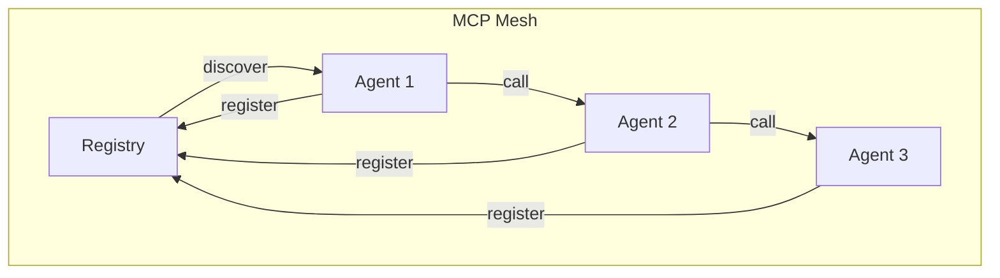
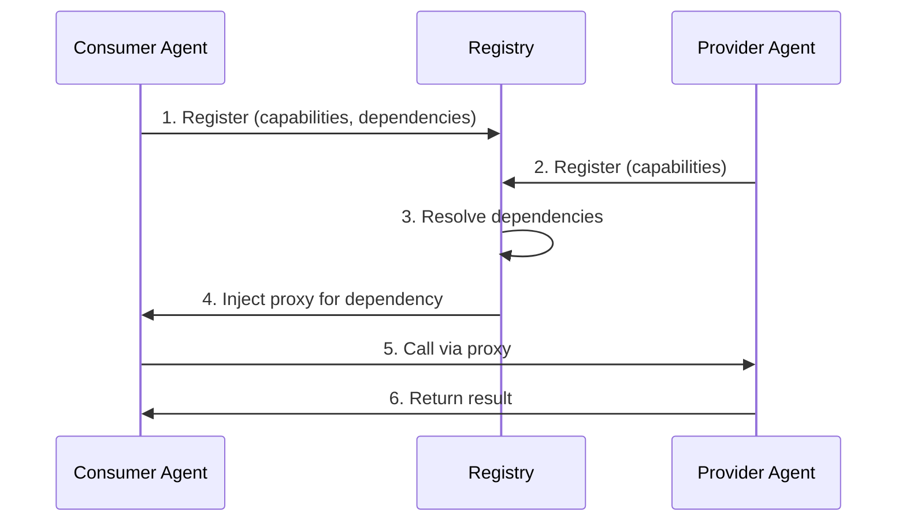
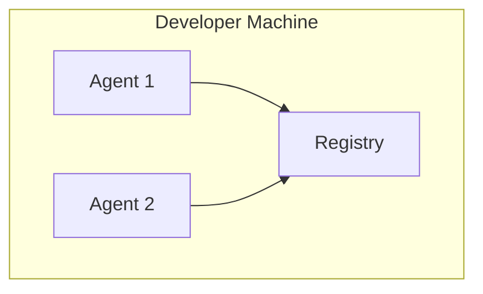
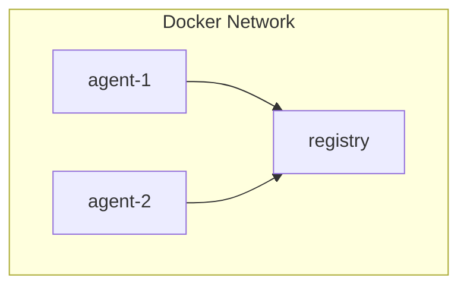
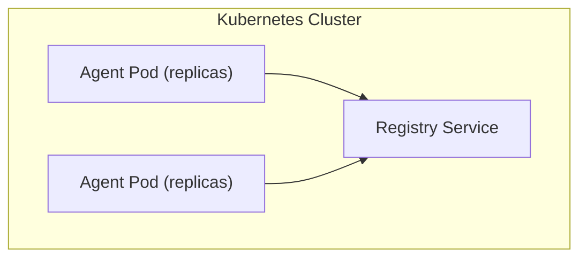

# Architecture & Design

> Core architecture, agent coordination, and design philosophy

## Overview

MCP Mesh is a distributed service mesh for MCP (Model Context Protocol) agents. It provides:

- **Zero-boilerplate dependency injection** between agents
- **Automatic service discovery** via a central registry
- **Smart routing** with tag-based selection
- **Health monitoring** with heartbeat and topology updates



## Core Components

### Registry

The registry is the central coordination point:

- **Agent registration** - Agents register on startup
- **Capability tracking** - Tracks what each agent provides
- **Dependency resolution** - Resolves capability dependencies
- **Health monitoring** - Tracks agent health via heartbeats

### Agents

Agents are the workhorses of the mesh:

- **Capabilities** - Named services they provide
- **Dependencies** - Capabilities they consume
- **Tags** - Metadata for smart selection
- **Health checks** - Regular heartbeat to registry

### Proxies

Proxies handle inter-agent communication:

- **SelfDependencyProxy** - Same agent (direct call, no network overhead)
- **EnhancedUnifiedMCPProxy** - Cross-agent calls (auto-configured from decorator kwargs)

## Communication Flow



## Dependency Injection

MCP Mesh uses **automatic dependency injection** based on capability names:

1. **Declaration**: Agent declares dependencies
2. **Discovery**: Registry finds matching providers
3. **Injection**: Proxy injected at function call time
4. **Routing**: Calls route through the mesh

```python
# Declaration
@mesh.tool(dependencies=["database"])
async def my_function(database=None):
    # database is automatically injected!
    result = await database(query="SELECT *")
```

## Service Discovery

### Capability-Based

Agents find each other by capability name:

```python
# Provider
@mesh.tool(capability="user_service")
def get_user(): pass

# Consumer
@mesh.tool(dependencies=["user_service"])
def my_function(user_service=None): pass
```

### Tag-Based Selection

When multiple providers exist, tags determine selection:

```python
# Multiple providers
@mesh.tool(capability="llm", tags=["claude", "opus"])
@mesh.tool(capability="llm", tags=["claude", "haiku"])

# Consumer selects
@mesh.tool(dependencies=[{"capability": "llm", "tags": ["+opus"]}])
```

## Health & Topology

### Heartbeat System

Agents send regular heartbeats to the registry:

```
Agent → Registry: heartbeat (every 30s default)
Registry: Update agent status, TTL
```

### Topology Updates

When agents join/leave, the registry updates topology:

1. New agent registers → Notify dependent agents
2. Agent disconnects → Mark unhealthy, reroute
3. Agent recovers → Restore routing

## Deployment Patterns

### Local Development



### Docker Compose



### Kubernetes



## Design Principles

### 1. Zero Boilerplate

No manual wiring, no service locators:

```python
# Just declare, mesh handles the rest
@mesh.tool(dependencies=["service"])
def my_function(service=None):
    return service()
```

### 2. Graceful Degradation

Always handle missing dependencies:

```python
if service is None:
    return "Fallback response"
```

### 3. Protocol Agnostic

Built on MCP, works with any MCP-compatible client.

### 4. Cloud Native

Designed for containers and Kubernetes.

## See Also

- [Registry](registry.md) - Registry details
- [Health & Discovery](health-discovery.md) - Health system
- [Tag Matching](tag-matching.md) - Selection algorithm
