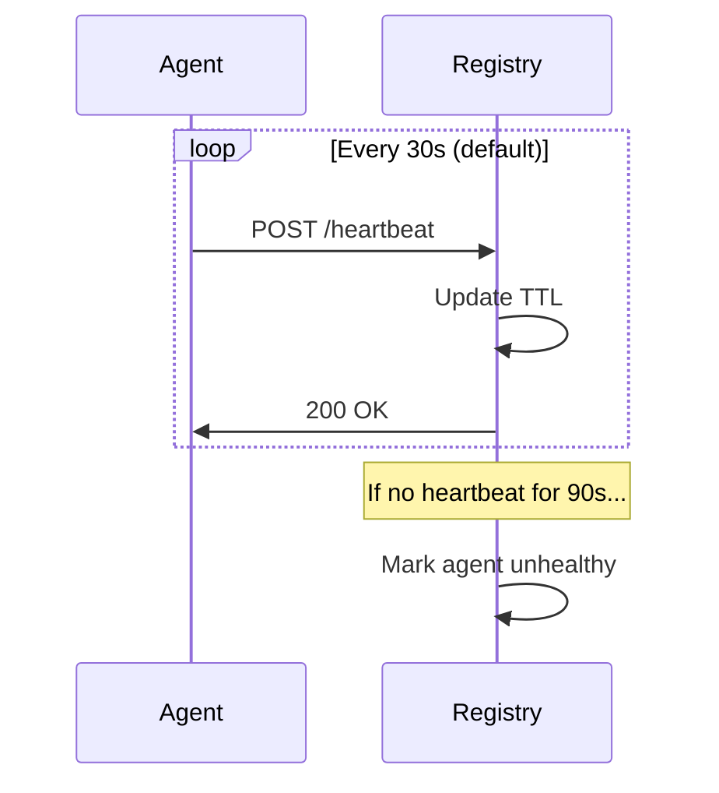
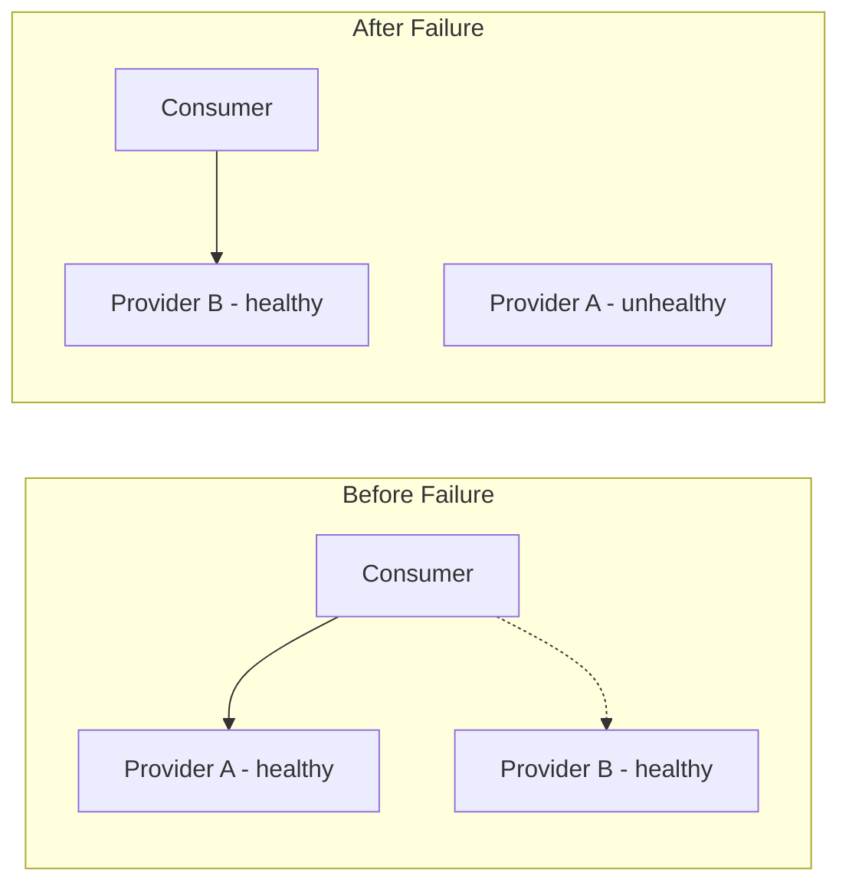

# Health & Discovery

> Heartbeat system, health checks, and topology updates

## Overview

MCP Mesh maintains agent health through:

- **Heartbeats** - Regular pings to registry
- **Health checks** - Custom health functions
- **Topology updates** - Automatic rerouting on failures

## Heartbeat System

### How It Works



### Configuration

```python
@mesh.agent(
    name="my-agent",
    health_interval=30,      # Heartbeat every 30s
    auto_run_interval=10,    # Keep-alive every 10s
)
```

```typescript
const agent = mesh(server, {
  name: "my-agent",
  heartbeatInterval: 30, // Heartbeat every 30s
});
```

## Health Checks

### Custom Health Function (Python)

```python
async def my_health_check():
    """Custom health check."""
    # Check database connection
    if not db.is_connected():
        return {"status": "unhealthy", "reason": "db disconnected"}

    # Check memory
    if memory_usage() > 90:
        return {"status": "degraded", "reason": "high memory"}

    return {"status": "healthy"}

@mesh.agent(
    name="my-agent",
    health_check=my_health_check,
    health_check_ttl=30,  # Cache health for 30s
)
class MyAgent:
    pass
```

### Health States

| State       | Description                 |
| ----------- | --------------------------- |
| `healthy`   | Agent is fully operational  |
| `degraded`  | Agent works but with issues |
| `unhealthy` | Agent cannot serve requests |

## Discovery

### Capability Discovery

Agents discover each other by capability:

```python
# Provider registers capability
@mesh.tool(capability="user_service")
def get_user(): pass

# Consumer discovers by capability
@mesh.tool(dependencies=["user_service"])
def my_function(user_service=None): pass
```

### Tag-Based Discovery

Filter by tags when multiple providers exist:

```python
@mesh.tool(dependencies=[{
    "capability": "llm",
    "tags": ["claude", "+opus"]
}])
```

### Version-Based Discovery

Require specific versions:

```python
@mesh.tool(dependencies=[{
    "capability": "api",
    "version": ">=2.0.0"
}])
```

## Topology Updates

### Agent Joins

When a new agent registers:

1. Registry stores agent info
2. Dependent agents notified
3. Proxies updated with new routes

### Agent Leaves

When an agent disconnects:

1. Heartbeat timeout detected
2. Agent marked unhealthy
3. Traffic rerouted to healthy instances
4. Dependent agents notified

### Automatic Failover



## Monitoring

### Registry Endpoints

```bash
# All agents
curl http://localhost:8000/agents

# Specific agent
curl http://localhost:8000/agents/my-agent

# Registry health
curl http://localhost:8000/health
```

### CLI Commands

```bash
# List agents with status
meshctl list

# Detailed status
meshctl status

# Watch for changes
meshctl status --watch
```

## Configuration

### Environment Variables

```bash
# Heartbeat interval (seconds)
export MCP_MESH_HEALTH_INTERVAL=30

# Health check TTL (seconds)
export MCP_MESH_HEALTH_CHECK_TTL=30

# Agent timeout (mark unhealthy after)
export MCP_MESH_AGENT_TIMEOUT=90
```

## Best Practices

### 1. Implement Health Checks

```python
async def health():
    # Check all critical dependencies
    checks = {
        "database": await check_db(),
        "cache": await check_cache(),
        "memory": check_memory(),
    }

    if all(c["ok"] for c in checks.values()):
        return {"status": "healthy", "checks": checks}
    return {"status": "degraded", "checks": checks}
```

### 2. Handle Failures Gracefully

```python
@mesh.tool(dependencies=["optional_service"])
async def my_function(optional_service=None):
    if optional_service is None:
        # Fallback logic
        return "Fallback response"
    return await optional_service()
```

### 3. Use Appropriate Intervals

| Use Case          | Heartbeat | TTL |
| ----------------- | --------- | --- |
| Development       | 30s       | 90s |
| Production        | 15s       | 45s |
| High Availability | 10s       | 30s |

## Troubleshooting

### Agent Shows Unhealthy

```bash
# Check agent logs
meshctl start my_agent.py --log-level debug

# Check heartbeat
curl http://localhost:8000/agents/my-agent
```

### Discovery Not Working

```bash
# Verify registration
curl http://localhost:8000/agents | jq '.agents[] | {name, capabilities}'

# Check namespace
curl http://localhost:8000/agents | jq '.agents[] | {name, namespace}'
```

## See Also

- [Architecture](architecture.md) - System overview
- [Registry](registry.md) - Registry details
- [Tag Matching](tag-matching.md) - Selection algorithm
