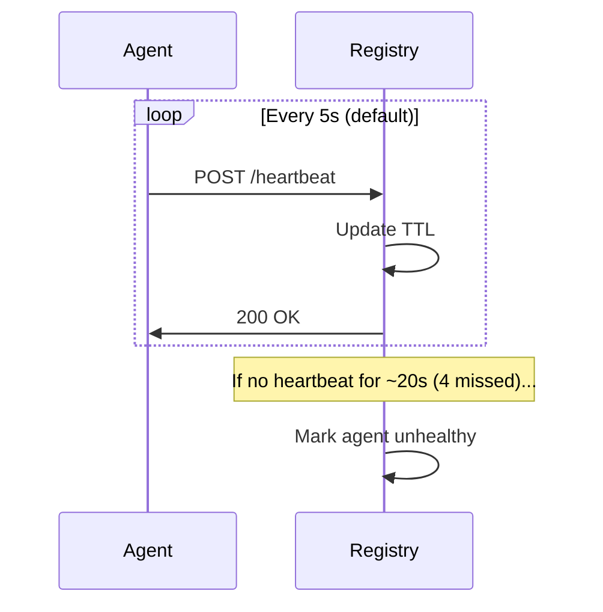
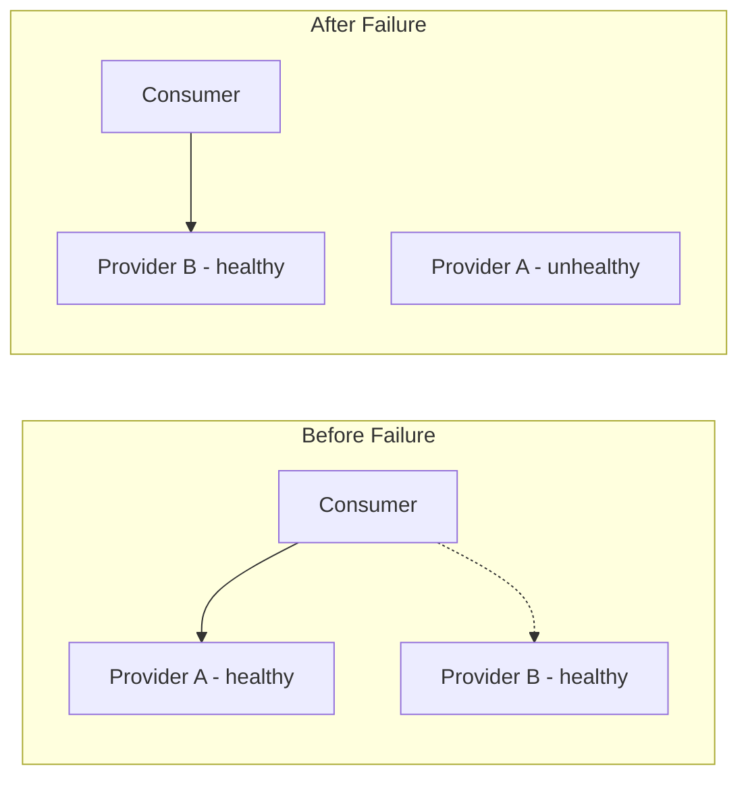

# Health & Discovery

> Heartbeat system, health checks, and topology updates

## Overview

MCP Mesh maintains agent health through:

- **Heartbeats** - Regular pings to registry
- **Health checks** - Custom health functions
- **Topology updates** - Automatic rerouting on failures

## Heartbeat System

### How It Works


```mermaid
sequenceDiagram
    participant A as Agent
    participant R as Registry

    loop Every 5s (default)
        A->>R: POST /heartbeat
        R->>R: Update TTL
        R->>A: 200 OK
    end

    Note over R: If no heartbeat for ~20s (4 missed)...
    R->>R: Mark agent unhealthy
```

### Configuration

```python
@mesh.agent(
    name="my-agent",
    health_interval=5,       # Heartbeat every 5s (default)
    auto_run_interval=10,    # Keep-alive every 10s
)
```

```typescript
const agent = mesh(server, {
  name: "my-agent",
  heartbeatInterval: 5, // Heartbeat every 5s (default)
});
```

## Health Checks

### Custom Health Function (Python)

```python
async def my_health_check():
    """Custom health check."""
    # Check database connection
    if not db.is_connected():
        return {"status": "unhealthy", "reason": "db disconnected"}

    # Check memory
    if memory_usage() > 90:
        return {"status": "degraded", "reason": "high memory"}

    return {"status": "healthy"}

@mesh.agent(
    name="my-agent",
    health_check=my_health_check,
    health_check_ttl=30,  # Cache health for 30s
)
class MyAgent:
    pass
```

### Custom Health Function (Java)

```java
@MeshHealthCheck(ttlSeconds = 30)
public MeshHealth healthCheck() {
    if (!db.isConnected()) {
        return MeshHealth.unhealthy("db disconnected")
            .withCheck("db_connected", false);
    }
    if (memoryUsage() > 90) {
        return MeshHealth.degraded("high memory");
    }
    return MeshHealth.healthy().withCheck("db_connected", true);
}
```

One no-argument method per agent, on any Spring bean. Returning `boolean` works too: `true` is healthy, `false` unhealthy. `MCP_MESH_HEALTH_CHECK_TTL` overrides `ttlSeconds`.

### Custom Health Function (TypeScript)

```typescript
const agent = mesh(server, {
  name: "my-agent",
  httpPort: 9001,
  healthCheckTtl: 30, // Re-run every 30s
  healthCheck: async () => {
    if (!db.isConnected()) {
      return { status: "unhealthy", errors: ["db disconnected"] };
    }
    if (memoryUsage() > 90) {
      return { status: "degraded", errors: ["high memory"] };
    }
    return { status: "healthy", checks: { db_connected: true } };
  },
});
```

One check per agent. Returning `boolean` works too: `true` is healthy, `false` unhealthy. `MCP_MESH_HEALTH_CHECK_TTL` overrides `healthCheckTtl`.

### What a Failing Check Does

While the check reports `unhealthy` the agent stops heartbeating. The registry's staleness sweep then marks it unhealthy, dependency resolution stops selecting it, and consumers move to another provider. When the check passes again the heartbeat resumes and the registry restores the agent - no restart, no redeploy. This is what lets a provider whose upstream vendor is down take itself out of rotation.

Only an explicit unhealthy result does that. A check that raises is recorded as `degraded` and keeps heartbeating, in all three runtimes: a bug in the health check must not be able to remove a working agent from the mesh.

`degraded` shows on the diagnostic surface only, on all three runtimes: the agent keeps heartbeating and stays in dependency resolution, and `/health` answers 503 while `/ready` is unmoved. Nothing probes `/health`, so its status code is free to carry the verdict.

Route (`@mesh.route` / `@MeshRoute` / `mesh.route`) and A2A agents are no longer exempt: a failing check pauses their heartbeat too, and the registry stops advertising the gateway. The hook means the same thing on every agent type - "I am not available" - and mesh does the same thing with it everywhere: it stops wiring that agent. What differs is topology, not meaning. A provider is something others route _to_; a gateway is where requests _enter_, and the ingress it keeps serving was never mesh-routed in the first place.

So a withdrawn gateway is not a gateway that went down. Suppressing the heartbeat stops registry traffic only: the HTTP server keeps serving, already-resolved dependencies stay wired, and `/ready` reports the mesh runtime rather than the verdict on every agent type - so the pod keeps its Service endpoints and keeps taking ingress. It stops being discovered, it does not go dark.

Declaring one differs by runtime. Java takes a `@MeshHealthCheck` bean on a gateway exactly as on a provider, and TypeScript a `healthCheck` in the `meshExpress` config (a bare `mesh.route()` gateway has no config object to put one in). Python has no declaration surface yet: `health_check` is an `@mesh.agent` argument, and that decorator cannot share a process with `@mesh.route` or `@mesh.a2a` - the runtime honours a gateway's check, the decorators cannot yet carry one.

### Kubernetes Probes

Every runtime serves four endpoints, and probes must not share one:

| Endpoint    | Probe                             | Reports                                                                                             |
| ----------- | --------------------------------- | --------------------------------------------------------------------------------------------------- |
| `/startupz` | `startupProbe`                    | Your startup check (`startup_check`, `@MeshStartupCheck`, `startupCheck`). An agent that declares none passes. |
| `/livez`    | `livenessProbe`                   | 200 for as long as the process is serving. Consults nothing else.                                     |
| `/ready`    | `readinessProbe`                  | Whether the mesh runtime is up, on every agent type. Your health check does NOT reach it: a failing check pauses the heartbeat, which is the whole withdrawal, and a 503 here would also empty the Service that mesh traffic arrives on. |
| `/health`   | none                              | Your health check's verdict plus `checks` and `errors`, on all three runtimes. 503 while the verdict is not healthy. This is the one endpoint the verdict moves, so it and `/ready` diverge by design. |

Never point liveness or startup at `/ready` or `/health`. `/health` reflects your health check on all three runtimes, so sharing a URL turns an upstream outage into a pod restart, which cannot fix the outage - and while an agent is still coming up both answer 503 (or are not mounted yet), which restart-loops a slow boot. The agent Helm chart is already wired this way; if you write your own manifests, you own this contract, and `meshctl man deployment` (`--typescript`, `--java`) has the probe stanzas to copy plus the two ways it is usually got wrong.

### Health States

| State       | Description                 |
| ----------- | --------------------------- |
| `healthy`   | Agent is fully operational  |
| `degraded`  | Agent works but with issues |
| `unhealthy` | Agent cannot serve requests |

## Discovery

### Capability Discovery

Agents discover each other by capability:

```python
# Provider registers capability
@mesh.tool(capability="user_service")
def get_user(): pass

# Consumer discovers by capability
@mesh.tool(dependencies=["user_service"])
def my_function(user_service: mesh.McpMeshTool = None): pass
```

### Tag-Based Discovery

Filter by tags when multiple providers exist:

```python
@mesh.tool(dependencies=[{
    "capability": "llm",
    "tags": ["claude", "+opus"]
}])
```

### Version-Based Discovery

Require specific versions:

```python
@mesh.tool(dependencies=[{
    "capability": "api",
    "version": ">=2.0.0"
}])
```

## Topology Updates

### Agent Joins

When a new agent registers:

1. Registry stores agent info
2. Dependent agents notified
3. Proxies updated with new routes

### Agent Leaves

When an agent disconnects:

1. Heartbeat timeout detected
2. Agent marked unhealthy
3. Traffic rerouted to healthy instances
4. Dependent agents notified

### Automatic Failover


```mermaid
graph LR
    subgraph "Before Failure"
        A1[Consumer] --> B1[Provider A - healthy]
        A1 -.-> B2[Provider B - healthy]
    end

    subgraph "After Failure"
        A2[Consumer] --> B3[Provider B - healthy]
        X[Provider A - unhealthy]
    end
```

## Monitoring

### Registry Endpoints

```bash
# All agents
curl http://localhost:8000/agents

# Specific agent
curl http://localhost:8000/agents/my-agent

# Registry health
curl http://localhost:8000/health
```

### CLI Commands

```bash
# List agents with status
meshctl list

# Detailed status
meshctl status

# Watch for changes
meshctl status --watch
```

## Configuration

### Environment Variables

```bash
# Heartbeat interval (seconds, default 5)
export MCP_MESH_HEALTH_INTERVAL=5

# Health check TTL (seconds)
export MCP_MESH_HEALTH_CHECK_TTL=30

# Registry-side: mark agent unhealthy after N seconds of missed
# heartbeats (default 20 = 4 missed heartbeats at the 5s cadence)
export DEFAULT_TIMEOUT_THRESHOLD=20
```

## Best Practices

### 1. Implement Health Checks

```python
async def health():
    # Check all critical dependencies
    checks = {
        "database": await check_db(),
        "cache": await check_cache(),
        "memory": check_memory(),
    }

    if all(c["ok"] for c in checks.values()):
        return {"status": "healthy", "checks": checks}
    return {"status": "degraded", "checks": checks}
```

### 2. Handle Failures Gracefully

```python
@mesh.tool(dependencies=["optional_service"])
async def my_function(optional_service: mesh.McpMeshTool = None):
    if optional_service is None:
        # Fallback logic
        return "Fallback response"
    return await optional_service()
```

### 3. Use Appropriate Intervals

| Use Case          | Heartbeat     | Timeout      |
| ----------------- | ------------- | ------------ |
| Development       | 5s (default)  | 20s (default) |
| Production        | 5s            | 20s          |
| High Availability | 2s            | 8s           |

## Troubleshooting

### Agent Shows Unhealthy

```bash
# Check agent logs
meshctl start my_agent.py --log-level debug

# Check heartbeat
curl http://localhost:8000/agents/my-agent
```

### Discovery Not Working

```bash
# Verify registration
curl http://localhost:8000/agents | jq '.agents[] | {name, capabilities}'

# Check namespace
curl http://localhost:8000/agents | jq '.agents[] | {name, namespace}'
```

## See Also

- [Architecture](architecture.md) - System overview
- [Registry](registry.md) - Registry details
- [Tag Matching](tag-matching.md) - Selection algorithm
