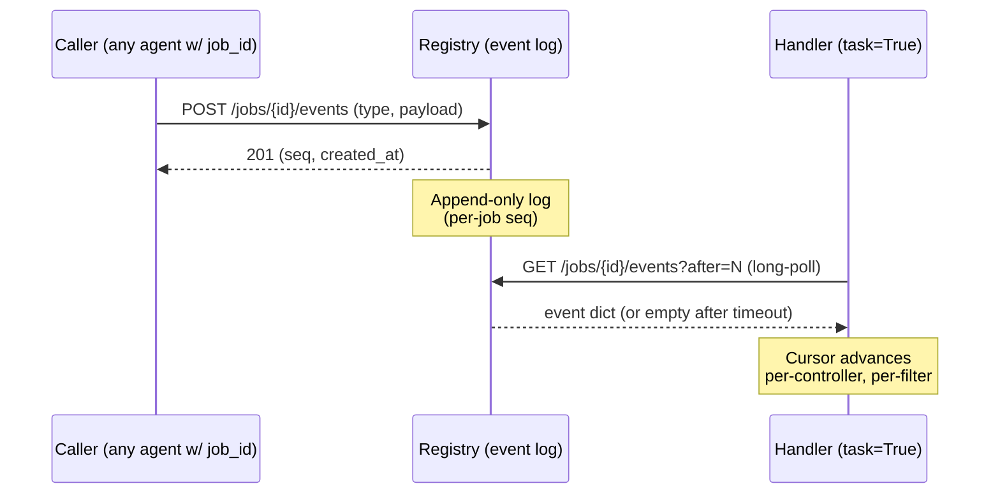
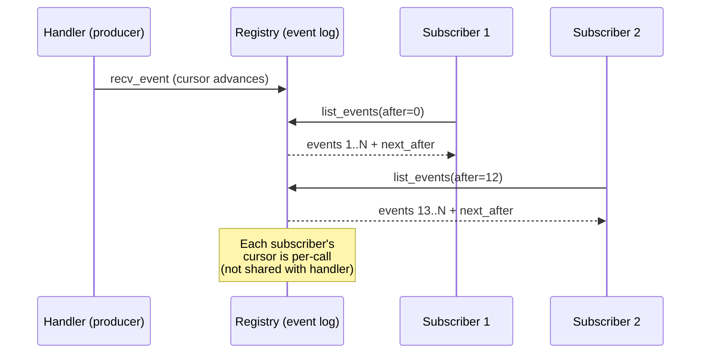

# Long-Running Jobs

> Submit-and-wait task execution that survives `tools/call` timeouts, replica
> restarts, and consumer disconnects.

A regular `tools/call` is a request-response pair on a single open HTTP/SSE
connection. If the work takes minutes — generating a multi-section report,
transcoding a video, running a long agentic loop — the client and server
spend that whole time holding a socket open and gambling that nothing in
between (load balancers, proxies, k8s pod restarts) drops the connection.
**MeshJob** is a different primitive for that class of work: producers
declare a tool as `task=true`, consumers `submit` and later `wait`, and the
registry holds the durable state in between.

## The problem

`tools/call` is fine for sub-second to ~30s tools. For anything longer:

- **Connection fragility.** Any hop (browser, ingress, mesh) drops idle
  HTTP after 60–120s. The producer keeps computing; the consumer sees a
  generic timeout and has no handle to recover.
- **No backpressure.** The producer can't tell the consumer "I'm 60% done,
  ETA 90 seconds." The consumer waits blind.
- **No cancel.** A consumer that gives up has no way to tell the producer
  to stop burning CPU.
- **No retry semantics.** A transient upstream error (rate-limit, network
  blip) on attempt 1 of a 5-minute job means restarting from scratch on the
  consumer's clock.

**Streaming** ([`streaming.md`](streaming.md)) solves the responsiveness
problem when the work is a single text stream — chunks flow back over the
already-open connection. **Jobs** solve the durability problem when the
work is a discrete unit that needs to outlive the request: the connection
closes, the producer keeps going, the consumer reconnects (or polls) for
the result.

## Solution: `task=true` opt-in

Authors annotate the tool with `task=true` and accept an injected
controller (`MeshJob`) that exposes `update_progress`, `complete`, and
`fail`. Consumers declare a dependency on the producer's capability and
type the parameter as `MeshJob` — the framework injects a
`MeshJobSubmitter` (instead of the usual `McpMeshTool` proxy) at that
slot. `submitter.submit(...)` returns a `JobProxy`; `proxy.wait(...)`
polls the registry until the row is terminal.

There's no global config knob. Whether a tool is a job is opt-in per
tool by virtue of `task=true`. Plain `task=false` tools continue to be
buffered request-response exactly as before.

## Getting started

A producer that emits progress updates and a consumer that submits-and-
waits — the canonical end-to-end pattern. The full files live under
[`examples/jobs/`](https://github.com/dhyansraj/mcp-mesh/tree/main/examples/jobs),
[`examples/jobs-ts/`](https://github.com/dhyansraj/mcp-mesh/tree/main/examples/jobs-ts),
and [`examples/jobs-java/`](https://github.com/dhyansraj/mcp-mesh/tree/main/examples/jobs-java).

<!-- markdownlint-disable MD046 -->
**Producer — declares a `task=true` capability:**

=== "Python"

    ```python
    import asyncio
    import mesh
    from fastmcp import FastMCP
    from mesh import MeshJob

    app = FastMCP("Long Task Provider")

    @app.tool()
    @mesh.tool(capability="generate_report", task=True)
    async def generate_report(
        user_id: str,
        sections: list[str],
        job: MeshJob = None,
    ) -> dict:
        if job is not None:
            await job.update_progress(0.0, "starting")
        results = []
        total = max(len(sections), 1)
        for i, section in enumerate(sections):
            await asyncio.sleep(2)
            results.append({"section": section, "content": f"...{section}"})
            if job is not None:
                await job.update_progress((i + 1) / total, f"section {i+1}/{total}")
        payload = {"user_id": user_id, "report": results}
        if job is not None:
            await job.complete(payload)
        return payload

    @mesh.agent(name="long-task-provider", http_port=9100, auto_run=True)
    class LongTaskProvider: pass
    ```

=== "TypeScript"

    ```typescript
    import { FastMCP, mesh, type MeshJob } from "@mcpmesh/sdk";
    import { z } from "zod";

    const server = new FastMCP({ name: "Long Task Provider (TS)", version: "1.0.0" });
    const agent = mesh(server, { name: "long-task-provider-ts", httpPort: 9110 });

    agent.addTool({
      name: "generate_report",
      capability: "generate_report",
      task: true,
      meshJobParamIndex: 1,         // job lands at sig pos 1 (after `args`)
      parameters: z.object({
        user_id: z.string(),
        sections: z.array(z.string()),
      }),
      execute: async ({ user_id, sections }, job: MeshJob | null = null) => {
        await job?.updateProgress?.(0.0, "starting");
        const results: { section: string; content: string }[] = [];
        const total = Math.max(sections.length, 1);
        for (let i = 0; i < sections.length; i++) {
          await new Promise((r) => setTimeout(r, 2000));
          results.push({ section: sections[i], content: `...${sections[i]}` });
          await job?.updateProgress?.((i + 1) / total, `section ${i+1}/${total}`);
        }
        const payload = { user_id, report: results };
        await job?.complete?.(payload);
        return payload;
      },
    });
    ```

=== "Java"

    ```java
    @MeshAgent(name = "long-task-provider-java", port = 9120)
    @SpringBootApplication
    public class LongTaskProviderApplication {

      public static void main(String[] args) {
        SpringApplication.run(LongTaskProviderApplication.class, args);
      }

      @MeshTool(capability = "generate_report", task = true)
      public Map<String, Object> generateReport(
          @Param("user_id") String userId,
          @Param("sections") List<String> sections,
          MeshJob job) throws InterruptedException {
        JobController controller = job instanceof JobController c ? c : null;
        if (controller != null) controller.updateProgress(0.0, "starting");
        List<Map<String, String>> results = new ArrayList<>();
        int total = Math.max(sections.size(), 1);
        for (int i = 0; i < sections.size(); i++) {
          Thread.sleep(2000);
          results.add(Map.of("section", sections.get(i), "content", "..."));
          if (controller != null) {
            controller.updateProgress((i + 1.0) / total, "section " + (i+1) + "/" + total);
          }
        }
        Map<String, Object> payload = new LinkedHashMap<>();
        payload.put("user_id", userId);
        payload.put("report", results);
        if (controller != null) controller.complete(payload);
        return payload;
      }
    }
    ```

**Consumer — submits and waits:**

=== "Python"

    ```python
    import mesh
    from fastmcp import FastMCP
    from mesh import MeshJob

    app = FastMCP("Long Task Consumer")

    @app.tool()
    @mesh.tool(capability="commission_report", dependencies=["generate_report"])
    async def commission_report(
        user_id: str,
        sections: list[str],
        # Param name MUST match the dependency capability — that pairing
        # is what makes the slot a MeshJobSubmitter (not a McpMeshTool proxy).
        generate_report: MeshJob = None,
    ) -> dict:
        proxy = await generate_report.submit(
            user_id=user_id, sections=sections, max_duration=60,
        )
        return await proxy.wait(timeout_secs=60)
    ```

=== "TypeScript"

    ```typescript
    agent.addTool({
      name: "commission_report",
      capability: "commission_report",
      dependencies: [{ capability: "generate_report" }],
      meshJobDepIndex: 0,            // dep[0] is task=true → MeshJobSubmitter
      parameters: z.object({
        user_id: z.string(),
        sections: z.array(z.string()),
      }),
      execute: async (
        { user_id, sections },
        generateReport: MeshJob | null = null,
      ) => {
        const proxy = await generateReport!.submit!(
          { user_id, sections },
          { maxDuration: 60 },
        );
        return await proxy.wait!(60);
      },
    });
    ```

=== "Java"

    ```java
    @MeshTool(
        capability = "commission_report",
        dependencies = @Selector(capability = "generate_report"))
    public Map<String, Object> commissionReport(
        @Param("user_id") String userId,
        @Param("sections") List<String> sections,
        MeshJob generateReport) throws Exception {
      MeshJobSubmitter submitter = (MeshJobSubmitter) generateReport;
      Map<String, Object> payload = new LinkedHashMap<>();
      payload.put("user_id", userId);
      payload.put("sections", sections);
      var opts = new MeshJobSubmitter.SubmitOptions(payload, null, 60, null, null);
      try (JobProxy proxy = submitter.submit(opts).get()) {
        return (Map<String, Object>) proxy.await(60.0);
      }
    }
    ```
<!-- markdownlint-enable MD046 -->

`submit(...)` posts to the registry's `POST /jobs` and returns a
`JobProxy` bound to the new `job_id`. `wait(...)` polls
`GET /jobs/{id}` until the status is terminal (`completed`, `failed`,
or `cancelled`) and returns the producer's `complete()` payload (or
raises on failure / cancel / timeout).

## Retry semantics

A failed attempt does not mean a failed job. The mesh distinguishes
**explicit failure** (the handler decided this is unrecoverable) from
**transient failure** (the handler hit a retryable error class), and
re-runs only the latter on a peer replica.

### `max_retries` (Sidekiq/Celery convention)

`max_retries` counts retries **beyond** the initial attempt. So
`max_retries=3` means up to 4 total attempts. The default is conservative
— check your runtime's per-tool default and set explicitly when in doubt.

!!! danger "`max_retries` does not soften a real failure"

    A handler exception **not** matched by `retry_on` — and any explicit
    `fail()` — is **terminal immediately**, regardless of how much of the
    `max_retries` budget is unspent. That budget covers only crash-style
    recoveries the runtime retries for you: lease expiry, orphan reclaim,
    `max_duration` timeout, plus `retry_on`-matched releases. A job that
    shows `attempt_count: 1` with `max_retries: 3` after a non-transient
    error has **zero** retries left — not two — it already reached its
    terminal `failed` state on that first attempt.

!!! warning "Retries restart from scratch"

    There are no idempotency keys in v2.x. Every retry runs the handler
    body from the top. If the work has external side effects (sending
    email, charging a card, mutating a remote DB), make the handler
    **idempotent** or design for at-least-once semantics — e.g.,
    deterministic IDs the downstream can dedupe on, or a "claim → check →
    execute → mark done" pattern keyed off the `job_id`.

### `retry_on` (per-tool exception whitelist)

`retry_on` is a per-tool list of exception classes that should be treated
as transient. When the handler raises a matching exception, the SDK calls
`releaseLease(reason)` instead of `fail(reason)`: the registry resets the
owner, and a peer replica (or the same replica on the next claim cycle)
re-runs the handler within ~5 seconds. Anything **not** in `retry_on`
still goes through `fail()` and surfaces to the consumer immediately.

The canonical pattern: a tool that calls a flakey upstream raises
`OSError` / `IOException` / `TransientUpstreamError` on the first N
attempts, succeeds on attempt N+1.

<!-- markdownlint-disable MD046 -->
=== "Python"

    ```python
    @app.tool()
    @mesh.tool(
        capability="report_with_transient_failures",
        task=True,
        retry_on=(OSError,),
    )
    async def report_with_transient_failures(
        user_id: str,
        transient_failures: int = 2,
        job: MeshJob = None,
    ) -> dict:
        n = _bump_retry_counter()
        if n <= transient_failures:
            # SDK matches retry_on=(OSError,) → calls release_lease(),
            # NOT fail() — the registry hands the job to a peer within ~5s.
            raise OSError(f"simulated transient failure {n}/{transient_failures}")
        payload = {"user_id": user_id, "succeeded_on_attempt": n}
        if job is not None:
            await job.complete(payload)
        return payload
    ```

=== "TypeScript"

    ```typescript
    class TransientUpstreamError extends Error {}

    agent.addTool({
      name: "report_with_transient_failures",
      capability: "report_with_transient_failures",
      task: true,
      meshJobParamIndex: 1,
      retryOn: [TransientUpstreamError],
      parameters: z.object({
        user_id: z.string(),
        transient_failures: z.number().default(2),
      }),
      execute: async (
        { user_id, transient_failures },
        job: MeshJob | null = null,
      ) => {
        const n = bumpRetryCounter();
        if (n <= transient_failures) {
          // retryOn match → SDK releases the lease; peer replica retries.
          throw new TransientUpstreamError(`transient ${n}/${transient_failures}`);
        }
        const payload = { user_id, succeeded_on_attempt: n };
        await job?.complete?.(payload);
        return payload;
      },
    });
    ```

=== "Java"

    ```java
    @MeshTool(
        capability = "report_with_transient_failures",
        task = true,
        retryOn = IOException.class)
    public Map<String, Object> reportWithTransientFailures(
        @Param("user_id") String userId,
        @Param(value = "transient_failures", required = false) Integer transientFailures,
        MeshJob job) throws IOException {
      int target = transientFailures == null ? 2 : transientFailures;
      int n = bumpRetryCounter();
      if (n <= target) {
        // retryOn=IOException matches → dispatch wrapper calls
        // releaseLease(reason) instead of fail(reason).
        throw new IOException("simulated transient failure " + n + "/" + target);
      }
      JobController controller = job instanceof JobController c ? c : null;
      Map<String, Object> payload = new LinkedHashMap<>();
      payload.put("user_id", userId);
      payload.put("succeeded_on_attempt", n);
      if (controller != null) controller.complete(payload);
      return payload;
    }
    ```
<!-- markdownlint-enable MD046 -->

**Validation is loud.** `retry_on` requires `task=true`; misuse (string
entries, non-`Error` classes) fails at registration so it surfaces at
agent boot, not at retry time. Both `report_with_transient_failures`
fixtures (Python `tests/integration/suites/uc21_meshjob/fixtures/long-task-provider/main.py`
and Java `tests/integration/suites/uc23_meshjob_java/fixtures/long-task-provider-java/`)
exercise this end-to-end with a file-based attempt counter that lets
the test assert "succeeded on attempt 3" deterministically.

## Timeout propagation

Jobs use the existing `X-Mesh-Timeout` header (#656) to carry a
**per-attempt deadline** — relative seconds remaining for the current
attempt, not an absolute timestamp. The provider runtime parses the
header on inbound, stashes the deadline in an async-local primitive,
and outbound proxies (any `McpMeshTool` call the handler makes) read
the same primitive and attach `X-Mesh-Timeout: <remaining>` to their
own downstream requests.

| Runtime    | Async-local primitive                          |
|------------|------------------------------------------------|
| Python     | `contextvars.ContextVar("mesh_job_deadline")`  |
| TypeScript | `AsyncLocalStorage`                            |
| Java       | `ThreadLocal` (or `ScopedValue` for Loom)      |

**Nested job cap.** When a parent job calls a child job, the child's
deadline is `min(parent_remaining, child_requested)`. If the parent
has 5 seconds left on its attempt and the child's `submit(...)`
requests `max_duration=30`, the child gets 5 seconds. This is enforced
at submission time so the child's runtime sees a single coherent
deadline regardless of how deep the chain runs.

The header is on the default `MCP_MESH_PROPAGATE_HEADERS` allowlist
alongside `X-Mesh-Job-Id`, `X-Mesh-Trace-Id`, etc. — no per-agent
configuration is needed for propagation to work. Tracing this in
[Audit Trail](audit.md) shows the deadline shrinking as it walks the
chain.

## meshctl

Three SDK-managed helper tools are exposed on every mesh agent for
out-of-band job inspection. They are not separate `meshctl` subcommands
— they are regular MCP tools, prefixed with `__mesh_job_` to mark them
framework-internal, that you reach via `meshctl call`:

```bash
# Inspect status (registry returns the full job row)
meshctl call <consumer>:__mesh_job_status \
    '{"job_id":"01HXY..."}'

# Pull just the terminal result + status (convenience over status)
meshctl call <consumer>:__mesh_job_result \
    '{"job_id":"01HXY..."}'

# Cancel mid-flight (idempotent — already-terminal jobs return ok)
meshctl call <consumer>:__mesh_job_cancel \
    '{"job_id":"01HXY...","reason":"user requested"}'
```

Submission goes through the consumer's actual capability (e.g.
`commission_report` in the example above), which is the wrapper that
calls `submitter.submit(...)` internally. There is no
`__mesh_job_submit` helper — kicking off a job always goes through a
consumer tool, because the submitter needs to know which capability
to route to and which retry / deadline policy to apply.

The Dashboard also lists active jobs and exposes the same status /
cancel actions over the registry HTTP API directly, useful when
debugging from a browser instead of a shell.

## Auth model

`job_id` is a **presigned-URL-style capability**. Possession of a valid
`job_id` (~122 bits of entropy from a UUID) grants full status / result
/ cancel rights on that job, with no additional caller-identity check.
Reads and writes against the registry's `/jobs/{id}` endpoints are not
authenticated by design: the secret IS the URL fragment.

!!! warning "Leak the id, leak the job"

    Treat `job_id` like a presigned S3 URL. Anyone who learns it can
    cancel the work or read the result, including any error payload it
    surfaced. Don't log job ids to a system that has a wider audience
    than the consumer that issued them. Don't return them to a
    third-party browser unless you intend that party to control the
    job. If a job carries sensitive payloads, scrub them out of the
    `complete()` body too — the result lives in the registry until the
    sweep cron expires it.

In v2.x there is **no opt-in caller-identity verification**. Future
work (tracked in `MESHJOB_DESIGN.org`) will add an optional SPIRE-
based mode that matches the calling SVID against the job's submitter
on cancel / status, for environments that need stricter isolation.

## Architecture overview

The **registry** is the durable substrate. It's a Go service backed by
PostgreSQL (or SQLite for `--singlepass` dev mode); jobs live in a
`jobs` table with `status`, `owner_instance_id`, `lease_expires_at`,
`attempt_count`, `progress`, and `result` columns. A periodic sweep
loop reaps orphaned jobs (owner crashed, lease expired) and enforces
`total_deadline` as a separate safety net beyond the per-attempt
`max_duration`. All status transitions land in the same Postgres row,
so any consumer that holds the `job_id` sees the latest state on the
next poll regardless of which replica owns the job.

### Default stale ceiling (opt-in)

Operators can set `MCP_MESH_JOB_STALE_TIMEOUT` (a Go duration, e.g.
`2h`) on the registry to apply a *default* total-runtime ceiling —
measured from submission — to jobs that did **not** set their own
`total_deadline`. A job that set `total_deadline` is fully exempt; the
per-job hard bound already governs it. The effective ceiling for a job
is `max(MCP_MESH_JOB_STALE_TIMEOUT, max_duration)`: the registry never
reaps a job before its own declared per-attempt `max_duration` has
elapsed, since a longer `max_duration` expresses intent to run that
long. Reaped jobs are marked `failed` with a `stale: ...` reason and a
synthetic `stale` event. Unset (the default) leaves the feature off —
such jobs run unbounded, subject only to lease recovery.

For a job that runs for hours: set `max_duration` to its real
per-attempt runtime (this sizes the lease AND floors the stale
ceiling). A handler sitting in `recv_event` gates renews the lease on
every poll; one that computes silently for long stretches should emit
periodic progress to keep the lease renewed. Set `total_deadline` if you
want a hard total-runtime bound across all attempts, or to opt out of the
registry-wide stale ceiling entirely.

`MCP_MESH_JOB_STALE_TIMEOUT` is a **reap ceiling, not the lease window** —
it caps total runtime from submission but does not size or extend the
per-attempt lease. The lease window is derived per-job from `max_duration`
(300s default) and is renewed by progress deltas and executor `recv_event`
polls; tuning the stale timeout does not change how quickly a quiet
handler's lease expires.

### Multi-replica fencing and poll-liveness

Several replicas can declare the same `task=true` capability. Each job is
claimed by exactly one replica per attempt (the guarded atomic `UPDATE`
above, so concurrent claimers race and one wins). The owner's lease is
renewed by **any accepted non-terminal delta and any executor `recv_event`
poll from the current claim** — a handler parked in a legitimate
`recv_event` gate is provably alive, so no artificial `update_progress`
keepalives are needed. Poll-liveness is capped so it never pushes the lease
past `total_deadline` or the stale ceiling.

If a lease genuinely expires (a handler wedged, neither progressing nor
polling), the sweep returns the job to the pool and a peer re-claims it.
Every claim — including a same-replica re-claim — carries a monotonically
increasing **claim epoch**. The registry fences the superseded execution:
its writes are rejected `claim_superseded` and its cancel token fires, so a
parked `recv_event` breaks out with the cancelled error and the handler
observes cancellation exactly as it would a user cancel. Handlers should
honor cancellation promptly; the read-only `claimEpoch` accessor on the job
context (`job.claim_epoch` in Python, `currentJob()?.claimEpoch` in
TypeScript, `JobContext.current().claimEpoch` in Java) can be stamped onto
external side effects so downstream can dedupe a fenced re-execution's
duplicate write.

**Calling-job identity (provider-side dual).** The stamp above lets a
handler fence *its own* side effects. When the dedupe target is itself a
mesh provider — a state-authority agent that must reject writes from a
*stale executor* it doesn't control — the caller need not thread `job_id` /
`claim_epoch` through the payload. The mesh seeds them automatically: any
outbound mesh→mesh tool call made from within a job handler carries the
calling job's identity on two dedicated propagated headers,
`x-mesh-calling-job-id` and (when known) `x-mesh-calling-claim-epoch`,
forwarded by default across every mesh→mesh hop (including the registry's
proxy hop). The provider reads the pair with `mesh.calling_job()` in Python
(→ `CallingJob(job_id, claim_epoch)` or `None`), `callingJob()` in TypeScript
(→ `{ jobId, claimEpoch }` or `null`, exported from the package root), and
`MeshCallContext.callingJob()` in Java (→ `CallingJob(jobId, claimEpoch)`,
package `io.mcpmesh.spring`). Each reports the identity of the job that
**called this tool**, not the job the handler is itself running as — so each
is the provider-side dual of the job-context accessor: `current_job()` /
`currentJob()` / `JobContext.current()` answer "what job am I executing
*as*", while the calling-job accessor answers "what job *invoked* me". All
three return the empty/`null` identity for a regular (non-job) `tools/call`,
a caller on an older SDK, and — critically — inside a handler that was
**claimed directly** (its own identity lives on the job-context accessor,
not here); the epoch is `null` for a push-mode inbound job. Reading them is
purely additive and read-only.

The **agent runtime** is a thin client. On the producer side, it
maintains a claim queue per `task=true` capability (`UPDATE jobs SET
owner_instance_id = $self WHERE capability = $cap AND status =
'pending'` is the atomic claim), runs the handler with an injected
`JobController`, and batches progress / terminal POSTs back to the
registry on a tick interval (terminal calls flush immediately). Cancel
signals bind a registry watcher to the in-flight handler's cancel
token, so `proxy.cancel(...)` from any consumer fires the token on the
owner replica and outbound HTTP proxies abort their requests too.

**DDDI is the injection layer.** The producer's `MeshJob` parameter
lands at `meshJobParamIndex` (Python and Java auto-detect it from the
type annotation; TS declares it explicitly in `addTool`). The
consumer's `MeshJob` parameter — typed identically, but on a slot
named after a dependency capability — gets a `MeshJobSubmitter`
instead of an `McpMeshTool` proxy: same DDDI lookup, different
injection target based on the dep's `task=true` flag. Resolution,
trust, and tag matching are unchanged from the regular tool path; the
only difference is the runtime swaps the proxy class at the dep slot.
For the full design rationale and lifecycle diagrams, see
[`MESHJOB_DESIGN.org`](https://github.com/dhyansraj/mcp-mesh/blob/main/MESHJOB_DESIGN.org)
and [`MESHJOB_DDDI_CONTRACT.md`](https://github.com/dhyansraj/mcp-mesh/blob/main/MESHJOB_DDDI_CONTRACT.md).

### Claim gating on unavailable capabilities

Claiming is also gated on capability availability. A claim worker will not
pull a job for a `task=true` capability whose `required` dependencies are
currently unavailable under the [availability predicate](../python/dependency-injection.md#required-dependencies) —
claiming it would only run the handler far enough to fail on the missing
dependency and burn a retry on a purely topological outage. Instead the
registry leaves the job queued and untouched (no owner, no `attempt_count`
increment, no `claim_epoch` bump, no lease) and the worker moves on to the
next candidate. The gate is evaluated lazily — only once a candidate job
actually exists — so an idle queue pays nothing. Claiming resumes
automatically within one claim-poll cycle (≤5s backoff ceiling) of the
required chain recovering, so no retry budget is spent while the capability
is down.

The gate is **belt-and-suspenders — enforced at both layers.** The
registry-side transitive predicate (above) keeps the job out of any claim
response whose `required` chain is down. Consumer-side, the claim worker
independently **skips claiming** while a `required` dependency slot is still
unresolved *locally* — the claim gate and the handler's injection read one
clock, so a dep flapping DOWN→UP cannot slip a job past the registry gate
into a handler that would see `null`. As a last resort, a **pre-invoke
guard** that finds a required slot still unresolved at invoke time
**releases the claim back to the queue** (a lease release, mirroring the
`retry_on` path — never a terminal `fail()`) rather than running the handler
with a missing dependency. Net effect: a handler never observes `null` for a
`required` dependency, including during dependency recovery.

## What it does NOT do (v2 limitations)

- **No idempotency keys.** Retries restart the handler from scratch;
  the SDK does not dedupe partial side effects. Make handlers
  idempotent if at-least-once semantics are not acceptable.
- **No caller-identity check on `job_id`.** Possession of the id is
  the only auth. SPIRE-based opt-in is future work.
- **No streaming-style chunked progress.** `update_progress(fraction,
  message)` flushes through the registry on a batching tick. For
  token-by-token feedback, use [streaming](streaming.md) instead — or
  combine: a job that calls a streaming tool internally and reports
  coarse progress via `update_progress`.
- **No cross-runtime retry-on whitelist coercion.** Each runtime
  matches its own native exception classes (Python `Exception`
  subclasses, TS `Error` subclasses, Java `Throwable` subclasses).
  A Python provider's `retry_on=(OSError,)` does not propagate to a
  Java peer claiming the same capability — declare the whitelist
  separately on each runtime that hosts the capability.

## Event injection

`update_progress` is producer-to-consumer one-way reporting. **Event
injection** opens the other direction (and the side channel between
two consumers): a per-job, ordered, append-only event log the registry
hosts, that anyone holding the `job_id` can write into and that the
running handler can drain from inline.

The shape is symmetric to a tiny pub/sub bus scoped to one job. Three
surfaces:

- **Inside the `task=True` handler** — drain events posted to this job
  via the injected `MeshJob` controller. Long-poll backed; returns one
  event dict (or `None` on timeout).
- **Outside the handler, holding a `job_id`** — fire one event into the
  job's log via a static helper. The SDK constructs (and caches) a
  transient `JobProxy` from `MCP_MESH_REGISTRY_URL`; no controller
  reference needed.
- **From a consumer that already holds a `JobProxy`** — `proxy.send_event`
  is the per-proxy fire-and-forget. Same wire shape as `post_event`;
  use whichever surface you have in scope.



### Receiving events inside a handler

The producer-side recv loop. Filter by `types` to drop noise, set a
`timeout_secs` so the loop can wake periodically to check other state.

<!-- markdownlint-disable MD046 -->
=== "Python"

    ```python
    @app.tool()
    @mesh.tool(capability="run_workflow", task=True)
    async def run_workflow(tenant_id: str, job: MeshJob = None) -> dict:
        while True:
            event = await job.recv_event(
                types=["user_input", "cancelled"],
                timeout_secs=10.0,
            )
            if event is None:
                continue  # timeout: tick housekeeping, then re-park
            if event["type"] == "cancelled":
                return {"status": "cancelled", "reason": event["payload"].get("reason")}
            # ...handle user_input...
    ```

=== "TypeScript"

    ```typescript
    agent.addTool({
      name: "run_workflow",
      capability: "run_workflow",
      task: true,
      meshJobParamIndex: 1,
      parameters: z.object({ tenant_id: z.string() }),
      execute: async ({ tenant_id }, job: MeshJob | null = null) => {
        if (!job) throw new Error("job slot is not bound");
        while (true) {
          const event = await job.recvEvent(["user_input", "cancelled"], 10);
          if (event === null) continue;
          if (event.type === "cancelled") {
            const payload = event.payload as Record<string, unknown> | null;
            const reason = typeof payload?.reason === "string" ? payload.reason : "";
            return { status: "cancelled", reason };
          }
          // ...handle user_input...
        }
      },
    });
    ```

=== "Java"

    ```java
    @MeshTool(capability = "run_workflow", task = true)
    public Map<String, Object> runWorkflow(
        @Param("tenant_id") String tenantId,
        MeshJob job) throws Exception {
      JobController controller = (JobController) job;
      while (true) {
        Map<String, Object> event = controller.recvEvent(
            List.of("user_input", "cancelled"),
            Duration.ofSeconds(10));
        if (event == null) continue;
        if ("cancelled".equals(event.get("type"))) {
          Map<?, ?> payload = (Map<?, ?>) event.get("payload");
          String reason = payload == null ? "" : Objects.toString(payload.get("reason"), "");
          return Map.of("status", "cancelled", "reason", reason);
        }
        // ...handle user_input...
      }
    }
    ```
<!-- markdownlint-enable MD046 -->

The handler's `recv_event` cursor is per-`JobController` instance **and
per-`types` filter**: each distinct filter is an independent stream with
its own cursor, so interleaving `recv_event(types=["A"])` and
`recv_event(types=["B"])` never lets one filter's consumption skip the
other's earlier events. Delivery is exactly-once within a filter stream
and at-least-once across different filters. Within a stream the running
handler always sees events in monotonic seq order.

**On (re-)claim the default replays every filter from `seq=0`.** A fresh
controller for the same `job_id` (e.g. a re-claim) starts each filter at the
beginning of the log. That is the safe default for idempotent or
cheap-to-recompute handlers.

#### `resume_cursor` — durable cursor resume (opt-in)

A **task tool** can opt into a durable per-filter cursor so a re-claimed
handler resumes **after** the last processed event instead of replaying from
`seq=0`. Reach for it when the per-event work is non-idempotent or expensive
and must not be redone on re-claim:

<!-- markdownlint-disable MD046 -->
=== "Python"

    ```python
    @app.tool()
    @mesh.tool(capability="run_workflow", task=True, resume_cursor=True)
    async def run_workflow(tenant_id: str, job: MeshJob = None) -> dict:
        while True:
            event = await job.recv_event(types=["user_input"], timeout_secs=10.0)
            if event is None:
                continue
            # ...process sequentially, then loop to request the next event...
    ```

=== "TypeScript"

    ```typescript
    agent.addTool({
      name: "run_workflow",
      capability: "run_workflow",
      task: true,
      resumeCursor: true,
      execute: async ({ tenant_id }, job: MeshJob | null = null) => {
        if (!job) throw new Error("job slot is not bound");
        while (true) {
          const event = await job.recvEvent(["user_input"], 10);
          if (event === null) continue;
          // ...process sequentially, then loop to request the next event...
        }
      },
    });
    ```

=== "Java"

    ```java
    @MeshTool(capability = "run_workflow", task = true, resumeCursor = true)
    public Map<String, Object> runWorkflow(
        @Param("tenant_id") String tenantId,
        MeshJob job) throws Exception {
      JobController controller = (JobController) job;
      while (true) {
        Map<String, Object> event = controller.recvEvent(
            List.of("user_input"), Duration.ofSeconds(10));
        if (event == null) continue;
        // ...process sequentially, then loop to request the next event...
      }
    }
    ```
<!-- markdownlint-enable MD046 -->

The framework persists each per-filter cursor on the job row through the
normal **epoch-fenced delta flush**; on re-claim the new controller resumes
past the persisted seqs. This preserves **at-least-once**: a crash replays
only the un-flushed tail — a small, bounded replay of the most recent events
— never the whole log. Handlers must still tolerate that bounded replay;
design for at-least-once, not exactly-once.

!!! danger "Durable resume requires sequential per-filter consumption"

    The cursor advances when the handler requests the *next* event of a
    filter — that `recv_event` call is treated as proof the prior event
    finished (commit-on-poll, Kafka-style). A handler that **prefetches** or
    processes a filter's events **concurrently** (recv → spawn async → recv
    again before the first finished) must **not** enable `resume_cursor`:
    resume would skip the still-in-flight event. If you pipeline a filter,
    stay on the replay-from-`seq=0` default (or checkpoint yourself).

### Posting events from outside the handler

`mesh.jobs.post_event` is the canonical fire-and-forget. It resolves the
registry from `MCP_MESH_REGISTRY_URL`, reuses a process-cached
`JobProxy` from the LRU keyed by `(registry_url, job_id)` (configurable
via [`MCP_MESH_JOBPROXY_CACHE_MAX`](../environment-variables.md#meshjob-event-channel)),
and forwards the call. Use it from any MCP tool that receives a
`job_id` in its request payload (a "submit_user_input" pattern):

<!-- markdownlint-disable MD046 -->
=== "Python"

    ```python
    import mesh

    @app.tool()
    @mesh.tool(capability="submit_user_input")
    async def submit_user_input(job_id: str, text: str) -> dict:
        receipt = await mesh.jobs.post_event(
            job_id, "user_input", {"text": text},
        )
        return {"seq": receipt["seq"]}
    ```

=== "TypeScript"

    ```typescript
    agent.addTool({
      name: "submit_user_input",
      capability: "submit_user_input",
      parameters: z.object({ jobId: z.string(), text: z.string() }),
      execute: async ({ jobId, text }) => {
        const receipt = await mesh.jobs.postEvent(
          jobId, "user_input", { text },
        );
        return { seq: receipt.seq };
      },
    });
    ```

=== "Java"

    ```java
    @MeshTool(capability = "submit_user_input")
    public Map<String, Object> submitUserInput(
        @Param("job_id") String jobId,
        @Param("text") String text) {
      Map<String, Object> receipt = MeshJobs.postEvent(
          jobId, "user_input", Map.of("text", text));
      return Map.of("seq", receipt.get("seq"));
    }
    ```
<!-- markdownlint-enable MD046 -->

If the calling code already holds a `JobProxy` (e.g. the consumer that
called `submitter.submit(...)`), the same wire surface is on the proxy
directly: `proxy.send_event(event_type, payload)` (Python) /
`proxy.sendEvent(eventType, payload)` (TS/Java). Skip the helper +
cache lookup when you already have a proxy in scope.

### Lifecycle facades by `job_id`

Symmetric to `post_event`: callers that hold a `job_id` but no
`JobProxy` reference can drive the rest of the post-submit lifecycle
through module-level facades that share the same registry-URL
resolution + cached-proxy machinery. All three runtimes ship the
same surface — Python, TypeScript, and Java each implement the same
DDDI-clean facade pattern.

| Operation                | Python                                             | TypeScript                                       | Java                                          | Returns                       |
| ------------------------ | -------------------------------------------------- | ------------------------------------------------ | --------------------------------------------- | ----------------------------- |
| Cancel a running job     | `await mesh.jobs.cancel(job_id, reason=None)`      | `await mesh.jobs.cancel(jobId, reason?)`         | `MeshJobs.cancel(jobId[, reason])`            | `None` / `void`               |
| Read latest job state    | `await mesh.jobs.status(job_id)`                   | `await mesh.jobs.status(jobId)`                  | `MeshJobs.status(jobId)`                      | `dict` / `JobStatus` / `Map`  |
| Wait for terminal state  | `await mesh.jobs.wait(job_id, timeout_secs=None)`  | `await mesh.jobs.wait(jobId, timeoutSecs?)`      | `MeshJobs.await(jobId[, timeoutSecs])`        | `result` payload on success   |

<!-- markdownlint-disable MD046 -->
=== "Python"

    ```python
    import mesh

    @app.tool()
    @mesh.tool(capability="abort_workflow")
    async def abort_workflow(job_id: str, reason: str) -> dict:
        await mesh.jobs.cancel(job_id, reason)
        return {"cancelled": job_id}

    @app.tool()
    @mesh.tool(capability="check_progress")
    async def check_progress(job_id: str) -> dict:
        snapshot = await mesh.jobs.status(job_id)
        return {
            "status": snapshot["status"],
            "progress": snapshot["progress"],
            "message": snapshot["progress_message"],
        }

    @app.tool()
    @mesh.tool(capability="run_to_completion")
    async def run_to_completion(job_id: str) -> dict:
        result = await mesh.jobs.wait(job_id, timeout_secs=300.0)
        return {"result": result}
    ```

=== "TypeScript"

    ```typescript
    agent.addTool({
      name: "abort_workflow",
      capability: "abort_workflow",
      parameters: z.object({ jobId: z.string(), reason: z.string() }),
      execute: async ({ jobId, reason }) => {
        await mesh.jobs.cancel(jobId, reason);
        return { cancelled: jobId };
      },
    });

    agent.addTool({
      name: "check_progress",
      capability: "check_progress",
      parameters: z.object({ jobId: z.string() }),
      execute: async ({ jobId }) => {
        const snapshot = await mesh.jobs.status(jobId);
        return {
          status: snapshot.status,
          progress: snapshot.progress,
          message: snapshot.progress_message,
        };
      },
    });

    agent.addTool({
      name: "run_to_completion",
      capability: "run_to_completion",
      parameters: z.object({ jobId: z.string() }),
      execute: async ({ jobId }) => {
        const result = await mesh.jobs.wait(jobId, 300);
        return { result };
      },
    });
    ```

=== "Java"

    ```java
    import io.mcpmesh.MeshJobs;

    @MeshTool(capability = "abort_workflow")
    public Map<String, Object> abortWorkflow(
        @Param("job_id") String jobId,
        @Param("reason") String reason) {
      MeshJobs.cancel(jobId, reason);
      return Map.of("cancelled", jobId);
    }

    @MeshTool(capability = "check_progress")
    public Map<String, Object> checkProgress(@Param("job_id") String jobId) {
      Map<String, Object> snapshot = MeshJobs.status(jobId);
      return Map.of(
          "status", snapshot.get("status"),
          "progress", snapshot.get("progress"),
          "message", snapshot.get("progress_message"));
    }

    @MeshTool(capability = "run_to_completion")
    public Map<String, Object> runToCompletion(@Param("job_id") String jobId) {
      Object result = MeshJobs.await(jobId, 300.0);
      return Map.of("result", result);
    }
    ```
<!-- markdownlint-enable MD046 -->

`cancel` is idempotent — calling it on an already-terminal job returns
ok. `wait` raises `TimeoutError` (Python) or rejects with an `Error`
whose message starts with `"timeout:"` (TypeScript) on `timeout_secs`
expiry; pass `None` / omit `timeoutSecs` to wait until the job reaches
a terminal state. `status` returns the same shape `JobProxy.status()`
exposes (registry `Job` row, field-for-field).

The Java facade is named `MeshJobs.await` (not `wait`) to avoid
readability confusion with the inherited `Object.wait()` / `wait(long)`
/ `wait(long, int)` overload family, and to match the existing
`JobProxy.await(double)` instance method precedent in the SDK. See the
Javadoc on `MeshJobs.await` and `JobProxy.await` for the detailed
rationale. `MeshJobs.await(jobId, timeoutSecs)` with `timeoutSecs <= 0.0`
or non-finite values means "no timeout" (matches the no-arg
`MeshJobs.await(jobId)` overload).

If the calling code already holds a `JobProxy`, the same surface is
on the proxy directly: `proxy.cancel(reason)`, `proxy.status()`,
`proxy.wait(timeout_secs)` (Python / TS) / `proxy.await(timeoutSecs)`
(Java). Skip the facade + cache lookup when you already have a proxy
in scope.

### Typed errors

Both `post_event` and `send_event` raise typed errors for the two
classes of failure the registry surfaces explicitly. Catch the
specific class if you care about distinguishing them; both still
descend from the runtime's generic exception type for back-compat
with broad handlers.

| Runtime    | Job not found in registry  | Job in terminal state         |
| ---------- | -------------------------- | ----------------------------- |
| Python     | `mesh.JobNotFoundError`    | `mesh.JobTerminalError`       |
| TypeScript | `JobNotFoundError`         | `JobTerminalError`            |
| Java       | `JobNotFoundException`     | `JobTerminalException`        |

Python's classes subclass `RuntimeError`; TypeScript's classes
subclass `Error`; Java's classes subclass `MeshException`.
`JobNotFoundError` covers the "sweep reaped it" / "id typo" case;
`JobTerminalError` covers "the job already completed / failed /
cancelled — no more events accepted."

### Synthetic cancel event

When a consumer calls `proxy.cancel(reason)`, the registry writes a
synthetic event into the log before forwarding the cancel signal to
the owner replica:

```
{"type": "cancelled", "payload": {"reason": "..."}}
```

A handler parked on `recv_event(types=["cancelled", ...])` observes
the event and can return cleanly instead of being interrupted by a
`CancelledError`-style exception at the next `await` point. The
registry waits a small grace window (default 200ms, configurable via
[`MCP_MESH_CANCEL_EVENT_GRACE_MS`](../environment-variables.md#meshjob-event-channel))
before issuing the cancel-forward, closing the race where the
synthetic event would otherwise be in flight when the cancel token
fires. The grace is capped at 10s — long enough for any reasonable
`recv_event` long-poll to wake, short enough that cancel calls don't
visibly stall.

Use this pattern when you want graceful shutdown semantics inside the
handler body instead of exception unwinding. The traditional
`CancelledError` path is still available — handlers that don't
subscribe to events continue to see the same behavior as before.

## Stream subscription

`recv_event` is **consumed** — once the handler reads an event at
`seq=N`, that controller's cursor advances past `N` and won't see it
again. **Stream subscription** is the **observer** counterpart: a
non-destructive iterator any caller can open against a job's event
log, each with its own cursor. Multiple subscribers can mirror the
same job's events without disturbing the producer's drain.



### When to use it

- **Fan-out**: ship the same event stream to a downstream queue, a UI
  websocket, and a metrics sink — three subscribers, three cursors,
  zero coordination.
- **Third-party observer**: a sidecar that mirrors events without
  being the running handler.
- **Reconnect-from-cursor**: persist `next_after` between subscriber
  sessions to resume from where the last session left off (the
  registry's log is append-only; the cursor is durable as long as
  the registry hasn't reaped the job).

For the in-handler drain — where each event is processed once — use
`recv_event` instead. Subscription is for cases where the act of
observing must not consume.

### Per-call cursor and watermark

Each call manages its own cursor. `after=0` (the default) starts from
the beginning of the log; pass a higher value to skip historical
events. The registry returns an ascending batch of events plus a
`next_after` watermark — the watermark advances even on empty pages
(useful when a server-side `types` filter scans past events that
don't match), so subsequent polls don't re-scan the same filtered
range.

There is **no automatic terminal-state detection**. The subscription
keeps polling until the caller breaks out of the loop or the
registry raises `JobNotFoundError` (job swept). Applications that
want a clean end signal post a sentinel event (e.g.
`{"type": "ended"}`) and break when the subscriber observes it.

### Cross-runtime examples

The three runtimes use the idiomatic iterator shape for each language:
Python and TypeScript expose async generators; Java exposes a blocking
`Closeable` iterator (try-with-resources is the canonical pattern).

<!-- markdownlint-disable MD046 -->
=== "Python"

    ```python
    import mesh

    async def mirror_progress(job_id: str) -> None:
        async for event in mesh.jobs.subscribe_events(
            job_id,
            types=["progress", "ended"],
            after=0,
            long_poll_secs=30.0,
        ):
            await downstream.publish(event)
            if event["type"] == "ended":
                break
    ```

=== "TypeScript"

    ```typescript
    import { mesh } from "@mcpmesh/sdk";

    async function mirrorProgress(jobId: string): Promise<void> {
      for await (const event of mesh.jobs.subscribeEvents(jobId, {
        types: ["progress", "ended"],
        after: 0,
        longPollSecs: 30,
      })) {
        await downstream.publish(event);
        if (event.type === "ended") break;
      }
    }
    ```

=== "Java"

    ```java
    void mirrorProgress(String jobId) {
      SubscribeOptions opts = SubscribeOptions.builder()
          .types(List.of("progress", "ended"))
          .after(0L)
          .longPoll(Duration.ofSeconds(30))
          .build();
      try (EventSubscription sub = MeshJobs.subscribeEvents(jobId, opts)) {
        while (sub.hasNext()) {
          Map<String, Object> event = sub.next();
          downstream.publish(event);
          if ("ended".equals(event.get("type"))) break;
        }
      }
    }
    ```
<!-- markdownlint-enable MD046 -->

A note on the Java shape: `EventSubscription` is **blocking** — `hasNext()`
parks inside the long-poll until an event arrives or the subscription
is closed. Use try-with-resources so `close()` flips the iterator's
"don't issue another long-poll" flag deterministically. Callers that
need fast shutdown should configure a shorter `longPoll` budget so an
in-flight FFI long-poll drains quickly when `close()` is invoked from
another thread (the close flag only stops *future* long-polls, not the
in-flight one). Python's `async for` and TS's `for await` integrate
with the runtime's cooperative cancellation natively.

The underlying `JobProxy` is reused across `post_event` /
`subscribe_events` calls targeting the same `(registry_url, job_id)`
via the shared process-wide LRU cache — one TCP/TLS pool serves both
surfaces. Cache cap and grace window knobs live with the other
MeshJob event-channel variables in
[Environment Variables](../environment-variables.md#meshjob-event-channel).

## See Also

- [Streaming](streaming.md) — token-by-token progress for the request-
  response case where the work fits in a single SSE
- [Audit Trail](audit.md) — `progressToken`, `X-Mesh-Job-Id`, and
  `X-Mesh-Timeout` propagation through the audit pipeline
- [DDDI](dddi.md) — Distributed Dynamic Dependency Injection overview;
  explains how `MeshJob` slots are resolved
- [Stateful Agents](stateful-agents.md) — the broader decomposition
  pattern for agents that hold state across multiple tool calls;
  event injection is the sub-iteration primitive that pattern leans
  on for external signals
- [Environment Variables](../environment-variables.md#meshjob-event-channel)
  — `MCP_MESH_JOBPROXY_CACHE_MAX`, `MCP_MESH_CANCEL_EVENT_GRACE_MS`
- [`MESHJOB_DESIGN.org`](https://github.com/dhyansraj/mcp-mesh/blob/main/MESHJOB_DESIGN.org)
  — full design doc with state machine, lifecycle, and SQL schema
- [`MESHJOB_DDDI_CONTRACT.md`](https://github.com/dhyansraj/mcp-mesh/blob/main/MESHJOB_DDDI_CONTRACT.md)
  — the cross-runtime injection contract every SDK implements
- [`examples/jobs/`](https://github.com/dhyansraj/mcp-mesh/tree/main/examples/jobs),
  [`examples/jobs-ts/`](https://github.com/dhyansraj/mcp-mesh/tree/main/examples/jobs-ts),
  [`examples/jobs-java/`](https://github.com/dhyansraj/mcp-mesh/tree/main/examples/jobs-java)
  — runnable producer + consumer pairs in all three runtimes
