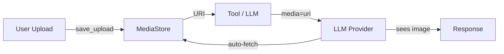
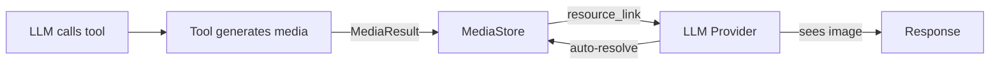

# Multimodal

> MCP Mesh agents can see images, read PDFs, and produce files. Media flows through the mesh as URIs — tools upload bytes to a shared MediaStore, and LLM providers fetch them automatically when needed.

MCP Mesh treats images, PDFs, and other files as first-class data. Rather than passing raw bytes between agents, media is stored once in a shared **MediaStore** and referenced by URI. Tools upload bytes and return lightweight `resource_link` references; LLM providers auto-fetch and convert media to each vendor's native format when they need to see it. Agents pass URI strings, not bytes — keeping agent-to-agent traffic small and working across languages and machines (with S3).

The sections below start with the two patterns you'll use most, then cover each building block: receiving web uploads, returning media from tools, passing media to LLMs, typing media parameters for multi-agent chains, per-provider capabilities, and storage configuration.

## Getting Started

The two most common multimodal patterns are a user uploading media for an LLM to analyze, and an LLM asking a tool to produce media.

### Story 1: User Uploads a Photo, LLM Analyzes It

A user uploads a photo of a restaurant receipt via HTTP POST. An LLM agent extracts the line items.

#### Web endpoint that receives the upload

=== "Python"

    ```python
    from fastapi import UploadFile
    import mesh

    @app.post("/upload")
    async def upload(file: UploadFile):
        uri = await mesh.save_upload(file)
        return {"uri": uri}
    ```

=== "TypeScript"

    ```typescript
    import { saveUpload } from "@mcpmesh/sdk";
    import multer from "multer";

    const upload = multer({ storage: multer.memoryStorage() });

    app.post("/upload", upload.single("file"), async (req, res) => {
      const uri = await saveUpload(req.file);
      res.json({ uri });
    });
    ```

=== "Java"

    ```java
    import io.mcpmesh.spring.media.MeshMedia;
    import io.mcpmesh.spring.media.MediaStore;
    import org.springframework.web.multipart.MultipartFile;

    @PostMapping("/upload")
    public Map<String, String> upload(
        @RequestParam("file") MultipartFile file,
        MediaStore mediaStore
    ) {
        String uri = MeshMedia.saveUpload(file, mediaStore);
        return Map.of("uri", uri);
    }
    ```

#### LLM agent that analyzes the image

=== "Python"

    ```python
    import mesh
    from fastmcp import FastMCP

    app = FastMCP("Receipt Analyzer")

    @app.tool()
    @mesh.llm(provider={"capability": "llm"})
    @mesh.tool(capability="receipt_analyzer")
    async def analyze(image_uri: str, llm: mesh.MeshLlmAgent = None) -> str:
        return await llm(
            "Extract all line items with prices from this receipt.",
            media=[image_uri],
        )

    @mesh.agent(name="receipt-analyzer", http_port=9010, auto_run=True)
    class ReceiptAgent:
        pass
    ```

=== "TypeScript"

    ```typescript
    import { FastMCP, mesh } from "@mcpmesh/sdk";
    import { z } from "zod";

    const server = new FastMCP({ name: "Receipt Analyzer", version: "1.0.0" });

    const llmTool = mesh.llm({
      provider: { capability: "llm" },
    });

    server.addTool({
      name: "analyze",
      ...llmTool,
      capability: "receipt_analyzer",
      parameters: z.object({ image_uri: z.string() }),
      execute: async ({ image_uri }, { llm }) => {
        return await llm("Extract all line items with prices from this receipt.", {
          media: [image_uri],
        });
      },
    });

    const agent = mesh(server, { name: "receipt-analyzer", httpPort: 9010 });
    ```

=== "Java"

    ```java
    @MeshAgent(name = "receipt-analyzer", port = 9010)
    @SpringBootApplication
    public class ReceiptAnalyzerApplication {
        @MeshLlm(providerSelector = @Selector(capability = "llm"))
        @MeshTool(capability = "receipt_analyzer")
        public String analyze(
            @Param("image_uri") String imageUri,
            MeshLlmAgent llm
        ) {
            return llm.request()
                .user("Extract all line items with prices from this receipt.")
                .media(imageUri)
                .generate();
        }
    }
    ```

#### Test it

```bash
# Upload a receipt photo
curl -X POST http://localhost:8080/upload -F "file=@receipt.jpg"
# Returns: {"uri": "s3://your-media-bucket/abc123.jpg"}

# Ask the LLM to analyze it
meshctl call receipt-analyzer analyze --params '{"image_uri": "s3://your-media-bucket/abc123.jpg"}'
# Returns: {"items": [{"name": "Burger", "price": 12.99}, ...]}
```

### Story 2: User Asks for a Chart, Agent Produces It

A user asks "chart Q3 revenue by region". An LLM calls a chart tool. The tool generates a PNG and returns it as a `resource_link`.

#### Chart tool that produces media

=== "Python"

    ```python
    import mesh
    from fastmcp import FastMCP

    app = FastMCP("Chart Agent")

    @app.tool()
    @mesh.tool(capability="charting", tags=["tools"])
    async def make_chart(query: str):
        png_bytes = render_chart(query)  # your rendering logic
        return await mesh.MediaResult(
            data=png_bytes,
            filename="chart.png",
            mime_type="image/png",
            name="Chart",
            description=query,
        )

    @mesh.agent(name="chart-agent", http_port=9020, auto_run=True)
    class ChartAgent:
        pass
    ```

=== "TypeScript"

    ```typescript
    import { FastMCP, mesh, createMediaResult } from "@mcpmesh/sdk";
    import { z } from "zod";

    const server = new FastMCP({ name: "Chart Agent", version: "1.0.0" });
    const agent = mesh(server, { name: "chart-agent", httpPort: 9020 });

    agent.addTool({
      name: "make_chart",
      capability: "charting",
      tags: ["tools"],
      parameters: z.object({ query: z.string() }),
      execute: async ({ query }) => {
        const png = renderChart(query);
        return await createMediaResult(png, "chart.png", "image/png", "Chart", query);
      },
    });
    ```

=== "Java"

    ```java
    @MeshAgent(name = "chart-agent", port = 9020)
    @SpringBootApplication
    public class ChartAgentApplication {
        @MeshTool(capability = "charting", tags = {"tools"})
        public ResourceLink makeChart(
            @Param("query") String query,
            MediaStore mediaStore
        ) {
            byte[] png = renderChart(query);
            return MeshMedia.mediaResult(
                png, "chart.png", "image/png",
                "Chart", query, mediaStore
            );
        }
    }
    ```

#### LLM agent that calls the chart tool

The LLM calls `make_chart`, gets back a `resource_link`, and the SDK auto-resolves the image so the LLM can describe it. No special media code needed on the LLM side.

=== "Python"

    ```python
    import mesh
    from fastmcp import FastMCP

    app = FastMCP("Analyst Agent")

    @app.tool()
    @mesh.llm(
        provider={"capability": "llm"},
        filter=[{"capability": "charting"}],
        max_iterations=3,
    )
    @mesh.tool(capability="analyst")
    async def analyze(question: str, llm: mesh.MeshLlmAgent = None) -> str:
        return await llm(f"Generate a chart and analyze it: {question}")

    @mesh.agent(name="analyst", http_port=9021, auto_run=True)
    class AnalystAgent:
        pass
    ```

=== "TypeScript"

    ```typescript
    import { FastMCP, mesh } from "@mcpmesh/sdk";
    import { z } from "zod";

    const server = new FastMCP({ name: "Analyst", version: "1.0.0" });

    const llmTool = mesh.llm({
      provider: { capability: "llm" },
      filter: [{ capability: "charting" }],
      maxIterations: 3,
    });

    server.addTool({
      name: "analyze",
      ...llmTool,
      capability: "analyst",
      parameters: z.object({ question: z.string() }),
      execute: async ({ question }, { llm }) => {
        return await llm(`Generate a chart and analyze it: ${question}`);
      },
    });

    const agent = mesh(server, { name: "analyst", httpPort: 9021 });
    ```

=== "Java"

    ```java
    @MeshAgent(name = "analyst", port = 9021)
    @SpringBootApplication
    public class AnalystApplication {
        @MeshLlm(
            providerSelector = @Selector(capability = "llm"),
            filter = @Selector(capability = "charting"),
            maxIterations = 3
        )
        @MeshTool(capability = "analyst")
        public String analyze(
            @Param("question") String question,
            MeshLlmAgent llm
        ) {
            return llm.request()
                .user("Generate a chart and analyze it: " + question)
                .generate();
        }
    }
    ```

#### Test it

```bash
meshctl call analyst analyze --params '{"question": "Chart Q3 revenue by region"}'
# Returns: {"answer": "Here is the Q3 revenue chart...", "chart_url": "s3://your-media-bucket/chart-xxx.png"}
```

### How It Works

**Upload flow** -- user provides media, LLM consumes it:



**Production flow** -- tool generates media, LLM sees it automatically:



Key points:

- Media is stored as bytes in MediaStore (local filesystem or S3)
- Agents pass URIs, not bytes -- lightweight and network-efficient
- LLM providers auto-fetch media when they see `resource_link` objects or `media=` URIs
- Works across agents in different languages and on different machines (with S3)

## Web Uploads

The most common way media enters the mesh is through a user upload. Use the framework helpers to receive files and store them in MediaStore.

### End-to-End Example

Upload an image via HTTP, then analyze it with an LLM:

=== "Python"

    ```python
    @app.post("/analyze")
    async def analyze_upload(file: UploadFile, question: str):
        uri = await mesh.save_upload(file)
        result = await call_tool("image_analyzer", {
            "question": question,
            "image": uri,
        })
        return {"analysis": result}
    ```

=== "TypeScript"

    ```typescript
    app.post("/analyze", upload.single("file"), async (req, res) => {
      const uri = await saveUpload(req.file);
      const result = await callTool("image_analyzer", {
        question: req.body.question,
        image: uri,
      });
      res.json({ analysis: result });
    });
    ```

### FastAPI (Python)

```python
from fastapi import UploadFile
import mesh

@app.post("/upload")
async def upload(file: UploadFile):
    uri = await mesh.save_upload(file)
    return {"uri": uri}
```

#### With Full Metadata

```python
result = await mesh.save_upload_result(file)
# result.uri = "file:///tmp/mcp-mesh-media/media/photo.jpg"
# result.name = "photo.jpg"
# result.mime_type = "image/jpeg"
# result.size = 12345
```

#### Parameters

| Parameter   | Type          | Description           |
| ----------- | ------------- | --------------------- |
| `upload`    | `UploadFile`  | FastAPI upload object |
| `filename`  | `str \| None` | Override filename     |
| `mime_type` | `str \| None` | Override MIME type    |

### Express (TypeScript)

Using multer for file uploads:

```typescript
import { saveUpload, saveUploadResult } from "@mcpmesh/sdk";
import multer from "multer";

const upload = multer({ storage: multer.memoryStorage() });

app.post("/upload", upload.single("file"), async (req, res) => {
  const uri = await saveUpload(req.file);
  res.json({ uri });
});
```

#### With Full Metadata

```typescript
const result = await saveUploadResult(req.file);
// result.uri, result.name, result.mimeType, result.size
```

### Spring Boot (Java)

```java
import org.springframework.web.multipart.MultipartFile;
import io.mcpmesh.spring.media.MeshMedia;
import io.mcpmesh.spring.media.MediaStore;

@PostMapping("/upload")
public Map<String, String> upload(
    @RequestParam("file") MultipartFile file,
    MediaStore mediaStore
) {
    String uri = MeshMedia.saveUpload(file, mediaStore);
    return Map.of("uri", uri);
}
```

#### With Full Metadata

```java
MediaUploadResult result = MeshMedia.saveUploadResult(file, mediaStore);
// result.uri(), result.name(), result.mimeType(), result.size()
```

Once you have a URI from `save_upload()`, pass it to tools via [MediaParam](#mediaparam) or directly via the `media=` parameter. See [Returning Media](#returning-media) for the reverse direction -- producing media from tools.

## Returning Media

When a tool generates an image, chart, or document, use `MediaResult` to upload the bytes and return a `resource_link`. LLM providers auto-resolve these links -- no manual fetching needed.

### MediaResult (Recommended)

The simplest approach — upload + return in one step:

=== "Python"

    ```python
    @mesh.tool(capability="chart_gen")
    async def generate_chart(query: str):
        png_bytes = render_chart(query)
        return await mesh.MediaResult(
            data=png_bytes,
            filename="chart.png",
            mime_type="image/png",
            name="Sales Chart",
            description="Q3 revenue chart",
        )
    ```

    | Parameter | Type | Description |
    | --- | --- | --- |
    | `data` | `bytes` | Raw binary content |
    | `filename` | `str` | Filename for storage |
    | `mime_type` | `str` | MIME type (e.g., `"image/png"`) |
    | `name` | `str \| None` | Display name (defaults to filename) |
    | `description` | `str \| None` | Optional description |

=== "TypeScript"

    ```typescript
    import { createMediaResult } from "@mcpmesh/sdk";

    agent.addTool({
      name: "generate_chart",
      capability: "chart_gen",
      parameters: z.object({ query: z.string() }),
      execute: async ({ query }) => {
        const png = renderChart(query);
        return await createMediaResult(
          png, "chart.png", "image/png", "Sales Chart", "Q3 revenue chart"
        );
      },
    });
    ```

=== "Java"

    ```java
    @MeshTool(capability = "chart_gen")
    public ResourceLink generateChart(
        @Param("query") String query,
        MediaStore mediaStore
    ) {
        byte[] png = renderChart(query);
        return MeshMedia.mediaResult(
            png, "chart.png", "image/png",
            "Sales Chart", "Q3 revenue chart",
            mediaStore
        );
    }
    ```

### Two-Step: upload_media + media_result

For more control, upload first, then create the link:

=== "Python"

    ```python
    uri = await mesh.upload_media(png_bytes, "chart.png", "image/png")
    return mesh.media_result(
        uri=uri,
        name="Sales Chart",
        mime_type="image/png",
        description="Q3 revenue",
        size=len(png_bytes),
    )
    ```

=== "TypeScript"

    ```typescript
    import { uploadMedia, mediaResult } from "@mcpmesh/sdk";

    const uri = await uploadMedia(png, "chart.png", "image/png");
    return mediaResult(uri, "Sales Chart", "image/png", "Q3 revenue", png.length);
    ```

=== "Java"

    ```java
    String uri = mediaStore.upload(png, "chart.png", "image/png");
    return MeshMedia.mediaResult(uri, "Sales Chart", "image/png", "Q3 chart", (long) png.length);
    ```

### Resource Link Format

Tools return media as MCP `resource_link` content:

```json
{
  "type": "resource_link",
  "uri": "file:///tmp/mcp-mesh-media/media/chart.png",
  "name": "Sales Chart",
  "mimeType": "image/png",
  "description": "Q3 revenue chart",
  "_meta": { "size": 45678 }
}
```

When an LLM agent receives this in a tool result, the SDK automatically fetches the URI from MediaStore and converts it to the provider's native format. See [Provider Support](#provider-support) for which MIME types each LLM vendor supports.

## LLM Media Input

Once media is in the mesh -- uploaded by a user or produced by a tool -- pass it to an LLM using the `media` parameter.

### Basic Usage

=== "Python"

    ```python
    @mesh.llm(provider={"capability": "llm"})
    @mesh.tool(capability="analyzer")
    async def analyze(question: str, llm: mesh.MeshLlmAgent = None) -> str:
        # Single image URI
        return await llm("Describe this image", media=["file:///tmp/photo.png"])

        # Raw bytes
        return await llm("What is this?", media=[(png_bytes, "image/png")])

        # Multiple items
        return await llm("Compare these", media=[
            "file:///tmp/a.png",
            "s3://bucket/b.jpg",
        ])
    ```

=== "TypeScript"

    ```typescript
    execute: async ({ question }, { llm }) => {
      // Single URI
      return await llm("Describe this image", {
        media: ["file:///tmp/photo.png"],
      });

      // Buffer
      return await llm("What is this?", {
        media: [{ data: pngBuffer, mimeType: "image/png" }],
      });

      // Multiple items
      return await llm("Compare these", {
        media: ["file:///tmp/a.png", "s3://bucket/b.jpg"],
      });
    }
    ```

=== "Java"

    ```java
    return llm.request()
        .user("Describe this image")
        .media(imageUri)
        .generate();
    ```

### Media Item Types

=== "Python"

    Each item in the `media` list can be:

    | Type | Format | Example |
    | --- | --- | --- |
    | URI string | `str` | `"file:///tmp/photo.png"` |
    | Bytes tuple | `tuple[bytes, str]` | `(png_bytes, "image/png")` |

=== "TypeScript"

    Each item in the `media` array can be:

    | Type | Format | Example |
    | --- | --- | --- |
    | URI string | `string` | `"file:///tmp/photo.png"` |
    | Buffer object | `{ data: Buffer, mimeType: string }` | `{ data: pngBuffer, mimeType: "image/png" }` |

### Automatic Resource Link Resolution

When an LLM calls a tool that returns a `resource_link`, the SDK resolves it automatically -- the LLM provider fetches the media bytes and converts them to the vendor's native format. No `media=` parameter is needed for tool-returned media. See [Getting Started](#getting-started) for the full flow.

### Reading Media in Agents

When an agent receives a media URI (e.g., from a tool parameter or another agent) and needs to read the actual bytes — not pass it to an LLM — use `download_media`:

=== "Python"

    ```python
    data, mime_type = await mesh.download_media("s3://mcp-mesh-media/media/report.csv")
    ```

=== "TypeScript"

    ```typescript
    import { downloadMedia } from "@mcpmesh/sdk";
    const { data, mimeType } = await downloadMedia("s3://mcp-mesh-media/media/report.csv");
    ```

=== "Java"

    ```java
    MediaFetchResult result = MeshMedia.downloadMedia(uri, mediaStore);
    byte[] data = result.data();
    ```

This reads from the same MediaStore backend (local or S3) that `upload_media` wrote to.

## MediaParam

In multi-agent chains, LLMs need to know which tool parameters accept media URIs. `MediaParam` type hints annotate your tool schema so media is routed to the right place.

### Usage

=== "Python"

    ```python
    @mesh.tool(capability="image_analyzer")
    async def analyze(
        question: str,
        image: mesh.MediaParam("image/*") = None,
        document: mesh.MediaParam("application/pdf") = None,
        llm: mesh.MeshLlmAgent = None,
    ) -> str:
        media = []
        if image:
            media.append(image)
        if document:
            media.append(document)
        return await llm(question, media=media)
    ```

=== "TypeScript"

    ```typescript
    import { mediaParam } from "@mcpmesh/sdk";

    agent.addTool({
      name: "analyze",
      capability: "image_analyzer",
      parameters: z.object({
        question: z.string(),
        image: mediaParam("image/*"),
        document: mediaParam("application/pdf"),
      }),
      execute: async ({ question, image, document }, { llm }) => {
        const media = [image, document].filter(Boolean);
        return await llm(question, { media });
      },
    });
    ```

=== "Java"

    ```java
    @MeshTool(capability = "image_analyzer")
    public String analyze(
        @Param("question") String question,
        @MediaParam("image/*") @Param("image") String imageUri,
        @MediaParam("application/pdf") @Param("document") String documentUri,
        MeshLlmAgent llm
    ) {
        // Use imageUri / documentUri with LLM
        return llm.request().user(question).media(imageUri).generate();
    }
    ```

### MIME Type Patterns

| Pattern             | Accepts                                 |
| ------------------- | --------------------------------------- |
| `"image/*"`         | Any image (PNG, JPEG, GIF, WebP)        |
| `"application/pdf"` | PDF documents                           |
| `"text/*"`          | Text files (plain, CSV, markdown, HTML) |
| `"*/*"`             | Any media type (default)                |

### How MediaParam Annotates the Schema

`MediaParam` adds `x-media-type` to the parameter's JSON schema:

```json
{
  "type": "object",
  "properties": {
    "question": { "type": "string" },
    "image": {
      "type": "string",
      "x-media-type": "image/*",
      "description": "Media URI for this parameter (accepts media URI: image/*)"
    }
  }
}
```

When an LLM discovers this tool via the mesh, it sees the `x-media-type` annotation and knows to pass media URIs to that parameter.

### Multi-Agent Media Flow

`MediaParam` enables media to flow through multi-agent chains:

```
User uploads image
    -> Web API saves to MediaStore -> URI
        -> Calls router tool with image=URI
            -> Router LLM passes URI to analyzer tool (sees x-media-type)
                -> Analyzer LLM resolves URI -> sees actual image
```

Each agent in the chain passes the URI string. Only the final LLM agent resolves the URI to actual bytes.

## Provider Support

What each LLM provider supports for multimodal content. The MCP Mesh SDK automatically converts media to each provider's native format, but capabilities vary.

### Support Matrix

| Content Type | Claude | OpenAI | Gemini |
| --- | --- | --- | --- |
| **Images** (PNG, JPEG, GIF, WebP) | Native image blocks | image_url (base64) | image_url (base64) |
| **PDF** | Native document blocks | Text extraction fallback | Text extraction fallback |
| **Text files** (plain, CSV, MD, HTML, JSON) | Text content blocks | Text content blocks | Text content blocks |
| **Images in tool results** | Inline in tool message | Separate user message | Separate user message |

### Image Handling

All three providers support images, but with different mechanics:

#### Claude (Anthropic)

- Images supported in both user messages and tool result messages
- Native `image` content blocks with base64 encoding
- Supports PNG, JPEG, GIF, WebP
- Best multimodal experience -- images appear inline with tool results

#### OpenAI

- Images supported in user messages only
- Uses `image_url` content blocks with base64 data URIs
- When a tool returns an image, the SDK sends it as a follow-up user message
- Supports PNG, JPEG, GIF, WebP

#### Gemini

- Similar to OpenAI -- images in user messages only
- Uses `image_url` format compatible with OpenAI
- Tool result images sent as follow-up user messages

!!! tip "Claude is Recommended for Media-Heavy Workloads"
    Claude provides the best multimodal experience because it supports images directly in tool result messages. This means the LLM sees the image in context with the tool output, rather than as a separate message.

### PDF Handling

| Provider | Support |
| --- | --- |
| **Claude** | Native `document` blocks -- full PDF understanding |
| **OpenAI** | Text extraction fallback (first 50,000 characters) |
| **Gemini** | Text extraction fallback (first 50,000 characters) |

### Text File Handling

All providers receive text files as plain text content blocks. Files are decoded as UTF-8 (with Latin-1 fallback) and truncated to 50,000 characters.

Supported text MIME types:

- `text/plain`, `text/csv`, `text/markdown`, `text/html`, `text/xml`
- `application/json`, `application/xml`, `application/csv`

### Provider Selection for Multimodal

When building multimodal agents, select providers based on your media needs:

=== "Python"

    ```python
    # Prefer Claude for image-heavy workloads
    @mesh.llm(
        provider={"capability": "llm", "tags": ["+claude"]},
        filter=[{"capability": "chart_gen"}],
    )
    ```

=== "TypeScript"

    ```typescript
    mesh.llm({
      provider: { capability: "llm", tags: ["+claude"] },
      filter: [{ capability: "chart_gen" }],
    })
    ```

=== "Java"

    ```java
    @MeshLlm(
        providerSelector = @Selector(capability = "llm", tags = {"+claude"}),
        filter = @Selector(capability = "chart_gen")
    )
    ```

For full LLM documentation, see [LLM Integration (Python)](../python/llm/index.md).

## Storage Configuration

MediaStore handles where media bytes are saved. For local development, the defaults work -- no configuration needed. Configure storage explicitly when deploying to Docker, Kubernetes, or any environment where agents run on different machines.

Two backends are available:

| Backend             | Best For                    | URI Format                                   |
| ------------------- | --------------------------- | -------------------------------------------- |
| **Local** (default) | Development, single-machine | `file:///tmp/mcp-mesh-media/media/chart.png` |
| **S3**              | Production, multi-agent     | `s3://my-media-bucket/media/chart.png`       |

### Local Filesystem (Default)

No configuration needed for development. Files are stored at `/tmp/mcp-mesh-media/media/` by default.

```bash
# Optional — customize the path
export MCP_MESH_MEDIA_STORAGE=local
export MCP_MESH_MEDIA_STORAGE_PATH=/var/lib/mcp-mesh-media
export MCP_MESH_MEDIA_STORAGE_PREFIX=media/
```

!!! tip "Shared Storage for Multi-Agent"
    When running multiple agents locally, they all share the same filesystem, so local storage works out of the box. In Docker or Kubernetes, use S3 or a shared volume.

### S3 / S3-Compatible (Production)

For production deployments with MinIO, AWS S3, or any S3-compatible service:

=== "Environment Variables"

    ```bash
    export MCP_MESH_MEDIA_STORAGE=s3
    export MCP_MESH_MEDIA_STORAGE_BUCKET=my-media-bucket     # required for s3 — no default
    export MCP_MESH_MEDIA_STORAGE_ENDPOINT=http://minio:9000  # omit for AWS
    export MCP_MESH_MEDIA_STORAGE_PREFIX=media/
    # Standard AWS credentials
    export AWS_ACCESS_KEY_ID=minioadmin
    export AWS_SECRET_ACCESS_KEY=minioadmin
    ```

=== "Java (application.yml)"

    ```yaml
    mesh:
      media:
        storage: s3
        storageBucket: my-media-bucket   # required for s3 — no default
        storageEndpoint: http://minio:9000
        storagePrefix: media/
    ```

=== "Docker Compose (MinIO)"

    ```yaml
    services:
      minio:
        image: minio/minio:latest
        command: server /data --console-address ":9001"
        ports:
          - "9000:9000"
          - "9001:9001"
        environment:
          MINIO_ROOT_USER: minioadmin
          MINIO_ROOT_PASSWORD: minioadmin
    ```

#### S3 Dependencies

=== "Python"

    ```bash
    pip install boto3
    ```

=== "TypeScript"

    ```bash
    npm install @aws-sdk/client-s3
    ```

    The SDK lazy-loads `@aws-sdk/client-s3` only when the S3 backend is configured.

=== "Java"

    S3 client is included in `mcp-mesh-spring-boot-starter`. No additional dependency needed.

### Storage Environment Variables

| Variable                          | Default                   | Description                                        |
| --------------------------------- | ------------------------- | -------------------------------------------------- |
| `MCP_MESH_MEDIA_STORAGE`          | `local`                   | Backend: `local` or `s3`                           |
| `MCP_MESH_MEDIA_STORAGE_PATH`     | `/tmp/mcp-mesh-media`     | Local filesystem base path                         |
| `MCP_MESH_MEDIA_STORAGE_BUCKET`   | _(required for s3 — no default)_ | S3 bucket name — must be set when backend is `s3`  |
| `MCP_MESH_MEDIA_STORAGE_ENDPOINT` | _(none)_                  | S3-compatible endpoint URL                         |
| `MCP_MESH_MEDIA_STORAGE_PREFIX`   | `media/`                  | Key/directory prefix                               |
| `MCP_MESH_MEDIA_STORAGE_VALIDATE` | `false`                   | When `true`, run a `head_bucket` probe at startup  |
| `AWS_ACCESS_KEY_ID`               | _(none)_                  | S3 access key (or use an IAM role)                 |
| `AWS_SECRET_ACCESS_KEY`           | _(none)_                  | S3 secret key (or use an IAM role)                 |

!!! warning "S3 fails fast at startup"
    There is **no default bucket**. When `MCP_MESH_MEDIA_STORAGE=s3`, the agent fails fast at construction: a missing `boto3` raises `RuntimeError`, and an unset `MCP_MESH_MEDIA_STORAGE_BUCKET` raises `ValueError` (a silent default would let a typo produce confusing 404s at first use). Set `MCP_MESH_MEDIA_STORAGE_VALIDATE=true` to additionally run an inexpensive `head_bucket` probe that confirms credentials and bucket reachability before the agent starts serving traffic — it is opt-in so CI/local-dev environments without real AWS credentials keep working.

### Distributed Deployment

In multi-agent deployments (Docker, Kubernetes), local filesystem storage does not work across containers. A `file:///tmp/...` URI produced by one container is inaccessible to another. Use S3 or MinIO for any deployment where agents run in separate processes or containers.

#### Which Agents Need S3 Config?

| Agent Role                          | Needs S3?              | Why                                                            |
| ----------------------------------- | ---------------------- | -------------------------------------------------------------- |
| **Producer** (uploads media)        | Yes -- WRITE           | Calls `upload_media()` / `MediaResult`                         |
| **LLM Provider** (resolves media)   | Yes -- READ            | Fetches `resource_link` URIs to show the LLM the image         |
| **Router / Consumer** (passes URIs) | Optional               | Just passes URI strings through -- no MediaStore access needed |
| **Expert** (receives URI params)    | Only if using `media=` | Needs READ access if it passes media to its own LLM call       |

#### MinIO for Local Development

```yaml
# docker-compose.yml
services:
  minio:
    image: minio/minio:latest
    command: server /data --console-address ":9001"
    ports:
      - "9000:9000"
      - "9001:9001" # Console UI
    environment:
      MINIO_ROOT_USER: minioadmin
      MINIO_ROOT_PASSWORD: minioadmin

  createbucket:
    image: minio/mc
    depends_on: [minio]
    entrypoint: >
      /bin/sh -c "
      mc alias set local http://minio:9000 minioadmin minioadmin;
      mc mb local/my-media-bucket --ignore-existing;
      "
```

#### Kubernetes

Add the following environment variables to every agent deployment that needs media access:

```yaml
env:
  - name: MCP_MESH_MEDIA_STORAGE
    value: "s3"
  - name: MCP_MESH_MEDIA_STORAGE_BUCKET
    value: "my-media-bucket"
  - name: MCP_MESH_MEDIA_STORAGE_ENDPOINT
    value: "http://minio:9000"
  - name: AWS_ACCESS_KEY_ID
    valueFrom:
      secretKeyRef:
        name: minio-credentials
        key: access-key
  - name: AWS_SECRET_ACCESS_KEY
    valueFrom:
      secretKeyRef:
        name: minio-credentials
        key: secret-key
```

### Security

- **Path traversal protection** -- Local storage validates all paths against directory traversal attacks
- **S3 credentials** -- Use IAM roles or environment variables; never hardcode
- **Storage isolation** -- Each deployment's media is isolated by the configured prefix

For the full configuration reference, see [Environment Variables](../environment-variables.md).
