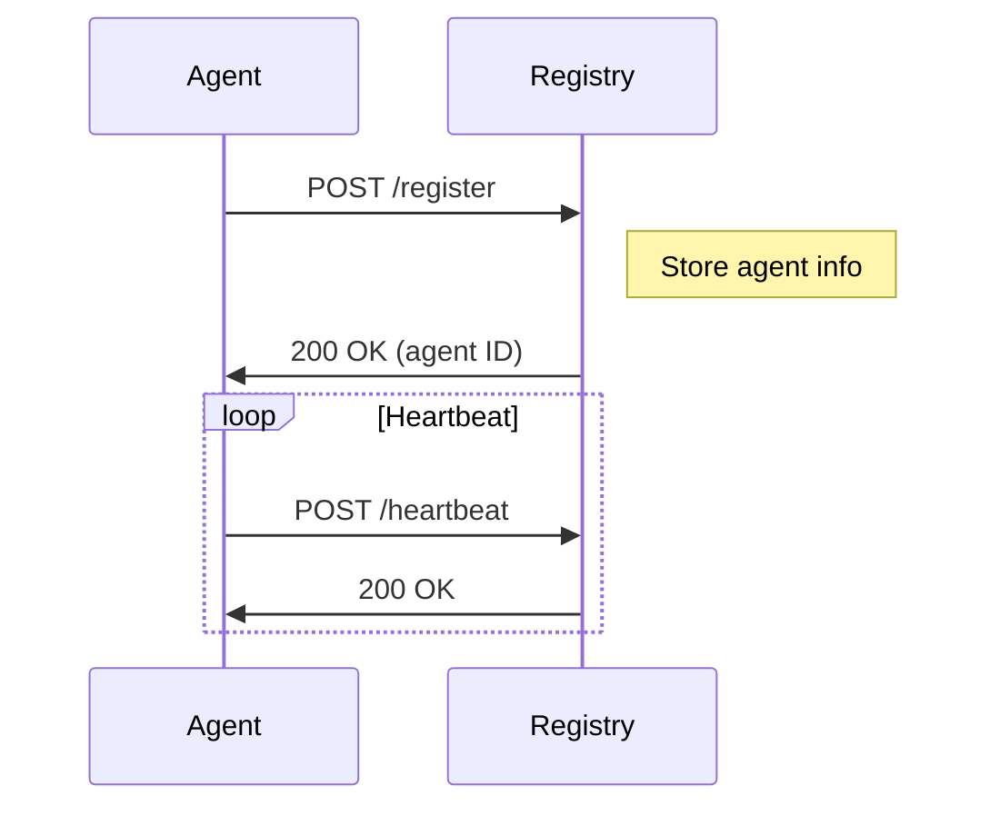
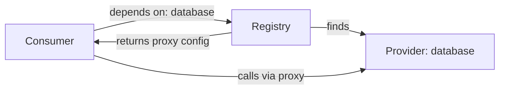

# Registry

> Central coordination point for agent discovery

## Overview

The registry is the brain of MCP Mesh:

- Tracks all registered agents
- Resolves capability dependencies
- Manages health status
- Provides discovery endpoints

## Automatic Startup

The registry starts automatically when you run your first agent:

```bash
meshctl start my_agent.py
# Registry starts automatically on port 8000
```

## Manual Startup

For custom configurations:

```bash
meshctl registry start --port 8000 --host 0.0.0.0
```

## Registry API

### List Agents

```bash
curl http://localhost:8000/agents
```

Response:

```json
{
  "agents": [
    {
      "name": "my-agent",
      "host": "localhost",
      "port": 9090,
      "capabilities": {
        "greeting": {
          "version": "1.0.0",
          "tags": ["social"]
        }
      },
      "status": "healthy"
    }
  ]
}
```

### Get Agent Status

```bash
curl http://localhost:8000/agents/my-agent
```

### Health Check

```bash
curl http://localhost:8000/health
```

## Agent Registration

Agents auto-register on startup:



### Registration Payload

```json
{
  "name": "my-agent",
  "host": "localhost",
  "port": 9090,
  "namespace": "default",
  "capabilities": {
    "greeting": {
      "version": "1.0.0",
      "tags": ["social", "basic"],
      "dependencies": []
    }
  }
}
```

## Dependency Resolution

When an agent registers with dependencies:

1. Registry receives registration with `dependencies`
2. Finds agents providing those capabilities
3. Returns proxy configurations to consumer
4. Consumer uses proxies to call providers



## Configuration

### Environment Variables

```bash
# Registry host/port
export MCP_MESH_REGISTRY_URL=http://localhost:8000

# Custom registry host
export MCP_MESH_REGISTRY_HOST=0.0.0.0
export MCP_MESH_REGISTRY_PORT=8000

# Health check settings
export MCP_MESH_HEALTH_INTERVAL=30
export MCP_MESH_HEALTH_TTL=90
```

### Docker Compose

```yaml
services:
  registry:
    image: mcpmesh/registry:latest
    ports:
      - "8000:8000"
    environment:
      - MCP_MESH_REGISTRY_HOST=0.0.0.0
      - MCP_MESH_HEALTH_INTERVAL=30

  my-agent:
    build: ./my-agent
    environment:
      - MCP_MESH_REGISTRY_URL=http://registry:8000
    depends_on:
      - registry
```

## Namespaces

Namespaces isolate agents:

```python
# Production namespace
@mesh.agent(name="api", namespace="production")

# Development namespace
@mesh.agent(name="api", namespace="development")
```

Agents only discover others in the same namespace.

## High Availability

For production, run multiple registry instances:

```yaml
# docker-compose.yml
services:
  registry-1:
    image: mcpmesh/registry:latest
    ports:
      - "8000:8000"

  registry-2:
    image: mcpmesh/registry:latest
    ports:
      - "8001:8000"

  # Load balancer in front
```

## Troubleshooting

### Agent Not Registering

```bash
# Check registry is running
curl http://localhost:8000/health

# Check agent logs
meshctl start my_agent.py --log-level debug
```

### Dependency Not Found

```bash
# List all agents
curl http://localhost:8000/agents | jq '.agents[] | {name, capabilities: (.capabilities | keys)}'

# Check capability exists
curl http://localhost:8000/agents | jq '.agents[] | select(.capabilities.my_capability)'
```

### Wrong Namespace

```bash
# Check agent namespace
curl http://localhost:8000/agents | jq '.agents[] | {name, namespace}'
```

## See Also

- [Architecture](architecture.md) - System overview
- [Health & Discovery](health-discovery.md) - Health system
- [Environment Variables](../environment-variables.md) - All config options
