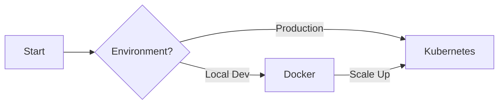

# Deployment

> Choose the right deployment method for your environment

## Overview

MCP Mesh supports multiple deployment options to fit your infrastructure needs. Whether you're developing locally or deploying to production Kubernetes clusters, MCP Mesh has you covered.

---

## Deployment Options

<div class="grid-features" markdown>
<div class="feature-card" markdown>
### :material-docker: Docker

**Best for**: Local development, testing, simple deployments

- Quick setup with Docker Compose
- Pre-built images available
- Auto-generated compose files with `meshctl scaffold`
- Great for development and CI/CD

```bash
# Quick start
meshctl scaffold --name my-agent --compose
docker-compose up
```

[:material-arrow-right: Docker Guide](03-docker-deployment.md){ .md-button }

</div>

<div class="feature-card recommended" markdown>
### :material-kubernetes: Kubernetes :material-star:{ .recommended-star }

**Best for**: Production deployments (Recommended)

- Production-ready Helm charts
- Horizontal pod autoscaling
- Built-in observability (Grafana, Tempo)
- Multi-environment support

```bash
# Quick start (OCI registry - no helm repo add needed)
helm install mcp-registry oci://ghcr.io/dhyansraj/mcp-mesh/mcp-mesh-registry \
  --version 0.7.14 -n mcp-mesh --create-namespace
```

[:material-arrow-right: Kubernetes Guide](04-kubernetes-basics.md){ .md-button .md-button--primary }

</div>
</div>

---

## Quick Comparison

| Feature              | Docker                   | Kubernetes                            |
| -------------------- | ------------------------ | ------------------------------------- |
| **Setup Complexity** | :material-star: Easy     | :material-star::material-star: Medium |
| **Production Ready** | :material-close: Limited | :material-check-all: Yes              |
| **Scaling**          | Manual                   | Automatic (HPA)                       |
| **Observability**    | Optional                 | Built-in                              |
| **Best Use Case**    | Development              | Production                            |

---

## Which Should I Choose?

### Use Docker if you want to:

- Get started quickly with minimal setup
- Develop and test locally
- Run a simple proof-of-concept
- Use Docker Compose for orchestration

### Use Kubernetes if you want to:

- Deploy to production
- Scale agents independently
- Use enterprise features (monitoring, tracing)
- Follow GitOps practices

!!! tip "Recommendation"
For **production deployments**, we strongly recommend **Kubernetes with Helm charts**. They include battle-tested configurations, built-in observability, and follow Kubernetes best practices.

---

## Deployment Path



---

## Next Steps

- **[Docker Deployment](03-docker-deployment.md)** - Start here for local development
- **[Kubernetes Deployment](04-kubernetes-basics.md)** - Production-ready deployment with Helm
