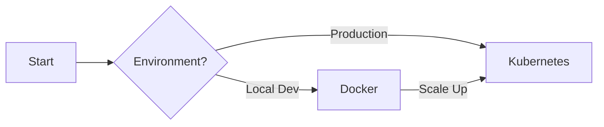

# Deployment

> Choose the right deployment method for your environment

## Overview

MCP Mesh supports multiple deployment options to fit your infrastructure needs. Whether you're developing locally or deploying to production Kubernetes clusters, MCP Mesh has you covered.

---

## Deployment Options

<div class="grid-features" markdown>
<div class="feature-card" markdown>
### :material-docker: Docker

**Best for**: Local development, testing, simple deployments

- Quick setup with Docker Compose
- Pre-built images available
- Auto-generated compose files with `meshctl scaffold`
- Great for development and testing

```bash
# Quick start
meshctl scaffold --name my-agent --compose
docker-compose up
```

[:material-arrow-right: Docker Guide](03-docker-deployment.md){ .md-button }

</div>

<div class="feature-card recommended" markdown>
### :material-kubernetes: Kubernetes :material-star:{ .recommended-star }

**Best for**: Production deployments (Recommended)

- Helm charts
- Horizontal pod autoscaling
- Built-in observability (Grafana, Tempo)
- Multi-environment support

```bash
# Quick start (OCI registry - no helm repo add needed)
helm install mcp-registry oci://ghcr.io/dhyansraj/mcp-mesh/mcp-mesh-registry \
  --version 1.4.1 -n mcp-mesh --create-namespace
```

[:material-arrow-right: Kubernetes Guide](04-kubernetes-basics.md){ .md-button .md-button--primary }

</div>
</div>

---

## Quick Comparison

| Feature              | Docker                   | Kubernetes                            |
| -------------------- | ------------------------ | ------------------------------------- |
| **Setup Complexity** | :material-star: Easy     | :material-star::material-star: Medium |
| **Production Ready** | :material-close: Limited | :material-check-all: Yes              |
| **Scaling**          | Manual                   | Automatic (HPA)                       |
| **Observability**    | Built-in (opt-in)        | Built-in (opt-in)                     |
| **Best Use Case**    | Development              | Production                            |

---

## Which Should I Choose?

### Use Docker if you want to:

- Get started quickly with minimal setup
- Develop and test locally
- Run a simple proof-of-concept
- Use Docker Compose for orchestration

### Use Kubernetes if you want to:

- Deploy to production
- Scale agents independently
- Use enterprise features (monitoring, tracing)
- Follow GitOps practices

!!! tip "Recommendation"
For **production deployments**, we strongly recommend **Kubernetes with Helm charts**. They include tested configurations, built-in observability, and follow Kubernetes best practices.

---

## Deployment Path


```mermaid
graph LR
    A[Start] --> B{Environment?}
    B -->|Local Dev| C[Docker]
    B -->|Production| D[Kubernetes]
    C -->|Scale Up| D
```

---

## Security & Governance

MCP Mesh provides built-in security features for production deployments.

### TLS Encryption

Enable mutual TLS between agents and the registry:

```bash
# Local development with auto-generated certificates
meshctl start --registry-only --tls-auto -d
meshctl start my_agent.py
```

For Kubernetes, configure TLS via Helm values:

```bash
helm install mcp-registry oci://ghcr.io/dhyansraj/mcp-mesh/mcp-mesh-registry \
  --version 1.4.1 -n mcp-mesh --create-namespace \
  --set registry.security.tls.mode=strict \
  --set registry.security.trust.backend=k8s-secrets
```

### Entity Trust

Control which organizations' agents can join the mesh using entity CA certificates:

```bash
meshctl entity register "partner-corp" --ca-cert /path/to/partner-ca.pem
meshctl entity list
meshctl entity revoke "partner-corp" --force
meshctl entity rotate  # Trigger re-verification
```

### Certificate Rotation

Rotate certificates without downtime — agents re-register on their next heartbeat:

```bash
meshctl entity rotate                    # All agents re-register
meshctl entity rotate "partner-corp"     # Specific entity only
```

Agents with revoked certificates are automatically evicted in strict TLS mode.

### Admin Port Isolation

Separate admin APIs from the agent-facing port for defense in depth:

```bash
# Registry listens on 8000 (agents) and 8001 (admin only)
MCP_MESH_ADMIN_PORT=8001 mcp-mesh-registry
```

[:material-arrow-right: Security Guide](meshctl-cli.md){ .md-button } — Run `meshctl man security` for the full security reference.

---

## Next Steps

- **[Docker Deployment](03-docker-deployment.md)** - Start here for local development
- **[Kubernetes Deployment](04-kubernetes-basics.md)** - Deployment with Helm
- **Security** - Run `meshctl man security` for TLS, entity trust, and certificate management
