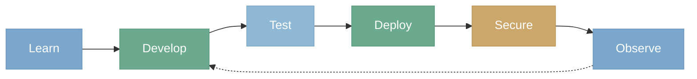

# From Dev to Production

MCP Mesh covers every phase of the agent lifecycle — from first scaffold to production observability.



---

## Learn

```bash
meshctl --help              # All available commands
meshctl man                 # Built-in documentation for every feature
meshctl man llm             # Deep dive into any topic
meshctl man llm --java      # Language-specific variants
```

Documentation: [mcp-mesh.ai](https://mcp-mesh.ai) | CLI: `meshctl man <topic>` | YouTube: [youtube.com/@MCPMesh](https://www.youtube.com/@MCPMesh)

---

## Develop

```bash
meshctl scaffold --name my-agent --agent-type tool        # Generate agent
meshctl scaffold --name my-llm --agent-type llm-agent     # Generate LLM agent
meshctl scaffold --name my-api --agent-type llm-provider  # Generate provider

meshctl start --registry-only -d                          # Start registry
meshctl start my-agent -d                                 # Start agent (detached)
meshctl start my-agent --watch                            # Auto-restart on changes

meshctl list                                              # See registered agents
meshctl list --tools                                      # See available tools
meshctl status                                            # Agent health and dependencies
meshctl call greet --params '{"name": "World"}'           # Call a tool
meshctl logs my-agent                                     # View agent logs
```

Guide: [Local Development](02-local-development.md) | Reference: [meshctl CLI](cli/index.md)

---

## Test

```bash
meshctl call my-tool --params '{"input": "test"}'         # Call tools directly
meshctl call my-tool --trace                              # Call with tracing
meshctl trace <trace-id>                                  # View call tree
```

**Zero-config mocking.** Need to test against a payment service that isn't ready yet? Start a mock agent locally with the same capability name — the mesh wires it in automatically. No mock frameworks inside your code, no test configurations to manage, no risk of mock code reaching production. Your mock is just another agent on the mesh, and since it's not in your CI/CD pipeline, it can't accidentally ship. Compare this to traditional mocking (Spring `@MockBean`, Python `unittest.mock`) where mock code lives alongside production code and a misconfiguration silently executes the wrong path.

The [TSuite](https://github.com/dhyansraj/mcp-mesh-test-suite) integration testing framework runs 300+ tests across Python, TypeScript, and Java using this approach.

---

## Deploy

=== "Docker Compose"

    ```bash
    meshctl scaffold --compose                    # Generate docker-compose.yml
    meshctl scaffold --compose --observability    # With Grafana/Tempo/Redis
    docker compose up -d
    ```

=== "Kubernetes"

    ```bash
    helm install mcp-core oci://ghcr.io/dhyansraj/mcp-mesh/mcp-mesh-core \
      --version 1.4.1 -n mcp-mesh --create-namespace

    helm install my-agent oci://ghcr.io/dhyansraj/mcp-mesh/mcp-mesh-agent \
      --version 1.4.1 -n mcp-mesh -f helm-values.yaml
    ```

Same agent code runs locally, in Docker, and in Kubernetes — no changes needed.

Guide: [Deployment Patterns](deployment.md) | [Kubernetes](04-kubernetes-basics.md)

---

## Secure

```bash
# Development (zero-config TLS)
meshctl start --registry-only --tls-auto -d
meshctl start my-agent --tls-auto

# Production (Vault/SPIRE)
meshctl start my-agent \
  --env MCP_MESH_TLS_MODE=strict \
  --env MCP_MESH_TLS_PROVIDER=vault \
  --env MCP_MESH_VAULT_ADDR=https://vault:8200
```

Three layers: [registration trust](security/registration-trust.md) verifies identity, [agent-to-agent mTLS](security/agent-to-agent-mtls.md) authenticates every call, [header propagation](security/authorization.md) enables fine-grained authorization.

---

## Observe

```bash
meshctl call my-tool --trace                    # Trace a call
meshctl trace <trace-id>                        # View distributed trace tree
```

Grafana dashboards and Tempo distributed tracing come pre-configured with `--observability`. Every tool call, every LLM hop, every inter-agent request — traced end-to-end.

Guide: [Observability](07-observability.md)
