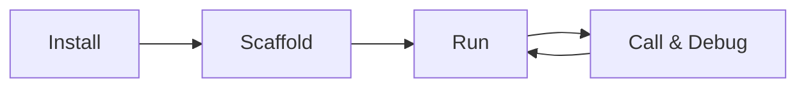

# Local Development (Java)

<div class="runtime-crossref">
  <span class="runtime-crossref-icon">&#x1F40D;</span>
  <span>Looking for Python? See <a href="../../python/local-development/">Python Local Development</a></span>
  <span> | </span>
  <span class="runtime-crossref-icon">&#x1F4D8;</span>
  <span>Looking for TypeScript? See <a href="../../typescript/local-development/">TypeScript Local Development</a></span>
</div>

> Develop MCP Mesh agents locally with Java/Spring Boot

## Development Workflow



## Guides

| Guide                                       | What You'll Learn                             |
| ------------------------------------------- | --------------------------------------------- |
| [Getting Started](./01-getting-started.md)  | Install meshctl CLI and set up a Java project |
| [Scaffold Agents](./02-scaffold.md)         | Generate agents with `meshctl scaffold`       |
| [Run Agents](./03-running-agents.md)        | Start agents with debug mode, hot reload      |
| [Inspect the Mesh](./04-inspecting-mesh.md) | View agents, tools, and dependencies          |
| [Call & Debug Tools](./05-calling-tools.md) | Call tools and trace distributed calls        |
| [Troubleshooting](./troubleshooting.md)     | Java-specific issues and solutions            |

## Quick Reference

```bash
# Install CLI
npm install -g @mcpmesh/cli

# Scaffold a Java agent (interactive wizard)
meshctl scaffold

# Or non-interactive
meshctl scaffold --name hello --agent-type basic --lang java

# Run (recommended)
meshctl start hello/
meshctl start -w hello/                # hot reload
meshctl start --debug hello/           # debug mode

# Inspect
meshctl list                           # agents
meshctl list --tools                   # all tools
meshctl status                         # wiring details

# Call
meshctl call greeting '{"name":"World"}'
meshctl call --trace greeting          # with tracing

# Debug
meshctl trace <trace-id>               # view call tree
meshctl logs my-agent -f               # follow logs
meshctl man --list                     # built-in docs
```
