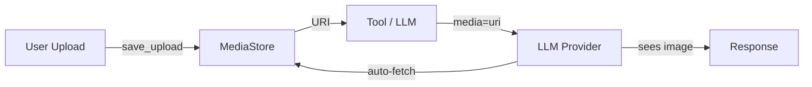
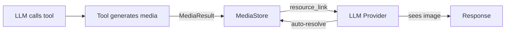

# Multimodal Getting Started

MCP Mesh agents can see images, read PDFs, and produce files. Media flows through the mesh as URIs -- tools upload bytes to a shared MediaStore, and LLM providers fetch them automatically when needed. Here are the two patterns you'll use most.

## Story 1: User Uploads a Photo, LLM Analyzes It

A user uploads a photo of a restaurant receipt via HTTP POST. An LLM agent extracts the line items.

### Web endpoint that receives the upload

=== "Python"

    ```python
    from fastapi import UploadFile
    import mesh

    @app.post("/upload")
    async def upload(file: UploadFile):
        uri = await mesh.save_upload(file)
        return {"uri": uri}
    ```

=== "TypeScript"

    ```typescript
    import { saveUpload } from "@mcpmesh/sdk";
    import multer from "multer";

    const upload = multer({ storage: multer.memoryStorage() });

    app.post("/upload", upload.single("file"), async (req, res) => {
      const uri = await saveUpload(req.file);
      res.json({ uri });
    });
    ```

=== "Java"

    ```java
    import io.mcpmesh.spring.media.MeshMedia;
    import io.mcpmesh.spring.media.MediaStore;
    import org.springframework.web.multipart.MultipartFile;

    @PostMapping("/upload")
    public Map<String, String> upload(
        @RequestParam("file") MultipartFile file,
        MediaStore mediaStore
    ) {
        String uri = MeshMedia.saveUpload(file, mediaStore);
        return Map.of("uri", uri);
    }
    ```

### LLM agent that analyzes the image

=== "Python"

    ```python
    import mesh
    from fastmcp import FastMCP

    app = FastMCP("Receipt Analyzer")

    @app.tool()
    @mesh.llm(provider={"capability": "llm"})
    @mesh.tool(capability="receipt_analyzer")
    async def analyze(image_uri: str, llm: mesh.MeshLlmAgent = None) -> str:
        return await llm(
            "Extract all line items with prices from this receipt.",
            media=[image_uri],
        )

    @mesh.agent(name="receipt-analyzer", http_port=9010, auto_run=True)
    class ReceiptAgent:
        pass
    ```

=== "TypeScript"

    ```typescript
    import { FastMCP, mesh } from "@mcpmesh/sdk";
    import { z } from "zod";

    const server = new FastMCP({ name: "Receipt Analyzer", version: "1.0.0" });

    const llmTool = mesh.llm({
      provider: { capability: "llm" },
    });

    server.addTool({
      name: "analyze",
      ...llmTool,
      capability: "receipt_analyzer",
      parameters: z.object({ image_uri: z.string() }),
      execute: async ({ image_uri }, { llm }) => {
        return await llm("Extract all line items with prices from this receipt.", {
          media: [image_uri],
        });
      },
    });

    const agent = mesh(server, { name: "receipt-analyzer", httpPort: 9010 });
    ```

=== "Java"

    ```java
    @MeshAgent(name = "receipt-analyzer", port = 9010)
    @SpringBootApplication
    public class ReceiptAnalyzerApplication {
        @MeshLlm(providerSelector = @Selector(capability = "llm"))
        @MeshTool(capability = "receipt_analyzer")
        public String analyze(
            @Param("image_uri") String imageUri,
            MeshLlmAgent llm
        ) {
            return llm.request()
                .user("Extract all line items with prices from this receipt.")
                .media(imageUri)
                .generate();
        }
    }
    ```

### Test it

```bash
# Upload a receipt photo
curl -X POST http://localhost:8080/upload -F "file=@receipt.jpg"
# Returns: {"uri": "s3://mesh-media/abc123.jpg"}

# Ask the LLM to analyze it
meshctl call receipt-analyzer analyze --params '{"image_uri": "s3://mesh-media/abc123.jpg"}'
# Returns: {"items": [{"name": "Burger", "price": 12.99}, ...]}
```

---

## Story 2: User Asks for a Chart, Agent Produces It

A user asks "chart Q3 revenue by region". An LLM calls a chart tool. The tool generates a PNG and returns it as a `resource_link`.

### Chart tool that produces media

=== "Python"

    ```python
    import mesh
    from fastmcp import FastMCP

    app = FastMCP("Chart Agent")

    @app.tool()
    @mesh.tool(capability="charting", tags=["tools"])
    async def make_chart(query: str):
        png_bytes = render_chart(query)  # your rendering logic
        return await mesh.MediaResult(
            data=png_bytes,
            filename="chart.png",
            mime_type="image/png",
            name="Chart",
            description=query,
        )

    @mesh.agent(name="chart-agent", http_port=9020, auto_run=True)
    class ChartAgent:
        pass
    ```

=== "TypeScript"

    ```typescript
    import { FastMCP, mesh, createMediaResult } from "@mcpmesh/sdk";
    import { z } from "zod";

    const server = new FastMCP({ name: "Chart Agent", version: "1.0.0" });
    const agent = mesh(server, { name: "chart-agent", httpPort: 9020 });

    agent.addTool({
      name: "make_chart",
      capability: "charting",
      tags: ["tools"],
      parameters: z.object({ query: z.string() }),
      execute: async ({ query }) => {
        const png = renderChart(query);
        return await createMediaResult(png, "chart.png", "image/png", "Chart", query);
      },
    });
    ```

=== "Java"

    ```java
    @MeshAgent(name = "chart-agent", port = 9020)
    @SpringBootApplication
    public class ChartAgentApplication {
        @MeshTool(capability = "charting", tags = {"tools"})
        public ResourceLink makeChart(
            @Param("query") String query,
            MediaStore mediaStore
        ) {
            byte[] png = renderChart(query);
            return MeshMedia.mediaResult(
                png, "chart.png", "image/png",
                "Chart", query, mediaStore
            );
        }
    }
    ```

### LLM agent that calls the chart tool

The LLM calls `make_chart`, gets back a `resource_link`, and the SDK auto-resolves the image so the LLM can describe it. No special media code needed on the LLM side.

=== "Python"

    ```python
    import mesh
    from fastmcp import FastMCP

    app = FastMCP("Analyst Agent")

    @app.tool()
    @mesh.llm(
        provider={"capability": "llm"},
        filter=[{"capability": "charting"}],
        max_iterations=3,
    )
    @mesh.tool(capability="analyst")
    async def analyze(question: str, llm: mesh.MeshLlmAgent = None) -> str:
        return await llm(f"Generate a chart and analyze it: {question}")

    @mesh.agent(name="analyst", http_port=9021, auto_run=True)
    class AnalystAgent:
        pass
    ```

=== "TypeScript"

    ```typescript
    import { FastMCP, mesh } from "@mcpmesh/sdk";
    import { z } from "zod";

    const server = new FastMCP({ name: "Analyst", version: "1.0.0" });

    const llmTool = mesh.llm({
      provider: { capability: "llm" },
      filter: [{ capability: "charting" }],
      maxIterations: 3,
    });

    server.addTool({
      name: "analyze",
      ...llmTool,
      capability: "analyst",
      parameters: z.object({ question: z.string() }),
      execute: async ({ question }, { llm }) => {
        return await llm(`Generate a chart and analyze it: ${question}`);
      },
    });

    const agent = mesh(server, { name: "analyst", httpPort: 9021 });
    ```

=== "Java"

    ```java
    @MeshAgent(name = "analyst", port = 9021)
    @SpringBootApplication
    public class AnalystApplication {
        @MeshLlm(
            providerSelector = @Selector(capability = "llm"),
            filter = @Selector(capability = "charting"),
            maxIterations = 3
        )
        @MeshTool(capability = "analyst")
        public String analyze(
            @Param("question") String question,
            MeshLlmAgent llm
        ) {
            return llm.request()
                .user("Generate a chart and analyze it: " + question)
                .generate();
        }
    }
    ```

### Test it

```bash
meshctl call analyst analyze --params '{"question": "Chart Q3 revenue by region"}'
# Returns: {"answer": "Here is the Q3 revenue chart...", "chart_url": "s3://mesh-media/chart-xxx.png"}
```

---

## How It Works

**Upload flow** -- user provides media, LLM consumes it:



**Production flow** -- tool generates media, LLM sees it automatically:



Key points:

- Media is stored as bytes in MediaStore (local filesystem or S3)
- Agents pass URIs, not bytes -- lightweight and network-efficient
- LLM providers auto-fetch media when they see `resource_link` objects or `media=` URIs
- Works across agents in different languages and on different machines (with S3)

## What's Next

1. [Web Uploads](web-uploads.md) -- Receive files from web frameworks
2. [Returning Media](returning-media.md) -- Produce media from tools
3. [LLM Media Input](llm-media-input.md) -- Pass media to LLM calls
4. [MediaParam](media-param.md) -- Type hints for multi-agent media chains
5. [Provider Support](provider-support.md) -- Vendor capabilities (Claude, OpenAI, Gemini)
6. [Storage Configuration](media-store.md) -- Local vs S3, distributed deployment
