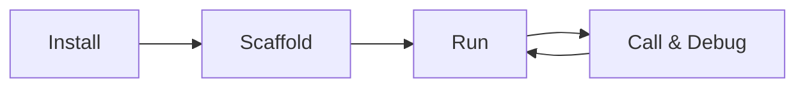

# Local Development (Python)

<div class="runtime-crossref">
  <span class="runtime-crossref-icon">📘</span>
  <span>Looking for TypeScript? See <a href="../../typescript/local-development/">TypeScript Local Development</a></span>
</div>

> Develop MCP Mesh agents locally with Python

## Development Workflow



## Guides

| Guide                                       | What You'll Learn                        |
| ------------------------------------------- | ---------------------------------------- |
| [Getting Started](./01-getting-started.md)  | Install meshctl CLI and Python SDK       |
| [Scaffold Agents](./02-scaffold.md)         | Generate agents with `meshctl scaffold`  |
| [Run Agents](./03-running-agents.md)        | Start agents with hot reload, debug mode |
| [Inspect the Mesh](./04-inspecting-mesh.md) | View agents, tools, and dependencies     |
| [Call & Debug Tools](./05-calling-tools.md) | Call tools and trace distributed calls   |
| [Troubleshooting](./troubleshooting.md)     | Common issues and solutions              |

## Quick Reference

```bash
# Install CLI
npm install -g @mcpmesh/cli

# Set up Python (at project root)
python3 -m venv .venv
source .venv/bin/activate
pip install "mcp-mesh>=0.8,<0.9"
deactivate  # meshctl auto-detects .venv

# Scaffold (interactive wizard)
meshctl scaffold

# Run
meshctl start main.py
meshctl start -w main.py          # hot reload
meshctl start --debug main.py     # debug mode

# Inspect
meshctl list                      # agents
meshctl list --tools              # all tools
meshctl status                    # wiring details

# Call
meshctl call get_weather '{"city":"London"}'
meshctl call --trace get_weather  # with tracing

# Debug
meshctl trace <trace-id>          # view call tree
meshctl logs my-agent -f          # follow logs
meshctl man --list                # built-in docs
```
