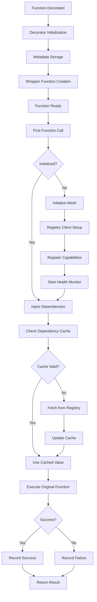
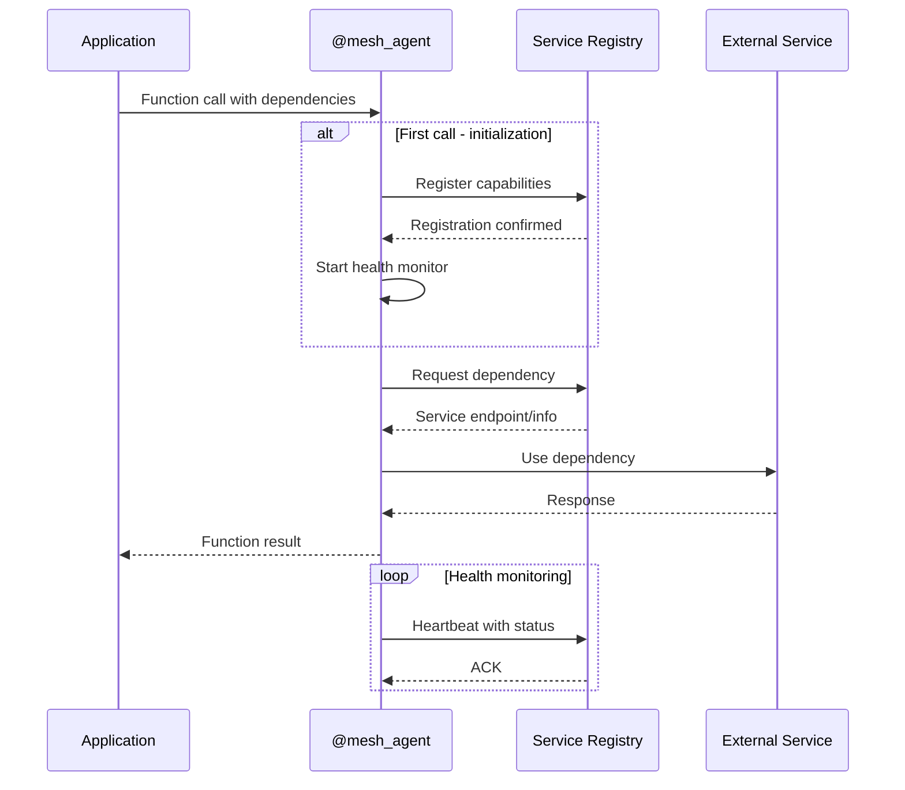
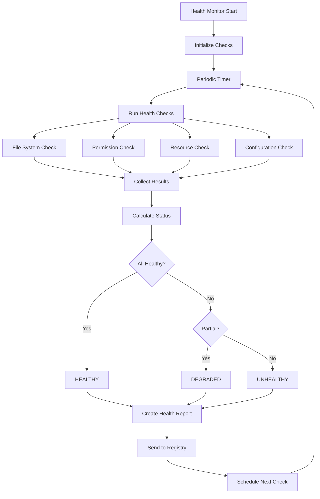

# Architecture Overview

This document provides a comprehensive overview of the MCP Mesh SDK architecture, including system design, component relationships, and integration patterns.

## Table of Contents

1. [System Architecture](#system-architecture)
2. [Core Components](#core-components)
3. [MCP SDK Integration](#mcp-sdk-integration)
4. [@mesh_agent Decorator Workflow](#mesh_agent-decorator-workflow)
5. [File Agent Architecture](#file-agent-architecture)
6. [Service Mesh Integration](#service-mesh-integration)
7. [Data Flow](#data-flow)
8. [Security Architecture](#security-architecture)
9. [Performance Considerations](#performance-considerations)
10. [Scalability Design](#scalability-design)

## System Architecture

The MCP Mesh SDK follows a layered architecture that integrates the official MCP SDK with service mesh capabilities:

```
┌─────────────────────────────────────────────────────────────┐
│                     Client Applications                     │
├─────────────────────────────────────────────────────────────┤
│                    MCP Protocol Layer                       │
├─────────────────────────────────────────────────────────────┤
│                   MCP Mesh SDK Layer                        │
│  ┌─────────────┐  ┌─────────────┐  ┌─────────────────────┐  │
│  │ @mesh_agent │  │ File Agent  │  │   Service Mesh      │  │
│  │ Decorator   │  │ Components  │  │   Integration       │  │
│  └─────────────┘  └─────────────┘  └─────────────────────┘  │
├─────────────────────────────────────────────────────────────┤
│                   Official MCP SDK                          │
│  ┌─────────────┐  ┌─────────────┐  ┌─────────────────────┐  │
│  │   Tools     │  │  Resources  │  │      Prompts        │  │
│  └─────────────┘  └─────────────┘  └─────────────────────┘  │
├─────────────────────────────────────────────────────────────┤
│                    Transport Layer                          │
│           (JSON-RPC 2.0 over stdio/HTTP/WebSocket)         │
└─────────────────────────────────────────────────────────────┘
```

### Architecture Principles

1. **MCP Compliance**: Full compatibility with MCP protocol specification
2. **Zero-Boilerplate**: Minimal code required for mesh integration
3. **Service Mesh Native**: Built-in service discovery and dependency injection
4. **Security First**: Comprehensive security validation and audit logging
5. **Fault Tolerance**: Graceful degradation and retry mechanisms
6. **Observability**: Health monitoring and performance metrics

## Core Components

### Component Diagram

```
┌──────────────────────────────────────────────────────────────┐
│                    MCP Mesh SDK                              │
│                                                              │
│  ┌─────────────────┐    ┌─────────────────────────────────┐  │
│  │  @mesh_agent    │    │         File Agent              │  │
│  │   Decorator     │    │                                 │  │
│  │                 │    │  ┌─────────────────────────────┐│  │
│  │ ┌─────────────┐ │    │  │      File Operations       ││  │
│  │ │Registry     │ │    │  │   - read_file()             ││  │
│  │ │Integration  │ │    │  │   - write_file()            ││  │
│  │ └─────────────┘ │    │  │   - list_directory()        ││  │
│  │                 │    │  └─────────────────────────────┘│  │
│  │ ┌─────────────┐ │    │                                 │  │
│  │ │Dependency   │ │◄───┤  ┌─────────────────────────────┐│  │
│  │ │Injection    │ │    │  │     Security Validation     ││  │
│  │ └─────────────┘ │    │  │   - Path traversal check    ││  │
│  │                 │    │  │   - File type validation    ││  │
│  │ ┌─────────────┐ │    │  │   - Permission verification ││  │
│  │ │Health       │ │    │  └─────────────────────────────┘│  │
│  │ │Monitoring   │ │    │                                 │  │
│  │ └─────────────┘ │    │  ┌─────────────────────────────┐│  │
│  └─────────────────┘    │  │      Error Handling         ││  │
│                         │  │   - MCP error responses     ││  │
│                         │  │   - Retry mechanisms        ││  │
│                         │  │   - Audit logging           ││  │
│                         │  └─────────────────────────────┘│  │
│                         └─────────────────────────────────┘  │
│                                                              │
│  ┌─────────────────────────────────────────────────────────┐  │
│  │                Shared Components                        │  │
│  │                                                         │  │
│  │  ┌──────────────┐  ┌──────────────┐  ┌──────────────┐  │  │
│  │  │  Exceptions  │  │    Types     │  │   Registry   │  │  │
│  │  │              │  │              │  │   Client     │  │  │
│  │  │ - MCP Errors │  │ - Health     │  │              │  │  │
│  │  │ - File Ops   │  │ - Retry      │  │ - Service    │  │  │
│  │  │ - Security   │  │ - File Info  │  │   Discovery  │  │  │
│  │  └──────────────┘  │ - Security   │  │ - Heartbeat  │  │  │
│  │                    └──────────────┘  │ - Metadata   │  │  │
│  │                                      └──────────────┘  │  │
│  └─────────────────────────────────────────────────────────┘  │
└──────────────────────────────────────────────────────────────┘
```

### Component Responsibilities

#### @mesh_agent Decorator

- **Service Registration**: Automatic registration with service mesh
- **Dependency Injection**: Runtime injection of service dependencies
- **Health Monitoring**: Periodic health reporting to mesh registry
- **Error Handling**: Consistent error handling and reporting
- **Caching**: Intelligent caching of dependency lookups

#### File Agent

- **Secure Operations**: Path validation and permission checking
- **MCP Integration**: Full MCP tool/resource/prompt compliance
- **Retry Logic**: Configurable retry mechanisms for transient failures
- **Audit Logging**: Comprehensive operation auditing
- **Performance Optimization**: Efficient file I/O with async operations

#### Shared Components

- **Exception Hierarchy**: MCP-compliant error responses
- **Type System**: Comprehensive type definitions for all components
- **Registry Client**: Communication with service mesh registry

## MCP SDK Integration

### MCP Protocol Compliance

The SDK maintains full compliance with the MCP specification:

```python
# MCP Tool Example with Mesh Integration
@mesh_agent(
    capabilities=["file_operations"],
    dependencies=["auth_service", "audit_logger"]
)
@app.tool(name="read_file", description="Read file with mesh security")
async def read_file(
    path: str,
    auth_service: Optional[str] = None,
    audit_logger: Optional[str] = None
) -> str:
    """MCP tool with automatic mesh integration."""
    # Mesh handles dependency injection automatically
    # Tool implementation focuses on business logic
    return await file_ops.read_file(path)
```

### Integration Layers

```
┌─────────────────────────────────────────────────────────┐
│                FastMCP Application                      │
│  ┌─────────────┐  ┌─────────────┐  ┌─────────────────┐  │
│  │ @app.tool() │  │@app.resource│  │ @app.prompt()   │  │
│  └─────────────┘  └─────────────┘  └─────────────────┘  │
├─────────────────────────────────────────────────────────┤
│                 @mesh_agent Layer                       │
│  ┌─────────────┐  ┌─────────────┐  ┌─────────────────┐  │
│  │Capabilities │  │Dependencies │  │ Health Monitor  │  │
│  │Registration │  │ Injection   │  │                 │  │
│  └─────────────┘  └─────────────┘  └─────────────────┘  │
├─────────────────────────────────────────────────────────┤
│                Official MCP SDK                         │
│  ┌─────────────┐  ┌─────────────┐  ┌─────────────────┐  │
│  │   Server    │  │   Client    │  │    Protocol     │  │
│  │ Foundation  │  │ Foundation  │  │   Compliance    │  │
│  └─────────────┘  └─────────────┘  └─────────────────┘  │
└─────────────────────────────────────────────────────────┘
```

## @mesh_agent Decorator Workflow

### Decorator Application Flow



### Initialization Sequence

1. **Decorator Construction**: Store configuration parameters
2. **Function Wrapping**: Create async or sync wrapper as appropriate
3. **Metadata Attachment**: Store mesh metadata on wrapped function
4. **Lazy Initialization**: Initialize mesh components on first call
5. **Health Monitoring**: Start background health reporting task

### Runtime Operations

1. **Dependency Resolution**: Resolve and inject service dependencies
2. **Function Execution**: Execute original function with injected dependencies
3. **Error Handling**: Catch and process exceptions according to configuration
4. **Metric Recording**: Record success/failure metrics for monitoring

## File Agent Architecture

### File Operations Component Design

```
┌─────────────────────────────────────────────────────────────┐
│                    FileOperations Class                     │
│                                                             │
│  ┌─────────────────────────────────────────────────────────┐│
│  │                 @mesh_agent Decorated Methods           ││
│  │                                                         ││
│  │  ┌─────────────┐  ┌─────────────┐  ┌─────────────────┐  ││
│  │  │ read_file() │  │write_file() │  │list_directory() │  ││
│  │  │             │  │             │  │                 │  ││
│  │  │ - Security  │  │ - Backup    │  │ - Filtering     │  ││
│  │  │ - Encoding  │  │ - Validation│  │ - Details       │  ││
│  │  │ - Retry     │  │ - Atomic    │  │ - Permissions   │  ││
│  │  └─────────────┘  └─────────────┘  └─────────────────┘  ││
│  └─────────────────────────────────────────────────────────┘│
│                                                             │
│  ┌─────────────────────────────────────────────────────────┐│
│  │                 Security Layer                          ││
│  │                                                         ││
│  │  ┌─────────────┐  ┌─────────────┐  ┌─────────────────┐  ││
│  │  │Path         │  │File Type    │  │Permission       │  ││
│  │  │Validation   │  │Validation   │  │Checking         │  ││
│  │  │             │  │             │  │                 │  ││
│  │  │ - Traversal │  │ - Extension │  │ - Auth Service  │  ││
│  │  │ - Base Dir  │  │ - MIME Type │  │ - OS Perms      │  ││
│  │  │ - Symlinks  │  │ - Content   │  │ - ACLs          │  ││
│  │  └─────────────┘  └─────────────┘  └─────────────────┘  ││
│  └─────────────────────────────────────────────────────────┘│
│                                                             │
│  ┌─────────────────────────────────────────────────────────┐│
│  │                Reliability Layer                        ││
│  │                                                         ││
│  │  ┌─────────────┐  ┌─────────────┐  ┌─────────────────┐  ││
│  │  │Retry Logic  │  │Rate Limiting│  │Health Monitoring│  ││
│  │  │             │  │             │  │                 │  ││
│  │  │ - Exponential│  │ - Per Op   │  │ - System Checks │  ││
│  │  │ - Jitter    │  │ - Time Window│  │ - Disk Space   │  ││
│  │  │ - Backoff   │  │ - Burst     │  │ - Permissions   │  ││
│  │  └─────────────┘  └─────────────┘  └─────────────────┘  ││
│  └─────────────────────────────────────────────────────────┘│
└─────────────────────────────────────────────────────────────┘
```

### Security Architecture

#### Multi-Layer Security Model

```
┌─────────────────────────────────────────────────────────────┐
│                   Security Layers                           │
│                                                             │
│  Layer 1: Input Validation                                 │
│  ┌─────────────────────────────────────────────────────────┐│
│  │ • Path sanitization                                     ││
│  │ • Character encoding validation                         ││
│  │ • Parameter type checking                               ││
│  │ • Length and size limits                                ││
│  └─────────────────────────────────────────────────────────┘│
│                                                             │
│  Layer 2: Authorization                                     │
│  ┌─────────────────────────────────────────────────────────┐│
│  │ • Service mesh authentication                           ││
│  │ • Role-based access control                             ││
│  │ • Operation-specific permissions                        ││
│  │ • Security context validation                           ││
│  └─────────────────────────────────────────────────────────┘│
│                                                             │
│  Layer 3: Path Security                                     │
│  ┌─────────────────────────────────────────────────────────┐│
│  │ • Path traversal prevention                             ││
│  │ • Base directory enforcement                            ││
│  │ • Symlink resolution control                            ││
│  │ • File type restrictions                                ││
│  └─────────────────────────────────────────────────────────┘│
│                                                             │
│  Layer 4: Operation Security                                │
│  ┌─────────────────────────────────────────────────────────┐│
│  │ • Atomic operations                                      ││
│  │ • Backup creation                                        ││
│  │ • Checksum validation                                    ││
│  │ • Audit logging                                          ││
│  └─────────────────────────────────────────────────────────┘│
└─────────────────────────────────────────────────────────────┘
```

## Service Mesh Integration

### Service Discovery and Registration



### Dependency Injection Flow

```
┌─────────────────────────────────────────────────────────────┐
│                Dependency Injection Process                 │
│                                                             │
│  1. Function Call with Dependencies                         │
│  ┌─────────────────────────────────────────────────────────┐│
│  │ @mesh_agent(dependencies=["auth", "logger"])            ││
│  │ async def func(param, auth=None, logger=None):          ││
│  │     # Implementation                                     ││
│  └─────────────────────────────────────────────────────────┘│
│                                                             │
│  2. Dependency Resolution                                   │
│  ┌─────────────────────────────────────────────────────────┐│
│  │ • Check local cache                                      ││
│  │ • Query service registry                                 ││
│  │ • Resolve service endpoints                              ││
│  │ • Validate availability                                  ││
│  └─────────────────────────────────────────────────────────┘│
│                                                             │
│  3. Service Injection                                       │
│  ┌─────────────────────────────────────────────────────────┐│
│  │ • Inject resolved services into kwargs                   ││
│  │ • Maintain dependency metadata                           ││
│  │ • Handle fallback scenarios                              ││
│  │ • Cache for future calls                                 ││
│  └─────────────────────────────────────────────────────────┘│
└─────────────────────────────────────────────────────────────┘
```

## Data Flow

### Request Processing Flow

```mermaid
graph TD
    A[MCP Client Request] --> B[Transport Layer]
    B --> C[MCP Server Handler]
    C --> D[@mesh_agent Wrapper]

    D --> E{Dependencies Required?}
    E -->|Yes| F[Resolve Dependencies]
    E -->|No| G[Execute Function]

    F --> F1[Check Cache]
    F1 --> F2{Cache Hit?}
    F2 -->|Yes| F3[Use Cached]
    F2 -->|No| F4[Query Registry]
    F4 --> F5[Cache Result]
    F5 --> F3
    F3 --> G

    G --> H[File Operations]
    H --> I[Security Validation]
    I --> J{Valid?}
    J -->|No| K[Security Error]
    J -->|Yes| L[Execute Operation]

    L --> M{Success?}
    M -->|No| N[Retry Logic]
    M -->|Yes| O[Audit Log]

    N --> N1{Retries Left?}
    N1 -->|Yes| N2[Backoff Delay]
    N2 --> L
    N1 -->|No| P[Final Error]

    O --> Q[MCP Response]
    K --> Q
    P --> Q
    Q --> R[Transport Response]
```

### Health Monitoring Flow



## Security Architecture

### Security Principles

1. **Defense in Depth**: Multiple security layers
2. **Principle of Least Privilege**: Minimal necessary permissions
3. **Input Validation**: Comprehensive input sanitization
4. **Audit Trail**: Complete operation logging
5. **Secure Defaults**: Security-first default configurations

### Authentication and Authorization

```
┌─────────────────────────────────────────────────────────────┐
│                 Security Framework                          │
│                                                             │
│  ┌─────────────────────────────────────────────────────────┐│
│  │               Identity Layer                            ││
│  │  • Service mesh authentication                          ││
│  │  • Agent identity verification                          ││
│  │  • Certificate-based trust                              ││
│  └─────────────────────────────────────────────────────────┘│
│                                                             │
│  ┌─────────────────────────────────────────────────────────┐│
│  │              Authorization Layer                        ││
│  │  • Capability-based access control                      ││
│  │  • Resource-specific permissions                        ││
│  │  • Operation-level authorization                        ││
│  └─────────────────────────────────────────────────────────┘│
│                                                             │
│  ┌─────────────────────────────────────────────────────────┐│
│  │               Validation Layer                          ││
│  │  • Input sanitization                                   ││
│  │  • Path traversal prevention                            ││
│  │  • File type validation                                 ││
│  └─────────────────────────────────────────────────────────┘│
│                                                             │
│  ┌─────────────────────────────────────────────────────────┐│
│  │                Audit Layer                              ││
│  │  • Operation logging                                     ││
│  │  • Security event tracking                              ││
│  │  • Compliance reporting                                 ││
│  └─────────────────────────────────────────────────────────┘│
└─────────────────────────────────────────────────────────────┘
```

## Performance Considerations

### Optimization Strategies

#### Caching Architecture

```
┌─────────────────────────────────────────────────────────────┐
│                   Caching Strategy                          │
│                                                             │
│  ┌─────────────────────────────────────────────────────────┐│
│  │              Dependency Cache                           ││
│  │  • 5-minute TTL for service lookups                     ││
│  │  • LRU eviction policy                                  ││
│  │  • Thread-safe concurrent access                        ││
│  │  • Configurable cache size limits                       ││
│  └─────────────────────────────────────────────────────────┘│
│                                                             │
│  ┌─────────────────────────────────────────────────────────┐│
│  │             Permission Cache                            ││
│  │  • 1-minute TTL for permission checks                   ││
│  │  • User/resource/operation key                          ││
│  │  • Immediate invalidation on security events            ││
│  └─────────────────────────────────────────────────────────┘│
│                                                             │
│  ┌─────────────────────────────────────────────────────────┐│
│  │              Health Status Cache                        ││
│  │  • In-memory health check results                       ││
│  │  • Avoid redundant system calls                         ││
│  │  • Smart refresh based on check types                   ││
│  └─────────────────────────────────────────────────────────┘│
└─────────────────────────────────────────────────────────────┘
```

#### Async Operation Design

```python
# Efficient async file operations
async def batch_file_operations(operations: List[FileOperation]) -> List[Result]:
    """Execute multiple file operations concurrently."""
    tasks = []

    # Create semaphore to limit concurrent operations
    semaphore = asyncio.Semaphore(10)

    async def bounded_operation(op: FileOperation) -> Result:
        async with semaphore:
            return await execute_operation(op)

    # Execute operations concurrently
    for operation in operations:
        task = asyncio.create_task(bounded_operation(operation))
        tasks.append(task)

    return await asyncio.gather(*tasks, return_exceptions=True)
```

### Performance Metrics

- **Dependency Resolution**: < 50ms for cached dependencies
- **File Operations**: < 100ms for typical file sizes (< 1MB)
- **Health Checks**: < 10ms for basic system checks
- **Service Registration**: < 200ms for initial registration

## Scalability Design

### Horizontal Scaling

```
┌─────────────────────────────────────────────────────────────┐
│                Scalability Architecture                     │
│                                                             │
│  ┌─────────────────────────────────────────────────────────┐│
│  │              Load Distribution                          ││
│  │                                                         ││
│  │  Client ──→ Load Balancer ──→ ┌─ Agent Instance 1      ││
│  │                              ├─ Agent Instance 2      ││
│  │                              ├─ Agent Instance 3      ││
│  │                              └─ Agent Instance N      ││
│  └─────────────────────────────────────────────────────────┘│
│                                                             │
│  ┌─────────────────────────────────────────────────────────┐│
│  │            Service Discovery                            ││
│  │                                                         ││
│  │  Registry ──→ ┌─ Capability Index                      ││
│  │              ├─ Health Status                          ││
│  │              ├─ Load Metrics                           ││
│  │              └─ Routing Rules                          ││
│  └─────────────────────────────────────────────────────────┘│
│                                                             │
│  ┌─────────────────────────────────────────────────────────┐│
│  │              State Management                           ││
│  │                                                         ││
│  │  • Stateless agent design                               ││
│  │  • External state storage                               ││
│  │  • Distributed caching                                  ││
│  │  • Session affinity where needed                        ││
│  └─────────────────────────────────────────────────────────┘│
└─────────────────────────────────────────────────────────────┘
```

### Resource Management

```python
# Resource limits and throttling
class ResourceManager:
    """Manage resource usage and limits."""

    def __init__(self):
        self.max_concurrent_operations = 100
        self.memory_limit_mb = 512
        self.disk_space_threshold = 0.9  # 90% usage warning

        self._operation_semaphore = asyncio.Semaphore(
            self.max_concurrent_operations
        )

    async def acquire_operation_slot(self) -> None:
        """Acquire slot for new operation."""
        await self._operation_semaphore.acquire()

    def release_operation_slot(self) -> None:
        """Release operation slot."""
        self._operation_semaphore.release()

    async def check_resource_availability(self) -> bool:
        """Check if resources are available for new operations."""
        memory_ok = await self._check_memory_usage()
        disk_ok = await self._check_disk_space()
        return memory_ok and disk_ok
```

This architecture provides a robust, scalable foundation for the MCP Mesh SDK while maintaining simplicity and performance. The design emphasizes security, reliability, and ease of use while providing comprehensive mesh integration capabilities.
