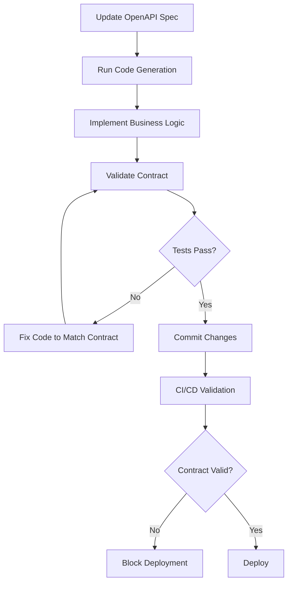

# Contract-First Development Guide

This document explains the contract-first development workflow implemented for MCP Mesh Registry, including the AI-driven development pattern and guardrails that prevent API drift.

## 🤖 AI Development Pattern

We've created a new pattern for AI-assisted development that embeds guidance directly in code and specifications. This addresses the context loss problem when AI developers work across multiple sessions.

### Core Principles

1. **OpenAPI Specification is Source of Truth**

   - All HTTP endpoints must be defined in `api/mcp-mesh-registry.openapi.yaml`
   - Generated code is never modified directly
   - Business logic is implemented in designated stub files

2. **Automatic Code Generation**

   - Go server handlers generated from OpenAPI spec
   - Python client generated from OpenAPI spec
   - Validation tools generated from OpenAPI spec

3. **Contract Enforcement**

   - Pre-commit hooks prevent contract violations
   - CI/CD pipeline validates all changes
   - Endpoint detection prevents manual implementations

4. **AI Behavior Guidance**
   - Embedded instructions in generated code
   - Clear failure messages with recovery instructions
   - Self-documenting test patterns

## Workflow Overview



## File Structure

```
api/
├── mcp-mesh-registry.openapi.yaml     # 📋 Source of truth for API contract
│
src/core/registry/
├── generated/
│   └── server.go                      # 🤖 Generated Go handlers (DO NOT EDIT)
├── handlers_impl.go                   # ✏️  Business logic implementation
└── server.go                         # 🔧 Server setup using generated handlers
│
src/runtime/python/
└── registry_client_generated/        # 🤖 Generated Python client (DO NOT EDIT)
    └── mcp_mesh_registry_client/
│
tools/
├── codegen/
│   ├── generate.sh                   # 🛠️  Code generation script
│   └── config.yaml                   # ⚙️  Generation configuration
├── validation/
│   ├── validate_schema.py            # 🔍 OpenAPI schema validator
│   ├── validate_contract.go          # 🔍 Go contract validator
│   └── test_suite.yaml              # 📋 Contract test definitions
└── detection/
    └── detect_endpoints.py           # 🚨 Unauthorized endpoint detector
```

## Development Workflow

### 1. Adding New Endpoints

✅ **Correct Approach:**

```bash
# 1. Update OpenAPI specification
vim api/mcp-mesh-registry.openapi.yaml

# 2. Generate code
make generate

# 3. Implement business logic
vim src/core/registry/handlers_impl.go

# 4. Validate
make validate-contract

# 5. Commit
git add .
git commit -m "Add new endpoint with OpenAPI contract"
```

❌ **Incorrect Approach:**

```bash
# DON'T: Add handlers manually
vim src/core/registry/handlers.go  # This will be blocked!

# DON'T: Modify generated code
vim src/core/registry/generated/server.go  # Pre-commit hook prevents this!
```

### 2. Modifying Existing Endpoints

```bash
# 1. Update OpenAPI spec first
vim api/mcp-mesh-registry.openapi.yaml

# 2. Regenerate code (this updates interfaces)
make generate

# 3. Update business logic to match new interface
vim src/core/registry/handlers_impl.go

# 4. Validate contract compliance
make validate-contract
```

### 3. Daily Development

```bash
# Always start with validation
make validate-schema
make detect-endpoints

# Generate code if spec changed
make generate

# Build and test
make build
make test

# Final validation before commit
make validate-contract
```

## Guardrails and Validation

### Pre-commit Hooks

1. **OpenAPI Specification Validation**

   - Validates YAML syntax
   - Checks OpenAPI 3.0 schema compliance
   - Ensures required fields are present

2. **Endpoint Detection**

   - Scans codebase for HTTP endpoints
   - Ensures all endpoints exist in OpenAPI spec
   - Blocks manual endpoint implementations

3. **Generated Code Validation**
   - Ensures generated code is up to date
   - Prevents direct modification of generated files
   - Validates Go code compiles with generated interfaces

### CI/CD Pipeline

The GitHub Actions workflow validates:

1. **Specification Validity**

   - OpenAPI syntax and schema
   - YAML formatting
   - Required documentation

2. **Code Generation**

   - Go server stubs generation
   - Python client generation
   - Consistency with repository

3. **Contract Compliance**

   - Response schema validation
   - Endpoint authorization
   - Integration testing

4. **Build Verification**
   - Go compilation with generated handlers
   - Python client import verification
   - Existing test compatibility

## AI Behavior Guidance

### For AI Developers

When working on this codebase:

1. **Never modify generated code directly**

   - Generated files have clear markers
   - Pre-commit hooks will block such changes
   - Always update OpenAPI spec first

2. **Follow the validation chain**

   - `make validate-schema` → `make generate` → `make validate-contract`
   - Fix validation errors by updating business logic
   - Only update OpenAPI spec with explicit user approval

3. **Understand failure messages**

   - Validation tools provide specific guidance
   - Error messages include recovery instructions
   - Check AI behavior guidance in code comments

4. **Test contract compliance**
   - Use provided test suites
   - Validate both request and response schemas
   - Ensure backward compatibility

### Embedded Guidance Examples

**In OpenAPI Specification:**

```yaml
🤖 AI BEHAVIOR RULES:
  - NEVER modify this spec without explicit user approval
  - If tests fail referencing this spec, fix your code, not the spec
  - Any breaking changes here affect both Go and Python implementations
```

**In Generated Code:**

```go
// 🤖 AI BEHAVIOR GUIDANCE:
// This file contains generated server interfaces from OpenAPI spec.
// DO NOT modify this file directly - it will be overwritten.
//
// TO ADD NEW ENDPOINTS:
// 1. Update api/mcp-mesh-registry.openapi.yaml
// 2. Run: make generate
// 3. Implement business logic in handlers_impl.go
```

**In Test Metadata:**

```python
@core_contract_test(
    description="Validates agent registration API contract",
    api_contract_reference="api/mcp-mesh-registry.openapi.yaml#/paths/~1agents~1register"
)
def test_agent_registration_contract():
    """
    🤖 AI CRITICAL CONTRACT:
    This test validates the core API contract.

    If this test fails:
    1. Check if your code change broke the API contract
    2. If you need to change the API, update OpenAPI spec first
    3. NEVER modify this test without user approval
    """
```

## Troubleshooting

### Common Issues

**1. Endpoint Detection Failure**

```
❌ Found endpoints not in OpenAPI specification:
  GET /new-endpoint
```

**Solution:** Add the endpoint to OpenAPI spec first, then regenerate.

**2. Generated Code Out of Date**

```
❌ Generated code is out of date!
🔧 Run: make generate
```

**Solution:** Run `make generate` and commit the updated generated files.

**3. Contract Validation Failure**

```
❌ Response validation failed: missing required field 'timestamp'
```

**Solution:** Update business logic to include all required fields per OpenAPI schema.

**4. Build Failure with Generated Code**

```
❌ Go code does not compile with generated handlers!
```

**Solution:** Update business logic to match generated interfaces.

### Recovery Commands

```bash
# Reset to clean state
make clean
make generate

# Full validation chain
make validate-schema
make generate
make build
make validate-contract

# Check what changed
git diff src/core/registry/generated/
git diff src/runtime/python/src/mcp_mesh/registry_client_generated/
```

## Benefits

### Development Benefits

1. **Consistency**: All endpoints follow the same contract
2. **Type Safety**: Generated code provides compile-time validation
3. **Documentation**: OpenAPI spec serves as living documentation
4. **Testing**: Contract tests catch API drift automatically

### AI Development Benefits

1. **Context Preservation**: Embedded guidance survives context loss
2. **Clear Boundaries**: Generated vs. business logic is explicit
3. **Failure Recovery**: Specific instructions for common issues
4. **Self-Documenting**: Code explains its own constraints

### Operational Benefits

1. **API Drift Prevention**: Automatic detection of unauthorized endpoints
2. **Backward Compatibility**: Schema validation ensures compatibility
3. **Rapid Development**: Code generation eliminates boilerplate
4. **Quality Assurance**: Multiple validation layers catch issues early

## Advanced Usage

### Custom Validation Rules

Add custom validators to `tools/validation/validate_schema.py`:

```python
def validate_custom_rule(spec):
    """Custom validation logic for MCP Mesh requirements."""
    # Implementation here
```

### Endpoint Detection Patterns

Extend patterns in `tools/detection/detect_endpoints.py`:

```python
patterns = [
    r'custom\.(?P<method>GET|POST)\s*\(\s*["\'](?P<path>/[^"\']*)["\']',
]
```

### Contract Test Extensions

Add test cases to `tools/validation/test_suite.yaml`:

```yaml
endpoints:
  - method: "POST"
    path: "/custom/endpoint"
    expected_code: 201
    description: "Custom endpoint validation"
```

## Migration Guide

### From Manual to Generated

1. **Audit existing endpoints**

   ```bash
   python3 tools/detection/detect_endpoints.py api/mcp-mesh-registry.openapi.yaml src
   ```

2. **Add missing endpoints to OpenAPI spec**

   ```bash
   vim api/mcp-mesh-registry.openapi.yaml
   ```

3. **Generate new handlers**

   ```bash
   make generate
   ```

4. **Migrate business logic**

   ```bash
   # Copy logic from old handlers to handlers_impl.go
   vim src/core/registry/handlers_impl.go
   ```

5. **Remove old handlers**

   ```bash
   mv old_handlers.go old_handlers_deprecated.go
   ```

6. **Validate migration**
   ```bash
   make validate-contract
   make build
   make test
   ```

This contract-first development approach ensures that MCP Mesh Registry maintains API consistency while enabling rapid, AI-assisted development with built-in guardrails against common mistakes.
