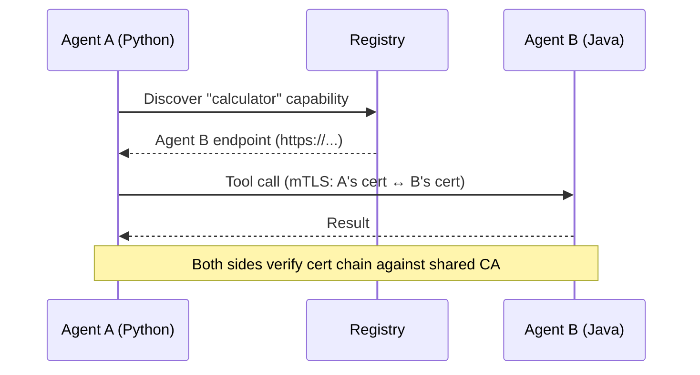

# Agent-to-Agent mTLS

When TLS is enabled, every agent-to-agent call is mutually authenticated. The same certificate used for registry registration is used for peer authentication — no additional configuration needed.

## How It Works



## Language Support

Each SDK implements mTLS using its platform's native TLS libraries:

=== "Python"

    ```python
    # Automatic — no code changes needed
    # httpx client uses ssl.create_default_context()
    # with cert/key from prepare_tls()

    @mesh.tool(capability="greeting", dependencies=["calculator"])
    async def greet(calculator: mesh.McpMeshTool = None):
        result = await calculator(a=1, b=2)  # mTLS automatically
        return f"Result: {result}"
    ```

=== "TypeScript"

    ```typescript
    // Automatic — no code changes needed
    // undici Agent configured with cert/key from prepareTls()

    agent.addTool({
      name: "greet",
      dependencies: ["calculator"],
      execute: async ({ calculator }) => {
        const result = await calculator({ a: 1, b: 2 }); // mTLS automatically
        return `Result: ${result}`;
      },
    });
    ```

=== "Java"

    ```java
    // Automatic — no code changes needed
    // OkHttpClient configured with SSLContext from MeshTlsConfig

    @MeshTool(capability = "greeting", dependencies = @Selector(capability = "calculator"))
    public String greet(McpMeshTool<Integer> calculator) {
        int result = calculator.call("a", 1, "b", 2); // mTLS automatically
        return "Result: " + result;
    }
    ```

## SPIFFE-Aware TLS

When using the SPIRE credential provider, MCP Mesh uses SPIFFE-aware TLS verification:

- **Standard TLS** (file/vault): Verifies cert chain **and** hostname (DNS/IP SANs)
- **SPIFFE TLS** (spire): Verifies cert chain but **skips hostname** — uses URI SANs (`spiffe://domain/workload`) for identity

This is automatic — no configuration needed. The Rust core detects `MCP_MESH_TLS_PROVIDER=spire` and adjusts verification accordingly.

## Self-Dependencies

When an agent calls its own capabilities (self-dependency), the call stays in-process and **skips TLS** — there's no network involved.

## Registry Proxy

The registry proxy (used by `meshctl call`) also uses mTLS when forwarding calls to agents. It verifies agent cert chains but skips hostname verification (agents may advertise pod IPs that don't match cert DNS SANs).
