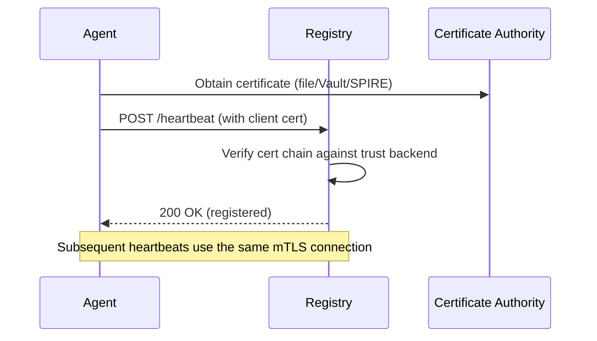

# Registration Trust

The registry validates agent identity before accepting registration. Agents present a TLS client certificate, and the registry verifies it against configured trust backends.

## How It Works



## Credential Providers

Agents can obtain TLS certificates from three sources:

### File Provider (Default)

Reads cert/key from files on disk. Works with cert-manager, static certs, or any PKI that writes PEM files.

```bash
export MCP_MESH_TLS_MODE=auto
export MCP_MESH_TLS_CERT=/etc/certs/agent.pem
export MCP_MESH_TLS_KEY=/etc/certs/agent-key.pem
export MCP_MESH_TLS_CA=/etc/certs/ca.pem
```

!!! tip "cert-manager Integration"
    In Kubernetes, use cert-manager to issue certificates automatically. Mount the cert secret as a volume and point `MCP_MESH_TLS_CERT`/`MCP_MESH_TLS_KEY` to the mounted paths.

### Vault Provider

Fetches certificates from HashiCorp Vault's PKI secrets engine at agent startup.

```bash
export MCP_MESH_TLS_MODE=auto
export MCP_MESH_TLS_PROVIDER=vault
export MCP_MESH_VAULT_ADDR=https://vault.example.com:8200
export MCP_MESH_VAULT_PKI_PATH=pki_int/issue/mesh-agent
export VAULT_TOKEN=s.xxxxx
export MCP_MESH_TLS_CA=/etc/certs/vault-ca.pem
```

| Variable | Description | Default |
|----------|-------------|---------|
| `MCP_MESH_VAULT_ADDR` | Vault server URL | (required) |
| `MCP_MESH_VAULT_PKI_PATH` | PKI issue endpoint path | (required) |
| `VAULT_TOKEN` | Vault authentication token | (required) |
| `MCP_MESH_VAULT_TTL` | Certificate TTL | `24h` |
| `MCP_MESH_TRUST_DOMAIN` | CN suffix for certificates | `mcp-mesh.local` |

Vault-issued certs include both DNS SANs (agent name) and IP SANs (advertised host) for proper hostname verification.

=== "Helm Values"

    ```yaml
    mesh:
      tls:
        mode: "auto"
        vault:
          enabled: true
          addr: "https://vault.vault-system:8200"
          pkiPath: "pki_int/issue/mesh-agent"
          tokenSecret: "vault-agent-token"
          tokenKey: "token"
        caSecret: "mesh-ca-bundle"
    ```

=== "Docker Compose"

    ```yaml
    services:
      my-agent:
        environment:
          MCP_MESH_TLS_MODE: "auto"
          MCP_MESH_TLS_PROVIDER: "vault"
          MCP_MESH_VAULT_ADDR: "https://vault:8200"  # use http:// for local dev only
          MCP_MESH_VAULT_PKI_PATH: "pki_int/issue/mesh-agent"
          VAULT_TOKEN: "${VAULT_TOKEN}"
          MCP_MESH_TLS_CA: "/etc/certs/ca.pem"
    ```

### SPIRE Provider

Fetches X.509-SVIDs from the SPIRE agent's Workload API via Unix domain socket.

```bash
export MCP_MESH_TLS_MODE=auto
export MCP_MESH_TLS_PROVIDER=spire
export MCP_MESH_SPIRE_SOCKET=/run/spire/agent/sockets/agent.sock
```

| Variable | Description | Default |
|----------|-------------|---------|
| `MCP_MESH_SPIRE_SOCKET` | SPIRE Workload API socket path | `/run/spire/agent/sockets/agent.sock` |

!!! info "SPIFFE Identity"
    SPIRE SVIDs use URI SANs (`spiffe://mcp-mesh.local/mesh-agent`), not DNS/IP SANs. MCP Mesh automatically handles SPIFFE-aware TLS verification — cert chain is validated, hostname check is skipped.

=== "Helm Values"

    ```yaml
    mesh:
      tls:
        mode: "auto"
        spire:
          enabled: true
          socketPath: "/run/spire/agent/sockets/agent.sock"
        caSecret: "spire-ca-bundle"
    ```

=== "Kubernetes"

    The SPIRE agent DaemonSet exposes the Workload API socket on each node. The Helm chart mounts it into agent pods automatically when `spire.enabled: true`.

### Credential Security

For Vault and SPIRE providers, certificates are handled securely:

- **In-memory fetch** — PEM content never passes through env vars
- **Secure temp files** — written with `0600` permissions (owner-only read)
- **Directory isolation** — created with `0700` permissions, PID-namespaced
- **tmpfs on Linux** — stored in `/dev/shm` so private keys never touch physical disk
- **Cleanup on shutdown** — temp files removed when agent stops

## Trust Backends

The registry validates agent certificates against one or more trust backends:

| Backend | Description | Use Case |
|---------|-------------|----------|
| **localca** | Built-in mini-CA, auto-generated with `--tls-auto` | Local development |
| **filestore** | Load CAs from filesystem with fsnotify hot-reload | Static CA deployments |
| **k8s-secrets** | Load CAs from Kubernetes secrets by label selector | Multi-tenant K8s |
| **spire** | Validate against SPIFFE trust bundles from Workload API | Workload identity |

Backends can be chained: `MCP_MESH_TRUST_BACKEND=spire,k8s-secrets` — first match wins.

## Entity Management

Entities represent organizational CAs whose agents are trusted by the mesh.

```bash
# Register an entity CA
meshctl entity register "partner-corp" --ca-cert /path/to/ca.pem

# List trusted entities
meshctl entity list

# Revoke an entity (evicts agents in strict mode)
meshctl entity revoke "partner-corp" --force

# Rotate certificates (triggers re-registration via heartbeat protocol)
meshctl entity rotate
```

!!! warning "Strict Mode Eviction"
    In strict mode, revoking an entity CA evicts all agents with certificates signed by that CA within one heartbeat cycle (~5 seconds).
