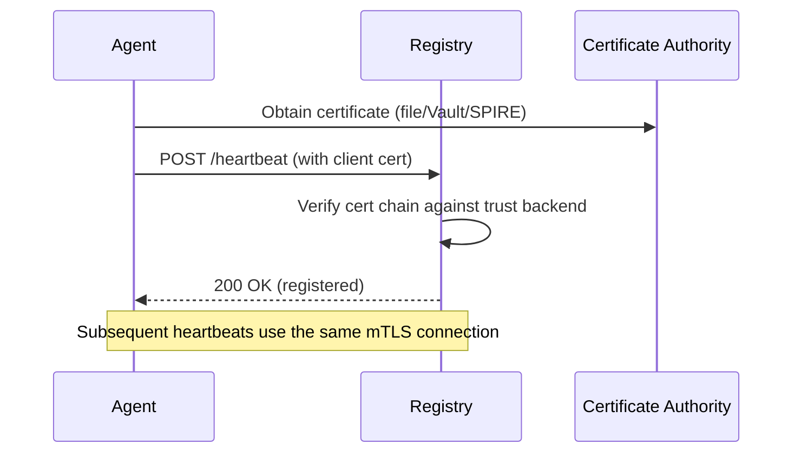

# Registration Trust

The registry verifies which trust entity an agent belongs to before accepting its registration. Agents present a TLS client certificate, and the registry verifies it against configured trust backends. Verification is entity-scoped, not agent-scoped: see [Trust Scope](#trust-scope).

## How It Works


```mermaid
sequenceDiagram
    participant A as Agent
    participant R as Registry
    participant CA as Certificate Authority

    A->>CA: Obtain certificate (file/Vault/SPIRE)
    A->>R: POST /heartbeat (with client cert)
    R->>R: Verify cert chain against trust backend
    R-->>A: 200 OK (registered)

    Note over A,R: Subsequent heartbeats use the same mTLS connection
```

## Credential Providers

Agents can obtain TLS certificates from three sources:

### File Provider (Default)

Reads cert/key from files on disk. Works with cert-manager, static certs, or any PKI that writes PEM files.

```bash
export MCP_MESH_TLS_MODE=auto
export MCP_MESH_TLS_CERT=/etc/certs/agent.pem
export MCP_MESH_TLS_KEY=/etc/certs/agent-key.pem
export MCP_MESH_TLS_CA=/etc/certs/ca.pem
```

!!! tip "cert-manager Integration"
    In Kubernetes, use cert-manager to issue certificates automatically. Mount the cert secret as a volume and point `MCP_MESH_TLS_CERT`/`MCP_MESH_TLS_KEY` to the mounted paths.

### Vault Provider

Fetches certificates from HashiCorp Vault's PKI secrets engine at agent startup.

```bash
export MCP_MESH_TLS_MODE=auto
export MCP_MESH_TLS_PROVIDER=vault
export MCP_MESH_VAULT_ADDR=https://vault.example.com:8200
export MCP_MESH_VAULT_PKI_PATH=pki_int/issue/mesh-agent
export VAULT_TOKEN=s.xxxxx
export MCP_MESH_TLS_CA=/etc/certs/vault-ca.pem
```

| Variable | Description | Default |
|----------|-------------|---------|
| `MCP_MESH_VAULT_ADDR` | Vault server URL | (required) |
| `MCP_MESH_VAULT_PKI_PATH` | PKI issue endpoint path | (required) |
| `VAULT_TOKEN` | Vault authentication token | (required) |
| `MCP_MESH_VAULT_TTL` | Certificate TTL | `24h` |
| `MCP_MESH_TRUST_DOMAIN` | CN suffix for certificates | `mcp-mesh.local` |

Vault-issued certs include both DNS SANs (agent name) and IP SANs (advertised host) for proper hostname verification.

=== "Helm Values"

    ```yaml
    mesh:
      tls:
        mode: "auto"
        vault:
          enabled: true
          addr: "https://vault.vault-system:8200"
          pkiPath: "pki_int/issue/mesh-agent"
          tokenSecret: "vault-agent-token"
          tokenKey: "token"
        caSecret: "mesh-ca-bundle"
    ```

=== "Docker Compose"

    ```yaml
    services:
      my-agent:
        environment:
          MCP_MESH_TLS_MODE: "auto"
          MCP_MESH_TLS_PROVIDER: "vault"
          MCP_MESH_VAULT_ADDR: "https://vault:8200"  # use http:// for local dev only
          MCP_MESH_VAULT_PKI_PATH: "pki_int/issue/mesh-agent"
          VAULT_TOKEN: "${VAULT_TOKEN}"
          MCP_MESH_TLS_CA: "/etc/certs/ca.pem"
    ```

### SPIRE Provider

Fetches X.509-SVIDs from the SPIRE agent's Workload API via Unix domain socket.

!!! warning "Python and TypeScript only"
    The SPIRE provider works for Python and TypeScript agents, not Java: the Java runtime refuses to start with `MCP_MESH_TLS_PROVIDER=spire` whenever TLS is enabled (`auto` or `strict`). A Java agent in a SPIRE deployment uses the file provider with its SVID written to disk by a SPIRE helper (for example `spiffe-helper`), pointing `MCP_MESH_TLS_CERT`, `MCP_MESH_TLS_KEY` and `MCP_MESH_TLS_CA` at the exported certificate, key and trust bundle.

```bash
export MCP_MESH_TLS_MODE=auto
export MCP_MESH_TLS_PROVIDER=spire
export MCP_MESH_SPIRE_SOCKET=/run/spire/agent/sockets/agent.sock
```

| Variable | Description | Default |
|----------|-------------|---------|
| `MCP_MESH_SPIRE_SOCKET` | SPIRE Workload API socket path | `/run/spire/agent/sockets/agent.sock` |

!!! info "SPIFFE Identity"
    SPIRE SVIDs use URI SANs (`spiffe://mcp-mesh.local/mesh-agent`), not DNS/IP SANs. MCP Mesh automatically handles SPIFFE-aware TLS verification — cert chain is validated, hostname check is skipped.

=== "Helm Values"

    ```yaml
    mesh:
      tls:
        mode: "auto"
        spire:
          enabled: true
          socketPath: "/run/spire/agent/sockets/agent.sock"
        caSecret: "spire-ca-bundle"
    ```

=== "Kubernetes"

    The SPIRE agent DaemonSet exposes the Workload API socket on each node. The Helm chart mounts it into agent pods automatically when `spire.enabled: true`. Enable it for Python and TypeScript agents only.

### Credential Security

For Vault and SPIRE providers, certificates are handled securely:

- **In-memory fetch** — PEM content never passes through env vars
- **Secure temp files** — written with `0600` permissions (owner-only read)
- **Directory isolation** — created with `0700` permissions, PID-namespaced
- **tmpfs on Linux** — stored in `/dev/shm` so private keys never touch physical disk
- **Cleanup on shutdown** — temp files removed when agent stops

## Trust Backends

The registry validates agent certificates against one or more trust backends:

| Backend | Description | Use Case |
|---------|-------------|----------|
| **localca** | Built-in mini-CA, auto-generated with `--tls-auto` | Local development |
| **filestore** | Load CAs from filesystem with fsnotify hot-reload | Static CA deployments |
| **k8s-secrets** | Load CAs from Kubernetes secrets by label selector | Multi-tenant K8s |
| **spire** | Validate against SPIFFE trust bundles from Workload API | Workload identity |

Backends can be chained: `MCP_MESH_TRUST_BACKEND=spire,k8s-secrets` — first match wins.

The `spire` backend needs a registry built with `go build -tags spire`. The released registry binaries and container images are built without that tag, and refuse to start with `spire` in `MCP_MESH_TRUST_BACKEND`. On a released registry, trust SPIRE-issued agent certificates by exporting the SPIRE trust bundle to a PEM file and loading it with `filestore`.

The registry accepts `off`, `auto` and `strict` for `MCP_MESH_TLS_MODE`, in any case, and refuses to start on any other value. When it is anything other than `off`, at least one trust backend is required. The registry refuses to start if `MCP_MESH_TRUST_BACKEND` is empty, if every listed backend is skipped for a missing prerequisite (`localca` and `filestore` need `MCP_MESH_TRUST_DIR`), or if a configured backend fails to initialize. `meshctl start --tls-auto` configures `localca,filestore` for you.

## Trust Scope

A verified certificate tells the registry which **trust entity** the caller belongs to. It does not identify the individual agent: the certificate's CN, SANs and SPIFFE ID are never compared with the `agent_id` being registered.

| Backend | The entity is |
|---------|---------------|
| **filestore** | The O (else OU, else file name) of the CA the certificate chains to |
| **k8s-secrets** | The entity annotation (else the Secret name) of the CA Secret the certificate chains to |
| **spire** | The SPIFFE trust domain, not the SVID's SPIFFE ID |
| **localca** | The O of the agent certificate itself (see below) |

The registry records the entity on an agent the first time that agent registers with a verified certificate. After that, only a caller from the same entity can re-register the agent, send its heartbeats (`POST /heartbeat` and the fast `HEAD /heartbeat/{agent_id}` check), or deregister it (`DELETE /agents/{agent_id}`). A caller from another entity, or a certless caller in `auto` mode, gets `403` (with `entity_id mismatch` in the body, except on `HEAD`, which has none). An agent that registered without a certificate has no recorded entity, and any caller can re-register or deregister it.

What this means in practice:

- Agents that share a trust entity can register under, or take over, each other's `agent_id`. Taking over an id replaces the agent's endpoint and capabilities in the registry.
- With `filestore`, `k8s-secrets` and `spire`, takeover across entities is blocked.
- To isolate workloads that must not trust each other, give them distinct entity ids, not just separate CA files: two `filestore` CAs with the same O are one entity, as are two CA Secrets with the same entity annotation. For `spire`, use separate trust domains.
- With SPIRE, every workload in one trust domain is one entity, however finely its SPIFFE IDs are assigned.

`localca` is a development backend. It takes the entity from the O field of the agent's own certificate, which whoever issues that certificate controls, so any holder of an entity-CA key under the local root can issue a certificate naming another entity. A certificate with no O names no entity, and the agent registers unclaimed.

## Entity Management

Entities represent organizational CAs whose agents are trusted by the mesh. The name given to `meshctl entity register` names the CA file; the entity id recorded on agents is that CA's O (else OU), and only falls back to the registered name when the CA has neither. `meshctl entity rotate <entity>` matches the entity id recorded on agents.

```bash
# Register an entity CA
meshctl entity register "partner-corp" --ca-cert /path/to/ca.pem

# List trusted entities
meshctl entity list

# Revoke an entity (evicts agents in strict mode)
meshctl entity revoke "partner-corp" --force

# Rotate certificates (triggers re-registration via heartbeat protocol)
meshctl entity rotate
```

!!! warning "Strict Mode Eviction"
    In strict mode, revoking an entity CA evicts all agents with certificates signed by that CA within one heartbeat cycle (~5 seconds).
