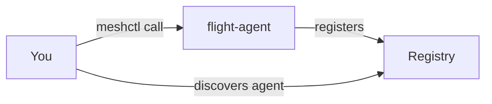
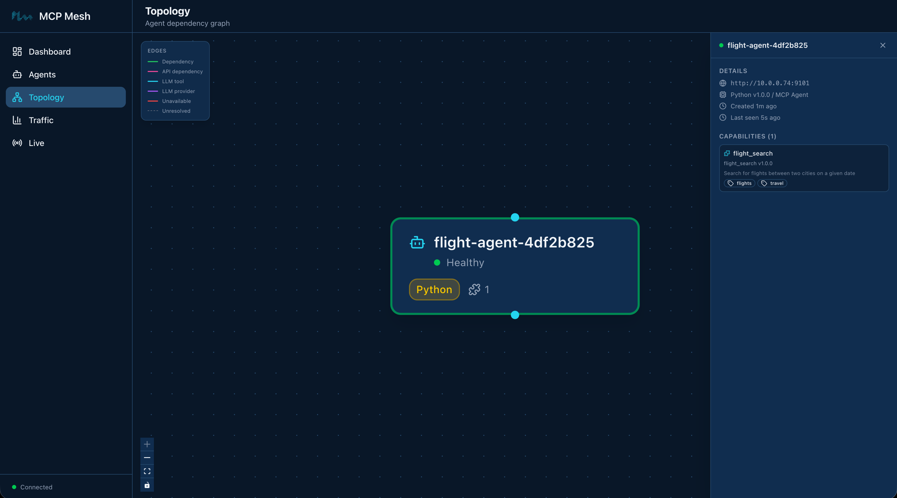

# Day 1 — Scaffold and First Tool Agent

Today you'll scaffold your first tool agent, run it locally, and call it from your
terminal. By the end you'll have used every core `meshctl` command. No LLMs yet —
just the basics: build, start, inspect, call.

## What we're building today



A local registry and one agent. The agent registers with the registry so it can
be discovered. When you run `meshctl call`, it looks up the agent's endpoint via
the registry and then calls the agent directly. (By default `meshctl` proxies the
call through the registry for convenience — useful in Docker/K8s where you only
port-forward the registry — but architecturally the registry is a discovery layer,
not a routing layer.) The agent exposes a single tool, `flight_search`, that takes
an origin, destination, and date and returns stub flight data. That's the complete
Day 1 mesh.

## Step 1: Scaffold the agent

`meshctl scaffold` generates a ready-to-run agent from a built-in template. For
a basic Python tool agent, the flags you need are `--name`, `--agent-type tool`,
and `--lang python` (which is the default, so you can omit it).

```shell
$ meshctl scaffold --name flight-agent --agent-type tool --port 9101

Created agent 'flight-agent' in flight-agent/

Generated files:
  flight-agent/
  |-- .dockerignore
  |-- Dockerfile
  |-- README.md
  |-- __init__.py
  |-- __main__.py
  |-- helm-values.yaml
  |-- main.py
  |-- requirements.txt

Next steps:
  meshctl start flight-agent/main.py

For Docker/K8s deployment, see: meshctl man deployment
```

Everything mesh needs is in `flight-agent/main.py`. The scaffold also generates
Docker and Helm files — you won't need them today, but they'll come in handy on
Day 8 (Docker) and Day 9 (Kubernetes). The scaffold gives you a starting function
named `hello` — you're going to replace it with `flight_search`.

## Step 2: Write the tool

A mesh tool is a plain Python function with two decorators: `@app.tool()` from
FastMCP (which exposes it as an MCP tool) and `@mesh.tool(...)` from MCP Mesh
(which registers it with the mesh and handles dependency injection). Here's the
`flight_search` function you'll put in `main.py`:

```python
--8<-- "examples/tutorial/trip-planner/day-01/python/flight-agent/main.py:flight_tool"
```

Three parameters, a list of dicts back. The `capability` on `@mesh.tool` is how
other agents will look this tool up once there are other agents — you'll see that
on Day 2. The `tags` are how the registry narrows matches when multiple agents
advertise the same capability.

Here's the complete `main.py` — imports, tool function, and agent class:

```python
--8<-- "examples/tutorial/trip-planner/day-01/python/flight-agent/main.py:full_file"
```

The `@mesh.agent` class at the bottom is what mesh uses to run the FastMCP server
and register the agent with the registry. `auto_run=True` means you don't need a
`main()` — mesh starts the server when the module is imported by `meshctl start`.

!!! tip "meshctl DX: prerequisite detection"
    Before `meshctl start` actually runs anything, it checks that the language
    runtime and required packages are present. If something's missing, it prints
    the exact commands you need to fix it and then exits — it won't half-start a
    broken agent. Here's what you'd see if Python's `.venv` is missing:

    ```shell
    $ meshctl start flight-agent/main.py
    Validating prerequisites...

    ❌ Prerequisite check failed: Python environment

    Python environment check failed: .venv not found in current directory

    MCP Mesh requires a .venv directory in your current working directory.

    Current directory: /home/you/trip-planner

    To fix this issue:
      1. Navigate to your project directory (where your agents are)
      2. Create a virtual environment: python3.11 -m venv .venv
      3. Activate it: source .venv/bin/activate
      4. Install mcp-mesh: pip install mcp-mesh
      5. Run meshctl start from this directory

    Run 'meshctl man prerequisite' for detailed setup instructions.
    ```

    Same pattern for missing `mcp-mesh`, missing Node for TypeScript agents, or
    missing Java/Maven for Java agents — `meshctl` tells you what's wrong and
    what command to run next.

## Step 3: Start the agent

With a `.venv` in place and `mcp-mesh` installed, start the agent in detached mode.
If no registry is running, `meshctl` starts one automatically on port 8000.

```shell
$ meshctl start flight-agent/main.py -d
Validating prerequisites...
  Using virtual environment: /tmp/trip-planner-day1/.venv/bin/python
  All prerequisites validated successfully
   Python: 3.11.14 (/tmp/trip-planner-day1/.venv/bin/python)
   Virtual environment: .venv
Started 'flight-agent' in detach
Logs: ~/.mcp-mesh/logs/flight-agent.log
Use 'meshctl logs flight-agent' to view or 'meshctl stop flight-agent' to stop
```

`meshctl` auto-detected the `.venv` and started the agent in detached mode. The
registry was started automatically — no separate command needed. Logs are stored
at `~/.mcp-mesh/logs/flight-agent.log` and viewable with `meshctl logs flight-agent`.

## Step 4: Start the UI

meshctl ships a web dashboard for inspecting agents, tools, and traces. Start it
alongside your agent:

```shell
$ meshctl start --ui -d
Started in detach
Use 'meshctl logs <agent>' to view logs or 'meshctl stop' to stop
```

The dashboard is available at [http://localhost:3080](http://localhost:3080). Open
it in your browser and you'll see flight-agent listed with its status and
capabilities.



## Step 5: Inspect the mesh

`meshctl list` shows you what's running:

```shell
$ meshctl list
Registry: running (http://localhost:8000) - 1 healthy

NAME                    RUNTIME        TYPE    STATUS       DEPS     ENDPOINT                AGE      LAST SEEN
--------------------------------------------------------------------------------------------------------------------------
flight-agent-ba2b3bc8   Python         Agent   healthy      0/0      10.0.0.74:9101          53s      3s
```

The agent registers as `flight-agent-ba2b3bc8` — mesh appends a short hash to
ensure uniqueness when multiple instances of the same agent run. All meshctl
commands accept the prefix `flight-agent` for convenience, so you never need to
type the hash.

The `DEPS` column is `0/0` because `flight-agent` doesn't depend on any other
agent. When you add hotel and weather agents on Day 2, this column will show
resolved-over-declared dependencies and turn green when all dependencies are
satisfied.

`meshctl list --tools` shows every tool registered across all agents:

```shell
$ meshctl list --tools
TOOL                      AGENT                   CAPABILITY           TAGS
----------------------------------------------------------------------------------------
flight_search             flight-agent-ba2b3bc8   flight_search        flights,travel

1 tool(s) found
```

And `meshctl status flight-agent` gives you a detailed breakdown — capabilities,
endpoint, version, uptime:

```shell
$ meshctl status flight-agent
Agent Details: flight-agent-ba2b3bc8
================================================================================
Name                : flight-agent-ba2b3bc8
Type                : Agent
Runtime             : Python
Status              : healthy
Endpoint            : http://10.0.0.74:9101
Version             : 1.0.0
Dependencies        : 0/0
Last Seen           : 2026-04-12 05:29:01 (3s ago)
Created             : 2026-04-12 01:28:06

Capabilities (1):
--------------------------------------------------------------------------------
CAPABILITY                MCP TOOL                       VERSION    TAGS
--------------------------------------------------------------------------------
flight_search             flight_search                  1.0.0      flights,travel
```

## Step 6: Call the tool

`meshctl call` discovers the agent via the registry and sends an MCP JSON-RPC
`tools/call` to it. You pass the tool name and a JSON object with the arguments:

```shell
$ meshctl call flight_search '{"origin":"SFO","destination":"NRT","date":"2026-06-01"}'
```

```json
{
  "_meta": {
    "fastmcp": {
      "wrap_result": true
    }
  },
  "content": [
    {
      "type": "text",
      "text": "[{\"carrier\":\"MH\",\"flight\":\"MH007\",\"origin\":\"SFO\",\"destination\":\"NRT\",\"date\":\"2026-06-01\",\"depart\":\"09:15\",\"arrive\":\"14:40\",\"price_usd\":842},{\"carrier\":\"SQ\",\"flight\":\"SQ017\",\"origin\":\"SFO\",\"destination\":\"NRT\",\"date\":\"2026-06-01\",\"depart\":\"11:50\",\"arrive\":\"17:05\",\"price_usd\":901}]"
    }
  ],
  "structuredContent": {
    "result": [
      {
        "carrier": "MH",
        "flight": "MH007",
        "origin": "SFO",
        "destination": "NRT",
        "date": "2026-06-01",
        "depart": "09:15",
        "arrive": "14:40",
        "price_usd": 842
      },
      {
        "carrier": "SQ",
        "flight": "SQ017",
        "origin": "SFO",
        "destination": "NRT",
        "date": "2026-06-01",
        "depart": "11:50",
        "arrive": "17:05",
        "price_usd": 901
      }
    ]
  },
  "isError": false
}
```

The response is a standard MCP tool result envelope. The flight data you care
about is under `structuredContent.result` — two flights matching the stub data
from your `flight_search` function. The `content` field contains the same data as
a JSON string (the MCP text format), and `_meta` is FastMCP internal metadata.
When other agents call this tool via dependency injection, mesh parses
`structuredContent` automatically — they receive the Python list directly.

meshctl call discovers the agent's endpoint via the registry and calls it. By
default it proxies through the registry for convenience — this is especially
useful in Kubernetes where you only need to port-forward the registry. You can
call the agent directly with `--use-proxy=false` for debugging.

## Stop and clean up

One command stops the registry, the agent, and any other background processes
`meshctl` is tracking:

```shell
$ meshctl stop
Stopping 1 agent(s) in parallel...
Stopping agent 'flight-agent' (PID: 14560)...
Agent 'flight-agent' stopped
Stopping UI server (PID: 15245)...
UI server stopped
Stopping registry (PID: 14555)...
Registry stopped

Stopped 3 process(es)
```

## Troubleshooting

**Agent name has a hash suffix.** Your agent registers as
`flight-agent-XXXXXXXX` (name plus a random hash). This ensures uniqueness when
you run multiple instances. All meshctl commands accept just the prefix
(`flight-agent`) — you never need to type the hash.

**Warning about McpMeshTool parameters in logs.** If you check
`meshctl logs flight-agent`, you may see a warning: `Function
'__main__.flight_search' has 3 parameters but none are typed as McpMeshTool.
Skipping injection of 0 dependencies.` This is harmless — it means your tool has
no mesh dependencies to inject, which is expected on Day 1. The warning
disappears once you add dependencies on Day 2.

**meshctl stop reports a failed UI process.** If `meshctl stop` reports
`Failed to stop UI server`, it usually means a previous UI process is still
running. Run `ps aux | grep meshui` to find it and `kill <PID>` to clean it up.

**Port 8000 already in use.** If `meshctl start` fails because port 8000 is
taken, another service (or a previous registry) is using it. Stop the other
service, or set a different port with
`MCP_MESH_REGISTRY_PORT=9000 meshctl start ...`.

## Recap

You built, started, inspected, and called an agent using six `meshctl` commands
and a dozen lines of Python. The `flight_search` function you wrote today is the
same function that will run on Kubernetes on Day 9 — same file, same decorators,
same types, no wrapper code or deployment-specific edits. That's DDDI: the agent
doesn't know or care where it's running, and you get dev-to-production with
nothing in between.

## See also

- `meshctl man scaffold` — the full scaffold CLI reference, including the `llm-agent`
  and `llm-provider` templates you'll see in later chapters
- `meshctl man decorators` — the `@mesh.tool`, `@mesh.agent`, `@mesh.llm`, and
  `@mesh.llm_provider` reference
- `meshctl man quickstart` — a condensed version of this tutorial for when you
  already know mesh and want the commands back
- `meshctl man cli` — full CLI reference for `start`, `list`, `call`, `status`, `stop`

## Next up

[Day 2 — More Tools and Dependency Injection](day-02-dependency-injection.md)
adds four more tool agents and introduces dependency injection between them —
the `flight_search` tool will start asking for user preferences from another
agent, and you'll see how mesh resolves and injects those dependencies at
runtime.
