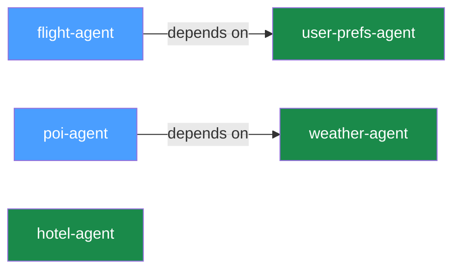
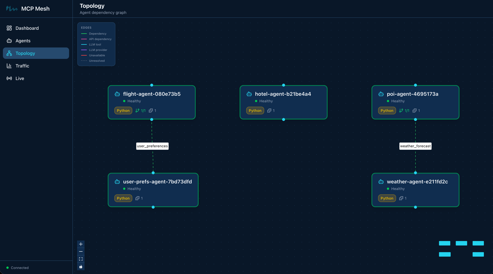

# Day 2 — More Tools and Dependency Injection

Yesterday you built one agent. Today you'll build four more, connect them via
dependency injection, and see mesh resolve dependencies at runtime. By the end
you'll have five agents working together — and you won't have written a single
line of networking code.

## What we're building today



Five agents. Two dependency arrows. `flight-agent` calls `user-prefs-agent` to
personalize results. `poi-agent` calls `weather-agent` to recommend indoor or
outdoor activities. The other three — `hotel-agent`, `weather-agent`, and
`user-prefs-agent` — are standalone tools with no dependencies.

## Step 1: Scaffold the new agents

You know `meshctl scaffold` from Day 1. Scaffold four new agents:

```shell
$ meshctl scaffold --name hotel-agent --agent-type tool --port 9102
$ meshctl scaffold --name weather-agent --agent-type tool --port 9103
$ meshctl scaffold --name poi-agent --agent-type tool --port 9104
$ meshctl scaffold --name user-prefs-agent --agent-type tool --port 9105
```

Each command creates the same set of files you saw on Day 1: `main.py`,
`Dockerfile`, `helm-values.yaml`, and the rest. You'll replace the generated
`main.py` in each directory with the tool implementations below.

## Step 2: Write the tools

### Standalone tools: hotel, weather, user-prefs

These three agents have no dependencies. Each registers a single tool with the
mesh.

**hotel-agent** — searches for hotels at a destination:

```python
--8<-- "examples/tutorial/trip-planner/day-02/python/hotel-agent/main.py:tool_function"
```

**weather-agent** — returns a weather forecast:

```python
--8<-- "examples/tutorial/trip-planner/day-02/python/weather-agent/main.py:tool_function"
```

**user-prefs-agent** — returns user travel preferences:

```python
--8<-- "examples/tutorial/trip-planner/day-02/python/user-prefs-agent/main.py:tool_function"
```

All three follow the same pattern from Day 1: `@app.tool()` + `@mesh.tool()`
with a `capability` name and `tags`. No dependencies, no injected parameters.

### DI tools: flight-agent (updated) and poi-agent (new)

These two agents depend on other agents' capabilities. This is where dependency
injection comes in.

**flight-agent** — updated from Day 1 to depend on `user_preferences`:

```python
--8<-- "examples/tutorial/trip-planner/day-02/python/flight-agent/main.py:di_function"
```

Three things changed from Day 1:

1. **`dependencies=["user_preferences"]`** on `@mesh.tool` declares that this
   tool needs the `user_preferences` capability at runtime.
2. **`user_prefs: mesh.McpMeshTool = None`** is the injected parameter. At
   startup, mesh resolves the dependency by finding an agent that advertises
   `user_preferences`, creates a proxy, and injects it here.
3. **`await user_prefs(user_id="demo-user")`** calls the injected tool like a
   regular async function. No URL, no REST client, no serialization code — mesh
   handles all of that behind the proxy.

The function also changed from `def` to `async def` — dependency injection
calls are async because they cross process boundaries.

**poi-agent** — depends on `weather_forecast`:

```python
--8<-- "examples/tutorial/trip-planner/day-02/python/poi-agent/main.py:di_function"
```

Same pattern: declare the dependency in `@mesh.tool`, accept an
`mesh.McpMeshTool` parameter, and call it with `await`. The `search_pois`
function fetches the weather forecast, checks the rain chance, and adjusts its
recommendations — indoor activities if rain is likely, outdoor otherwise.

Here's the complete `flight-agent/main.py` for reference:

```python
--8<-- "examples/tutorial/trip-planner/day-02/python/flight-agent/main.py:full_file"
```

## Step 3: Start all agents

Start all five with one command:

```shell
$ meshctl start --debug -d -w flight-agent/main.py hotel-agent/main.py weather-agent/main.py poi-agent/main.py user-prefs-agent/main.py
```

```
Validating prerequisites...
  Using virtual environment: /tmp/trip-planner-day2/.venv/bin/python
  All prerequisites validated successfully
   Python: 3.11.14 (/tmp/trip-planner-day2/.venv/bin/python)
   Virtual environment: .venv
Starting 5 agents in detach: flight-agent, hotel-agent, weather-agent, poi-agent, user-prefs-agent
Logs: ~/.mcp-mesh/logs/<agent>.log
Use 'meshctl logs <agent>' to view or 'meshctl stop' to stop all
```

The `-w` flag
means mesh is watching your agent files — edit any `main.py`, save it, and mesh
restarts that agent automatically. Combined with `-d` (detach) and `--debug`
(verbose logs), this gives you a tight development loop: edit, save, call, see
results.

Here's what each flag does:

- **`--debug`** — verbose logging. Useful for seeing dependency resolution.
- **`-d`** — detach mode. All five agents run in the background.
- **`-w`** — watch mode. Monitors agent directories and auto-restarts on changes.

If no registry is running, `meshctl` starts one automatically, same as Day 1.

## Step 4: Start the UI

```shell
$ meshctl start --ui -d
```

The dashboard is at [http://localhost:3080](http://localhost:3080). You'll see
all five agents listed.



## Step 5: Inspect the mesh

```shell
$ meshctl list
Registry: running (http://localhost:8000) - 5 healthy

NAME                        RUNTIME   TYPE    STATUS    DEPS   ENDPOINT           AGE   LAST SEEN
flight-agent-835864a0       Python    Agent   healthy   1/1    10.0.0.74:63297    5s    5s
hotel-agent-eb0eb637        Python    Agent   healthy   0/0    10.0.0.74:63298    5s    5s
poi-agent-5923d848          Python    Agent   healthy   1/1    10.0.0.74:63295    5s    5s
user-prefs-agent-950b70c3   Python    Agent   healthy   0/0    10.0.0.74:63294    5s    5s
weather-agent-1760466a      Python    Agent   healthy   0/0    10.0.0.74:63296    5s    5s
```

Notice the `DEPS` column. `flight-agent` shows `1/1` — one dependency declared,
one resolved. `poi-agent` also shows `1/1`. The others show `0/0`. When all
dependencies are resolved, the agent is fully operational.

List the tools:

```shell
$ meshctl list --tools
TOOL              AGENT                       CAPABILITY         TAGS
flight_search     flight-agent-835864a0       flight_search      flights,travel
get_user_prefs    user-prefs-agent-950b70c3   user_preferences   preferences,travel
get_weather       weather-agent-1760466a      weather_forecast   weather,travel
hotel_search      hotel-agent-eb0eb637        hotel_search       hotels,travel
search_pois       poi-agent-5923d848          poi_search         poi,travel

5 tool(s) found
```

Five tools across five agents. Each tool's capability name is how other agents
find it via dependency injection.

## Step 6: Call a tool with dependency injection

Call `flight_search`. This triggers a cross-agent call — `flight-agent` calls
`user-prefs-agent` behind the scenes to fetch user preferences:

```shell
$ meshctl call flight_search '{"origin":"SFO","destination":"NRT","date":"2026-06-01"}'
```

The response includes personalized results. The stub preferences set a budget of
$1000 and prefer SQ and MH airlines, so the $1150 AA flight is filtered out, and
the preferred carriers sort first:

```json
{
  "_meta": {
    "fastmcp": {
      "wrap_result": true
    }
  },
  "content": [
    {
      "type": "text",
      "text": "[{\"carrier\":\"MH\",\"flight\":\"MH007\",\"origin\":\"SFO\",\"destination\":\"NRT\",\"date\":\"2026-06-01\",\"depart\":\"09:15\",\"arrive\":\"14:40\",\"price_usd\":842},{\"carrier\":\"SQ\",\"flight\":\"SQ017\",\"origin\":\"SFO\",\"destination\":\"NRT\",\"date\":\"2026-06-01\",\"depart\":\"11:50\",\"arrive\":\"17:05\",\"price_usd\":901}]"
    }
  ],
  "structuredContent": {
    "result": [
      {
        "carrier": "MH",
        "flight": "MH007",
        "origin": "SFO",
        "destination": "NRT",
        "date": "2026-06-01",
        "depart": "09:15",
        "arrive": "14:40",
        "price_usd": 842
      },
      {
        "carrier": "SQ",
        "flight": "SQ017",
        "origin": "SFO",
        "destination": "NRT",
        "date": "2026-06-01",
        "depart": "11:50",
        "arrive": "17:05",
        "price_usd": 901
      }
    ]
  },
  "isError": false
}
```

Now call `search_pois`. This triggers `poi-agent` calling `weather-agent`:

```shell
$ meshctl call search_pois '{"location":"Tokyo"}'
```

```json
{
  "content": [
    {
      "type": "text",
      "text": "{\"location\":\"Tokyo\",\"weather_summary\":\"Partly cloudy in Tokyo on today, 28C high, 30% chance of rain.\",\"recommendation\":\"Weather looks good — outdoor activities recommended.\",\"pois\":[{\"name\":\"Senso-ji Temple\",\"type\":\"outdoor\",\"category\":\"cultural\",\"location\":\"Tokyo\"},{\"name\":\"Ueno Park\",\"type\":\"outdoor\",\"category\":\"nature\",\"location\":\"Tokyo\"},{\"name\":\"Meiji Shrine\",\"type\":\"outdoor\",\"category\":\"cultural\",\"location\":\"Tokyo\"},{\"name\":\"TeamLab Borderless\",\"type\":\"indoor\",\"category\":\"art\",\"location\":\"Tokyo\"}]}"
    }
  ],
  "structuredContent": {
    "location": "Tokyo",
    "weather_summary": "Partly cloudy in Tokyo on today, 28C high, 30% chance of rain.",
    "recommendation": "Weather looks good — outdoor activities recommended.",
    "pois": [
      {"name": "Senso-ji Temple", "type": "outdoor", "category": "cultural", "location": "Tokyo"},
      {"name": "Ueno Park", "type": "outdoor", "category": "nature", "location": "Tokyo"},
      {"name": "Meiji Shrine", "type": "outdoor", "category": "cultural", "location": "Tokyo"},
      {"name": "TeamLab Borderless", "type": "indoor", "category": "art", "location": "Tokyo"}
    ]
  },
  "isError": false
}
```

The 30% rain chance is below the 50% threshold, so `poi-agent` recommends
outdoor activities. Change the stub data in `weather-agent` to return 80% rain
chance, save the file (watch mode restarts it automatically), and call again —
you'll get indoor recommendations instead.

!!! tip "meshctl DX — watch mode"
    Edit your `flight_search` function, save the file, and mesh auto-restarts
    the agent. No manual stop/start cycle. Combined with `-d`, you get a
    development loop that feels like editing a local script — change, save,
    call, see results.

!!! info "What is DDDI?"
    Your `flight_search` function calls `user_prefs()` like a local function. It
    has no idea that `user_prefs` lives in a different process, possibly on a
    different machine. mesh resolved the dependency by matching the
    `user_preferences` capability name, injected a proxy that handles the
    network call, and your code stayed clean. That's Distributed Dynamic
    Dependency Injection — DDDI.

## Stop and clean up

```shell
$ meshctl stop
```

On Day 3 you'll restart with distributed tracing enabled — the agents need the `--dte` flag to publish trace events, so a fresh start is needed.

## Troubleshooting

**"Dependency not resolved" — agent shows 0/1 in DEPS column.** This means the
agent that provides the required capability hasn't registered yet. mesh doesn't
crash — the dependent agent starts and waits. Once the provider agent registers,
mesh resolves the dependency and the DEPS column updates to 1/1. If you start
agents one at a time, you may see this briefly. Starting all agents together
(as in Step 3) avoids it in practice.

**DI call returns empty dict instead of preferences.** Check that `user_prefs`
is not `None`. The `if user_prefs else {}` guard in the function handles the
case where the dependency wasn't resolved. If it's consistently `None`, check
`meshctl status flight-agent` to verify the dependency is resolved.

**Watch mode doesn't pick up changes.** Verify that the file you edited is in
the same directory that `meshctl start` is watching. Watch mode monitors the
directory of the `main.py` file you passed to `meshctl start`.

**Agent ports change on every restart.** When using `-w` (watch mode), meshctl
starts agents with the HTTP port set to `0` — the OS assigns a random available
port. This is intentional: when watch mode restarts an agent after a code change,
the old process needs to release its port before the new one starts. Since mesh
discovers agents by capability name through the registry (not by URL), the actual
port number doesn't matter. `meshctl call` and dependency injection both resolve
endpoints via the registry, so everything works regardless of which port an agent
lands on.

## Recap

You built five agents, connected two of them via dependency injection, and called
tools that trigger cross-agent calls. The total networking code you wrote: zero
lines. The dependency injection, service discovery, and proxy creation all
happened at runtime — declared in decorators, resolved by mesh.

## See also

- `meshctl man dependency-injection` — the full DI reference, including
  tag-based dependency matching and multi-dependency patterns
- `meshctl man capabilities` — how capabilities and tags work together for
  service discovery
- `meshctl man cli` — full CLI reference for `start`, `list`, `call`, `status`,
  `stop`

## Next up

[Day 3](day-03-llm-provider.md) sets up the observability stack for distributed
tracing, then adds an LLM provider agent and a planner — your first agent that
can reason, not just return data.
