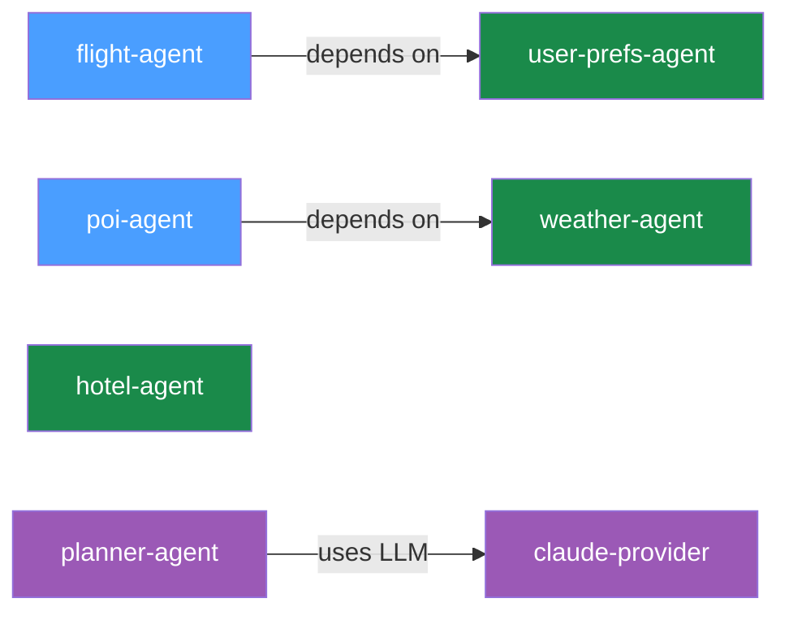

# Day 3 -- Observability and LLM Integration

Your five tool agents are still running from Day 2. Today you'll set up
distributed tracing so you can see every call across the mesh, then add an LLM
provider and build your first agent that can reason -- a trip planner that
generates itineraries from natural language.

## What we're building today



Seven agents. The five you already know (blue and green) plus two new ones in
purple: `claude-provider` wraps the Claude API as a mesh capability, and
`planner-agent` consumes that capability to generate trip itineraries. The
planner connects to the provider through the same capability-based discovery
that `flight-agent` uses to find `user-prefs-agent` -- no hardcoded URLs,
no model-specific code in the planner.

Today has five parts:

1. **Set up distributed tracing** -- Redis, Tempo, Grafana via Docker Compose
2. **Register an LLM provider** -- wrap Claude as a mesh capability
3. **Build the planner agent** -- consume the LLM via prompt templates
4. **Call the planner** -- generate a Kyoto itinerary
5. **Walk the trace** -- see the full call tree across agents

## Part 1: Set up distributed tracing

Mesh agents publish trace events to Redis. The registry consumes those events
and exports them to Tempo. You view traces with `meshctl trace` or in Grafana.
Before any of that works, you need the observability stack running.

### Generate the compose file

```shell
$ meshctl scaffold --compose --observability
```

This generates a `docker-compose.yml` with Redis, Tempo, and Grafana, plus the
supporting config files (Tempo config, Grafana provisioning).

### Start the stack

```shell
$ docker compose up -d
```

```
 Container trip-planner-redis   Started
 Container trip-planner-tempo   Started
 Container trip-planner-grafana Started
```

Verify everything is healthy:

```shell
$ docker compose ps
NAME                   STATUS
trip-planner-redis     Up (healthy)
trip-planner-tempo     Up (healthy)
trip-planner-grafana   Up (healthy)
```

Three containers. Redis collects trace events on port 6379, Tempo stores traces
on ports 3200 (HTTP) and 4317 (OTLP gRPC), and Grafana serves dashboards on
port 3000.

### Enable tracing

Tell the registry and agents to publish trace events. This must be set before
starting any agents:

```shell
$ export MCP_MESH_DISTRIBUTED_TRACING_ENABLED=true
```

That's all you need. Redis, Tempo, and Grafana URLs default to `localhost` with
the standard ports from the compose file you just started.

!!! tip "Make it stick"
    Add this to a `.env` file in your project directory and pass it with
    `meshctl start --env-file .env ...` so you don't have to export it every
    session.

## Part 2: Register an LLM provider

!!! note "API key required"
    The LLM provider needs an `ANTHROPIC_API_KEY` environment variable. If you
    don't have one, [create one here](https://console.anthropic.com/settings/keys)
    and export it: `export ANTHROPIC_API_KEY=sk-ant-...`

An LLM provider wraps an external LLM API -- Claude, GPT, Gemini -- as a mesh
capability. Other agents discover it by capability name, the same way tool
agents discover each other. The provider agent is zero-code: the
`@mesh.llm_provider` decorator handles the LiteLLM integration, request
parsing, and response formatting.

### Scaffold the provider

```shell
$ meshctl scaffold --name claude-provider --agent-type llm-provider --model anthropic/claude-sonnet-4-5
```

Replace the generated `main.py` with:

```python
--8<-- "examples/tutorial/trip-planner/day-03/python/claude-provider/main.py:full_file"
```

The decorator does all the work:

- **`model="anthropic/claude-sonnet-4-5"`** -- the LiteLLM model identifier.
  LiteLLM routes this to the Anthropic API using your `ANTHROPIC_API_KEY`.
- **`capability="llm"`** -- the capability name other agents use to discover
  this provider.
- **`tags=["claude"]`** -- tags for filtering. On Day 4 you'll add GPT and
  Gemini providers with different tags and select between them.

The function body is `pass` -- the decorator generates the full implementation.

### Start the provider

```shell
$ meshctl start --debug -d -w claude-provider/main.py
```

```
Starting 1 agents in detach: claude-provider
Logs: ~/.mcp-mesh/logs/<agent>.log
Use 'meshctl logs <agent>' to view or 'meshctl stop' to stop all
```

Check that it registered:

```shell
$ meshctl list
Registry: running (http://localhost:8000) - 6 healthy

NAME                        RUNTIME   TYPE    STATUS    DEPS   ENDPOINT           AGE   LAST SEEN
claude-provider-a8eb909e    Python    Agent   healthy   0/0    10.0.0.74:65349    5s    0s
flight-agent-be1924a4       Python    Agent   healthy   1/1    10.0.0.74:65350    5s    0s
hotel-agent-f8830ef1        Python    Agent   healthy   0/0    10.0.0.74:65354    5s    0s
poi-agent-801db357          Python    Agent   healthy   1/1    10.0.0.74:65351    5s    0s
user-prefs-agent-bfa9de39   Python    Agent   healthy   0/0    10.0.0.74:65353    5s    0s
weather-agent-0aed0742      Python    Agent   healthy   0/0    10.0.0.74:65355    5s    0s
```

Six agents. The provider shows `0/0` for dependencies -- it doesn't depend on
anything, it provides a capability for others to consume.

## Part 3: Build the planner agent

The planner agent uses `@mesh.llm` to consume an LLM capability from the mesh.
It takes a destination, dates, and budget, feeds them into a Jinja prompt
template, and returns an LLM-generated itinerary.

### The prompt template

Create `planner-agent/prompts/plan_trip.j2`:

```jinja
--8<-- "examples/tutorial/trip-planner/day-03/python/planner-agent/prompts/plan_trip.j2:full_file"
```

The template variables -- `{{ destination }}`, `{{ dates }}`, `{{ budget }}` --
are populated from the context model at call time.

### The planner code

Scaffold the agent, then replace `main.py`:

```shell
$ meshctl scaffold --name planner-agent --agent-type llm-agent
```

```python
--8<-- "examples/tutorial/trip-planner/day-03/python/planner-agent/main.py:full_file"
```

Three things to note:

1. **`TripRequest(MeshContextModel)`** defines the context fields that map to
   template variables. Each field becomes a tool parameter and a template
   variable.

2. **`system_prompt="file://prompts/plan_trip.j2"`** loads the Jinja template
   from disk. At call time, mesh renders the template with the context fields
   and passes the result as the system prompt to the LLM.

3. **`provider={"capability": "llm"}`** tells mesh to find any agent that
   advertises the `llm` capability. Right now that's `claude-provider`. The
   planner doesn't know or care which model is behind that capability.

The `llm` parameter is injected by mesh, just like `mesh.McpMeshTool` in DI.
Calling `await llm(...)` sends the user message plus the rendered system prompt
to the resolved LLM provider.

### Start the planner

```shell
$ meshctl start --debug -d -w planner-agent/main.py
```

Check the full mesh:

```shell
$ meshctl list
Registry: running (http://localhost:8000) - 7 healthy

NAME                        RUNTIME   TYPE    STATUS    DEPS   ENDPOINT           AGE   LAST SEEN
claude-provider-a8eb909e    Python    Agent   healthy   0/0    10.0.0.74:65349    57s   2s
flight-agent-be1924a4       Python    Agent   healthy   1/1    10.0.0.74:65350    57s   2s
hotel-agent-f8830ef1        Python    Agent   healthy   0/0    10.0.0.74:65354    57s   2s
planner-agent-2efb4dce      Python    Agent   healthy   0/0    10.0.0.74:65352    57s   2s
poi-agent-801db357          Python    Agent   healthy   1/1    10.0.0.74:65351    57s   2s
user-prefs-agent-bfa9de39   Python    Agent   healthy   0/0    10.0.0.74:65353    57s   2s
weather-agent-0aed0742      Python    Agent   healthy   0/0    10.0.0.74:65355    57s   2s
```

Seven agents. List the tools:

```shell
$ meshctl list --tools
TOOL                      AGENT                       CAPABILITY           TAGS
--------------------------------------------------------------------------------------------
claude_provider           claude-provider-a8eb909e    llm                  claude
flight_search             flight-agent-be1924a4       flight_search        flights,travel
get_user_prefs            user-prefs-agent-bfa9de39   user_preferences     preferences,travel
get_weather               weather-agent-0aed0742      weather_forecast     weather,travel
hotel_search              hotel-agent-f8830ef1        hotel_search         hotels,travel
plan_trip                 planner-agent-2efb4dce      trip_planning        planner,travel,llm
search_pois               poi-agent-801db357          poi_search           poi,travel

7 tool(s) found
```

Seven tools. Notice `claude_provider` with capability `llm` and `plan_trip`
with capability `trip_planning`.

### Start the UI

```shell
$ meshctl start --ui -d
```

Open [http://localhost:3080](http://localhost:3080) to see all seven agents in
the dashboard. The two new agents -- `claude-provider` and `planner-agent` --
appear alongside the five from Day 2.

## Part 4: Call the planner

```shell
$ meshctl call plan_trip '{"destination":"Kyoto","dates":"June 1-5, 2026","budget":"$2000"}' --trace
```

The `--trace` flag tells meshctl to display the trace ID after the response.
The response is an LLM-generated itinerary:

```json
{
  "structuredContent": {
    "result": "# Kyoto Itinerary: June 1-5, 2026 | Budget: $2,000\n\n## Budget Breakdown\n- Accommodation (4 nights): ~$400\n- Food: ~$400\n- Transportation: ~$100\n- Activities: ~$150\n- Reserve: ~$950\n\n## Day 1 - June 1 (Arrival & Eastern Kyoto)\nMorning: Arrive, check in (Gion area). Get ICOCA transit card.\nAfternoon: Kiyomizu-dera Temple -> Ninenzaka & Sannenzaka streets.\nEvening: Stroll through Gion district.\nRestaurant: Gion Kappa - kaiseki sets (~$30-40)\n\n## Day 2 - June 2 (Arashiyama)\nMorning: Bamboo Grove -> Tenryu-ji Temple.\nAfternoon: Monkey Park Iwatayama -> Togetsukyo Bridge.\nEvening: Pontocho Alley.\nRestaurant: Arashiyama Yoshimura - soba (~$15-20)\n\n..."
  },
  "isError": false
}

Trace ID: 2bb20ffe16ff3e03ff356aada9d11947
View trace: meshctl trace 2bb20ffe16ff3e03ff356aada9d11947
```

Here's the call flow:

1. `meshctl call` discovers `plan_trip` via the registry and sends your JSON
   arguments to `planner-agent`.
2. `planner-agent` populates `TripRequest` from the arguments, renders
   `plan_trip.j2` with `destination="Kyoto"`, `dates="June 1-5, 2026"`,
   `budget="$2000"`, and sets it as the system prompt.
3. `await llm(...)` resolves the `llm` capability to `claude-provider` and
   sends the system prompt plus user message.
4. `claude-provider` calls the Anthropic API via LiteLLM and returns the
   generated text.
5. The itinerary flows back through the planner to your terminal.

You wrote no HTTP client code, no API key management in the planner, no
routing logic. The planner knows *what* it needs (an LLM), not *where* to
find it.

## Part 5: Walk the trace

Now that the observability stack is running, you can inspect the full call tree.
Copy the trace ID from the output above:

```shell
$ meshctl trace 2bb20ffe16ff3e03ff356aada9d11947
```

```
Call Tree for trace 2bb20ffe16ff3e03ff356aada9d11947

└─ plan_trip (planner-agent) [21835ms]
   └─ claude_provider (claude-provider) [21812ms]

Summary: 3 spans across 2 agents | 21.84s
Agents: claude-provider, planner-agent
```

The trace tree shows exactly what happened:

- **`plan_trip (planner-agent)`** -- the entry point. Received your JSON
  arguments, rendered the Jinja template, and delegated to the LLM provider.
- **`claude_provider (claude-provider)`** -- the LLM provider. Received the
  rendered prompt, called the Anthropic API via LiteLLM, and returned the
  generated itinerary.

The total time (~22 seconds) is almost entirely Claude's inference time. The
mesh overhead -- discovery, routing, serialization -- is in the low
milliseconds.

In Grafana at [http://localhost:3000](http://localhost:3000), you can drill
into each span, see request/response payloads, and visualize latency in a
waterfall chart. Navigate to **Explore** and select the **Tempo** datasource
to search for traces.

This is the payoff for the observability setup at the start of the chapter. From
now on, every `meshctl call --trace` gives you a trace ID, and
`meshctl trace <id>` shows the full call tree across all agents involved. As
your mesh grows, traces will span more agents -- on Day 4 when the planner
calls tool agents, the trace tree will show the full chain from planner to LLM
to tool agents and back.

!!! tip "Trace propagation"
    Trace context propagates automatically across mesh calls. When
    `planner-agent` calls `claude-provider`, mesh injects trace headers so the
    provider's spans link back to the planner's span. You don't need to pass
    trace IDs manually.

!!! info "LLM provider abstraction"
    The planner declares a dependency on the `llm` capability -- it has no idea
    it's talking to Claude. On Day 4 you'll add GPT and Gemini providers and
    swap between them by changing a tag. The planner's code won't change.

## Leave it running

Your seven agents are running in watch mode -- leave them. On Day 4 you'll add
more LLM providers and introduce provider tiers. No need to stop and restart
between chapters.

Keep the observability stack running too (`docker compose` stays up). Traces
from Day 4 calls will appear in the same Grafana instance.

If you do need to stop for any reason, `meshctl stop` shuts down all agents,
and `docker compose down` stops the observability stack.

## Troubleshooting

**Docker not running / compose fails.** The observability stack runs in Docker.
Make sure Docker Desktop (or your Docker daemon) is running before
`docker compose up -d`. If ports 6379, 3200, or 3000 are already in use, stop
the conflicting services or change the ports in `docker-compose.yml`.

**`ANTHROPIC_API_KEY` not set.** The `claude-provider` agent needs an Anthropic
API key. Set it in your environment:

```shell
$ export ANTHROPIC_API_KEY=sk-ant-...
```

If the key is missing, the provider will start but LLM calls will fail with an
authentication error.

**Traces not appearing.** Check two things:

1. `MCP_MESH_DISTRIBUTED_TRACING_ENABLED=true` is set before starting agents.
2. Redis is reachable at `redis://localhost:6379` (run `redis-cli ping`).

If you started agents before setting the variable, stop them with
`meshctl stop` and start again with it exported.

**Observability stack on non-default ports.** If you're running Redis, Tempo, or
Grafana on non-standard ports (because the defaults are already in use), set the
corresponding environment variables before starting agents:

```shell
export REDIS_URL=redis://localhost:6380          # default: 6379
export TELEMETRY_ENDPOINT=localhost:4318         # default: 4317
export TEMPO_URL=http://localhost:3201           # default: 3200
```

**`meshctl trace` returns "trace not found".** Traces take a few seconds to
propagate from Redis through the registry to Tempo. Wait 5-10 seconds after
the call completes, then try again. You can also pass `--retries 5` to
have meshctl retry automatically.

## Recap

You stood up an observability stack (Redis, Tempo, Grafana), registered a
zero-code LLM provider, built a planner agent that generates itineraries via
prompt templates, and traced the full call tree across agents. The planner
consumed the LLM capability the same way `flight-agent` consumes
`user_preferences` -- by declaring what it needs, not where to find it.

## See also

- `meshctl man llm` -- the full LLM integration reference, including
  `@mesh.llm_provider`, `@mesh.llm`, prompt templates, and context models
- `meshctl man observability` -- distributed tracing setup, environment
  variables, and Grafana configuration
- `meshctl man decorators` -- the complete decorator reference

## Next up

[Day 4](day-04-provider-tiers.md) adds a second LLM provider (GPT), introduces
tag-based provider selection with automatic failover, and connects the planner
to your tool agents so it can look up real flight and hotel data while
generating itineraries.
