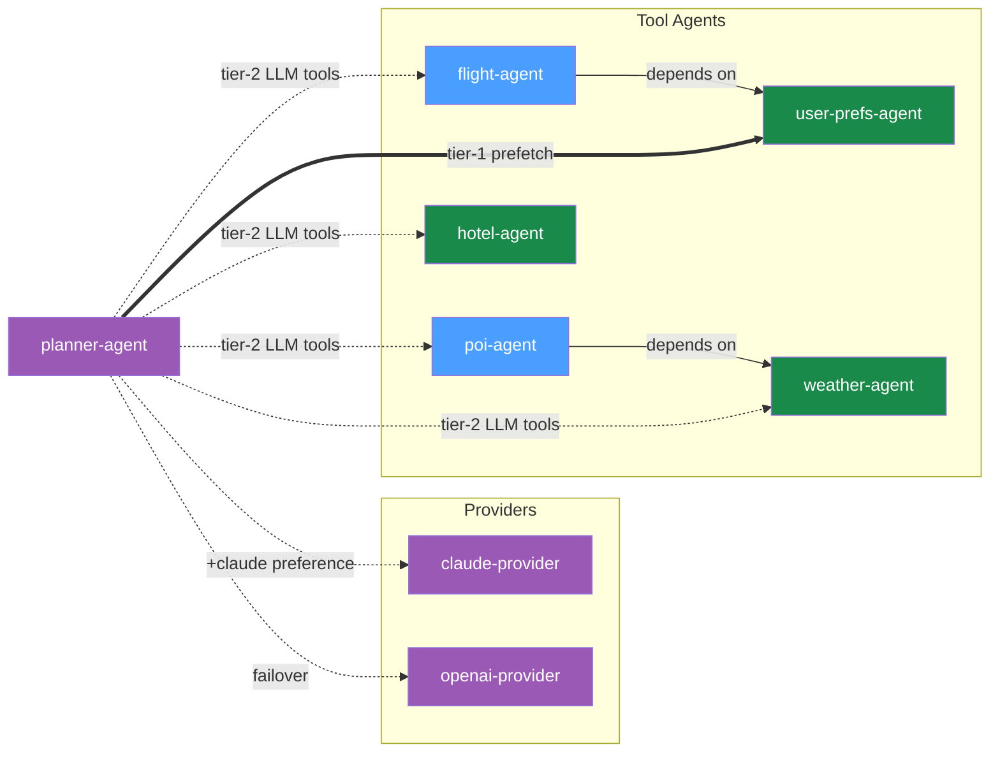
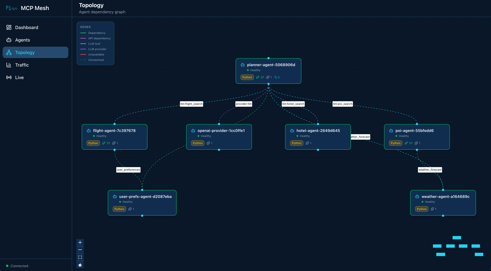
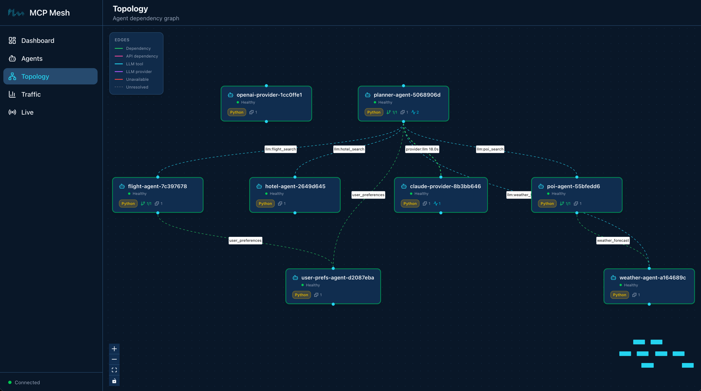

# Day 4 -- Multiple Providers and Dependency Tiers

Your planner works, but it's locked to one LLM provider and generates plans
from imagination. Today you'll add a second LLM provider, introduce
preference-based routing with automatic failover, and connect the planner to
your tool agents so it plans with real flight and hotel data.

## What we're building today



Eight agents. The five tool agents you already know (blue and green), two LLM
providers in purple (Claude and OpenAI), and the planner -- now connected to
everything. The solid arrow is a tier-1 dependency (prefetched before the LLM
call). The dashed arrows are tier-2 (tools the LLM discovers and calls during
its reasoning loop).

Today has six parts:

1. **Add a second LLM provider** -- wrap OpenAI as a mesh capability
2. **Provider tags and preference routing** -- teach `+`/`-` tag operators
3. **Provider swap -- zero code changes** -- stop Claude, watch failover
4. **Connect the planner to tool agents** -- tier-1 prefetch and tier-2 tools
5. **Call the enhanced planner** -- generate a plan with real data
6. **Walk the trace** -- see the full call tree across all eight agents

## Part 1: Add a second LLM provider

!!! note "API keys required"
    You need both `ANTHROPIC_API_KEY` and `OPENAI_API_KEY` set in your
    environment. If you don't have an OpenAI key,
    [create one here](https://platform.openai.com/api-keys) and export it:
    `export OPENAI_API_KEY=sk-...`

The OpenAI provider follows the exact same pattern as the Claude provider from
Day 3. Same decorator, same zero-code body, different model string.

### Scaffold the provider

```shell
$ meshctl scaffold --name openai-provider --agent-type llm-provider --model openai/gpt-4o-mini --port 9108
```

Replace the generated `main.py` with:

```python
--8<-- "examples/tutorial/trip-planner/day-04/python/openai-provider/main.py:full_file"
```

The only differences from `claude-provider`:

- **`model="openai/gpt-4o-mini"`** -- LiteLLM routes this to the OpenAI API
  using your `OPENAI_API_KEY`.
- **`tags=["openai", "gpt"]`** -- different tags so consumers can
  distinguish between providers.

The capability name is still `"llm"` -- both providers advertise the same
capability. This is how the mesh supports multiple providers for the same
function.

### Start the provider

```shell
$ meshctl start --dte --debug -d -w openai-provider/main.py
```

Check the mesh:

```shell
$ meshctl list
```

```
Registry: running (http://localhost:8000) - 8 healthy

NAME                        RUNTIME   TYPE    STATUS    DEPS   ENDPOINT           AGE   LAST SEEN
claude-provider-0a89e8c6    Python    Agent   healthy   0/0    10.0.0.74:49486    1m    2s
flight-agent-a939da4b       Python    Agent   healthy   1/1    10.0.0.74:49480    1m    2s
hotel-agent-9932ac09        Python    Agent   healthy   0/0    10.0.0.74:49482    1m    2s
openai-provider-40a5c637    Python    Agent   healthy   0/0    10.0.0.74:49485    4s    4s
planner-agent-fb07b918      Python    Agent   healthy   1/1    10.0.0.74:49484    1m    2s
poi-agent-97bd9fcc          Python    Agent   healthy   1/1    10.0.0.74:49481    1m    2s
user-prefs-agent-87506c4a   Python    Agent   healthy   0/0    10.0.0.74:49479    1m    2s
weather-agent-a6f7ea5e      Python    Agent   healthy   0/0    10.0.0.74:49483    1m    2s
```

Eight agents. List the tools:

```shell
$ meshctl list --tools
```

```
TOOL                      AGENT                       CAPABILITY           TAGS
--------------------------------------------------------------------------------------------
claude_provider           claude-provider-0a89e8c6    llm                  claude
flight_search             flight-agent-a939da4b       flight_search        flights,travel
get_user_prefs            user-prefs-agent-87506c4a   user_preferences     preferences,travel
get_weather               weather-agent-a6f7ea5e      weather_forecast     weather,travel
hotel_search              hotel-agent-9932ac09        hotel_search         hotels,travel
openai_provider           openai-provider-40a5c637    llm                  openai,gpt
plan_trip                 planner-agent-fb07b918      trip_planning        planner,travel,llm
search_pois               poi-agent-97bd9fcc          poi_search           poi,travel

8 tool(s) found
```

Two tools with capability `llm` -- `claude_provider` and `openai_provider`.
Both are available. Right now, if the planner asks for `{"capability": "llm"}`,
the registry picks one at random. You need a way to express a preference.

## Part 2: Provider tags and preference routing

MCP Mesh tags support three operators for consumer-side selection:

| Prefix | Meaning   | Example                               |
| ------ | --------- | ------------------------------------- |
| (none) | Required  | `"api"` -- must have this tag         |
| `+`    | Preferred | `"+claude"` -- bonus if present       |
| `-`    | Excluded  | `"-deprecated"` -- reject if present  |

These operators are for the **consumer** side only (the `provider=` or
`dependencies=` spec). When you declare tags on your provider, use plain
strings without prefixes.

The matching algorithm:

1. **Filter** -- remove candidates with any excluded tag (`-`)
2. **Require** -- keep only candidates with all required tags (no prefix)
3. **Score** -- add bonus points for each preferred tag (`+`) present
4. **Select** -- return the highest-scoring candidate

### Update the planner's provider selection

In Day 3, the planner used `provider={"capability": "llm"}` -- any provider
will do. Now add a preference for Claude:

```python
--8<-- "examples/tutorial/trip-planner/day-04/python/planner-agent/main.py:provider_selection"
```

`+claude` means: "prefer a provider tagged `claude`. If one is available, route
there. If not, fall back to any other provider with capability `llm`." The `+`
makes it a preference, not a requirement -- the planner still works even if
Claude is down.

Compare with alternatives:

- `"claude"` (no prefix) -- **required**. If Claude is down, the call fails.
  No fallback.
- `"+claude"` -- **preferred**. If Claude is down, route to the next available
  provider. Automatic failover.
- `"-gemini"` -- **excluded**. Never route to a provider tagged `gemini`, even
  if it's the only one available.

## Part 3: Provider swap -- zero code changes

This is where capability-based routing pays off. You'll call the planner
three times, stopping and restarting Claude between calls, and watch the
trace show different providers without changing a single line of code.

### Call 1: Claude is preferred and available

```shell
$ meshctl call plan_trip '{"destination":"Kyoto","dates":"June 1-5, 2026","budget":"$2000"}' --trace
```

The response is a Kyoto itinerary. Check the trace:

```shell
$ meshctl trace <trace-id>
```

```
Call Tree for trace 16f53c4095e481d329515600024f365c
════════════════════════════════════════════════════════════

└─ plan_trip (planner-agent) [18349ms] ✓
   ├─ get_user_prefs (user-prefs-agent) [1ms] ✓
   └─ claude_provider (claude-provider) [18308ms] ✓
      ├─ search_pois (poi-agent) [31ms] ✓
      │  └─ get_weather (weather-agent) [1ms] ✓
      ├─ get_weather (weather-agent) [0ms] ✓
      ├─ get_weather (weather-agent) [0ms] ✓
      └─ hotel_search (hotel-agent) [1ms] ✓

────────────────────────────────────────────────────────────
Summary: 11 spans across 6 agents | 18.35s | ✓
```

The planner routed to `claude_provider`. The tool calls you see under the
provider (`search_pois`, `get_weather`, `hotel_search`) are tier-2 calls --
Claude decided to call those tools during its reasoning loop. More on that in
Part 4.

### Call 2: Stop Claude, watch failover

```shell
$ meshctl stop claude-provider
```

```
Agent 'claude-provider' stopped
```

Now call the planner again. Same code, same arguments, same mesh:

```shell
$ meshctl call plan_trip '{"destination":"Tokyo","dates":"June 10-14, 2026","budget":"$3000"}' --trace
```

The response is a Tokyo itinerary -- generated by GPT, not Claude. Check the
trace:

```shell
$ meshctl trace <trace-id>
```

```
Call Tree for trace 2c71f26f5df8bbe8efbdb36f4ddbbea8
════════════════════════════════════════════════════════════

└─ plan_trip (planner-agent) [15963ms] ✓
   ├─ get_user_prefs (user-prefs-agent) [0ms] ✓
   └─ openai_provider (openai-provider) [15928ms] ✓
      ├─ flight_search (flight-agent) [22ms] ✓
      │  └─ get_user_prefs (user-prefs-agent) [0ms] ✓
      ├─ hotel_search (hotel-agent) [0ms] ✓
      └─ search_pois (poi-agent) [12ms] ✓
         └─ get_weather (weather-agent) [0ms] ✓

────────────────────────────────────────────────────────────
Summary: 12 spans across 7 agents | 15.96s | ✓
```

`openai_provider (openai-provider)`. Same planner code, same tools, different
LLM. No code change, no config change, no restart. The registry saw that
Claude was down, found another healthy provider with capability `llm`, and
routed there.



### Call 3: Restart Claude, verify preference

```shell
$ meshctl start --dte --debug -d -w claude-provider/main.py
```

Wait a few seconds for registration, then call again:

```shell
$ meshctl call plan_trip '{"destination":"Osaka","dates":"June 20-22, 2026","budget":"$1500"}' --trace
```

Check the trace:

```shell
$ meshctl trace <trace-id>
```

```
Call Tree for trace d208aeaebcc78ebfdaed968eebbeae28
════════════════════════════════════════════════════════════

└─ plan_trip (planner-agent) [18020ms] ✓
   ├─ get_user_prefs (user-prefs-agent) [0ms] ✓
   └─ claude_provider (claude-provider) [17984ms] ✓
      ├─ flight_search (flight-agent) [13ms] ✓
      │  └─ get_user_prefs (user-prefs-agent) [0ms] ✓
      ├─ get_weather (weather-agent) [0ms] ✓
      ├─ search_pois (poi-agent) [19ms] ✓
      │  └─ get_weather (weather-agent) [0ms] ✓
      └─ hotel_search (hotel-agent) [0ms] ✓

────────────────────────────────────────────────────────────
Summary: 18 spans across 7 agents | 18.02s | ✓
```

Back to `claude_provider`. The `+claude` preference kicks in again because
Claude is healthy and has the highest tag score.



Notice that `openai-provider` is still healthy and connected to the mesh. The planner routes to `claude-provider` because of the `+claude` preference tag — not because OpenAI is unavailable. Both providers are ready; mesh picks the preferred one.

Three calls, three traces, two different providers. The planner's code didn't
change once.

## Part 4: Connect the planner to tool agents

On Day 3, the planner generated itineraries from the LLM's training data --
no real flight prices, no actual hotel availability. Today you'll connect it
to your tool agents using two dependency mechanisms.

### Tier-1: prefetch dependencies

Tier-1 dependencies are fetched **before** the LLM call. Your code calls them
explicitly and injects the results into the prompt context. The LLM always
sees this data.

For the planner, that's `user_preferences` -- fetch the user's travel
preferences and include them in every prompt:

```python
--8<-- "examples/tutorial/trip-planner/day-04/python/planner-agent/main.py:tier1_prefetch"
```

This is the same `dependencies=[...]` syntax from Day 2. The
`user_prefs` parameter is injected by mesh DI, just like
`flight-agent` gets its `user_prefs` dependency. The planner calls it
before the LLM call and formats the result into a preferences summary string.

### Tier-2: LLM-discoverable tools

Tier-2 tools are made available to the LLM during its reasoning loop. The LLM
discovers them via their schemas and decides which to call based on the user's
question. You don't call them -- the LLM does.

```python
--8<-- "examples/tutorial/trip-planner/day-04/python/planner-agent/main.py:tier2_tools"
```

The `filter` parameter tells the registry which tools to expose to the LLM:

- `{"capability": "flight_search"}` -- flights
- `{"capability": "hotel_search"}` -- hotels
- `{"capability": "weather_forecast"}` -- weather
- `{"capability": "poi_search"}` -- points of interest

`filter_mode="all"` means include every matching tool (not just the best
match per capability). `max_iterations=10` gives the LLM up to 10 rounds
of tool calling -- enough to search flights, check hotels, look up weather,
and find attractions in a single planning session.

### The two tiers together

Here is the updated planner with both tiers:

```python
--8<-- "examples/tutorial/trip-planner/day-04/python/planner-agent/main.py:llm_function"
```

The execution flow:

1. **Tier-1**: `user_prefs` is called explicitly. The result is formatted
   and passed as `context={"user_preferences": prefs_summary}` to the LLM
   call. The Jinja template renders it into the system prompt.
2. **Tier-2**: `flight_search`, `hotel_search`, `get_weather`, `search_pois`
   are presented to the LLM as callable tools. The LLM decides which to call
   during `await llm(...)`.

The distinction matters:

- **Tier-1** runs before the LLM, every time. You control what data the LLM
  sees. User preferences are always in the prompt.
- **Tier-2** runs during the LLM's reasoning. The LLM chooses whether to
  search for flights or just answer from training data. You control which
  tools are available; the LLM controls which ones to use.

### The updated prompt template

The Jinja template now includes user preferences:

```jinja
--8<-- "examples/tutorial/trip-planner/day-04/python/planner-agent/prompts/plan_trip.j2:full_file"
```

The new guidelines tell the LLM to use the available tools for real data
rather than guessing. The `{{ user_preferences }}` variable is populated
from the tier-1 prefetch.

## Part 5: Call the enhanced planner

With all eight agents running:

```shell
$ meshctl call plan_trip '{"destination":"Kyoto","dates":"June 1-5, 2026","budget":"$2000"}' --trace
```

The response now includes real data from your tool agents -- flight prices
from `flight-agent`, hotel options from `hotel-agent`, weather from
`weather-agent`, and attractions from `poi-agent`. The LLM weaves this
data into a coherent itinerary, respecting the user's preferences
(preferred airlines, minimum hotel stars, interests).

## Part 6: Walk the trace

```shell
$ meshctl trace <trace-id>
```

```
└─ plan_trip (planner-agent) [18349ms] ✓
   ├─ get_user_prefs (user-prefs-agent) [1ms] ✓
   └─ claude_provider (claude-provider) [18308ms] ✓
      ├─ search_pois (poi-agent) [31ms] ✓
      │  └─ get_weather (weather-agent) [1ms] ✓
      ├─ get_weather (weather-agent) [0ms] ✓
      ├─ get_weather (weather-agent) [0ms] ✓
      └─ hotel_search (hotel-agent) [1ms] ✓
```

This is the most complex trace in the tutorial so far. Read it top to bottom:

1. **`plan_trip (planner-agent)`** -- the entry point. Receives the user's
   request.
2. **`get_user_prefs (user-prefs-agent)`** -- tier-1 prefetch. The planner's
   code calls this explicitly before the LLM. Takes 1ms. User preferences
   are now in the prompt context.
3. **`claude_provider (claude-provider)`** -- the LLM call. The planner
   sends the rendered prompt (with user preferences baked in) plus the
   user message to Claude.
4. **`search_pois`, `get_weather`, `hotel_search`** -- tier-2 tool calls.
   Claude decided to call these tools during its reasoning loop. Each tool
   call appears as a child span under `claude_provider`. Notice that
   `search_pois` triggers its own DI call to `get_weather` (from Day 2) --
   the dependency chain is fully traced.

The planner's total time (~18 seconds) is mostly Claude's inference. The mesh
overhead -- discovering tools, routing to providers, serializing requests --
adds single-digit milliseconds.

!!! tip "Trace depth"
    The trace tree can go multiple levels deep. `plan_trip` calls
    `claude_provider`, which calls `search_pois`, which calls `get_weather`.
    Each hop is a separate span, linked by trace context that propagates
    automatically across mesh calls. You get this for free -- no manual
    instrumentation.

## Leave it running

Your eight agents are running in watch mode. On Day 5 you'll add an HTTP
gateway. No need to stop between chapters.

## Troubleshooting

**`OPENAI_API_KEY` not set.** The `openai-provider` agent needs an OpenAI
API key. Set it in your environment:

```shell
$ export OPENAI_API_KEY=sk-...
```

If the key is missing, the provider will start but LLM calls routed to it
will fail with an authentication error.

**Provider swap doesn't work.** Both providers must have the same capability
name (`"llm"`). Check with `meshctl list --tools` -- both `claude_provider`
and `openai_provider` should show capability `llm`. If one shows a different
capability, update the `capability` parameter in `@mesh.llm_provider`.

**Tool calls not appearing in trace.** Check two things:

1. The planner's `filter` parameter lists the correct capabilities
   (`flight_search`, `hotel_search`, etc.).
2. `max_iterations` is high enough (10 is good). If set to 1, the LLM gets
   one shot and may not call any tools.

**Planner returns a generic plan without real data.** The LLM didn't call
the tier-2 tools. This can happen if:

- The `filter` capabilities don't match any registered tools. Verify with
  `meshctl list --tools`.
- The system prompt doesn't instruct the LLM to use tools. Check that
  `plan_trip.j2` includes the guideline about using available tools.
- `filter_mode` is set to something other than `"all"`. Use `"all"` to
  expose all matching tools.

**Tier-1 prefetch not working.** Check that `user-prefs-agent` is running
and the planner shows `1/1` in the DEPS column of `meshctl list`. If it
shows `0/1`, the dependency hasn't resolved yet -- wait a few seconds and
check again.

## Recap

You added a provider, swapped it with zero code changes, and connected the
planner to real data sources. The planner's code changed in two places: a tag
preference and a dependency list. Everything else -- failover, tool discovery,
trace propagation -- happened at runtime.

## See also

- `meshctl man tags` -- the full tag matching reference, including `+`/`-`
  operators and scoring
- `meshctl man llm` -- the `@mesh.llm` decorator reference, including
  `filter`, `filter_mode`, and `max_iterations`
- `meshctl man capabilities` -- capability selectors and how they compose
  with tags and versions

## Next up

[Day 5](day-05-http-gateway.md) wraps the trip planner in a FastAPI gateway,
exposing it as a REST API with `@mesh.route`. Five lines of code, zero business
logic in the gateway -- just HTTP to mesh and back.
