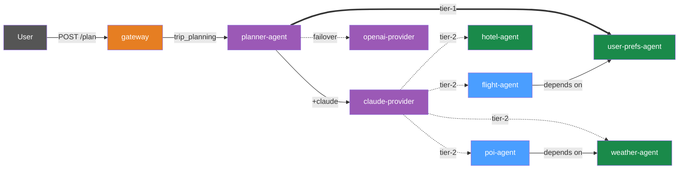

# Day 5 -- HTTP Gateway

Your trip planner works from the terminal via `meshctl call`. But real users
need an HTTP API. Today you'll wrap the planner in a FastAPI gateway -- a thin
REST endpoint that bridges HTTP requests to mesh tool calls. By the end of
Part 1, you'll have a complete, callable trip planning API.

## What we're building today



Nine agents. Everything from Day 4 (blue, green, purple) plus the gateway in
orange. The user sends an HTTP request to the gateway. The gateway calls the
planner through mesh dependency injection. The planner calls the LLM provider,
which calls the tool agents. The gateway doesn't know any of this -- it just
calls `plan_trip` and returns the result.

Today has four parts:

1. **Build the gateway** -- a FastAPI app with `@mesh.route`
2. **Start the gateway** -- add it to your running mesh
3. **Call the API** -- `curl` the gateway and compare with `meshctl call`
4. **Walk the trace** -- see the full call tree from HTTP to tool agents

## Part 1: Build the gateway

### Scaffold the gateway

```shell
$ meshctl scaffold --name gateway --agent-type api --lang python
```

Replace the generated `main.py` with:

```python
--8<-- "examples/tutorial/trip-planner/day-05/python/gateway/main.py:full_file"
```

That's the entire gateway. Three imports, a health check, and one route handler.

### How @mesh.route works

`@mesh.route` is a decorator for FastAPI handlers that injects mesh
capabilities as function parameters -- the same dependency injection that
`@mesh.tool` uses, but for HTTP endpoints instead of MCP tools.

```python
--8<-- "examples/tutorial/trip-planner/day-05/python/gateway/main.py:plan_endpoint"
```

The key line is `@mesh.route(dependencies=["trip_planning"])`. This tells mesh:
"Before this handler runs, resolve the `trip_planning` capability and inject it
as a callable." The parameter name `plan_trip` matches the tool name registered
by `planner-agent`. The type hint `McpMeshTool` tells mesh to inject a tool
proxy.

The handler is five lines of code:

1. Parse the JSON body.
2. Check that the tool was injected (defensive -- it should always resolve if
   the planner is running).
3. Call the injected tool with the request parameters.
4. Return the result.

The gateway doesn't import the planner. It doesn't know the planner's URL. It
declares a dependency on `trip_planning`, and mesh injects a callable. When you
add new tool agents on Day 6, the gateway won't change -- it calls the planner,
and the planner discovers new tools automatically.

### Install dependencies

The gateway needs `fastapi` and `uvicorn`. If they're not already in your venv:

```shell
$ pip install fastapi uvicorn
```

## Part 2: Start the gateway

Your eight agents from Day 4 should still be running. Add the gateway:

```shell
$ meshctl start --debug -d -w gateway/main.py
```

Check the mesh:

```shell
$ meshctl list
```

```
Registry: running (http://localhost:8000) - 9 healthy

NAME                        RUNTIME   TYPE    STATUS    DEPS   ENDPOINT           AGE   LAST SEEN
claude-provider-0a89e8c6    Python    Agent   healthy   0/0    10.0.0.74:49486    10m   2s
flight-agent-a939da4b       Python    Agent   healthy   1/1    10.0.0.74:49480    10m   2s
gateway-7b3f2e91            Python    API     healthy   1/1    10.0.0.74:8080     4s    4s
hotel-agent-9932ac09        Python    Agent   healthy   0/0    10.0.0.74:49482    10m   2s
openai-provider-40a5c637    Python    Agent   healthy   0/0    10.0.0.74:49485    10m   2s
planner-agent-fb07b918      Python    Agent   healthy   1/1    10.0.0.74:49484    10m   2s
poi-agent-97bd9fcc          Python    Agent   healthy   1/1    10.0.0.74:49481    10m   2s
user-prefs-agent-87506c4a   Python    Agent   healthy   0/0    10.0.0.74:49479    10m   2s
weather-agent-a6f7ea5e      Python    Agent   healthy   0/0    10.0.0.74:49483    10m   2s
```

Nine agents. The gateway shows type `API` (not `Agent`) and its dependency
`1/1` resolved -- it found the `trip_planning` capability from
`planner-agent`.

List the tools:

```shell
$ meshctl list --tools
```

```
TOOL                      AGENT                       CAPABILITY           TAGS
--------------------------------------------------------------------------------------------
claude_provider           claude-provider-0a89e8c6    llm                  claude
flight_search             flight-agent-a939da4b       flight_search        flights,travel
get_user_prefs            user-prefs-agent-87506c4a   user_preferences     preferences,travel
get_weather               weather-agent-a6f7ea5e      weather_forecast     weather,travel
hotel_search              hotel-agent-9932ac09        hotel_search         hotels,travel
openai_provider           openai-provider-40a5c637    llm                  openai,gpt
plan_trip                 planner-agent-fb07b918      trip_planning        planner,travel,llm
search_pois               poi-agent-97bd9fcc          poi_search           poi,travel

8 tool(s) found
```

The gateway doesn't appear in the tool list -- it doesn't expose any tools. It
consumes the `trip_planning` capability via `@mesh.route`, not `@mesh.tool`.
This is the difference between an API agent and a tool agent: API agents are
HTTP entry points into the mesh, not MCP tool providers.

## Part 3: Call the API

### Via curl

```shell
$ curl -s -X POST http://localhost:8080/plan \
    -H "Content-Type: application/json" \
    -d '{"destination":"Kyoto","dates":"June 1-5, 2026","budget":"$2000"}'
```

```json
{
  "result": "## Kyoto Trip Itinerary: June 1-5, 2026\n\n**Budget: $2,000**\n\n### Day 1 (June 1) - Arrival & Eastern Kyoto\n\n**Morning:**\n- Arrive via SQ017 ($901) — preferred airline per your preferences\n- Check into Sakura Inn ($95/night, 3-star) — meets your minimum star rating\n\n**Afternoon:**\n- Visit Fushimi Inari Shrine (cultural — matches your interests)\n- Walk the thousand torii gates trail\n\n**Evening:**\n- Dinner at Nishiki Market area — street food tour (food interest)\n- Explore Gion district\n\n..."
}
```

A full trip itinerary, personalized with the user's preferences (preferred
airlines, hotel stars, interests), built from real data returned by your tool
agents.

### Via meshctl

For comparison, the same call through `meshctl`:

```shell
$ meshctl call plan_trip '{"destination":"Kyoto","dates":"June 1-5, 2026","budget":"$2000"}' --trace
```

Same result, different transport. The `curl` path goes
user -> gateway -> planner -> LLM -> tools. The `meshctl` path goes
user -> registry -> planner -> LLM -> tools. Both end up at the same planner
with the same tools.

## Part 4: Walk the trace

If you called via `meshctl --trace`, you got a trace ID. View it:

```shell
$ meshctl trace <trace-id>
```

```
Call Tree for trace a4e8b2c91f7d3e56a8120900037f48d1
════════════════════════════════════════════════════════════

└─ plan_trip (planner-agent) [17842ms] ✓
   ├─ get_user_prefs (user-prefs-agent) [1ms] ✓
   └─ claude_provider (claude-provider) [17803ms] ✓
      ├─ flight_search (flight-agent) [15ms] ✓
      │  └─ get_user_prefs (user-prefs-agent) [0ms] ✓
      ├─ hotel_search (hotel-agent) [1ms] ✓
      ├─ get_weather (weather-agent) [0ms] ✓
      ├─ search_pois (poi-agent) [22ms] ✓
      │  └─ get_weather (weather-agent) [0ms] ✓
      └─ get_weather (weather-agent) [0ms] ✓

────────────────────────────────────────────────────────────
Summary: 14 spans across 7 agents | 17.84s | ✓
```

The full call tree: planner prefetches user preferences (tier-1), calls Claude
(who calls flight, hotel, weather, and POI tools during its reasoning loop),
and returns the assembled itinerary. Every hop is a separate span with
sub-millisecond mesh overhead.

!!! tip "The thin wrapper pattern"
    The gateway has no business logic. It translates HTTP to mesh and mesh to
    HTTP. That's it. When you add a new tool agent on Day 6, the gateway
    doesn't change -- it calls the planner, and the planner discovers new tools
    automatically. If you need a second endpoint (say, `POST /flights` for
    direct flight search), you add one `@mesh.route` handler. The gateway
    stays thin.

## Cross-language gateway swap

!!! tip "Choose your adventure"
    One of mesh's strengths is that any agent -- including the gateway -- can be
    swapped for a different language without changing anything else. The planner,
    providers, and tool agents don't care what language the gateway is written in.

    Want to see this in action? Pick one:

    - **[Build the gateway in Spring Boot](../java/spring-boot-integration.md)** --
      same REST endpoints, same mesh DI, Java instead of Python
    - **[Build the gateway in Express](../typescript/express-integration.md)** --
      same endpoints, TypeScript
    - **Skip** -- continue to [Day 6](day-06-chat-history.md) with the FastAPI
      gateway

    Stop the Python gateway with `meshctl stop gateway`, build the replacement
    in your language of choice, and start it with `meshctl start`. The rest of
    the mesh keeps running.

## Part 1 complete

That's Part 1. You have a working trip planner: nine agents, two LLM providers
with automatic failover, dependency injection across tools and providers,
prompt templates, distributed traces, and an HTTP API. All of it running
locally with `meshctl start` and an observability stack in Docker.

Part 2 grows this into something production-shaped -- chat history, specialist
committees, Docker Compose packaging, Kubernetes deployment, and a full
observability walkthrough.

## Leave it running

Your nine agents are running in watch mode. On Day 6 you'll add Redis-backed
chat history. No need to stop between chapters.

## Troubleshooting

**Port 8080 already in use.** The gateway defaults to port 8080. If another
service is using that port, either stop the conflicting service or change the
port in `gateway/main.py`:

```python
uvicorn.run(app, host="0.0.0.0", port=8081, log_level="info")
```

**FastAPI not installed.** The gateway requires `fastapi` and `uvicorn`. If you
see `ModuleNotFoundError: No module named 'fastapi'`, install them in your
venv:

```shell
$ pip install fastapi uvicorn
```

**Gateway starts but curl fails.** Check three things:

1. The gateway is healthy: `meshctl list` should show `gateway` with status
   `healthy` and deps `1/1`.
2. You're using the correct port: check the `meshctl list` output for the
   gateway's endpoint.
3. The planner is running: the gateway depends on `trip_planning`. If the
   planner is down, the gateway starts but tool injection fails.

**curl returns an error response.** If the response is
`{"error": "trip_planning capability unavailable"}`, the planner hasn't
registered yet or its dependency on `llm` hasn't resolved. Check
`meshctl list` -- the planner should show `healthy` with deps `1/1`. Also
verify your LLM API keys are set (`ANTHROPIC_API_KEY` or `OPENAI_API_KEY`).

**curl returns empty or truncated response.** The LLM is still generating.
Trip planning calls take 15-20 seconds depending on the LLM provider. If
`curl` times out, increase the timeout:

```shell
$ curl -s --max-time 60 -X POST http://localhost:8080/plan ...
```

## Recap

You wrapped your trip planner in a five-line FastAPI handler, bridging HTTP to
mesh with `@mesh.route`. The gateway is a thin entry point -- no business
logic, no planner imports, no hardcoded URLs. It declares what it needs
(`trip_planning`), mesh injects a callable, and the handler forwards the
request. Two transports (curl and meshctl) reach the same planner through
different paths.

## See also

- `meshctl man fastapi` -- the full `@mesh.route` reference, including
  multiple dependencies, middleware configuration, and CORS setup
- `meshctl man decorators` -- the complete decorator reference
- `meshctl man capabilities` -- capability selectors and dependency resolution

## Next up

[Day 6](day-06-chat-history.md) adds Redis-backed chat history so users can
iterate on their trip plans across multiple turns.
