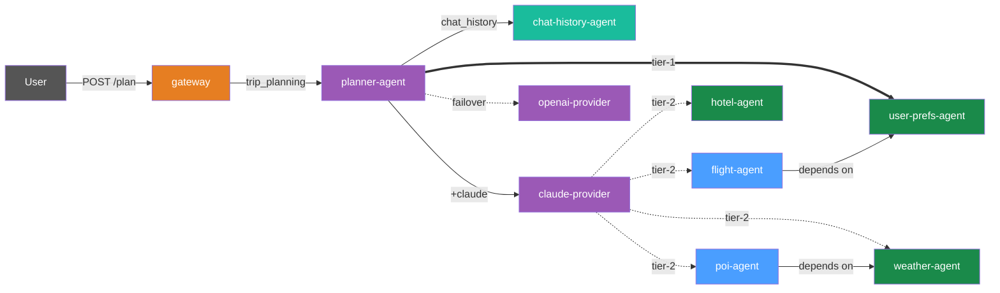
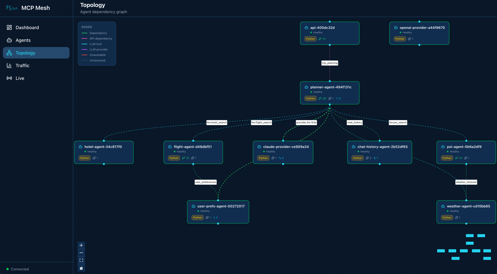

# Day 6 -- Chat History

Your trip planner generates great itineraries, but every call starts from
scratch. Real users iterate -- "make it cheaper," "add a beach day," "what
about hotels near the train station." Today you add conversation memory so the
planner remembers what you have discussed.

## What we're building today



Ten agents. Everything from Day 5 plus `chat-history-agent` in teal. The
planner fetches prior turns from chat history before calling the LLM, and saves
both the user message and the response afterward. The gateway stays thin -- it
just passes the session ID through.

Today has four parts:

1. **Build the chat history agent** -- a tool agent backed by Redis
2. **Update the planner** -- add history fetch and save around the LLM call
3. **Update the gateway** -- add session ID passthrough
4. **Walk the trace** -- see history calls in the distributed trace

## Part 1: Build the chat history agent

Chat history is just another mesh tool agent. The same dependency injection
that wires `flight-agent` wires `chat-history-agent`. There is no special
framework primitive for state -- you write an agent that wraps a data store,
and other agents call it like any other tool.

### Scaffold the agent

```shell
$ meshctl scaffold --name chat-history-agent --agent-type tool --port 9109
```

```
Created agent 'chat-history-agent' in chat-history-agent/

Generated files:
  chat-history-agent/
  ├── .dockerignore
  ├── Dockerfile
  ├── README.md
  ├── __init__.py
  ├── __main__.py
  ├── helm-values.yaml
  ├── main.py
  └── requirements.txt
```

### Add Redis to requirements

The agent needs `redis-py` to talk to the Redis instance from your
observability stack (Day 3's `docker-compose.observability.yml` already runs Redis on
port 6379):

```
--8<-- "examples/tutorial/trip-planner/day-06/python/chat-history-agent/requirements.txt"
```

### Replace main.py

Replace the generated `main.py` with:

```python
--8<-- "examples/tutorial/trip-planner/day-06/python/chat-history-agent/main.py:full_file"
```

Two tools, one capability. `save_turn` appends a JSON-encoded turn to a Redis
list keyed by session ID. `get_history` reads the most recent turns from that
list. Both tools share the `chat_history` capability -- when the planner
declares a dependency on `chat_history`, mesh injects a proxy that can call
either tool by name.

The Redis connection is straightforward: a module-level `redis.Redis` client
pointed at `localhost:6379` (configurable via environment variables for
Docker/Kubernetes deployment).

```python
--8<-- "examples/tutorial/trip-planner/day-06/python/chat-history-agent/main.py:redis_client"
```

### Why this works

Swap Redis for Postgres by editing one agent. Add encryption by extending one
agent. The gateway and planner do not move. mesh does not need a chat history
primitive -- the general abstraction (any MCP tool anywhere is a local function
call) handles it.

## Part 2: Update the planner

The planner gains chat history as a tier-1 dependency alongside user
preferences. It fetches history before the LLM call and saves turns after. The
gateway stays thin -- it just passes the session ID.

```python
--8<-- "examples/tutorial/trip-planner/day-06/python/planner-agent/main.py:full_file"
```

### Dependency declaration

The `@mesh.tool` decorator now declares two dependencies instead of one:

```python
--8<-- "examples/tutorial/trip-planner/day-06/python/planner-agent/main.py:tier1_prefetch"
```

Both `user_preferences` and `chat_history` are tier-1 dependencies -- resolved
before the tool function runs. The planner calls
`chat_history.call_tool("get_history", {...})` and
`chat_history.call_tool("save_turn", {...})` because the `chat_history`
capability exposes two tools. For `user_prefs`, the single-tool shorthand
(`await user_prefs(...)`) still works.

### History fetch

Before the LLM call, the planner fetches the conversation history for the
current session:

```python
--8<-- "examples/tutorial/trip-planner/day-06/python/planner-agent/main.py:chat_history_fetch"
```

### Multi-turn messages

When history is present, the planner passes the full message list to the LLM
instead of a single string:

```python
--8<-- "examples/tutorial/trip-planner/day-06/python/planner-agent/main.py:multi_turn"
```

The `@mesh.llm` decorator handles multi-turn natively -- pass a list of
`{"role": "...", "content": "..."}` dicts as the first argument to `llm()` and
the decorator builds the correct LLM API call. The system prompt from the
Jinja2 template is inserted automatically.

### History save

After the LLM responds, the planner saves both the user turn and the assistant
turn so the next request sees them:

```python
--8<-- "examples/tutorial/trip-planner/day-06/python/planner-agent/main.py:chat_history_save"
```

## Part 3: Update the gateway

The gateway gains a `session_id` parameter. Everything else stays the same --
one dependency, five lines of code.

```python
--8<-- "examples/tutorial/trip-planner/day-06/python/gateway/main.py:full_file"
```

### Session ID

```python
--8<-- "examples/tutorial/trip-planner/day-06/python/gateway/main.py:session_id"
```

If the client sends `X-Session-Id`, the gateway uses it. Otherwise it generates
a UUID and returns it in the response so the client can use it for follow-up
calls. The gateway passes `session_id` to the planner alongside the trip
parameters -- the planner handles the rest.

### Start and test

#### Install redis-py

If `redis` is not already in your venv:

```shell
$ pip install redis
```

#### Start the chat history agent

Your nine agents from Day 5 should still be running. Add `chat-history-agent`:

```shell
$ meshctl start --dte --debug -d -w chat-history-agent/main.py
```

If you are starting fresh, launch everything at once:

```shell
$ meshctl start --dte --debug -d -w \
    chat-history-agent/main.py \
    claude-provider/main.py \
    openai-provider/main.py \
    flight-agent/main.py \
    hotel-agent/main.py \
    weather-agent/main.py \
    poi-agent/main.py \
    user-prefs-agent/main.py \
    planner-agent/main.py \
    gateway/main.py
```

Check the mesh:

```shell
$ meshctl list
```

```
Registry: running (http://localhost:8000) - 10 healthy

NAME                             RUNTIME   TYPE    STATUS    DEPS   ENDPOINT           AGE   LAST SEEN
chat-history-agent-3f2a1b9c      Python    Agent   healthy   0/0    10.0.0.74:9109     8s    2s
claude-provider-0a89e8c6         Python    Agent   healthy   0/0    10.0.0.74:49486    15m   2s
flight-agent-a939da4b            Python    Agent   healthy   1/1    10.0.0.74:49480    15m   2s
gateway-7b3f2e91                 Python    API     healthy   1/1    10.0.0.74:8080     5m    2s
hotel-agent-9932ac09             Python    Agent   healthy   0/0    10.0.0.74:49482    15m   2s
openai-provider-40a5c637         Python    Agent   healthy   0/0    10.0.0.74:49485    15m   2s
planner-agent-fb07b918           Python    Agent   healthy   2/2    10.0.0.74:49484    15m   2s
poi-agent-97bd9fcc               Python    Agent   healthy   1/1    10.0.0.74:49481    15m   2s
user-prefs-agent-87506c4a        Python    Agent   healthy   0/0    10.0.0.74:49479    15m   2s
weather-agent-a6f7ea5e           Python    Agent   healthy   0/0    10.0.0.74:49483    15m   2s
```

Ten agents. The gateway shows `1/1` dependency -- just `trip_planning`. The
planner shows `2/2` dependencies -- it resolved both `user_preferences` and
`chat_history`.

List the tools:

```shell
$ meshctl list --tools
```

```
TOOL                      AGENT                            CAPABILITY           TAGS
-----------------------------------------------------------------------------------------------
claude_provider           claude-provider-0a89e8c6         llm                  claude
flight_search             flight-agent-a939da4b            flight_search        flights,travel
get_history               chat-history-agent-3f2a1b9c      chat_history         chat,history,state
get_user_prefs            user-prefs-agent-87506c4a        user_preferences     preferences,travel
get_weather               weather-agent-a6f7ea5e           weather_forecast     weather,travel
hotel_search              hotel-agent-9932ac09             hotel_search         hotels,travel
openai_provider           openai-provider-40a5c637         llm                  openai,gpt
plan_trip                 planner-agent-fb07b918           trip_planning        planner,travel,llm
save_turn                 chat-history-agent-3f2a1b9c      chat_history         chat,history,state
search_pois               poi-agent-97bd9fcc               poi_search           poi,travel

10 tool(s) found
```

Two new tools: `save_turn` and `get_history`, both from `chat-history-agent`.



#### Multi-turn demo

Turn 1 -- plan a trip:

```shell
$ curl -s -X POST http://localhost:8080/plan \
    -H "Content-Type: application/json" \
    -H "X-Session-Id: test-session-1" \
    -d '{"destination":"Kyoto","dates":"June 1-5, 2026","budget":"$2000"}'
```

```json
{
  "result": "## Kyoto Trip Itinerary: June 1-5, 2026\n\n**Budget: $2,000**\n\n### Day 1 (June 1) - Arrival & Eastern Kyoto\n\n**Morning:**\n- Arrive via SQ017 ($901) — preferred airline per your preferences\n- Check into Sakura Inn ($95/night, 3-star) — meets your minimum star rating\n\n**Afternoon:**\n- Visit Fushimi Inari Shrine (cultural — matches your interests)\n...",
  "session_id": "test-session-1"
}
```

Turn 2 -- iterate on the plan:

```shell
$ curl -s -X POST http://localhost:8080/plan \
    -H "Content-Type: application/json" \
    -H "X-Session-Id: test-session-1" \
    -d '{"destination":"Kyoto","dates":"June 1-5, 2026","budget":"$1500","message":"Can you make it cheaper? I want to stay under $1500."}'
```

```json
{
  "result": "## Revised Kyoto Itinerary: June 1-5, 2026\n\n**Budget: $1,500** (revised from $2,000)\n\n### Changes from Previous Plan\n- Switched to MH007 ($842, saving $59) — still a preferred airline\n- Downgraded to Capsule Stay ($45/night, saving $200 over 4 nights)\n- Replaced paid attractions with free alternatives\n\n### Day 1 (June 1) - Arrival\n...",
  "session_id": "test-session-1"
}
```

The second response references the first plan -- it knows about the previous
hotel choice, the original budget, and the itinerary structure. This is the
conversation history at work: the planner fetched the prior turns from Redis,
passed them to the LLM as a multi-turn message list, and the LLM responded
with awareness of the full dialogue.

Turn 3 -- ask a question:

```shell
$ curl -s -X POST http://localhost:8080/plan \
    -H "Content-Type: application/json" \
    -H "X-Session-Id: test-session-1" \
    -d '{"destination":"Kyoto","dates":"June 1-5, 2026","budget":"$1500","message":"What if I skip the flight and take the Shinkansen from Tokyo instead?"}'
```

The planner sees all three turns and adjusts accordingly. Each turn adds to
the Redis list, and the next request reads the full history.

## Part 4: Walk the trace

Open the mesh UI to view the trace:

```shell
$ meshctl start --ui -d
```

Navigate to `http://localhost:3080` and click the most recent trace. The call
tree shows the planner's orchestration -- history fetch and save happen inside
the planner, not the gateway:

```
└─ plan_trip (planner-agent) [18542ms] ✓
   ├─ get_history (chat-history-agent) [2ms] ✓
   ├─ get_user_prefs (user-prefs-agent) [1ms] ✓
   ├─ claude_provider (claude-provider) [18451ms] ✓
   │  ├─ flight_search (flight-agent) [14ms] ✓
   │  │  └─ get_user_prefs (user-prefs-agent) [0ms] ✓
   │  ├─ hotel_search (hotel-agent) [1ms] ✓
   │  ├─ get_weather (weather-agent) [0ms] ✓
   │  └─ search_pois (poi-agent) [21ms] ✓
   │     └─ get_weather (weather-agent) [0ms] ✓
   ├─ save_turn (chat-history-agent) [1ms] ✓
   └─ save_turn (chat-history-agent) [1ms] ✓
```

The flow reads top to bottom: fetch history (2ms), prefetch user preferences
(1ms), run the LLM (18s, most of which is the LLM reasoning loop), save the
user message (1ms), save the assistant response (1ms). The chat history calls
add negligible overhead -- Redis round-trips are sub-millisecond.

!!! note "Stateful concerns are just agents"
    Redis-backed chat history, user profiles, booking state, audit logs -- they
    are all the same pattern: a mesh tool agent wrapping a data store. mesh does
    not need a special primitive for each one. The general abstraction -- any
    MCP tool anywhere is a local function call -- handles them all. Want to swap
    Redis for Postgres? Edit one agent. Want to add message encryption? Extend
    one agent. The gateway and planner do not change.

## Leave it running

Your ten agents are running in watch mode. On Day 7 you will add a committee
of specialists. No need to stop between chapters.

## Troubleshooting

**Redis connection refused.** The chat-history-agent connects to Redis on
`localhost:6379`. Make sure the observability stack is running:

```shell
$ docker compose -f docker-compose.observability.yml up -d
```

Check Redis is healthy:

```shell
$ docker compose -f docker-compose.observability.yml ps redis
```

**History not persisting across calls.** Verify you are sending the same
`X-Session-Id` header in both requests. If the header is missing, the gateway
generates a new UUID for each call -- each turn gets its own session with no
shared history. Check the `session_id` field in the response.

**Second turn does not reference the first.** Three things to check:

1. The `chat_history` dependency resolved: `meshctl list` should show the
   planner with `2/2` deps.
2. Redis contains the turns: `redis-cli LRANGE chat:test-session-1 0 -1`
   should show the saved JSON.
3. The planner received the history: check the trace for `get_history` returning
   a non-empty list. If the planner's `max_iterations` is too low, the LLM may
   not fully process the history before hitting the iteration cap.

**ModuleNotFoundError: No module named 'redis'.** Install `redis-py` in your
venv:

```shell
$ pip install redis
```

## Recap

You added multi-turn chat history to the trip planner by building one new
agent and updating two existing ones. The chat-history-agent wraps Redis with
two tools (`save_turn`, `get_history`). The planner owns the full chat
lifecycle -- it fetches history before the LLM call and saves turns after. The
gateway stays thin: one dependency, session ID passthrough. No framework
changes, no special chat primitives -- just another mesh tool agent wired
through dependency injection.

## See also

- `meshctl man decorators` -- the `@mesh.tool` and `@mesh.route` decorator
  reference
- `meshctl man dependency-injection` -- how DI resolves multi-tool capabilities
- `meshctl man llm` -- multi-turn message format for `llm()` calls

## Next up

[Day 7](day-07-committee.md) adds a committee of specialists -- three LLM
agents (budget analyst, adventure advisor, logistics planner) that the planner
consults in parallel before producing the final itinerary.
