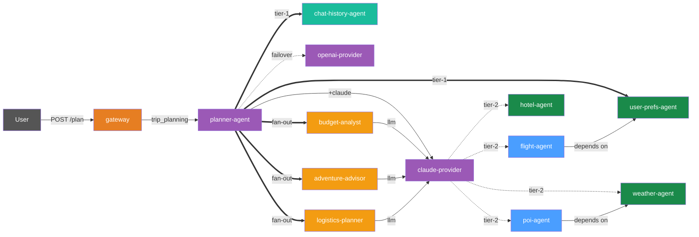
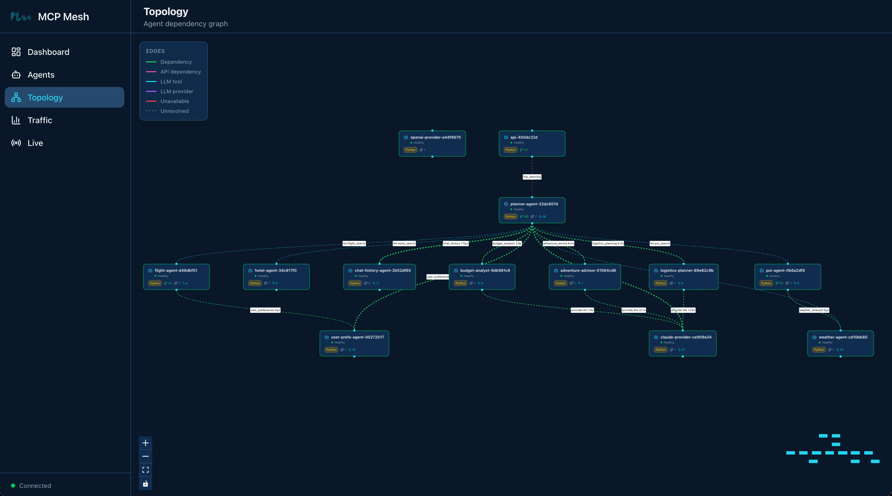

# Day 7 -- Committee of Specialists

Your planner generates solid itineraries, but a single LLM perspective has
blind spots. A budget-conscious traveler needs cost analysis. An adventurous
one needs hidden gems. Everyone needs logistics that actually work. Today you
add three specialist agents -- each with its own expertise -- and have the
planner consult all of them before producing the final plan.

## What we're building today



Thirteen agents. Everything from Day 6 plus three specialists in gold. The
planner generates a base itinerary, then fans out to three specialist LLM
agents in parallel. Each specialist returns structured data -- a Pydantic
model -- which the planner synthesizes into the final response.

Today has five parts:

1. **Structured outputs** -- Pydantic return types on `@mesh.llm` agents
2. **Build the specialists** -- scaffold three LLM agents with structured outputs
3. **Update the planner** -- add committee dependencies and parallel fan-out
4. **Start and test** -- launch 13 agents, call the planner, see enhanced results
5. **Walk the trace** -- fan-out trace showing the planner calling specialists in parallel

## Part 1: Structured outputs

When an `@mesh.llm` function returns `str`, the LLM's text response passes
through as-is. When it returns a Pydantic `BaseModel`, mesh instructs the LLM
to produce JSON matching the schema and validates the response automatically.
No special parameter needed -- the return type annotation controls format.

Here is the budget specialist's output model:

```python
--8<-- "examples/tutorial/trip-planner/day-07/python/budget-analyst/main.py:output_model"
```

The `BudgetAnalysis` model has three fields: `total_estimated` (an integer),
`savings_tips` (a list of strings), and `budget_breakdown` (a list of
`BudgetItem` sub-models with per-category costs). When the LLM returns, mesh
validates the response against this schema. If the LLM produces invalid JSON,
mesh retries automatically.

!!! tip "Use typed models, not dict"
    Define typed Pydantic sub-models (like `BudgetItem`) instead of bare `dict` for
    list fields. Typed models produce explicit JSON schemas that work across all LLM
    providers -- Claude, GPT, Gemini -- without schema compatibility issues. If you
    use `list[dict]`, some providers may reject the schema or return unpredictable
    field names. Typed models also give the LLM a clearer contract, producing more
    consistent results.

The same pattern applies to the other two specialists. Each defines its own
Pydantic model with fields specific to its domain.

## Part 2: Build the specialists

### Budget analyst

Scaffold the agent:

```shell
$ meshctl scaffold --name budget-analyst --agent-type llm-agent --port 9110
```

```
Created agent 'budget-analyst' in budget-analyst/

Generated files:
  budget-analyst/
  ├── .dockerignore
  ├── Dockerfile
  ├── README.md
  ├── __init__.py
  ├── __main__.py
  ├── helm-values.yaml
  ├── main.py
  ├── prompts/
  │   └── budget-analyst.jinja2
  └── requirements.txt
```

Replace `main.py` with:

```python
--8<-- "examples/tutorial/trip-planner/day-07/python/budget-analyst/main.py:full_file"
```

The function takes `destination`, `plan_summary`, and `budget` as input. It
calls the LLM with a single prompt, and the return type `BudgetAnalysis`
tells mesh to validate the response as structured JSON. The `max_iterations=1`
setting means no tool loop -- the specialist makes one LLM call and returns.

Replace the prompt template at `prompts/budget_analysis.j2`:

```jinja
--8<-- "examples/tutorial/trip-planner/day-07/python/budget-analyst/prompts/budget_analysis.j2:full_file"
```

### Adventure advisor

Scaffold:

```shell
$ meshctl scaffold --name adventure-advisor --agent-type llm-agent --port 9111
```

Replace `main.py`:

```python
--8<-- "examples/tutorial/trip-planner/day-07/python/adventure-advisor/main.py:full_file"
```

The `AdventureAdvice` model returns `unique_experiences` (a list of
`Experience` sub-models with name, description, and why_special),
`local_gems` (list of strings), and `off_beaten_path` (a paragraph of text).

Replace the prompt at `prompts/adventure_advice.j2`:

```jinja
--8<-- "examples/tutorial/trip-planner/day-07/python/adventure-advisor/prompts/adventure_advice.j2:full_file"
```

### Logistics planner

Scaffold:

```shell
$ meshctl scaffold --name logistics-planner --agent-type llm-agent --port 9112
```

Replace `main.py`:

```python
--8<-- "examples/tutorial/trip-planner/day-07/python/logistics-planner/main.py:full_file"
```

The `LogisticsPlan` model returns `daily_schedule`, `transit_tips`, and
`time_optimization`. Each specialist follows the same pattern: define a
Pydantic model, write a Jinja prompt, return the model type from the function.

Replace the prompt at `prompts/logistics_plan.j2`:

```jinja
--8<-- "examples/tutorial/trip-planner/day-07/python/logistics-planner/prompts/logistics_plan.j2:full_file"
```

## Part 3: Update the planner

The planner needs two changes: declare the specialist capabilities as
dependencies, and fan out to them after generating the base plan.

### Add dependencies

The `@mesh.tool` decorator now lists four dependencies instead of one:

```python
--8<-- "examples/tutorial/trip-planner/day-07/python/planner-agent/main.py:committee_deps"
```

Mesh resolves each capability to an `McpMeshTool` proxy. The planner function
signature gains three new parameters -- `budget_analyst`, `adventure_advisor`,
and `logistics_planner` -- each injected automatically by mesh.

### Fan out with asyncio.gather

After the LLM generates a base plan, the planner calls all three specialists
in parallel:

```python
--8<-- "examples/tutorial/trip-planner/day-07/python/planner-agent/main.py:committee_fanout"
```

Each specialist receives the destination and the base plan summary. The
planner waits for all three to complete, then appends their insights to the
response. Because each specialist is an independent LLM call with
`max_iterations=1`, they run concurrently without interference.

### Full updated planner

Here is the complete updated `main.py`:

```python
--8<-- "examples/tutorial/trip-planner/day-07/python/planner-agent/main.py:full_file"
```

The planner's description changes to reflect its new role as coordinator. The
core LLM call is unchanged -- it still generates the base itinerary using
flight, hotel, weather, and POI data. The committee adds depth without
replacing the original planning logic.

## Part 4: Start and test

### Start the specialist agents

Your ten agents from Day 6 should still be running. Add the three specialists:

```shell
$ meshctl start --dte --debug -d -w \
    budget-analyst/main.py \
    adventure-advisor/main.py \
    logistics-planner/main.py
```

If you are starting fresh, launch everything at once:

```shell
$ meshctl start --dte --debug -d -w \
    budget-analyst/main.py \
    adventure-advisor/main.py \
    logistics-planner/main.py \
    claude-provider/main.py \
    openai-provider/main.py \
    flight-agent/main.py \
    hotel-agent/main.py \
    weather-agent/main.py \
    poi-agent/main.py \
    user-prefs-agent/main.py \
    chat-history-agent/main.py \
    planner-agent/main.py \
    gateway/main.py
```

Check the mesh:

```shell
$ meshctl list
```

```
Registry: running (http://localhost:8000) - 13 healthy

NAME                             RUNTIME   TYPE    STATUS    DEPS   ENDPOINT           AGE   LAST SEEN
adventure-advisor-7c4e2f1a       Python    Agent   healthy   0/0    10.0.0.74:9111     8s    2s
budget-analyst-5a1d3b8e          Python    Agent   healthy   0/0    10.0.0.74:9110     8s    2s
chat-history-agent-3f2a1b9c      Python    Agent   healthy   0/0    10.0.0.74:9109     20m   2s
claude-provider-0a89e8c6         Python    Agent   healthy   0/0    10.0.0.74:49486    35m   2s
flight-agent-a939da4b            Python    Agent   healthy   1/1    10.0.0.74:49480    35m   2s
gateway-7b3f2e91                 Python    API     healthy   1/1    10.0.0.74:8080     25m   2s
hotel-agent-9932ac09             Python    Agent   healthy   0/0    10.0.0.74:49482    35m   2s
logistics-planner-9f6b4d2c       Python    Agent   healthy   0/0    10.0.0.74:9112     8s    2s
openai-provider-40a5c637         Python    Agent   healthy   0/0    10.0.0.74:49485    35m   2s
planner-agent-fb07b918           Python    Agent   healthy   5/5    10.0.0.74:49484    35m   2s
poi-agent-97bd9fcc               Python    Agent   healthy   1/1    10.0.0.74:49481    35m   2s
user-prefs-agent-87506c4a        Python    Agent   healthy   0/0    10.0.0.74:49479    35m   2s
weather-agent-a6f7ea5e           Python    Agent   healthy   0/0    10.0.0.74:49483    35m   2s
```

Thirteen agents. The planner now shows `5/5` dependencies -- `user_preferences`,
`chat_history`, plus the three specialist capabilities.

List the tools:

```shell
$ meshctl list --tools
```

```
TOOL                      AGENT                            CAPABILITY           TAGS
-----------------------------------------------------------------------------------------------
adventure_advice          adventure-advisor-7c4e2f1a       adventure_advice     specialist,adventure,llm
budget_analysis           budget-analyst-5a1d3b8e          budget_analysis      specialist,budget,llm
claude_provider           claude-provider-0a89e8c6         llm                  claude
flight_search             flight-agent-a939da4b            flight_search        flights,travel
get_history               chat-history-agent-3f2a1b9c      chat_history         chat,history,state
get_user_prefs            user-prefs-agent-87506c4a        user_preferences     preferences,travel
get_weather               weather-agent-a6f7ea5e           weather_forecast     weather,travel
hotel_search              hotel-agent-9932ac09             hotel_search         hotels,travel
logistics_planning        logistics-planner-9f6b4d2c       logistics_planning   specialist,logistics,llm
openai_provider           openai-provider-40a5c637         llm                  openai,gpt
plan_trip                 planner-agent-fb07b918           trip_planning        planner,travel,llm
save_turn                 chat-history-agent-3f2a1b9c      chat_history         chat,history,state
search_pois               poi-agent-97bd9fcc               poi_search           poi,travel

13 tool(s) found
```

Three new specialist tools: `budget_analysis`, `adventure_advice`, and
`logistics_planning`.



### Call the planner

```shell
$ curl -s -X POST http://localhost:8080/plan \
    -H "Content-Type: application/json" \
    -H "X-Session-Id: test-session-day7" \
    -d '{"destination":"Kyoto","dates":"June 1-5, 2026","budget":"$2000"}'
```

The response now includes the base itinerary followed by specialist insights:

```json
{
  "result": "## Kyoto Trip Itinerary: June 1-5, 2026\n\n**Budget: $2,000**\n\n### Day 1 (June 1) - Arrival & Eastern Kyoto\n...\n\n---\n## Specialist Insights\n\n### Budget Analysis\n{\"total_estimated\": 1847, \"savings_tips\": [\"Book flights 3 weeks in advance for 15% savings\", \"Use a Kyoto Bus Day Pass ($6/day) instead of taxis\", \"Eat at konbini (convenience stores) for 2 meals/day to save $30/day\"], \"budget_breakdown\": [{\"category\": \"flights\", \"amount\": 901}, {\"category\": \"hotels\", \"amount\": 380}, {\"category\": \"food\", \"amount\": 300}, {\"category\": \"activities\", \"amount\": 150}, {\"category\": \"transport\", \"amount\": 116}]}\n\n### Adventure Recommendations\n{\"unique_experiences\": [{\"name\": \"Fushimi Inari at dawn\", \"description\": \"Hike the thousand torii gates before 6am when the shrine is empty\", \"why_special\": \"Most tourists arrive after 9am — the early morning light through the gates is unforgettable\"}, ...], \"local_gems\": [\"Nishiki Market back alleys\", \"Philosopher's Path at sunset\", \"Tofuku-ji moss garden\"], \"off_beaten_path\": \"Skip the tourist-heavy Arashiyama bamboo grove midday. Instead, rent a bicycle and ride along the Kamo River to the northern temples...\"}\n\n### Logistics Plan\n{\"daily_schedule\": [{\"day\": 1, \"activities\": [{\"time\": \"14:00\", \"activity\": \"Arrive KIX\", \"transit\": \"Haruka Express to Kyoto Station (75 min, ¥3,430)\"}]}, ...], \"transit_tips\": [\"Buy an ICOCA card at the airport for all local transit\", \"Kyoto Bus Day Pass (¥700) covers most tourist routes\", \"Walk between eastern Higashiyama temples — they are within 15 minutes of each other\"], \"time_optimization\": \"Group attractions by neighborhood to minimize transit. Eastern Kyoto (Kiyomizu, Gion, Philosopher's Path) in one day, western Kyoto (Arashiyama, Kinkaku-ji) in another.\"}",
  "session_id": "test-session-day7"
}
```

The base plan covers flights, hotels, and a day-by-day itinerary. Below the
separator, three specialist sections provide targeted insights: a cost
breakdown with savings tips, adventure recommendations with hidden gems, and
a logistics plan with transit details. Each section is structured JSON that
your frontend can parse and display however you like.

## Part 5: Walk the trace

Open the mesh UI:

```shell
$ meshctl start --ui -d
```

Navigate to `http://localhost:3080` and click the most recent trace. The call
tree shows the fan-out pattern:

```
└─ plan_trip (planner-agent) [42871ms] ✓
   ├─ get_history (chat-history-agent) [2ms] ✓
   ├─ get_user_prefs (user-prefs-agent) [1ms] ✓
   ├─ claude_provider (claude-provider) [18451ms] ✓
   │  ├─ flight_search (flight-agent) [14ms] ✓
   │  │  └─ get_user_prefs (user-prefs-agent) [0ms] ✓
   │  ├─ hotel_search (hotel-agent) [1ms] ✓
   │  ├─ get_weather (weather-agent) [0ms] ✓
   │  └─ search_pois (poi-agent) [21ms] ✓
   │     └─ get_weather (weather-agent) [0ms] ✓
   ├─ budget_analysis (budget-analyst) [8204ms] ✓    ← parallel
   ├─ adventure_advice (adventure-advisor) [7891ms] ✓ ← parallel
   ├─ logistics_planning (logistics-planner) [8102ms] ✓ ← parallel
   ├─ save_turn (chat-history-agent) [1ms] ✓
   └─ save_turn (chat-history-agent) [1ms] ✓
```

The planner first generates the base plan (18s via Claude with tool calls),
then fans out to the three specialists in parallel (~8s each, overlapping).
Total wall-clock time for the specialists is about 8 seconds, not 24 -- they
run concurrently via `asyncio.gather`. Each specialist makes its own LLM call
through the shared `claude-provider`.

!!! note "Structured outputs are validated at the edge"
    Each specialist's Pydantic model acts as a contract. If a specialist's LLM
    response does not match the schema, mesh retries the call automatically.
    The planner receives validated data every time -- no defensive parsing
    needed. This is especially useful when specialists are developed by
    different teams: the model definition is the API contract.

## Stop and clean up

```shell
$ meshctl stop
```

On Day 8 you'll containerize the entire mesh with Docker Compose — local agents need to stop so Docker can use the same ports.

## Troubleshooting

**Specialist dependency not resolved.** The planner shows `3/4` or fewer deps
in `meshctl list`. Make sure all three specialist agents started successfully:

```shell
$ meshctl list | grep -E 'budget|adventure|logistics'
```

If a specialist is missing, check its logs:

```shell
$ meshctl logs budget-analyst
```

Common cause: the prompt template file path is wrong. The `file://` path in
`@mesh.llm` is relative to the agent's working directory. Verify the
`prompts/` directory exists next to `main.py`.

**Specialist returns raw text instead of JSON.** The Pydantic return type
requires the LLM to produce valid JSON. If the LLM ignores the schema
instruction, check that `max_iterations=1` is set and the prompt explicitly
asks for JSON output. Mesh retries once on validation failure, but a
fundamentally broken prompt will still fail.

**asyncio.gather raises an exception from one specialist.** If one specialist
fails, `asyncio.gather` raises the first exception and cancels the others.
This is Python's default behavior. For production, consider wrapping each call
in a try/except or using `asyncio.gather(*tasks, return_exceptions=True)` to
collect partial results.

**Timeouts on specialist calls.** Each specialist makes an LLM call. If your
provider is rate-limited, three parallel calls may hit the limit. Check your
API key's rate limits. As a fallback, you can call specialists sequentially
instead of with `asyncio.gather`.

## Recap

You added a committee of three specialist agents to the trip planner. Each
specialist is an independent `@mesh.llm` agent with a Pydantic return type
for structured output. The planner declares them as dependencies, calls them
in parallel with `asyncio.gather`, and synthesizes their insights into the
final response. No framework changes needed -- the same dependency injection
and LLM patterns you learned on Day 3 scale to multi-agent fan-out.

## See also

- `meshctl man decorators` -- the `@mesh.tool` and `@mesh.llm` decorator
  reference
- `meshctl man structured-output` -- Pydantic return types and JSON validation
- `meshctl man dependency-injection` -- how DI resolves multi-capability
  dependencies

## Next up

[Day 8](day-08-docker-compose.md) containerizes the mesh -- all thirteen
agents in a single Docker Compose file with health checks and log
aggregation.
