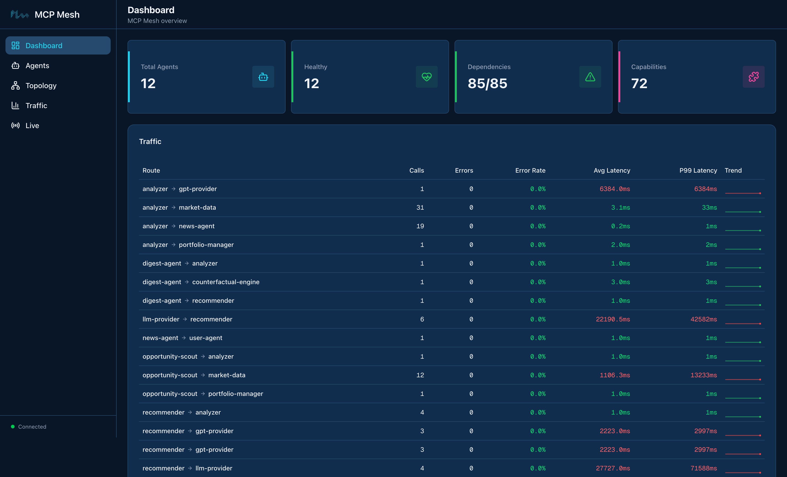
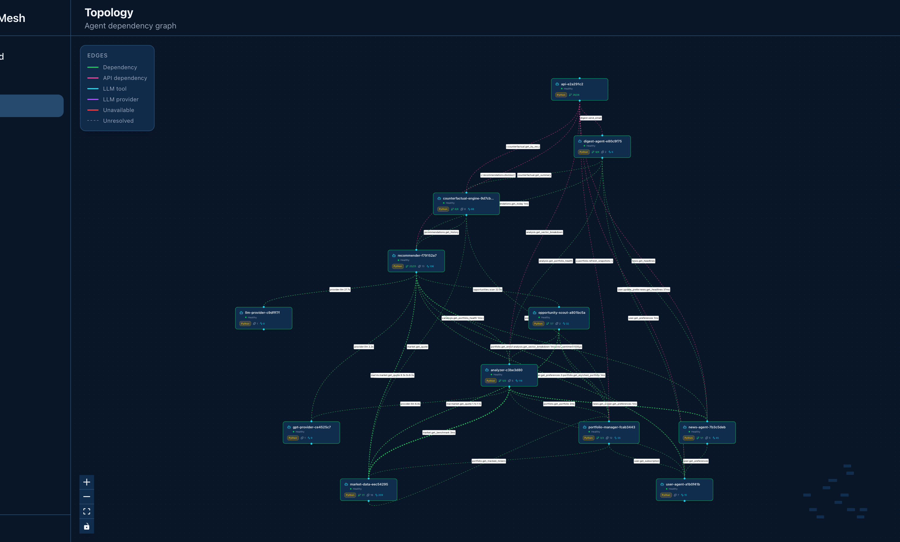
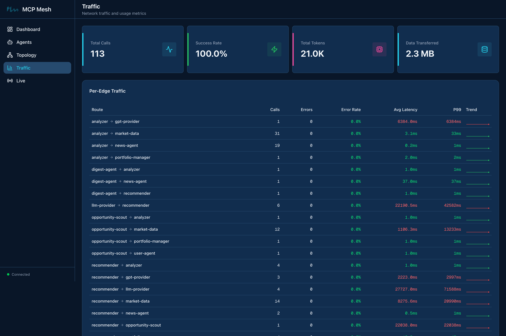
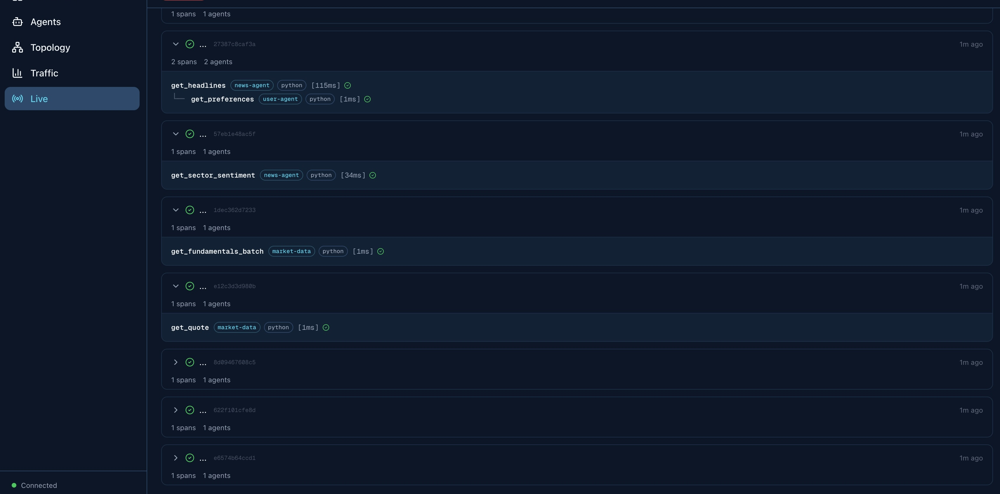

# Day 8 -- Docker Compose

Until now you have been running agents individually with `meshctl start`.
That is great for development -- watch mode, instant restarts, granular
control. But for integration testing and demo environments, you want one
command that brings up the entire mesh. Today you will generate a Docker
Compose file from your agent code and start everything with
`docker compose up`.

## What we're building today

```mermaid
graph TB
    subgraph compose["docker compose up -d"]
        direction TB
        subgraph infra["Infrastructure"]
            PG[(postgres)]
            REG[registry :8000]
            UI[mesh-ui :3080]
        end
        subgraph obs["Observability"]
            RD[(redis)]
            TM[tempo]
            GR[grafana :3000]
        end
        subgraph agents["13 Agents"]
            GW[gateway :8080]
            CH[chat-history]
            PL[planner]
            CP[claude-provider]
            OP[openai-provider]
            FA[flight-agent]
            HA[hotel-agent]
            WA[weather-agent]
            PA[poi-agent]
            UP[user-prefs]
            BA[budget-analyst]
            AA[adventure-advisor]
            LP[logistics-planner]
        end
    end

    U[User] -->|"POST /plan"| GW
    U -->|"browse"| UI

    style U fill:#555,color:#fff
    style compose fill:#1a1a2e,color:#fff,stroke:#4a9eff
    style infra fill:#2d2d44,color:#fff,stroke:#666
    style obs fill:#2d2d44,color:#fff,stroke:#666
    style agents fill:#2d2d44,color:#fff,stroke:#666
    style GW fill:#e67e22,color:#fff
    style REG fill:#1abc9c,color:#fff
    style UI fill:#1abc9c,color:#fff
    style PG fill:#336791,color:#fff
    style RD fill:#d63031,color:#fff
    style TM fill:#f39c12,color:#fff
    style GR fill:#f39c12,color:#fff
    style PL fill:#9b59b6,color:#fff
    style CP fill:#9b59b6,color:#fff
    style OP fill:#9b59b6,color:#fff
    style BA fill:#f39c12,color:#fff
    style AA fill:#f39c12,color:#fff
    style LP fill:#f39c12,color:#fff
    style FA fill:#4a9eff,color:#fff
    style PA fill:#4a9eff,color:#fff
    style UP fill:#1a8a4a,color:#fff
    style WA fill:#1a8a4a,color:#fff
    style HA fill:#1a8a4a,color:#fff
    style CH fill:#1abc9c,color:#fff
```



One Docker Compose file. Thirteen agents, a registry, a database, the Mesh
UI dashboard, and a full observability stack. Everything starts with a
single command. Everything stops with a single command.

Today has five parts:

1. **Generate the compose file** -- `meshctl scaffold --compose --observability`
2. **Start the containerized mesh** -- `docker compose up -d`
3. **Verify** -- `meshctl list`, curl the gateway, check health
4. **Mesh UI tour** -- agents, topology, traces at `localhost:3080`
5. **Stop and clean up** -- `docker compose down`

## Part 1: Generate the compose file

### Stop local agents

Day 7 stopped your local agents. If any are still running:

```shell
$ meshctl stop
```

### Copy agents to a fresh directory

Create the Day 8 working directory with all thirteen agents:

```shell
$ mkdir -p trip-planner/day-08
$ cp -r day-07/* day-08/
$ cd day-08
```

### Run the scaffold

```shell
$ meshctl scaffold --compose --observability
```

```text
Scanning for agents...
Found 12 agent(s):
  - adventure-advisor (port 9111) in adventure-advisor/
  - budget-analyst (port 9110) in budget-analyst/
  - chat-history-agent (port 9109) in chat-history-agent/
  - claude-provider (port 9106) in claude-provider/
  - flight-agent (port 9101) in flight-agent/
  - hotel-agent (port 9102) in hotel-agent/
  - logistics-planner (port 9112) in logistics-planner/
  - openai-provider (port 9108) in openai-provider/
  - planner-agent (port 9107) in planner-agent/
  - poi-agent (port 9104) in poi-agent/
  - user-prefs-agent (port 9105) in user-prefs-agent/
  - weather-agent (port 9103) in weather-agent/

Successfully generated docker-compose.yml in .

Services included:
  - postgres (5432)
  - registry (8000)
  - redis (6379)
  - tempo (3200, 4317)
  - grafana (3000)
  - adventure-advisor (9111)
  - budget-analyst (9110)
  - chat-history-agent (9109)
  - claude-provider (9106)
  - flight-agent (9101)
  - hotel-agent (9102)
  - logistics-planner (9112)
  - openai-provider (9108)
  - planner-agent (9107)
  - poi-agent (9104)
  - user-prefs-agent (9105)
  - weather-agent (9103)
```

The scaffold scanned every subdirectory, found `@mesh.agent` decorators in
twelve Python files, extracted each agent's name and port, and generated a
complete `docker-compose.yml` with infrastructure services, health checks,
and networking.

It also generated observability configuration files:

```text
.
├── docker-compose.yml
├── tempo.yaml
└── grafana/
    ├── grafana.ini
    ├── dashboards/
    │   └── mcp-mesh-overview.json
    └── provisioning/
        ├── dashboards/dashboards.yaml
        └── datasources/datasources.yaml
```

### What about the gateway?

The scaffold detected twelve agents, not thirteen. The gateway uses
`@mesh.route` on a FastAPI app -- it is not a `@mesh.agent` class.
The scaffold looks for `@mesh.agent` decorators to auto-detect agents, so
the gateway needs to be added manually.

Add the gateway service to `docker-compose.yml`:

```yaml
--8<-- "examples/tutorial/trip-planner/day-08/python/docker-compose.yml:gateway"
```

### Add the Mesh UI

The scaffold does not include the Mesh UI dashboard. Add it after the
registry service:

```yaml
--8<-- "examples/tutorial/trip-planner/day-08/python/docker-compose.yml:mesh_ui"
```

### Pass API keys

The LLM providers need API keys. The scaffold does not know about your
environment variables, so add them to the claude-provider and
openai-provider services:

```yaml
# In the claude-provider service environment:
ANTHROPIC_API_KEY: ${ANTHROPIC_API_KEY}

# In the openai-provider service environment:
OPENAI_API_KEY: ${OPENAI_API_KEY}
```

Make sure these variables are set in your shell or in a `.env` file next to
`docker-compose.yml`.

!!! tip "meshctl DX"
    The compose file was generated from your agent code. You did not write
    it. When you add a new agent, re-run `meshctl scaffold --compose` and
    the compose file updates automatically. The scaffold merges new agents
    into the existing file without overwriting your manual additions like
    the gateway and API keys.

## Part 2: Start the containerized mesh

### Start everything

```shell
$ docker compose up -d
```

Docker pulls the images (first run only), starts the infrastructure, waits
for health checks, and then starts all agents. The dependency ordering
ensures postgres and redis are healthy before the registry starts, and the
registry is healthy before agents start registering.

### Check service status

```shell
$ docker compose ps
```

```text
NAME                              STATUS         PORTS
trip-planner-postgres             Up (healthy)   0.0.0.0:5432->5432/tcp
trip-planner-redis                Up (healthy)   0.0.0.0:6379->6379/tcp
trip-planner-tempo                Up (healthy)   0.0.0.0:3200->3200/tcp, 0.0.0.0:4317->4317/tcp
trip-planner-grafana              Up (healthy)   0.0.0.0:3000->3000/tcp
trip-planner-registry             Up (healthy)   0.0.0.0:8000->8000/tcp
trip-planner-mesh-ui              Up (healthy)   0.0.0.0:3080->3080/tcp
trip-planner-gateway              Up (healthy)   0.0.0.0:8080->8080/tcp
trip-planner-flight-agent         Up (healthy)   0.0.0.0:9101->9101/tcp
trip-planner-hotel-agent          Up (healthy)   0.0.0.0:9102->9102/tcp
trip-planner-weather-agent        Up (healthy)   0.0.0.0:9103->9103/tcp
trip-planner-poi-agent            Up (healthy)   0.0.0.0:9104->9104/tcp
trip-planner-user-prefs-agent     Up (healthy)   0.0.0.0:9105->9105/tcp
trip-planner-claude-provider      Up (healthy)   0.0.0.0:9106->9106/tcp
trip-planner-planner-agent        Up (healthy)   0.0.0.0:9107->9107/tcp
trip-planner-openai-provider      Up (healthy)   0.0.0.0:9108->9108/tcp
trip-planner-chat-history-agent   Up (healthy)   0.0.0.0:9109->9109/tcp
trip-planner-budget-analyst       Up (healthy)   0.0.0.0:9110->9110/tcp
trip-planner-adventure-advisor    Up (healthy)   0.0.0.0:9111->9111/tcp
trip-planner-logistics-planner    Up (healthy)   0.0.0.0:9112->9112/tcp
```

All nineteen services running. Five infrastructure, one UI, thirteen agents.

### View logs

```shell
$ docker compose logs -f --tail=20
```

Press ++ctrl+c++ to stop following. To view a single agent's logs:

```shell
$ docker compose logs flight-agent
```

## Part 3: Verify

### Check agent registration

The registry is accessible at `localhost:8000`, the same address `meshctl`
uses by default:

```shell
$ meshctl list
```

All thirteen agents should appear with their tools and dependencies resolved.
The output is the same as when you ran them locally -- `meshctl` does not
know or care whether agents are running as local processes or containers.

### Call the gateway

```shell
$ curl -s -X POST http://localhost:8080/plan \
    -H "Content-Type: application/json" \
    -H "X-Session-Id: compose-test-1" \
    -d '{"destination":"Kyoto","dates":"June 1-5, 2026","budget":"$2000"}' \
    | python -m json.tool
```

The response includes the full trip plan with specialist insights --
budget analysis, adventure recommendations, and logistics planning. The
same functionality as Day 7, now running entirely in containers.

### Verify traces

```shell
$ meshctl trace --last
```

The trace shows the full call tree from the gateway through the planner to
all tool agents -- the same distributed trace pipeline from Day 3, now
flowing through containerized agents.

## Part 4: Mesh UI tour

Open [http://localhost:3080](http://localhost:3080) in your browser.

### Dashboard

The main page shows an overview of your mesh: agent count, health status,
and a traffic summary table. Real-time events stream in the sidebar --
you will see agent registrations from the initial startup.

<!--  -->

### Topology

Click **Topology** in the sidebar. The topology view renders the full
agent dependency graph. Nodes represent agents, edges represent
dependencies. Color coding shows agent types:

- **Blue**: tool agents (flight, hotel, weather, poi, user-prefs)
- **Purple**: LLM agents (planner, claude-provider, openai-provider)
- **Gold**: specialist agents (budget-analyst, adventure-advisor, logistics-planner)
- **Green**: utility agents (chat-history-agent)
- **Orange**: gateway

Hover over any node for details -- runtime, version, capabilities, and
endpoint.

<!--  -->

### Traffic

Click **Traffic** to see inter-agent call metrics. The top cards show
aggregate stats: total calls, success rate, token usage, and data
transferred. Below that, per-edge breakdowns show every agent-to-agent
route with call counts, latency, and error rates.

After making a few `/plan` calls, you will see traffic flowing from the
gateway through the planner to the LLM providers and tool agents.

<!--  -->

### Live

Click **Live** for real-time trace streaming. Make another `/plan` call
and watch the spans appear in real time -- which agent called which tool,
on which target, with timing and status. Each trace can be expanded to see
individual spans across the mesh.

<!--  -->

### Agents

Click **Agents** for a table of all registered agents. Each row shows
name, type, runtime, version, dependency resolution status, and last seen
time. Expand any row to see its capabilities, dependencies, and recent
traces.

## Part 5: Stop

```shell
$ docker compose down
```

This stops all containers and removes the network. Data volumes persist
so the next `docker compose up -d` starts faster. To remove volumes too:

```shell
$ docker compose down -v
```

## Troubleshooting

**Docker build fails with missing requirements.** The compose file uses
`mcpmesh/python-runtime:1.2.0` images with a dev-mode entrypoint that
installs `requirements.txt` on startup. If an agent has dependencies not
in the base image, check that `requirements.txt` exists in the agent
directory and lists all dependencies.

**Agent cannot connect to registry.** Check that the agent's
`MCP_MESH_REGISTRY_URL` environment variable is set to
`http://registry:8000` (using the Docker service hostname, not
`localhost`). Run `docker compose logs <agent-name>` to see connection
errors.

**Port conflict on startup.** If you see "port is already allocated",
another process is using that port on your host. Either stop the
conflicting process or change the host port mapping in
`docker-compose.yml`. For example, change `"8000:8000"` to `"8001:8000"`
to map the registry to port 8001 on your host.

**Duplicate agent ports.** If any two agents share the same `http_port`,
Docker Compose will fail to start them -- they'd bind to the same host
port. Check your `main.py` files: each agent should have a unique port.
If you used `--port` when scaffolding (as shown in earlier chapters),
you're already set.

**API keys not passed to containers.** LLM providers need
`ANTHROPIC_API_KEY` and `OPENAI_API_KEY`. These must be set in your shell
environment or in a `.env` file next to `docker-compose.yml`:

```shell
# .env
ANTHROPIC_API_KEY=sk-ant-...
OPENAI_API_KEY=sk-...
```

Docker Compose automatically reads `.env` files.

**Mesh UI not loading at localhost:3080.** Verify the mesh-ui container is
running: `docker compose ps mesh-ui`. Check its logs:
`docker compose logs mesh-ui`. The UI needs the registry to be healthy
before it starts.

## Recap

You generated a Docker Compose file from your agent code with a single
command. The scaffold detected twelve agents, extracted their names and
ports, and produced a complete compose file with infrastructure, health
checks, and observability. You added the gateway and Mesh UI manually,
started everything with `docker compose up -d`, and verified the mesh
works identically to the local setup. The Mesh UI dashboard gave you
real-time visibility into agent topology, traffic, and traces.

## See also

- `meshctl man deployment` -- local, Docker, and Kubernetes deployment
  patterns
- `meshctl scaffold --compose --help` -- all scaffold compose flags
- [Dashboard](../dashboard.md) -- dashboard pages and architecture

## Next up

[Day 9](day-09-kubernetes.md) takes the mesh to Kubernetes with Helm
charts.
