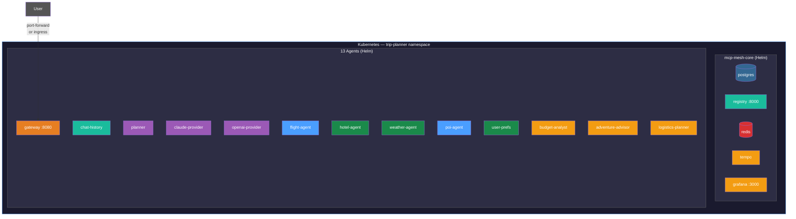

# Day 9 -- Kubernetes

Your trip planner runs in Docker Compose. Today you deploy it to
Kubernetes -- the same agents, the same code, the same mesh. The only new
file per agent is a Helm values file, and `meshctl scaffold` already
created that on Day 1.

## What we're building today



One namespace. Two Helm charts (`mcp-mesh-core` for infrastructure,
`mcp-mesh-agent` for each agent). Thirteen agents, a registry, a database,
and a full observability stack. Same agents as Day 8 -- running in
Kubernetes pods instead of Docker containers.

Today has five parts:

1. **The DDDI payoff** -- same code, new platform
2. **Create the namespace and secrets** -- one-time setup
3. **Deploy the registry and infrastructure** -- `helm install mcp-core`
4. **Deploy the agents** -- one `helm install` per agent
5. **Verify** -- `kubectl get pods`, `meshctl list`, `curl` the gateway

## The DDDI payoff

Open your Day 8 flight agent and your Day 9 flight agent side by side.

```shell
$ diff day-08/python/flight-agent/main.py day-09/python/flight-agent/main.py
```

```text
80c80
<     description="TripPlanner flight search tool -- Day 8",
---
>     description="TripPlanner flight search tool -- Day 9",
```

One line changed: the description string. The `flight_search` function --
its parameters, its return type, its stub data -- is identical. The
imports are identical. The decorators are identical. The function you
wrote on Day 1 and evolved through Day 8 runs on Kubernetes without a
single code change.

Remember that `helm-values.yaml` file from Day 1 that you ignored?

```yaml
--8<-- "examples/tutorial/trip-planner/day-09/helm/values-flight-agent.yaml:full_file"
```

That is the Kubernetes deployment manifest for your flight agent. The
scaffold generated it on Day 1. It tells the Helm chart which image to
pull, what to name the agent, and how many resources to give it. The
chart handles the rest: Deployment, Service, health probes, environment
variables, service account.

No env-specific config files. No sidecars. No wrapper code. The function
you wrote on Day 1 runs here.

## Prerequisites

- A Kubernetes cluster (minikube, kind, EKS, GKE, AKS)
- `kubectl` configured for your cluster
- Helm 3.8+ (OCI registry support)
- Agent images built and available to the cluster

For minikube, use minikube's Docker daemon so images are available
locally without pushing to a registry:

```shell
$ eval $(minikube docker-env)
```

## Part 1: Build agent images

Each agent has a `Dockerfile` (generated by `meshctl scaffold`) that uses
the official `mcpmesh/python-runtime` base image. Build all thirteen
agents:

```shell
$ cd day-09/python

$ for agent in flight-agent hotel-agent weather-agent poi-agent \
    user-prefs-agent chat-history-agent claude-provider openai-provider \
    planner-agent gateway budget-analyst adventure-advisor logistics-planner
do
  echo "Building $agent..."
  docker build -t "trip-planner/${agent}:latest" "$agent/"
done
```

Verify the images are available:

```shell
$ docker images --filter "reference=trip-planner/*" --format "table {{.Repository}}\t{{.Tag}}\t{{.Size}}"
```

```text
REPOSITORY                         TAG       SIZE
trip-planner/flight-agent          latest    409MB
trip-planner/hotel-agent           latest    409MB
trip-planner/weather-agent         latest    409MB
trip-planner/poi-agent             latest    409MB
trip-planner/user-prefs-agent      latest    409MB
trip-planner/chat-history-agent    latest    409MB
trip-planner/claude-provider       latest    409MB
trip-planner/openai-provider       latest    409MB
trip-planner/planner-agent         latest    409MB
trip-planner/gateway               latest    409MB
trip-planner/budget-analyst        latest    409MB
trip-planner/adventure-advisor     latest    409MB
trip-planner/logistics-planner     latest    409MB
```

!!! tip "Cloud clusters"
    For EKS, GKE, or AKS, push images to your container registry instead:
    ```shell
    docker buildx build --platform linux/amd64 \
      -t your-registry/flight-agent:v1.0.0 --push flight-agent/
    ```
    Then update `image.repository` in each values file.

## Part 2: Create the namespace and secrets

```shell
$ kubectl create namespace trip-planner
```

```text
namespace/trip-planner created
```

LLM agents need API keys. Create a Kubernetes Secret:

```shell
$ kubectl -n trip-planner create secret generic llm-keys \
    --from-literal=ANTHROPIC_API_KEY=$ANTHROPIC_API_KEY \
    --from-literal=OPENAI_API_KEY=$OPENAI_API_KEY
```

```text
secret/llm-keys created
```

The Helm values files for LLM agents reference this secret by name:

```yaml
--8<-- "examples/tutorial/trip-planner/day-09/helm/values-claude-provider.yaml:full_file"
```

The `secretKeyRef` mounts the key as an environment variable inside the
pod. The agent code reads `ANTHROPIC_API_KEY` from the environment -- the
same way it did locally. No code change needed.

## Part 3: Deploy the registry

The `mcp-mesh-core` chart deploys the registry, PostgreSQL, Redis, Tempo,
and Grafana as a single Helm release:

```shell
$ helm install mcp-core oci://ghcr.io/dhyansraj/mcp-mesh/mcp-mesh-core \
    --version 1.4.1 \
    -n trip-planner \
    -f helm/values-core.yaml \
    --wait --timeout 5m
```

Wait for the registry to become available:

```shell
$ kubectl wait --for=condition=available \
    deployment/mcp-core-mcp-mesh-registry \
    -n trip-planner --timeout=120s
```

```text
deployment.apps/mcp-core-mcp-mesh-registry condition met
```

## Part 4: Deploy the agents

Each agent gets its own `helm install` using the `mcp-mesh-agent` chart
and the values file from `helm/`:

```shell
$ AGENTS=(
    flight-agent hotel-agent weather-agent poi-agent user-prefs-agent
    chat-history-agent claude-provider openai-provider planner-agent
    gateway budget-analyst adventure-advisor logistics-planner
  )

$ for agent in "${AGENTS[@]}"; do
    echo "Installing $agent..."
    helm install "$agent" \
      oci://ghcr.io/dhyansraj/mcp-mesh/mcp-mesh-agent \
      --version 1.4.1 \
      -n trip-planner \
      -f "helm/values-${agent}.yaml"
  done
```

```text
Installing flight-agent...
Installing hotel-agent...
Installing weather-agent...
Installing poi-agent...
Installing user-prefs-agent...
Installing chat-history-agent...
Installing claude-provider...
Installing openai-provider...
Installing planner-agent...
Installing gateway...
Installing budget-analyst...
Installing adventure-advisor...
Installing logistics-planner...
```

!!! tip "minikube image pull"
    If you built images with `eval $(minikube docker-env)`, add
    `--set image.pullPolicy=Never` to each `helm install` so Kubernetes
    uses the local images instead of trying to pull from a registry.

### Port strategy

On Day 8, each agent had a unique port (`9101`, `9102`, ...) because all
containers shared the host network. In Kubernetes, each pod has its own
IP address, so every agent listens on port `8080`. The Helm chart sets
`MCP_MESH_HTTP_PORT=8080` as an environment variable, which overrides the
`http_port` in the `@mesh.agent` decorator. Your code does not change.

## Part 5: Verify

### Check pods

```shell
$ kubectl -n trip-planner get pods
```

```text
NAME                                                 READY   STATUS    AGE
adventure-advisor-mcp-mesh-agent-b5fcb5d9-tw48r      1/1     Running   30s
budget-analyst-mcp-mesh-agent-6cdfc8c5c5-bmr9d       1/1     Running   30s
chat-history-agent-mcp-mesh-agent-57b497ffc9-6dgd4   1/1     Running   30s
claude-provider-mcp-mesh-agent-55756498b9-9sndc      1/1     Running   30s
flight-agent-mcp-mesh-agent-5df865b559-jc6cx         1/1     Running   30s
gateway-mcp-mesh-agent-79cbcf7d88-wxng4              1/1     Running   30s
hotel-agent-mcp-mesh-agent-94d8f8b8-dnfh8            1/1     Running   30s
logistics-planner-mcp-mesh-agent-5db8d9555-ndjff     1/1     Running   30s
mcp-core-mcp-mesh-grafana-6d7b9f68d6-rhbqx           1/1     Running   6m
mcp-core-mcp-mesh-postgres-0                         1/1     Running   6m
mcp-core-mcp-mesh-redis-7df8848cb7-bdlqs             1/1     Running   6m
mcp-core-mcp-mesh-registry-8448c85b75-4p9h7          1/1     Running   6m
mcp-core-mcp-mesh-tempo-5d8d4cbb49-gmqpd             1/1     Running   6m
openai-provider-mcp-mesh-agent-7cfd4b55bb-stqwr      1/1     Running   30s
planner-agent-mcp-mesh-agent-54876f44f4-6cp87        1/1     Running   30s
poi-agent-mcp-mesh-agent-b7fcf4864-gmslk             1/1     Running   30s
user-prefs-agent-mcp-mesh-agent-c4746c7c8-vz5bh      1/1     Running   30s
weather-agent-mcp-mesh-agent-875b6477c-wvrkv         1/1     Running   30s
```

Eighteen pods: five infrastructure, thirteen agents. All `1/1 Running`.

### Check services

```shell
$ kubectl -n trip-planner get svc
```

Every agent has a `ClusterIP` service on port `8080`. The gateway has a
`NodePort` service so you can reach it from outside the cluster.

### Check agent registration

Port-forward the registry and use `meshctl list`:

```shell
$ kubectl -n trip-planner port-forward svc/mcp-core-mcp-mesh-registry 8000:8000 &

$ meshctl list --registry-url http://localhost:8000
```

```text
Registry: running (http://localhost:8000) - 13 healthy

NAME                        RUNTIME  TYPE    STATUS   DEPS  ENDPOINT
adventure-advisor-491aeceb  Python   Agent   healthy  0/0   adventure-advisor-mcp-mesh-agent.trip-planner:8080
budget-analyst-bbde0bf2     Python   Agent   healthy  0/0   budget-analyst-mcp-mesh-agent.trip-planner:8080
chat-history-agent-e6fe4291 Python   Agent   healthy  0/0   chat-history-agent-mcp-mesh-agent.trip-planner:8080
claude-provider-de41d665    Python   Agent   healthy  0/0   claude-provider-mcp-mesh-agent.trip-planner:8080
flight-agent-b5a0bfb6       Python   Agent   healthy  1/1   flight-agent-mcp-mesh-agent.trip-planner:8080
gateway-api-b7080b01        Python   API     healthy  1/1   gateway-mcp-mesh-agent.trip-planner:8080
hotel-agent-db0a6b18        Python   Agent   healthy  0/0   hotel-agent-mcp-mesh-agent.trip-planner:8080
logistics-planner-5fd4a0e7  Python   Agent   healthy  0/0   logistics-planner-mcp-mesh-agent.trip-planner:8080
openai-provider-b32513de    Python   Agent   healthy  0/0   openai-provider-mcp-mesh-agent.trip-planner:8080
planner-agent-9b662efc      Python   Agent   healthy  5/5   planner-agent-mcp-mesh-agent.trip-planner:8080
poi-agent-2ccdd8e5          Python   Agent   healthy  1/1   poi-agent-mcp-mesh-agent.trip-planner:8080
user-prefs-agent-3bfc1af9   Python   Agent   healthy  0/0   user-prefs-agent-mcp-mesh-agent.trip-planner:8080
weather-agent-b8c26c65      Python   Agent   healthy  0/0   weather-agent-mcp-mesh-agent.trip-planner:8080
```

Thirteen agents, all healthy. The planner resolves all five dependencies
(`5/5`). The gateway resolves its single dependency (`1/1`). Endpoints use
Kubernetes DNS names -- `<service>.<namespace>:<port>` -- which resolve
automatically within the cluster.

### Call the gateway

Port-forward the gateway and send a request:

```shell
$ kubectl -n trip-planner port-forward svc/gateway-mcp-mesh-agent 8080:8080 &

$ curl -s http://localhost:8080/health
```

```json
{"status": "healthy"}
```

```shell
$ curl -s -X POST http://localhost:8080/plan \
    -H "Content-Type: application/json" \
    -H "X-Session-Id: k8s-test-1" \
    -d '{"destination":"Kyoto","dates":"June 1-5, 2026","budget":"$2000"}' \
    | python -m json.tool
```

The response includes the full trip plan with specialist insights -- the
same output you saw on Day 7 and Day 8, now served from Kubernetes pods.

### Call a tool directly

You can also call individual tools through the registry, the same way
you did on Day 1:

```shell
$ meshctl call flight_search \
    '{"origin":"SFO","destination":"NRT","date":"2026-06-01"}' \
    --registry-url http://localhost:8000
```

```json
{
  "result": [
    {
      "carrier": "MH",
      "flight": "MH007",
      "origin": "SFO",
      "destination": "NRT",
      "date": "2026-06-01",
      "depart": "09:15",
      "arrive": "14:40",
      "price_usd": 842
    },
    {
      "carrier": "SQ",
      "flight": "SQ017",
      "origin": "SFO",
      "destination": "NRT",
      "date": "2026-06-01",
      "depart": "11:50",
      "arrive": "17:05",
      "price_usd": 901
    }
  ]
}
```

The same stub data. The same function. Running in a Kubernetes pod.

### Optional: Ingress

Instead of port-forwarding, you can expose the gateway via Ingress. On
minikube, enable the ingress addon:

```shell
$ minikube addons enable ingress
```

Apply the ingress manifest:

```shell
$ kubectl apply -f k8s/ingress-gateway.yaml
```

```yaml
--8<-- "examples/tutorial/trip-planner/day-09/k8s/ingress-gateway.yaml:full_file"
```

Add the hostname to your `/etc/hosts`:

```shell
$ echo "$(minikube ip) trip-planner.local" | sudo tee -a /etc/hosts
```

Then call the gateway via the ingress:

```shell
$ curl -s http://trip-planner.local/health
```

## What changed from Day 8

| Aspect | Day 8 (Docker Compose) | Day 9 (Kubernetes) |
| --- | --- | --- |
| **Agent code** | Identical | Identical |
| **Orchestrator** | `docker compose up` | `helm install` |
| **Port strategy** | Unique ports (9101, 9102...) | All agents on 8080 |
| **Secrets** | `.env` file | Kubernetes Secret |
| **Networking** | Docker bridge network | Kubernetes DNS |
| **Health probes** | Docker health checks | k8s liveness/readiness |
| **Scaling** | Manual (`docker compose up --scale`) | `kubectl scale` or HPA |

The agent code column is the important one. It says "Identical" twice.

## Clean up

```shell
$ helm uninstall gateway -n trip-planner
$ helm uninstall planner-agent -n trip-planner
$ # ... (repeat for all agents, or use the teardown script)

$ # Or use the provided teardown script:
$ ./helm/teardown.sh
```

The teardown script uninstalls all Helm releases and deletes the
namespace:

```shell
$ ./helm/teardown.sh
```

```text
=== Uninstalling agents ===
  Removed flight-agent
  Removed hotel-agent
  ...
=== Uninstalling core ===
  Removed mcp-core
=== Deleting namespace ===
namespace "trip-planner" deleted
=== Done ===
```

## Troubleshooting

**Image pull errors.** On minikube, build images inside minikube's Docker
daemon (`eval $(minikube docker-env)`) and set `image.pullPolicy=Never`
in the Helm install. On cloud clusters, push images to your container
registry and update `image.repository` in the values files.

**Pod in CrashLoopBackOff.** Check the logs:

```shell
$ kubectl -n trip-planner logs <pod-name>
```

Common causes: missing secrets (the `llm-keys` Secret was not created),
missing dependencies (Redis not ready before chat-history-agent starts),
or import errors in agent code.

**meshctl list shows no agents.** Make sure the registry port-forward is
running:

```shell
$ kubectl -n trip-planner port-forward svc/mcp-core-mcp-mesh-registry 8000:8000 &
$ meshctl list --registry-url http://localhost:8000
```

**Gateway returns "capability unavailable".** The planner or its
dependencies have not registered yet. Wait 30 seconds for all agents to
complete registration, then retry.

**Ingress not working.** Verify the ingress controller is running:

```shell
$ minikube addons enable ingress
$ kubectl get pods -n ingress-nginx
```

Check the ingress resource:

```shell
$ kubectl -n trip-planner describe ingress trip-planner-gateway
```

## Recap

You deployed all thirteen trip planner agents to Kubernetes using two Helm
charts: `mcp-mesh-core` for infrastructure and `mcp-mesh-agent` for each
agent. The agent code is identical to Day 8. The only new files are the
Helm values files -- and `meshctl scaffold` generated those on Day 1.

The DDDI pattern delivered on its promise: the function you wrote on
Day 1 runs in Kubernetes without modification. The decorators handle
registration. The Helm chart handles deployment. The registry handles
discovery. Your code handles your business logic.

## See also

- `meshctl man deployment` -- local, Docker, and Kubernetes deployment
  patterns
- `meshctl man security` -- TLS, entity trust, and certificate management
  for production clusters
- [Kubernetes basics](../04-kubernetes-basics.md) -- reference guide for
  Helm charts and common operations

## Next up

[Day 10](day-10-whats-next.md) wraps up the tutorial -- a celebration of
what you built, production readiness pointers, and open-ended challenges
for where to go from here.
