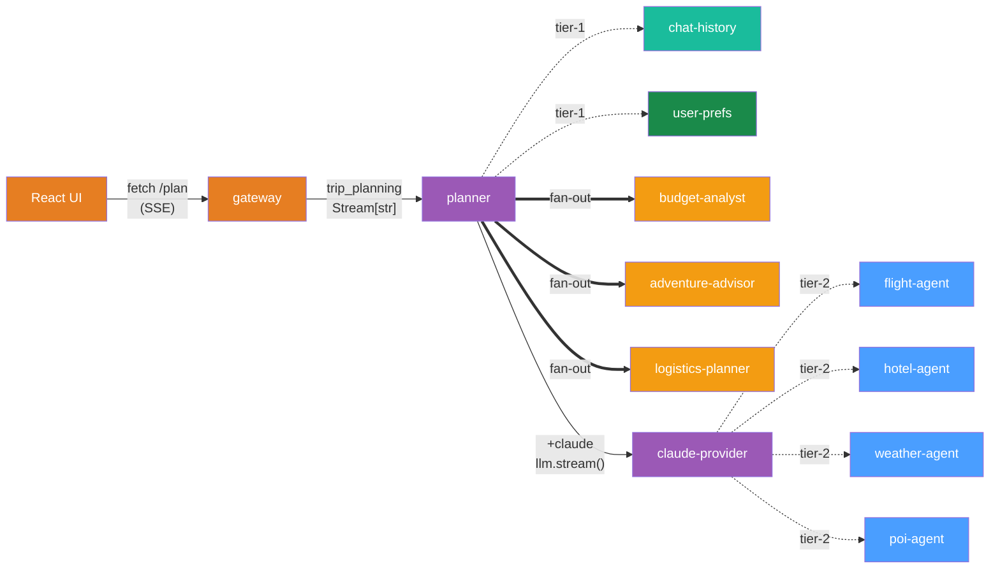

# Day 10 Bonus -- Streaming UI

Your Day 9 mesh produces complete trip plans, but the user stares at a spinner
for 30+ seconds while Claude composes the response, the committee runs, and
tools fetch real data. Today's bonus chapter swaps the buffered request/response
pattern for **token-by-token streaming** — the itinerary appears as Claude
writes it, and a mobile-first React UI renders the stream live.

You'll change exactly two files (the planner and the gateway), add a single
HTML file for the UI, and watch chunks flow through the **deepest pipeline
mcp-mesh can compose**: browser → SSE → gateway → planner → committee
(parallel fan-out) → LLM provider → tool calls → final streaming Claude call.
Every hop you built across Days 1-9 still runs unchanged.

!!! info "Prerequisites"
    Day 9's mesh must be running (all 13 agents, locally or in Kubernetes).
    The bonus chapter swaps the planner and gateway for streaming variants —
    the other 11 agents stay exactly as they are. You'll also need
    `ANTHROPIC_API_KEY` set so Claude actually streams (no API key →
    `MESH_LLM_DRY_RUN=1` produces a deterministic test stream).

## What we're building today



The mesh topology is identical to Day 9. The only thing that changes is **how
chunks travel along the dotted edges**: instead of a single buffered
`CallToolResult` arriving at the end, the planner's final Claude call streams
text chunks back through the planner, through the gateway, and out as SSE
events to the browser — live as Claude generates them.

Today has five parts:

1. **Stream[str] in 60 seconds** — the opt-in API
2. **Update the planner** — fan out the committee, then stream the final LLM call
3. **Update the gateway** — `@mesh.route` + `mesh.Stream[str]` = automatic SSE
4. **Add the React UI** — a single HTML file, no build step
5. **Run it and watch tokens flow**

## Part 1: Stream[str] in 60 seconds

Streaming in mcp-mesh is **opt-in per tool by return type annotation**. Two
changes to a tool flip it from buffered to streaming:

- Return type goes from `str` (or a Pydantic model) to `mesh.Stream[str]`
- The function `yield`s chunks instead of `return`ing the final string

```python
@mesh.tool(capability="chat")
async def chat(prompt: str, llm: mesh.MeshLlmAgent = None) -> mesh.Stream[str]:
    async for chunk in llm.stream(prompt):
        yield chunk
```

That's it. The framework detects the `Stream[str]` annotation, picks the
streaming code path on the producer (sends each chunk as an MCP
`notifications/progress` message) and on the consumer (`proxy.stream(...)`
returns an async iterator). Nothing else changes.

When a consumer's return type is `Stream[str]`, the resolver automatically
picks the **streaming variant** of any LLM provider (the auto-generated
`process_chat_stream` tool) — Claude's chunks flow through the provider's
agentic loop and out to the consumer in real time.

!!! tip "When does streaming actually buffer?"
    LLM agentic loops can run multiple iterations: the LLM may call a tool,
    get a result, call another tool, get a result, and only THEN produce the
    final text. Mesh streams **only the final iteration** — intermediate
    tool-calling iterations are buffered because the LLM needs the complete
    tool result in its context for the next step. In TripPlanner this means a
    brief silent pause (Claude calls `flight_search`, `hotel_search`,
    `get_weather`, `search_pois` — each fully completes), then the itinerary
    streams token-by-token as Claude composes the final answer.

For the full streaming concept doc, see
[Concepts: Streaming](../concepts/streaming.md). The rest of today is about
applying it to the trip planner.

## Part 2: Update the planner

The Day 7 planner returned `str` and called the LLM with `await llm(...)`.
The streaming variant returns `mesh.Stream[str]`, pre-fetches the committee
in parallel, then streams the final LLM call chunk-by-chunk.

The downloadable bonus already contains the full planner — the snippets below
walk through what changed.

### Imports and context model (unchanged)

```python
--8<-- "examples/tutorial/trip-planner/day-10/bonus-ui/python/planner-agent/main.py:imports"
```

```python
--8<-- "examples/tutorial/trip-planner/day-10/bonus-ui/python/planner-agent/main.py:context_model"
```

The Pydantic context model carries `destination`, `dates`, `budget`,
`user_preferences`, and `committee_insights` into the Jinja prompt — same as
Day 7, plus the new `committee_insights` field that holds the pre-fetched
specialist output.

### Same dependencies, new return type

```python
--8<-- "examples/tutorial/trip-planner/day-10/bonus-ui/python/planner-agent/main.py:committee_deps"
```

The dependency list is identical to Day 7. Five tier-1 dependencies:
`user_preferences`, `chat_history`, plus the three committee specialists.
Tools (flight/hotel/weather/POI) come in via the `@mesh.llm` decorator's
`filter` block above this.

The function signature changes the return annotation:

```python
async def plan_trip(
    destination: str,
    dates: str,
    budget: str,
    message: str = "",
    session_id: str = "",
    ...
    ctx: TripRequest = None,
    llm: mesh.MeshLlmAgent = None,
) -> mesh.Stream[str]:
    """Stream a trip itinerary one chunk at a time as the LLM generates it."""
```

`-> mesh.Stream[str]` is the only structural change required to flip from
buffered to streaming.

### Pre-fetch the committee in parallel

The committee runs **before** the streaming LLM call so its insights can be
injected into the LLM context. Each specialist agent is itself an `@mesh.llm`
function with `max_iterations=1` — they make their own non-streaming Claude
calls in parallel via `asyncio.gather`:

```python
--8<-- "examples/tutorial/trip-planner/day-10/bonus-ui/python/planner-agent/main.py:committee_prefetch"
```

This is the same fan-out pattern from Day 7, just hoisted up so it runs
before the streaming call instead of after a buffered one.

!!! info "Why aren't the specialists streaming too?"
    Each specialist returns a Pydantic model (`BudgetAnalysis`,
    `AdventureAdvice`, `LogisticsPlan`) — structured outputs genuinely cannot
    stream because the consumer needs complete valid JSON to validate against
    the schema. The planner consumes them as buffered Pydantic objects,
    weaves the insights into the Claude prompt, and **only the planner's
    final user-visible Claude call streams**. This mirrors how production
    streaming UIs work: the UI doesn't need to see specialist JSON arrive
    char-by-char, just the human-readable answer.

### Stream the final LLM call

The final piece is the streaming Claude call. `llm.stream(...)` returns an
async iterator — `yield` each chunk straight through to the consumer:

```python
--8<-- "examples/tutorial/trip-planner/day-10/bonus-ui/python/planner-agent/main.py:streaming_llm"
```

Two notes on this block:

1. The committee's pre-computed insights are injected via the `context=` kwarg.
   The Jinja template (`prompts/plan_trip.j2`) renders them into the system
   prompt under a `Committee Insights` section.
2. `accumulated.append(chunk)` collects the full text alongside streaming so
   chat history can persist the assistant's complete reply after the stream
   ends.

### Persist conversation history (unchanged from Day 6)

After the stream completes, the planner saves both the user message and the
assistant's full reply to chat history — same pattern as Day 6:

```python
--8<-- "examples/tutorial/trip-planner/day-10/bonus-ui/python/planner-agent/main.py:chat_history_save"
```

### Optional: dry-run mode for tests

The planner also supports a deterministic `MESH_LLM_DRY_RUN=1` mode that
yields a fixed sequence of test chunks. The `uc20_streaming` integration test
uses this to verify the streaming pipeline end-to-end without burning Claude
tokens:

```python
--8<-- "examples/tutorial/trip-planner/day-10/bonus-ui/python/planner-agent/main.py:dry_run"
```

## Part 3: Update the gateway

The gateway change is even smaller. `@mesh.route` already understands
`mesh.Stream[str]` — when the route's return type is a stream, FastAPI's
response is automatically wrapped as Server-Sent Events.

### Mount static files for the UI

The gateway also serves the React UI from a `static/` directory. Two lines of
imports and one mount call:

```python
--8<-- "examples/tutorial/trip-planner/day-10/bonus-ui/python/gateway/main.py:imports"
```

```python
--8<-- "examples/tutorial/trip-planner/day-10/bonus-ui/python/gateway/main.py:ui_route"
```

`GET /` serves `static/index.html`. `GET /static/*` serves the rest (only
`index.html` exists — no build step, no asset pipeline).

### `/plan` returns a stream

The streaming endpoint is structurally similar to Day 5's gateway, with two
critical changes: the function signature returns `mesh.Stream[str]`, and the
async iteration over `plan_trip.stream(...)` happens inside a separate inner
function:

```python
--8<-- "examples/tutorial/trip-planner/day-10/bonus-ui/python/gateway/main.py:plan_endpoint"
```

The split between `plan_trip` (the route handler) and `_stream_plan` (the
inner generator) is **intentional**, not stylistic.

!!! warning "FastAPI streaming gotcha — pre-flight errors"
    If you write the streaming logic directly in the route handler (as a
    single `async def ... yield`), the function becomes an async generator.
    FastAPI starts the SSE response immediately — and any `HTTPException`
    you raise to validate the request body (`if "destination" not in body:
    raise HTTPException(400)`) fires AFTER the response has already
    committed to HTTP 200. The client sees a 200 OK with an `event: error`
    SSE frame instead of a proper 400.

    The two-function pattern fixes this: `plan_trip` is a regular coroutine
    that runs the validation, then **returns** a generator (`_stream_plan`)
    without awaiting it. `HTTPException` raised inside `plan_trip` propagates
    as a real 400/503 status code; errors raised inside `_stream_plan` (after
    the stream starts) still surface as `event: error` frames. Pick the
    error model consciously.

The SSE wire format is plain MCP — each chunk becomes a `data: <chunk>\n\n`
line, and the stream terminates with `data: [DONE]\n\n`. Browsers consume it
via `fetch` + `ReadableStream` (the standard `EventSource` API is GET-only,
which is why we use `fetch` below).

## Part 4: Add the React UI

The UI is a **single HTML file** — React + Babel-standalone loaded from a
CDN. No npm install, no bundler, no build step. Drop the file into
`gateway/static/index.html` and the gateway serves it.

The complete file is in
`examples/tutorial/trip-planner/day-10/bonus-ui/python/gateway/static/index.html`.
Here are the three pieces that make it stream:

### Submit the form via fetch (not EventSource)

`EventSource` only supports GET. Streaming POST requires
`fetch` + `ReadableStream`:

```javascript
const resp = await fetch("/plan", {
  method: "POST",
  headers: {
    "Content-Type": "application/json",
    "X-Session-Id": sessionRef.current,
  },
  body: JSON.stringify({ destination, dates, budget, message }),
});
```

The `X-Session-Id` header carries the session UUID so the planner can fetch
prior chat history and persist this turn — same pattern as Day 6.

### Read the SSE stream chunk-by-chunk

```javascript
const reader = resp.body.getReader();
const decoder = new TextDecoder();
let buffer = "";
let acc = "";

while (!done) {
  const { value, done: rdDone } = await reader.read();
  if (rdDone) break;
  buffer += decoder.decode(value, { stream: true });

  // SSE framing: events separated by \n\n, payload after "data: "
  let sep;
  while ((sep = buffer.indexOf("\n\n")) !== -1) {
    const event = buffer.slice(0, sep);
    buffer = buffer.slice(sep + 2);
    const data = event
      .split("\n")
      .filter((l) => l.startsWith("data: "))
      .map((l) => l.slice(6))
      .join("\n");
    if (data === "[DONE]") { done = true; break; }
    acc += data;
    setStreaming(acc);  // re-render with the accumulated text
  }
}
```

The accumulator `acc` builds up the full text. Each `setStreaming(acc)` call
triggers a React re-render, so the user sees the itinerary grow chunk by
chunk.

### Render the streaming text

```jsx
{waiting && !streaming && <div className="spinner">contacting the committee...</div>}
{error && <div className="response error">{error}</div>}
{streaming && <div className="response">{streaming}</div>}
```

A spinner shows while we wait for the committee to finish (those buffered
specialist calls take 5-10s each). The first streaming chunk swaps the
spinner for the response container, and from that point on every new chunk
appends to the visible text. The whole UI is mobile-first — `max-width:
640px`, system fonts, dark-mode support via `prefers-color-scheme`, no
JavaScript framework beyond React + Babel.

## Part 5: Run it and watch tokens flow

### Stop the Day 9 planner and gateway

The other 11 agents stay exactly as they are. Only the planner and gateway
get swapped:

```shell
$ meshctl stop planner-agent gateway
```

### Start the streaming variants

From `examples/tutorial/trip-planner/day-10/bonus-ui/python/`:

```shell
$ meshctl start --debug -d -w \
    planner-agent/main.py \
    gateway/main.py
```

Verify the mesh:

```shell
$ meshctl list
```

```
Registry: running (http://localhost:8000) - 13 healthy

NAME                             RUNTIME   TYPE    STATUS    DEPS    ENDPOINT           ...
adventure-advisor-...            Python    Agent   healthy   0/0     ...
budget-analyst-...               Python    Agent   healthy   0/0     ...
chat-history-agent-...           Python    Agent   healthy   0/0     ...
claude-provider-...              Python    Agent   healthy   0/0     ...
flight-agent-...                 Python    Agent   healthy   1/1     ...
gateway-...                      Python    API     healthy   1/1     10.0.0.74:8080
hotel-agent-...                  Python    Agent   healthy   0/0     ...
logistics-planner-...            Python    Agent   healthy   0/0     ...
openai-provider-...              Python    Agent   healthy   0/0     ...
planner-agent-...                Python    Agent   healthy   5/5     ...
poi-agent-...                    Python    Agent   healthy   1/1     ...
user-prefs-agent-...             Python    Agent   healthy   0/0     ...
weather-agent-...                Python    Agent   healthy   0/0     ...
```

13 healthy agents, planner shows 5/5 deps. Same topology as Day 9 — only the
streaming code paths are new.

### Open the UI

Visit [http://localhost:8080/](http://localhost:8080/) in any browser. You
get the mobile-first form. Enter a destination, dates, and budget, then click
**Plan my trip**.

What you'll see:

1. The spinner (`contacting the committee...`) shows for ~5-10 seconds while
   the committee runs in parallel and Claude makes its tool calls
   (flight/hotel/weather/POI).
2. The first text chunk arrives — the spinner disappears.
3. The itinerary streams **token by token** as Claude composes the response.
4. Total wall-clock time matches Day 9 (~30-40s for a 5-day plan), but the
   user sees output starting much earlier.

### Curl it for the raw SSE wire format

```shell
$ curl -N -X POST http://localhost:8080/plan \
    -H "Content-Type: application/json" \
    -H "X-Session-Id: my-curl-session" \
    -d '{"destination":"Tokyo","dates":"June 1-5, 2026","budget":"$2000"}'
```

```
data: ##

data:  Tokyo

data:  Trip

data:  Itinerary

data: :

data:  June

...
data: [DONE]
```

Each `data:` line is one chunk Claude produced. The `[DONE]` sentinel marks
end-of-stream — the React client uses it to stop reading.

### Walk the trace

Open the mesh UI:

```shell
$ meshctl start --ui -d
```

Navigate to `http://localhost:3080` and click the most recent trace. You'll
see the same fan-out you saw on Day 7, but now with one streaming span:

```
└─ plan_trip (planner-agent) [38712ms] ✓
   ├─ get_history (chat-history-agent) [2ms] ✓
   ├─ get_user_prefs (user-prefs-agent) [1ms] ✓
   ├─ budget_analysis (budget-analyst) [8204ms] ✓        ← parallel
   ├─ adventure_advice (adventure-advisor) [7891ms] ✓    ← parallel
   ├─ logistics_planning (logistics-planner) [8102ms] ✓  ← parallel
   ├─ process_chat_stream (claude-provider) [21438ms] ✓  ← STREAMING
   │  ├─ flight_search (flight-agent) [14ms] ✓
   │  ├─ hotel_search (hotel-agent) [1ms] ✓
   │  ├─ get_weather (weather-agent) [0ms] ✓
   │  └─ search_pois (poi-agent) [21ms] ✓
   ├─ save_turn (chat-history-agent) [1ms] ✓
   └─ save_turn (chat-history-agent) [1ms] ✓
```

Two structural changes from Day 7:

- The committee specialists run **first** and in parallel (the planner
  pre-fetches their insights before the streaming call).
- The Claude call resolves to `process_chat_stream` (the streaming variant
  of `claude-provider`'s auto-generated tool) instead of `claude_provider`.
  That's the resolver picking the right variant based on the planner's
  `Stream[str]` return type — no manual config required.

## Stop and clean up

```shell
$ meshctl stop
```

## Troubleshooting

**Spinner never disappears, then everything appears at once.** This is the
classic "buffered, not streaming" failure mode. Check three things in order:

1. The planner function's return annotation is exactly `mesh.Stream[str]`
   (not `str`, not `AsyncIterator[str]`).
2. The function uses `yield` inside the body, not `return`.
3. No intermediate hop in the chain accumulates with
   `"".join([c async for c in ...])`. Each hop must be a pass-through
   `async for chunk in upstream.stream(...): yield chunk`.

**Browser receives `event: error` frame with HTTP 200 instead of 4xx.** The
gateway's route handler became an async generator — request validation fires
after the SSE response committed to 200. Fix: split the handler into a
regular coroutine (validation + return) and an inner generator
(streaming). See the warning callout in Part 3.

**`[DONE]` never arrives, browser hangs after final chunk.** Make sure the
gateway's `_stream_plan` generator function returns cleanly (no unhandled
exception in the `async for` loop). The mesh's SSE wrapper appends
`[DONE]` only when the generator exhausts normally.

**Tools time out during the streaming Claude call.** Each tool the LLM calls
is buffered (intermediate iterations don't stream). If a tool agent is slow
or down, the streaming portion never starts — there's just a long silent
pause. Check `meshctl list` for agent health and `meshctl logs <agent>`
for errors.

**`ctx` parameter not recognized as the prompt context model.** Mesh injects
the FastMCP `Context` object by **type annotation**, not by parameter name.
If you declare `ctx: SomeContextModel` (Pydantic) the framework treats it as
your prompt context, NOT as FastMCP `Context`. This is the intended
behavior — name your context-model parameter whatever makes the prompt
template most readable.

## Recap

You took the buffered Day 9 mesh and made the user-visible Claude response
stream live with two file changes:

- **Planner** — return `mesh.Stream[str]`, hoist the committee fan-out before
  the LLM call, replace `await llm(...)` with `async for chunk in
  llm.stream(...)`.
- **Gateway** — return `mesh.Stream[str]` from the `@mesh.route` handler,
  split the route into a coroutine + inner generator so pre-flight errors
  propagate as proper HTTP status codes.

Plus a single HTML file for a mobile-first React UI.

The 11 other agents — committee specialists, tool agents, providers, chat
history — stay unchanged. The mesh resolver picks the streaming variant of
`claude-provider` automatically because the planner's return type is
`Stream[str]`. The same `@mesh.llm_provider` you scaffolded on Day 3 now
streams without any code changes on the provider side.

This is the deepest pipeline mcp-mesh ships: browser → SSE → gateway →
streaming planner → parallel committee fan-out → mesh-delegated LLM provider
→ buffered tool calls → final streaming Claude response → all the way back
to the user's screen, token by token.

## See also

- [Concepts: Streaming](../concepts/streaming.md) — the full streaming
  architecture (Stream[str] type, MCP progress notifications wire protocol,
  multi-hop composition, direct vs mesh-delegate modes)
- `meshctl man decorators` — `@mesh.tool`, `@mesh.llm`, `@mesh.route`
  reference
- [Day 7 — Committee of Specialists](day-07-committee.md) — the original
  buffered version of the planner with the committee fan-out
- [Day 5 — HTTP Gateway](day-05-http-gateway.md) — the original buffered
  `@mesh.route` gateway

## Next up

This is the end of the TripPlanner tutorial. Head back to
[Day 10 — What's Next](day-10-whats-next.md) for production-readiness
pointers, scaling tips, and challenges to take TripPlanner further.
