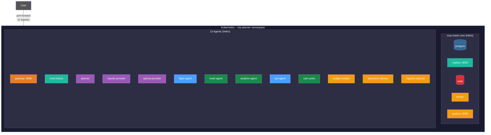
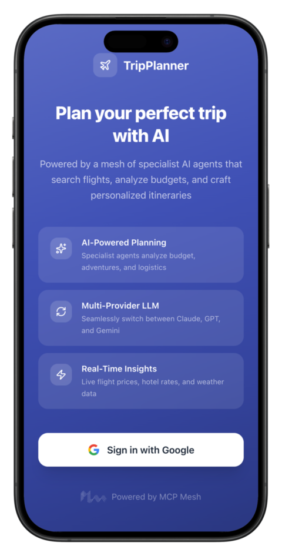
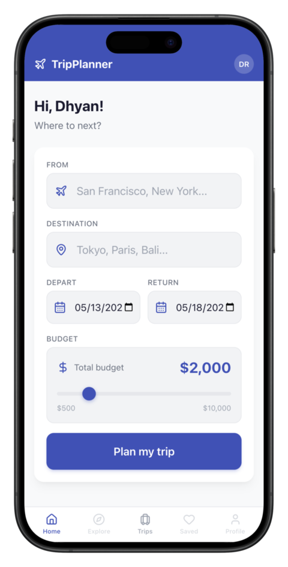
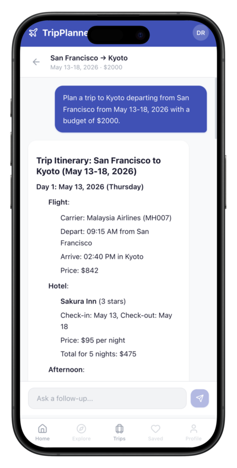
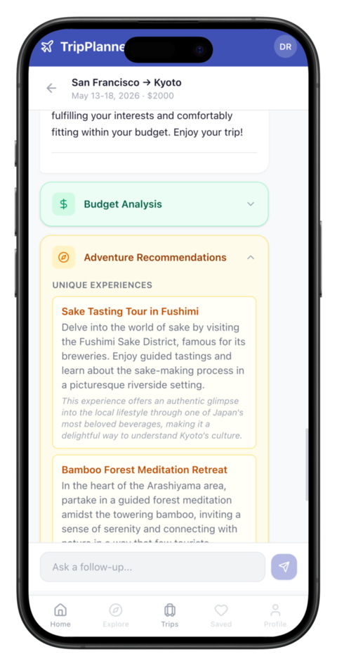

# Day 10 -- What You Built and Where to Go

Ten days ago you scaffolded a single tool agent. Today you have a 13-agent
trip planner running on Kubernetes with LLM-driven planning, a committee of
specialists, chat history, distributed tracing, and an HTTP API. Let's take
stock of what you built, cover a few production essentials, and look at where
to go from here.

---

## Part 1: What you built

### By the numbers

| Metric | Count |
|--------|-------|
| Agents | **13** -- 5 tool agents, 2 LLM providers, 1 planner, 3 specialists, 1 gateway, 1 chat history |
| LLM providers | **2** with automatic failover (Claude + OpenAI) |
| Dependency patterns | Tier-1 (direct) and tier-2 (transitive) |
| Chat backend | Multi-turn conversations with Redis |
| Structured outputs | Committee aggregation via Pydantic models |
| Deployment targets | Docker Compose + Kubernetes with Helm |
| Observability | Distributed tracing via `meshctl trace`, Grafana dashboards, Tempo |

### The final architecture



One namespace. Two Helm charts. Thirteen agents, a registry, a database, and
a full observability stack -- the same Python functions you wrote on Day 1,
running in Kubernetes pods.

### The journey, day by day

| Day | What you built | Key concept |
|-----|---------------|-------------|
| 1 | `flight_search` -- a single tool agent | `meshctl scaffold`, `@mesh.tool` |
| 2 | 5 tool agents wired together | Dependency injection, capabilities |
| 3 | LLM planner with Jinja templates | `@mesh.llm`, observability, `meshctl trace` |
| 4 | Claude + OpenAI with automatic failover | Tag routing (`+claude`), tier-1/tier-2 |
| 5 | FastAPI chat gateway | `@mesh.route`, HTTP integration |
| 6 | Redis-backed chat history | Persistent conversations, session management |
| 7 | Committee of specialists | Structured outputs, multi-agent coordination |
| 8 | Docker Compose deployment | Containerized agents, `meshctl scaffold --compose` |
| 9 | Kubernetes with Helm | Helm charts, ingress, production observability |
| 10 | You are here | Production readiness, what's next |

Every day added capability without rewriting what came before. The
`flight_search` function from Day 1 is the same function running on
Kubernetes on Day 9.

### The code you didn't write

Over ten days you focused on business logic -- the trip planning domain. Here
is what you never had to build:

- No REST clients or HTTP handlers for inter-agent communication
- No service discovery code
- No environment-specific configuration files
- No sidecars or proxy containers
- No LLM vendor SDK imports in the planner
- No serialization/deserialization code for tool calls

The `flight_search` function from Day 1 runs on Kubernetes unchanged. Same
file, same decorators, same types. The mesh handled registration, discovery,
routing, failover, and observability -- your code handled flights, hotels,
weather, and trip plans.

---

## Part 2: Production readiness

TripPlanner is functional, but a production deployment needs a few more
layers. Each item below is a brief pointer with a link to the full
documentation -- not a deep-dive.

### Security

MCP Mesh provides three layers of security: registration trust (who can join
the mesh), agent-to-agent mTLS (encrypted inter-agent calls), and
authorization (who can do what).

- **Registration trust** -- the registry validates agent identity via TLS
  certificates before accepting registration. Supports file-based certs,
  HashiCorp Vault PKI, and SPIRE workload identity.
- **Agent-to-agent mTLS** -- every inter-agent call is mutually
  authenticated. The same certificate used for registration handles peer
  auth -- no additional configuration.
- **Authorization** -- MCP Mesh propagates HTTP headers end-to-end through
  the mesh. Use your platform's auth framework (FastAPI middleware, Spring
  Security, Express middleware) to enforce access control.
- **Entity management** -- `meshctl entity register`, `meshctl entity list`,
  and `meshctl entity revoke` control which organizational CAs are trusted.

Full details: [Security documentation](../security/index.md)

### Observability

The observability stack you deployed on Day 9 (Tempo + Grafana) is ready for
production monitoring:

- **Distributed tracing** -- every tool call, LLM invocation, and
  inter-agent hop is traced. Use `meshctl trace` locally or Grafana's Tempo
  datasource in Kubernetes.
- **Dashboards** -- Grafana ships with pre-configured views for latency,
  error rates, and queue depth.
- **Alerting** -- connect Grafana alerting to Slack, PagerDuty, or email
  for latency spikes or error rate thresholds.

Full details: [Observability documentation](../07-observability.md)

### Resource limits

Set CPU and memory limits in your Helm values files. You already have
`helm-values.yaml` per agent from Day 9 -- add resource blocks:

```yaml
agent:
  resources:
    requests:
      cpu: 100m
      memory: 128Mi
    limits:
      cpu: 500m
      memory: 512Mi
```

### Health probes

Mesh agents expose health endpoints automatically (`/health`). The Helm
chart wires liveness and readiness probes to this endpoint -- no
configuration needed. If an agent becomes unhealthy, Kubernetes restarts it
and the registry removes it from the topology within one heartbeat cycle.

### Secrets management

Day 9 used `kubectl create secret` for LLM API keys. For production, move
to a secrets operator:

- [external-secrets-operator](https://external-secrets.io/) -- syncs
  secrets from Vault, AWS Secrets Manager, or GCP Secret Manager into
  Kubernetes secrets.
- [sealed-secrets](https://sealed-secrets.netlify.app/) -- encrypt secrets
  in Git, decrypt at deploy time.

### Horizontal scaling

Tool agents are stateless -- run multiple replicas for throughput. The mesh
routes calls to any healthy instance automatically:

```yaml
agent:
  replicaCount: 3
```

LLM providers and the planner can also scale horizontally. The chat history
agent is stateless too (state lives in Redis). The gateway scales behind a
Kubernetes Service or Ingress.

---

## Part 3: Challenges

The tutorial is complete, but TripPlanner is a starting point. Here are ideas
to explore on your own -- each one exercises a different part of the mesh.

### Add OAuth authentication to the gateway

Protect the `/plan` endpoint with JWT tokens. Use FastAPI's `HTTPBearer`
dependency to validate tokens, and configure `MCP_MESH_PROPAGATE_HEADERS` to
forward the `Authorization` header through the mesh so downstream agents can
see the caller's identity. See the
[authorization documentation](../security/authorization.md) for the header
propagation pattern.

### Integrate RAG with a knowledge-base agent

Scaffold a new agent that retrieves destination guides from a vector store
(Pinecone, Weaviate, pgvector). Inject the retrieved context into the
planner's prompt template as an additional variable. The planner already
supports Jinja templates -- add a `{{ destination_context }}` block and wire
the knowledge agent as a tier-1 dependency.

### Add a Gemini provider

Scaffold a third LLM provider with `meshctl scaffold`. Register it with
`capability="llm"` and `tags=["gemini"]`. Deploy all three providers and
benchmark them on the same trip query. The planner's `+claude` tag routing
gives Claude priority, but if you stop Claude and Gemini, traffic fails over
to OpenAI -- test it.

### Build a price monitor

Create a scheduled agent that checks flight prices daily (expand the
`flight_search` stub with real API calls or a richer simulation). When
prices drop below a user-defined threshold, write an alert to a new
`price_alerts` capability. Wire a notification agent that reads alerts and
sends messages via email or Slack.

### Swap a Python agent for TypeScript

Rewrite `weather-agent` in TypeScript using the
[TypeScript SDK](../typescript/index.md). Start it alongside the Python
agents. The planner doesn't know or care what language the weather agent is
written in -- it discovers capabilities, not implementations. Verify
everything works with `meshctl call get_weather`.

### Add structured logging

Configure JSON logging in your agents (Python's `structlog` or the standard
`logging` module with a JSON formatter). Include the `trace_id` from mesh
headers so log lines correlate with distributed traces. Ship logs to Grafana
Loki and cross-reference with Tempo traces for full request-level
observability.

### Build a mobile client

Create a lightweight web UI that talks to the gateway's `/plan` endpoint.
A starter project is waiting in
`examples/tutorial/trip-planner/day-10/bonus-ui/` -- check the README for
status. The gateway already exposes a REST API, so the client is a standard
fetch/axios integration.

---

## The finished product

Add a modern web UI, wire in Google authentication, and your ten days of work
becomes a production-ready AI application. Not a demo. Not a prototype. A
real, multi-user trip planner backed by thirteen mesh agents, specialist AI
committees, multi-turn chat, automatic LLM failover, and distributed
tracing -- deployable to Kubernetes with a single helm install.

<div class="app-showcase" markdown>
<div class="app-grid" markdown>

{: .app-screen }

{: .app-screen }

{: .app-screen }

{: .app-screen }

</div>
</div>

Ten days. Thirteen agents. Three LLM providers. One framework. You went from
`meshctl scaffold` to a Kubernetes-deployed, multi-user AI application -- and
the `flight_search` function you wrote in the first hour of Day 1 is still
running, unchanged, in a production pod. No rewrites. No migration layer. No
"now let's port it to the real stack." The code you wrote *is* the real stack.
That is what MCP Mesh was built for, and you just proved it works.

---

## Thank you

That's the TripPlanner tutorial. You started with a single Python function
and ended with a 13-agent system running on Kubernetes -- with LLM planning,
committee refinement, chat history, distributed tracing, and an HTTP API.
Every agent is a plain Python file. Every deployment target uses the same
code. The mesh handled the infrastructure so you could focus on the domain.

If you have questions, ideas, or feedback, find us on
[Discord](https://discord.gg/KDFDREphWn) or
[GitHub](https://github.com/dhyansraj/mcp-mesh). We'd love to see what you
build.

---

## See also

- [Python SDK](../python/index.md) -- decorators, dependency injection, LLM
  integration
- [TypeScript SDK](../typescript/index.md) -- mesh functions, Express
  integration
- [Java SDK](../java/index.md) -- annotations, Spring Boot integration
- [Security](../security/index.md) -- mTLS, registration trust,
  authorization
- [Observability](../07-observability.md) -- tracing, Grafana dashboards
- [Deployment](../deployment.md) -- Docker and Kubernetes deployment guides
- [CLI Reference](../cli/index.md) -- meshctl commands and environment
  variables
- [Tutorial index](index.md) -- all ten chapters
