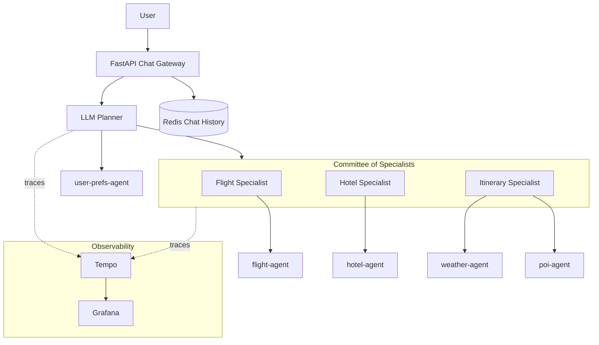

# The TripPlanner Tutorial

MCP Mesh has a lot of surface area — decorators, dependency injection,
capability-based discovery, LLM provider abstraction, tag routing, structured
outputs, and thirty-odd more concepts beyond those. Reading about each one in
isolation will only take you so far. At some point you need to see how they
compose inside a real application, the kind of multi-user, cloud-deployable
system that an enterprise-grade agent framework was built to support.

That's what this tutorial is. Over ten chapters you'll build **TripPlanner**, a
multi-agent trip-planning application that is decidedly not a chatbot demo or a
"hello, world." It has tool agents for domain logic, LLM-driven planning, a
committee of specialists that refine results, a chat API for end users, and a
full deployment to Kubernetes with observability baked in. You'll start on Day 1
with a single agent running locally, and by Day 10 every one of those pieces will
be live — built by you, understood by you.

## What you'll have built by Day 10

By the end of the tutorial, TripPlanner consists of:

- **Five tool agents** — flight search, hotel search, weather forecast, points of
  interest, and user preferences. Each runs as a standalone mesh agent and exposes
  one or more tools.
- **An LLM planner** — an `@mesh.llm` agent driven by Jinja prompt templates. It
  uses the tool agents as dependencies and orchestrates an end-to-end trip plan.
- **Multiple LLM providers** — Claude, GPT, and Gemini running simultaneously,
  with preference-based routing and automatic failover if one goes down.
- **A committee of three specialists** — flight specialist, hotel specialist, and
  itinerary specialist — each an `@mesh.llm` agent, coordinated to refine the plan.
- **A FastAPI chat gateway** — a stateless HTTP endpoint that accepts user messages
  and returns planner responses.
- **A cross-language gateway swap** — a demonstration of replacing the FastAPI
  gateway with a Spring Boot gateway mid-tutorial. Same agents, same mesh,
  different language, everything works.
- **Redis-backed chat history** — persistent, resumable conversations indexed by
  user and session.
- **Kubernetes deployment via Helm** — the same agents running on a real cluster,
  with the registry as a service and agents as deployments.
- **An observability stack** — Tempo for traces, Grafana dashboards, metrics on
  tool call latency, queue depth, and error rates.

## The Day 10 architecture

Everything in that diagram runs on Kubernetes in the final chapter. The agents
themselves are plain Python functions — no k8s-specific code, no sidecars, no
framework-specific wiring.

## The arc

The tutorial is ten chapters long, split into two parts.

**Part 1 — Build and run (Days 1-5)** starts from nothing and ends with a working
TripPlanner running locally. You scaffold your first agent, learn how dependency
injection works between tools, introduce tag-based routing, plug in an LLM with
prompt templates, put a FastAPI gateway in front of it all, and then swap that
gateway for Spring Boot to see cross-language interop in action.

**Part 2 — Grow and scale (Days 6-10)** takes the working system and grows it into
something production-shaped. You add a committee of specialists to refine plans,
wire Redis into the chat for persistent history, instrument everything with traces
and metrics, deploy to Kubernetes via Helm, and finish with production hardening.

!!! info "All ten chapters are available"
    **Days 1-10 are complete.** Work through them at your own pace -- each chapter
    builds on the previous one, from a single tool agent to a 13-agent system
    running on Kubernetes.

!!! note "Language coverage"
    This tutorial uses Python throughout. The patterns and concepts apply equally
    to TypeScript and Java — see the [TypeScript SDK](../typescript/index.md) and
    [Java SDK](../java/index.md) documentation for language-specific syntax.

## Prerequisites

Before starting Day 1, you'll need Python 3.11+, `meshctl` on your `PATH`, and a few
minutes to set up a virtual environment. See the [Prerequisites](prerequisites.md)
page for platform-specific install instructions.

## Start Day 1

When you're ready, head to [Day 1 — Scaffold & first tool](day-01-scaffold.md).

## Things worth noticing along the way

As you work through the tutorial, keep an eye out for a few things we're
particularly proud of:

- **One codebase, every environment.** The agent you write on Day 1 runs locally,
  in Docker, and on Kubernetes without any configuration changes.
- **mesh runs in-process.** There are no sidecars or proxy containers to manage —
  your agent code is all you need to deploy.
- **Distributed calls feel like local function calls.** Declare your dependencies,
  then call them — mesh injects the real implementations at runtime, whether they
  live in the same process or across the network. No REST clients, no MCP wiring,
  no response parsing. Your code reads like a plain Python script, which is why
  a complex multi-agent application can go from zero to running in half a day.
- **Day 1 code is Day 9 code.** The function you write in the first tutorial is the
  same function that runs on Kubernetes later. Same file, same decorators, same types.
- **Switching LLM providers is zero code changes.** Your agent declares a
  dependency on the `llm` capability — no vendor SDK, no provider-specific code.
  Swap Claude for GPT by bringing up a different provider agent; mesh abstracts
  away the API differences and your consumer auto-switches. With preference tags
  like `+claude`, you also get automatic failover — if Claude goes down, traffic
  routes to the next available provider with no downtime. Day 4 shows this in
  practice.
