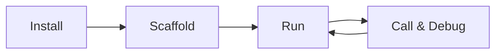

# Local Development (TypeScript)

<div class="runtime-crossref">
  <span class="runtime-crossref-icon">🐍</span>
  <span>Looking for Python? See <a href="../../python/local-development/">Python Local Development</a></span>
  <span> | </span>
  <span class="runtime-crossref-icon">☕</span>
  <span>Looking for Java? See <a href="../../java/local-development/">Java Local Development</a></span>
</div>

> Develop MCP Mesh agents locally with TypeScript

## Development Workflow



## Guides

| Guide                                       | What You'll Learn                        |
| ------------------------------------------- | ---------------------------------------- |
| [Getting Started](./01-getting-started.md)  | Install meshctl CLI and TypeScript SDK   |
| [Scaffold Agents](./02-scaffold.md)         | Generate agents with `meshctl scaffold`  |
| [Run Agents](./03-running-agents.md)        | Start agents with hot reload, debug mode |
| [Inspect the Mesh](./04-inspecting-mesh.md) | View agents, tools, and dependencies     |
| [Call & Debug Tools](./05-calling-tools.md) | Call tools and trace distributed calls   |
| [Troubleshooting](./troubleshooting.md)     | Common issues and solutions              |

## Quick Reference

```bash
# Install CLI
npm install -g @mcpmesh/cli

# Set up TypeScript project
mkdir my-mesh-project && cd my-mesh-project
npm init -y
npm install @mcpmesh/sdk zod
npm install -D typescript tsx @types/node

# Scaffold (interactive wizard)
meshctl scaffold

# Run
meshctl start src/index.ts
meshctl start -w src/index.ts      # hot reload
meshctl start --debug src/index.ts # debug mode

# Inspect
meshctl list                       # agents
meshctl list --tools               # all tools
meshctl status                     # wiring details

# Call
meshctl call get_weather '{"city":"London"}'
meshctl call --trace get_weather   # with tracing

# Debug
meshctl trace <trace-id>           # view call tree
meshctl logs my-agent -f           # follow logs
meshctl man --list                 # built-in docs
```
