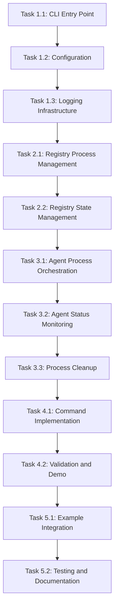

# MCP-Mesh Developer CLI Implementation Tasks

## Week 1 Day 7: Developer Tools Implementation

### 🎯 **TASK OVERVIEW**

This document outlines the implementation tasks for the `mcp_mesh_dev` CLI tool. Based on comprehensive analysis, the CLI serves as a simple process orchestrator leveraging existing production-ready mesh infrastructure. **Estimated total effort: 2-3 days**.

**Important Note**: `pip install mcp_mesh` alone lets you run in MCP SDK environment, but will not have any MCP Mesh functionalities. Full mesh capabilities require `mcp_mesh_runtime` package.

### 🏗️ **PHASE 1: CLI Foundation**

**Duration**: 1 day **Priority**: Critical

#### **TASK 1.1: CLI Entry Point and Python Entry Point Setup**

**Duration**: 3 hours **Assignee**: TBD

**Description**: Create CLI framework using modern Python entry point approach

**Implementation Steps**:

1. Create `packages/mcp_mesh_runtime/src/mcp_mesh_runtime/cli/` package structure
2. Add CLI entry point to root `pyproject.toml` (integrating with existing entry points):
   ```toml
   [project.scripts]
   mcp_mesh_dev = "mcp_mesh_runtime.cli.main:main"
   mcp_mesh_server = "mcp_mesh_runtime.server:main"  # existing
   mcp_mesh_registry = "mcp_mesh_runtime.server.registry_server:main"  # existing
   ```
3. Implement main entry point function following argparse patterns:
   ```python
   # mcp_mesh_runtime/cli/main.py
   def main(argv: Optional[list[str]] = None) -> int:
       parser = argparse.ArgumentParser(prog="mcp_mesh_dev")
       # Add subcommands and handle dispatch
   ```
4. Add command routing for: `start`, `stop`, `status`, `list`, `logs`
5. Test entry point installation via `pip install -e .`

**Dependencies**: None
**Deliverables**:

- CLI entry point installed and functional
- Modern Python packaging integration
- Cross-platform executable creation

**Acceptance Criteria**:

- `pip install -e .` makes `mcp_mesh_dev` available in PATH
- CLI executable works on Linux/Mac (Windows optional)
- Entry point follows existing project patterns

---

#### **TASK 1.2: Comprehensive Help System Implementation**

**Duration**: 2 hours **Assignee**: TBD

**Description**: Implement comprehensive help system following CLI best practices

**Implementation Steps**:

1. Design help text structure following established CLI patterns (black, pytest style):
   ```
   mcp_mesh_dev --help:
   - Global usage and description
   - Available commands with brief descriptions
   - Common usage examples
   - Link to detailed documentation
   ```
2. Implement command-specific help for each subcommand:
   ```
   mcp_mesh_dev start --help:
   - Command usage and description
   - Available arguments and options
   - Usage examples specific to start command
   - Common workflows and patterns
   ```
3. Add usage examples for original design vision workflow:
   ```
   Examples:
     mcp_mesh_dev start                    # Start registry only
     mcp_mesh_dev start intent_agent.py   # Start registry + intent agent
     mcp_mesh_dev start --registry-port 8081  # Custom port
     mcp_mesh_dev list                     # Show running agents
   ```
4. Implement help text validation and consistency checks
5. Add troubleshooting section to global help

**Dependencies**: Task 1.1
**Deliverables**:

- Comprehensive help system
- Command-specific help for all commands
- Usage examples and workflows

**Acceptance Criteria**:

- `mcp_mesh_dev --help` provides comprehensive usage guidance
- All subcommands have detailed help available
- Help text includes practical examples
- New users can understand CLI from help text alone

---

#### **TASK 1.3: Configuration Management**

**Duration**: 2 hours **Assignee**: TBD

**Implementation Steps**:

1. Create configuration classes using existing patterns from `mcp_mesh_runtime.shared.configuration`
2. Implement default development configuration:
   ```python
   DEFAULT_CONFIG = {
       "registry_port": 8080,
       "registry_host": "localhost",
       "db_path": "./dev_registry.db",
       "log_level": "INFO",
       "health_check_interval": 30
   }
   ```
3. Add command-line override support:
   - `--registry-port`: Override registry port
   - `--db-path`: Override SQLite database location
   - `--log-level`: Override logging level
4. Implement configuration validation and error handling
5. Add configuration persistence for development sessions

**Dependencies**: Task 1.1
**Deliverables**:

- Configuration management system
- Command-line parameter handling
- Development defaults established

**Acceptance Criteria**:

- Configuration parameters can be overridden via CLI
- Invalid configuration produces helpful error messages
- Default configuration works without any parameters

---

#### **TASK 1.4: Logging and Status Infrastructure**

**Duration**: 1 hour **Assignee**: TBD

**Description**: Implement logging and status reporting infrastructure

**Implementation Steps**:

1. Configure logging for CLI operations
2. Implement status display formatting
3. Add process tracking utilities
4. Create log aggregation for multiple services

**Dependencies**: Task 1.3
**Deliverables**:

- Logging infrastructure
- Status display utilities
- Process tracking foundation

**Acceptance Criteria**:

- CLI operations are properly logged
- Status information is clearly formatted
- Log levels work correctly

---

### 🚀 **PHASE 2: Registry Service Management**

**Duration**: 0.5 days **Priority**: Critical

#### **TASK 2.1: Registry Process Management**

**Duration**: 3 hours **Assignee**: TBD

**Description**: Implement registry service process lifecycle management

**Implementation Steps**:

1. Create registry service launcher using existing `mcp_mesh_registry` entry point:
   ```python
   def start_registry_service(port=8080, db_path="./dev_registry.db"):
       cmd = [
           sys.executable, "-m", "mcp_mesh_runtime.server.registry_server",
           "--port", str(port),
           "--database-url", f"sqlite:///{db_path}",
           "--host", "localhost"
       ]
       return subprocess.Popen(cmd, stdout=subprocess.PIPE, stderr=subprocess.PIPE)
   ```
2. Implement registry health checking:
   ```python
   async def check_registry_health(url: str) -> bool:
       # Use existing RegistryClient health check
       client = RegistryClient(url)
       return await client.health_check()
   ```
3. Add automatic port conflict resolution
4. Implement graceful registry shutdown
5. Add registry status monitoring

**Dependencies**: Task 1.3
**Deliverables**:

- Registry process management
- Health checking functionality
- Port conflict handling

**Acceptance Criteria**:

- `mcp_mesh_dev start` launches registry successfully
- Registry binds to correct port or finds alternative
- `mcp_mesh_dev status` shows registry health
- `mcp_mesh_dev stop` shuts down registry gracefully

---

#### **TASK 2.2: Registry State Management**

**Duration**: 1 hour **Assignee**: TBD

**Description**: Implement registry state tracking and persistence

**Implementation Steps**:

1. Create process state tracking for registry service
2. Implement SQLite database lifecycle management
3. Add registry URL determination and sharing
4. Create registry restart capabilities

**Dependencies**: Task 2.1
**Deliverables**:

- Registry state persistence
- Database management
- Restart capabilities

**Acceptance Criteria**:

- Registry state survives CLI restarts
- SQLite database is properly managed
- Registry URL is accessible to agents

---

### 🤖 **PHASE 3: Agent Process Management**

**Duration**: 1 day **Priority**: Critical

#### **TASK 3.1: Agent Process Orchestration**

**Duration**: 4 hours **Assignee**: TBD

**Description**: Implement agent process lifecycle management

**Implementation Steps**:

1. Create agent process launcher:

   ```python
   def start_agent_process(agent_file: str, registry_url: str):
       env = os.environ.copy()
       env["MCP_MESH_REGISTRY_URL"] = registry_url

       cmd = [sys.executable, agent_file]
       return subprocess.Popen(
           cmd,
           env=env,
           stdout=subprocess.PIPE,
           stderr=subprocess.PIPE
       )
   ```

2. Implement automatic registry startup if not running
3. Add agent process tracking with PIDs
4. Create agent health monitoring integration
5. Implement graceful agent shutdown

**Dependencies**: Task 2.2
**Deliverables**:

- Agent process management
- Environment variable handling
- Process tracking system

**Acceptance Criteria**:

- `mcp_mesh_dev start intent_agent.py` works end-to-end
- Registry starts automatically if not running
- Agent registration occurs automatically via `@mesh_agent`
- Multiple agents can run simultaneously

---

#### **TASK 3.2: Agent Status and Monitoring**

**Duration**: 2 hours **Assignee**: TBD

**Description**: Implement agent status reporting and monitoring

**Implementation Steps**:

1. Integrate with existing registry client to query agent status
2. Implement agent list functionality:
   ```python
   async def list_running_agents(registry_url: str) -> List[AgentInfo]:
       client = RegistryClient(registry_url)
       return await client.get_all_agents()
   ```
3. Add agent health status display
4. Create agent restart capabilities
5. Implement agent log access

**Dependencies**: Task 3.1
**Deliverables**:

- Agent status reporting
- Agent list functionality
- Log access capabilities

**Acceptance Criteria**:

- `mcp_mesh_dev list` shows all running agents
- Agent health status is accurately displayed
- Individual agent logs are accessible

---

#### **TASK 3.3: Process Cleanup and Management**

**Duration**: 2 hours **Assignee**: TBD

**Description**: Implement reliable process cleanup and management

**Implementation Steps**:

1. Add signal handlers for graceful shutdown
2. Implement process tree cleanup
3. Create process restart capabilities
4. Add cross-platform process management
5. Implement process monitoring and recovery

**Dependencies**: Task 3.2
**Deliverables**:

- Reliable process cleanup
- Signal handling
- Cross-platform compatibility

**Acceptance Criteria**:

- Process cleanup is complete and reliable
- Signal handling works correctly
- No zombie processes remain after shutdown

---

### 🔧 **PHASE 4: Developer Experience Enhancement**

**Duration**: 0.5 days **Priority**: High

#### **TASK 4.1: Command Implementation**

**Duration**: 2 hours **Assignee**: TBD

**Description**: Implement core CLI commands with proper UX

**Implementation Steps**:

1. Implement `mcp_mesh_dev start` command:
   - Registry-only mode: `mcp_mesh_dev start`
   - Agent mode: `mcp_mesh_dev start <agent.py>`
   - Background mode: `mcp_mesh_dev start -d`
2. Implement `mcp_mesh_dev stop` command:
   - Stop all: `mcp_mesh_dev stop`
   - Stop specific agent: `mcp_mesh_dev stop <agent.py>`
3. Implement `mcp_mesh_dev status` command with clear formatting
4. Implement `mcp_mesh_dev list` command with agent details
5. Implement `mcp_mesh_dev logs` command with filtering

**Dependencies**: Task 3.3
**Deliverables**:

- Complete command implementation
- User-friendly interfaces
- Error handling and messaging

**Acceptance Criteria**:

- All planned commands work as specified
- Error messages are helpful and actionable
- Command output is clear and informative

---

#### **TASK 4.2: Perfect Demonstration Example Implementation**

**Duration**: 1 hour **Assignee**: TBD

**Description**: Create perfect demonstration showcasing MCP vs MCP Mesh capabilities

**Implementation Steps**:

1. Validate demonstration examples in `examples/` directory:
   - `hello_world.py` with dual MCP/MCP Mesh functions
   - `system_agent.py` with SystemAgent dependency provider
   - `README.md` with complete demonstration workflow
2. Test complete demonstration workflow:
   - Start hello_world.py (basic greetings)
   - Add system_agent.py (automatic dependency injection)
   - Remove system_agent.py (dependency removal)
3. Validate HTTP endpoint behavior via curl testing
4. Ensure demonstration follows MCP SDK standards
5. **Important**: Stress that `pip install mcp_mesh` alone lets you run in MCP SDK environment, but will not have any MCP Mesh functionalities

**Dependencies**: Task 4.1
**Deliverables**:

- Perfect demonstration examples in examples/
- Complete workflow validation
- Clear package limitation documentation

**Acceptance Criteria**:

- Demonstration perfectly shows MCP vs MCP Mesh differences
- Real-time dependency injection visible via HTTP endpoints
- Clear before/after behavior comparison
- Documentation enables new users to run demo in < 5 minutes

---

### ✅ **PHASE 5: Integration and Testing**

**Duration**: 0.5 days **Priority**: Medium

#### **TASK 4.3: Example Integration**

**Duration**: 2 hours **Assignee**: TBD

**Description**: Ensure all existing examples work with CLI

**Implementation Steps**:

1. Test CLI with all 16 existing examples
2. Validate original design vision workflow:
   - `mcp_mesh_dev start intent_agent.py` (no parameters injected)
   - `mcp_mesh_dev start developer_agent.py` (parameters injected to intent agent)
   - `mcp_mesh_dev stop developer_agent.py` (parameters removed from intent agent)
3. Add example-specific configurations if needed
4. Update example documentation for CLI usage
5. **Important**: Stress that `pip install mcp_mesh` alone lets you run in MCP SDK environment, but will not have any MCP Mesh functionalities

**Dependencies**: Task 4.2
**Deliverables**:

- Complete example compatibility
- Workflow validation
- Documentation updates

**Acceptance Criteria**:

- All existing examples work without modification
- Original design vision workflow is demonstrated
- Examples show clear CLI usage patterns

---

#### **TASK 4.4: Testing and Documentation**

**Duration**: 2 hours **Assignee**: TBD

**Description**: Create testing infrastructure and documentation

**Implementation Steps**:

1. Create unit tests for CLI components
2. Add integration tests for complete workflows
3. Create end-to-end testing for original design vision
4. Write comprehensive CLI documentation
5. Add troubleshooting guides

**Dependencies**: Task 4.3
**Deliverables**:

- Test suite for CLI
- Complete documentation
- Troubleshooting guides

**Acceptance Criteria**:

- Test suite covers core functionality
- Documentation is comprehensive and clear
- Troubleshooting covers common scenarios

---

### 📊 **TASK DEPENDENCIES**



### 🎯 **IMPLEMENTATION STRATEGY**

#### **Development Approach**:

1. **Iterative Development**: Implement and test each phase incrementally
2. **Leverage Existing**: Use 95% existing infrastructure, focus on process orchestration
3. **Validate Early**: Test original design vision workflow in Phase 3
4. **Developer Experience**: Prioritize intuitive CLI and helpful error messages

#### **Key Implementation Principles**:

- **Zero Breaking Changes**: Preserve all existing mesh functionality
- **Simple Orchestration**: CLI as thin process management layer
- **Automatic Integration**: Leverage existing `@mesh_agent` automatic registration
- **Developer Focus**: Optimize for MCP community developer experience

#### **Success Validation**:

- Original design vision workflow works exactly as specified
- All existing examples work without modification
- Development time for new MCP agents is dramatically reduced
- CLI provides clear, actionable feedback and error handling

---

## 📝 **IMPLEMENTATION NOTES**

### **Critical Success Factors**:

1. **Leverage Existing Infrastructure**: 95% of complex functionality already exists
2. **Focus on Process Management**: CLI is primarily subprocess orchestration
3. **Environment Variable Magic**: `MCP_MESH_REGISTRY_URL` enables automatic integration
4. **Zero Agent Modification**: All existing examples work without changes

### **Key Technical Insights**:

- Registry service already has production-ready CLI entry point
- `@mesh_agent` decorator handles all complex registration logic automatically
- Heartbeat-based dependency injection works transparently
- Service discovery and eviction require zero CLI involvement

### **Estimated Effort Breakdown**:

- **Phase 1** (CLI Foundation): 1 day
- **Phase 2** (Registry Management): 0.5 days
- **Phase 3** (Agent Management): 1 day
- **Phase 4** (Developer Experience): 0.5 days
- **Phase 5** (Integration/Testing): 0.5 days
- **Total**: **3.5 days maximum** (2-3 days realistic)

### **Modern Python CLI Implementation Notes**:

#### **Executable Installation Strategy**:

The implementation uses modern Python packaging best practices:

1. **Python Entry Points (Recommended)**:

   - No bin/ directory or shell scripts needed
   - Cross-platform executable creation handled by pip
   - Virtual environment integration automatic
   - Follows patterns used by pip, black, pytest, uvicorn

2. **pyproject.toml Integration**:

   ```toml
   [project.scripts]
   mcp_mesh_dev = "mcp_mesh_runtime.cli.main:main"
   ```

3. **Installation Workflow**:

   ```bash
   # Development installation
   pip install -e .

   # CLI immediately available
   mcp_mesh_dev --help
   ```

#### **Help System Best Practices**:

Following established CLI patterns from major Python tools:

1. **Global Help** (`mcp-mesh-dev --help`):

   - Program description and purpose
   - Available commands with brief descriptions
   - Common usage examples
   - Links to additional resources

2. **Command Help** (`mcp-mesh-dev start --help`):

   - Command-specific usage and options
   - Practical examples for each command
   - Parameter descriptions and defaults

3. **Help Content Strategy**:
   - Include original design vision workflow examples
   - Provide troubleshooting guidance
   - Enable new users to get started in < 5 minutes
